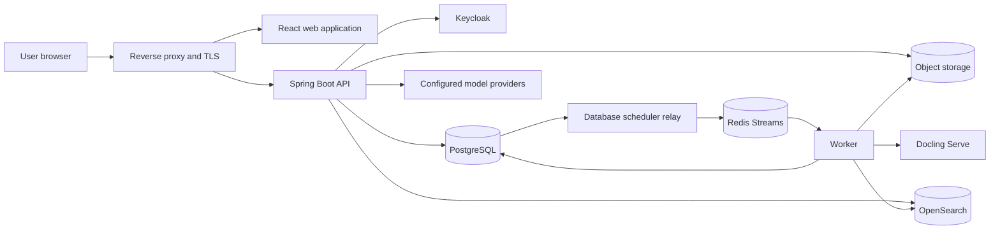
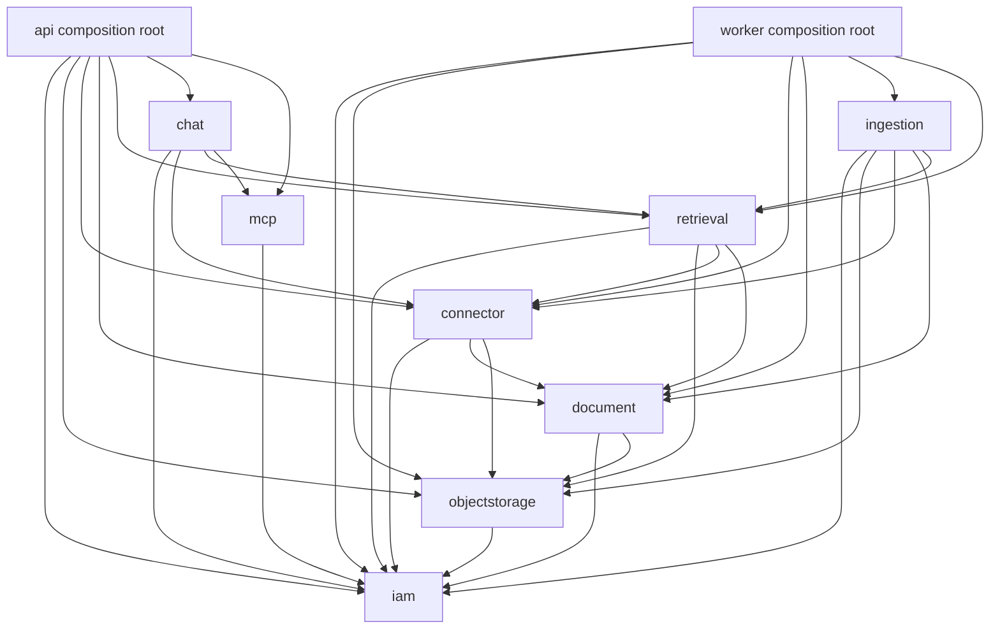
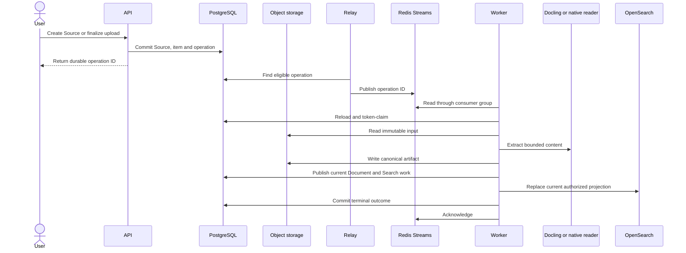
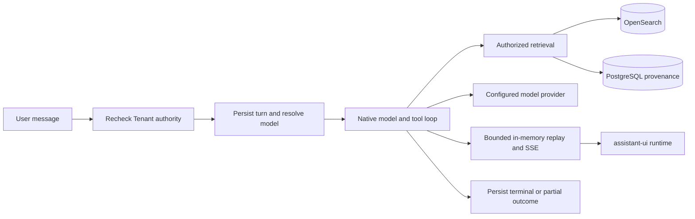
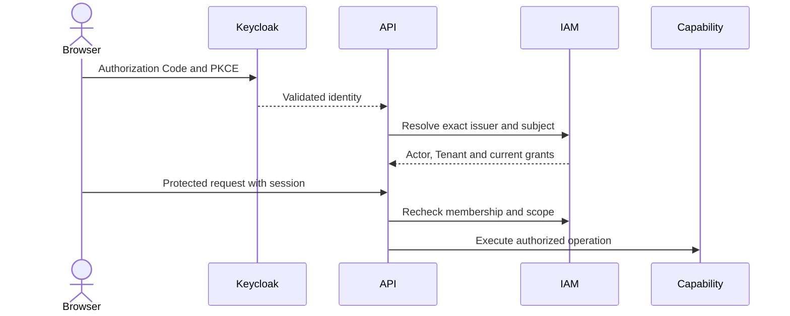
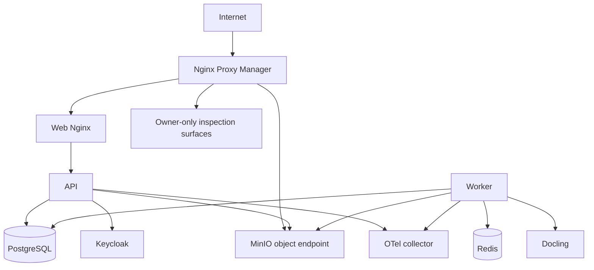

# MemoryOS architecture

This document describes the architecture implemented by the current repository. Detailed behavior belongs in capability [specifications](docs/specs), verification evidence belongs in [test matrices](docs/tests), operating procedures belong in [runbooks](docs/runbooks), and future direction belongs in the [vision](docs/vision.md#target-architecture). Accepted rationale is recorded in [ADRs](docs/decisions).

## Runtime overview

The web application's account-language and safe error boundary is documented in [localization](docs/specs/localization.md). Chat's lazy code/diagram renderers and bounded persisted read-only presentations reuse the existing native tool loop, authorized history and responsive reader panel; see [Chat renderers](docs/specs/chat.md#message-renderers-and-read-only-presentations).

The API and worker are separate deployables. The API owns HTTP, browser sessions, authorization, business commands, Chat inference and Flyway. The worker owns durable background execution for source synchronization, ingestion, cleanup and Search projection. The web application is a separate Vite/React deployable served by Nginx.

## Why the system has these components

| Choice | Reason | Operational consequence |
| --- | --- | --- |
| Controlled modular monolith | Current capabilities need shared transactions and explicit in-process contracts more than independent service scaling | Spring Modulith and ArchUnit enforce boundaries; split a service only after an accepted operational need |
| PostgreSQL as business authority | Authorization, ownership, commands, claims, retries and final outcomes need transactional consistency | Redis and OpenSearch can be rebuilt without inventing business state |
| Redis Streams for work delivery | Consumer groups, acknowledgement and pending-message recovery fit independent API and worker processes | Delivery is at least once; consumers must tolerate redelivery and acknowledge only after durable commit |
| Object storage for bytes and artifacts | Large immutable inputs and extraction results do not belong in request bodies or relational rows | PostgreSQL retains metadata, ownership, checksums and lifecycle fences |
| OpenSearch as a projection | Hybrid text/vector retrieval needs an index optimized for ranking | Index contents never grant access; reads remain Tenant and Source scoped |
| Docling out of process | Parsing and OCR have a different dependency, resource and failure profile from the JVM | Calls are bounded and retryable; parser failure does not take down the API |
| Keycloak for identity, MemoryOS for authorization | External identity and local Tenant/Group/capability policy change independently | Every protected operation resolves current MemoryOS authority |

Redis Streams is not an event-sourcing log and does not own operation status. PostgreSQL records eligible work before dispatch, the relay publishes stable identifiers, and workers reload and token-claim the authoritative row. Lost or duplicated delivery is recovered through durable rediscovery, leases and idempotent completion.

## Code and capability boundaries

Arrows show allowed use of public capability contracts. Capability internals, persistence models and provider-specific types do not cross these boundaries. Application services own authorization, validation, orchestration and transaction boundaries. Concrete capability repositories own SQL/JPA persistence, row mapping, locks, claims and bulk writes. Cross-capability JPA relationships and single-implementation repository interfaces are avoided.

| Gradle module | Responsibility |
| --- | --- |
| `core` | Eight capability implementations and public contracts; no dependency on `connector` or a deployable |
| `connector` | Shared provider integration and bounded content extraction bundle; depends only on public `core` APIs |
| `api` | HTTP, security, migrations and interactive Chat composition |
| `worker` | Redis/db-scheduler composition and durable background work |

| Capability | Owns | Detailed contract |
| --- | --- | --- |
| `iam` | Actor identity, Tenant membership, invitations, Users, Groups and authorization | [Identity](docs/specs/identity.md), [Tenant](docs/specs/tenant.md), [Invitation](docs/specs/invitation.md) |
| `objectstorage` | Upload reservations, stored objects, adoption, discard and cleanup | [Object storage](docs/specs/object-storage.md) |
| `connector` | Sources, credentials, provider selection, items, synchronization and Source–Group associations | [Connector](docs/specs/connector.md) |
| `document` | Current Document metadata, canonical extraction artifact and current chunk identity | [Document](docs/specs/document.md) |
| `ingestion` | Durable selection, synchronization, extraction, indexing and cleanup orchestration | [Ingestion](docs/specs/ingestion.md) |
| `retrieval` | Embedding/OpenSearch adapters, authorized Search, document passages and original PDF readers | [Search](docs/specs/search.md) |
| `chat` | Personas, projects, sessions, message trees, model catalog, files, sharing and feedback | [Chat](docs/specs/chat.md), [model catalog](docs/specs/chat-models.md) |
| `mcp` | Tenant-registered remote MCP servers, their OAuth clients, tool snapshots, sealed credentials and the Streamable HTTP client (MEM-112, in progress) | [MEM-112 design](docs/increments/active/mem-112-chat-mcp-client/design.md) |

## Durable ingestion and Search projection

FILE uploads use checksum-bound presigned PUT directly from the browser to object storage. Google Drive synchronization acquires provider content into tracked immutable raw snapshots before ingestion; ingestion never depends on a later provider read. Current Documents replace prior representations, while retained run/attempt records preserve observable processing history. Extraction success and Search readiness are separate states.

The standalone OCR image owns a thin Serve composition and PDF backend/pipeline extensions for conservative pre-layout orientation. Worker retains its byte-only API boundary; its bounded adapter preserves raw document JSON and source-frame metadata rather than routing it through the SDK's closed document model. The [OCR recipe](infrastructure/deployment/ocr/README.md) and [Document contract](docs/specs/document.md) distinguish corrected coordinates, original provenance and unresolved financial periods. Image publication and deployment remain separate operational decisions.
FILE and Drive binary admission is bounded at 100 MiB; native snapshots retain their separate 32 MiB bound. Admission, parser/OCR completion, financial fidelity and Search readiness are separate acceptance claims; the [Ingestion contract](docs/specs/ingestion.md) owns parser budgets and current OCR limits.

Search uses the current authorized Document generation. PostgreSQL holds bounded chunk text and provenance; OpenSearch holds BM25/vector projection data. Query filters narrow an already authorized scope and never create authority. Search results remain source passages; answer generation belongs to Chat.

Direct Search and passage reads require current global `SEARCH_READ`. Actor-bound eligibility permits active PUBLIC FILE Sources and authorized private FILE Sources, with fresh membership, origin and generation checks after index IO and during expansion. It does not grant Drive document access or expose private Chat attachments through general Search.

## Chat execution and retrieval

External Web tools now use this same turn/Embabel execution path, not a second worker or agent. Tenant-owned JPA connections reuse encrypted model credentials; Web URL evidence shares the existing answer-source store and reader panel. Protocol adapters, bounded public HTML/text/PDF reading and remaining native-search work are recorded in the [Chat Web contract](docs/specs/chat.md#external-web-search-and-url-reading).

Chat inference runs in the API process and does not use the ingestion worker or Redis journal. PostgreSQL owns sessions, message branches, command identity, outcome, run lease and model metadata. A bounded in-memory buffer supports live SSE and short replay; committed database state remains the recovery boundary. Stop is local cancellation for the active process, with persisted partial/terminal outcome semantics.

Deep research is the one Chat mode where MemoryOS owns the inference loop: `ResearchExecutor` runs clarification, plan, orchestrator cycles, up to three parallel research agents and the final report as single guarded `streamInference` calls, executing agent tools directly and merging agent citations into the turn sources. It runs in the same turn, lease, Stop scope and budget as other answers; see the [Deep research contract](docs/specs/chat.md#deep-research).

Code Interpreter (`run_python`) calls the separate `memoryos-interpreter` service from the same tool loop. The service is vendored from Onyx python-sandbox under `interpreter/`. It is reachable only on the internal network with a shared API key, and it starts a disposable, network-less executor container per run. Generated files are copied into Object Storage as owner-authorized Chat artifacts. See the [Chat contract](docs/specs/chat.md#code-interpreter) and the [interpreter runtime](docs/runbooks/ci-cd.md#interpreter-runtime).

Private Chat files reuse Object Storage, Document extraction and passage readers while remaining Chat-owned and owner-authorized. General Search excludes private file chunks. Sharing exposes allowed transcript descriptors without granting access to underlying private bytes or passages.

Chat provider/model/default lifecycle uses capability-owned Spring Data JPA repositories and Hibernate revisions; authority projections, conflict-safe initialization and bulk reference mechanics remain JDBC. Access uses IAM `MODELS_MANAGE`, Group/Persona access and stable model configuration UUIDs. Organization BYOK is encrypted using a deployment-managed AES key. `/admin/models` implements Models-only navigation and provider/model/default administration through generated clients, independently of Tenant administration. Its bounded Persona projection respects builtin/current-actor ownership and stays separate from the assistant editor and Chat model selector. Access editing remains deferred. See the [catalog contract](docs/specs/chat-models.md).

Each turn resolves a native Embabel/Spring AI binding once and acquires a bounded client lease. API composition registers the existing OpenAI protocol adapter with the hosted O200K estimator profile; the executor neither selects providers nor decodes provider options. A shared immutable policy measures pre-reservation mandatory framing, bounded history and every converted native request/Validate. Raw HTTP cancellation precedes blocked-reader closure. No vendored tokenizer assets or native libraries ship in either deployable.

The managed deployment source under `infrastructure/inference/managed` and explicit inference Compose overlays owns pinned asset provisioning, private API → gateway → unpublished vLLM topology, one-slot/zero-queue admission, maintenance/drain and guarded credential/serving recovery. The existing reserved deployment transaction validates manifests/images/host receipts and retains its Flyway-history guard. No application health dependency on inference is added. [Operations](docs/runbooks/ci-cd.md#managed-inference-operations) describe the source contract; [MEM-77 evidence](docs/increments/active/mem-77-provider-backend/verification.md#implementation-and-controlled-evidence--2026-09-11) separates controlled provision/tokenizer/transport/UI checks from unverified final API image, real inference, workload and authorized target acceptance. No deployment, publication or web/image tool completion is claimed.

## Identity and authorization

Keycloak is the browser credential store and enterprise identity broker. MemoryOS binds the exact validated `(issuer, subject)` to an Actor and owns Tenant membership, Group grants, capability implications and resource scope. Email, provider role presentation and indexed metadata never substitute for authorization. IAM mutations advance the Tenant authorization revision so the browser can discard revoked private state.

Protected Admin/Basic Groups persist `SYSTEM_ADMIN`/`SYSTEM_BASIC`. Admin expands to every enum capability; Basic implies `SEARCH_READ`, `CHAT_READ`, `CHAT_WRITE`, `IMAGE_GENERATE` and `LLM_GATEWAY_USE`. Only Users, Groups, Sources and Models management are assignable ordinary grants. Chat retains its membership/resource policy rather than granular Chat-token enforcement; image/gateway vocabulary does not claim feature delivery. The [Identity contract](docs/specs/identity.md) defines protected memberships, peer-manager restrictions, Onyx identity presentation and the `manage_grants` gate that hides ordinary Group Permissions and its registry query.

Source associations contain ordinary Groups only: global managers may save `[]`, the recorded Source manager may add or remove only the Groups they manage, and no Source defaults to Admin. Scoped operations require the Source's recorded manager rather than management of every associated Group, while a Group's manager may detach any Source from that Group; deep Drive selection/discovery, FILE visibility and existing OAuth client replacement remain global-only, with callback and post-provider rechecks. Shared deletion remains global, apart from the narrow existing private groupless-creator cleanup rule. The [Connector matrix](docs/specs/connector.md#management-authority-and-group-associations) owns the exact policy; the catalog settings shortcut requires nonempty projected Source actions.

Google authorization is a separate Connector credential flow. Its callback cannot replace the signed-in Actor or infer identity from email. Provider tokens are encrypted or transient and do not become application-session authority.

## Data ownership and consistency

| Store | Authoritative for | Rebuildable or derived |
| --- | --- | --- |
| PostgreSQL | Identity bindings, authorization, Sources, operations, current Documents, Chat state and lifecycle evidence | No |
| Object storage | Immutable raw inputs, canonical extraction artifacts and private file bytes | Bytes are authoritative; associations and lifecycle remain in PostgreSQL |
| Redis Streams | Background delivery and pending consumer-group state | Yes, from eligible PostgreSQL operations |
| OpenSearch | Searchable text/vector projection | Yes, from current authorized Document generations |
| Keycloak | External authentication and broker configuration | MemoryOS authorization is separate |

Flyway owns schema evolution and runs from the API composition root. Released migrations are append-only; local or historical review databases with divergent unpublished histories are not upgrade targets. Verification uses fresh disposable databases or an explicit data-preserving migration plan.

The merged layout has 68 migrations. Published main V1–V53 stay unchanged, including Chat uploads/message files, 100 MiB binary admission, automatic titles, account language, read-only message artifacts, Web connections, history search and Search access in V37–V52. The MEM-77 tokenizer-profile backfill lands as `V54__backfill_model_tokenizer_profile.sql` without changing catalog identity/revisions or transcript history, and `V55__chat_web_gateway_provider.sql` widens the `chat_web_connection` provider constraint for the 9Router search gateway without touching stored connections. `V61__chat_web_search_modes.sql` rewrites any stored `required` Web intent to `auto` and narrows the `chat_command.web_search` constraint to those two values. PR #106 integrates the feature migrations under these nonconflicting versions:

| Historical local version | Current filename |
| --- | --- |
| V37 | `V43__grant_basic_access.sql` |
| V38 | `V44__rename_system_capability_grants.sql` |
| V39 | `V45__make_group_read_derived_only.sql` |
| V40 | `V46__unify_source_management_grants.sql` |
| V41 | `V47__group_manager_source_scope.sql` |
| V42 | `V48__ordinary_source_group_associations.sql` |

Existing local databases containing the old feature V37–V42 cannot run this merged layout until deliberate, data-preserving Flyway-history and schema reconciliation. The same caution applies to older feature V18–V21 and retained `memoryos_main_review`/`memoryos_drive_review` histories. Do not start either deployable against a divergent database, reset it, or automatically repair checksums/history. Deploy matching API/worker/schema only after reconciliation or use a fresh isolated database. Historical verification keeps its original migration numbers; current PR evidence is recorded in [Basic Access verification](docs/increments/completed/basic-access-capabilities/verification.md#pr-106-ci-repair). The increment remains active until merge.

## Deployment and operations

Base Compose owns PostgreSQL, MinIO, Keycloak, Redis-dependent application services, API, worker and web. Staging adds protected inspection and observability surfaces; production exposes none of them. API and worker images remain distinct, use bounded resources and report readiness for their owned dependencies. Exact deployment, recovery and evidence boundaries are in the [CI/CD runbook](docs/runbooks/ci-cd.md) and [delivery matrix](docs/tests/delivery.md).

Structured logs, metrics and traces flow through OpenTelemetry to the independently operated LGTM stack. Telemetry carries correlation and operation-origin identifiers but never changes authorization, durable claims or acknowledgement semantics. See the [observability policy](docs/guidelines/observability.md).

The public `vadan.app` landing site is a separate static image and Compose project. It is released and operated independently from the MemoryOS application; see the [landing runbook](docs/runbooks/landing.md).

## Current boundary and future direction

The implemented system has no multi-Tenant switcher, dynamic broker administration, audit evidence viewer, SCIM, Google document ACL enforcement, reader identity linking, MCP server, GraphRAG engine or durable memory-management surface. These are candidate capabilities rather than implied parts of the current runtime.

The [target architecture](docs/vision.md#target-architecture) describes the intended evolution and its decision gates. New capability or dependency edges require an accepted design, an ADR when implementation starts, boundary-test updates and a production runtime path.
