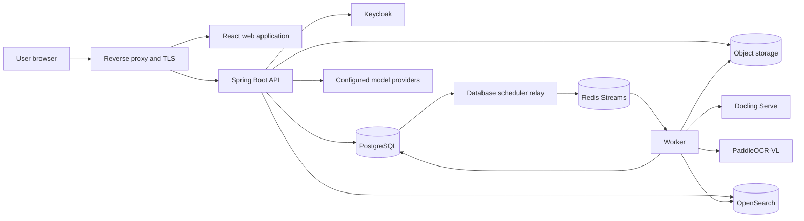
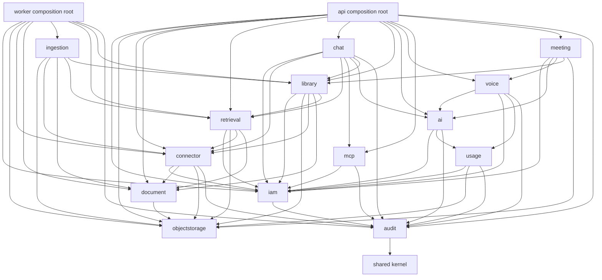
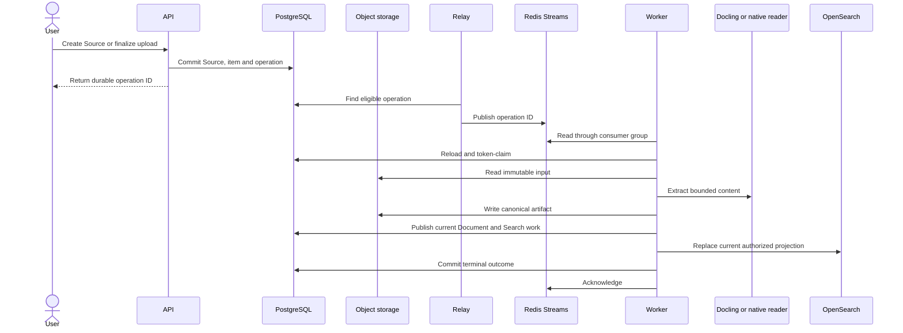
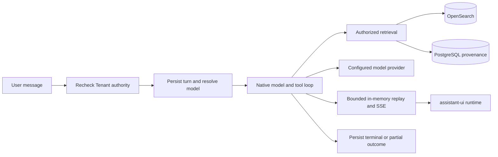
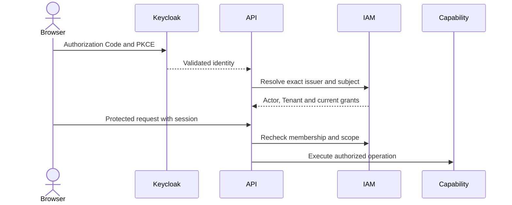
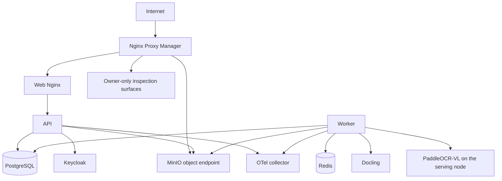

# MemoryOS architecture

This document describes the architecture implemented by the current repository. Detailed behavior belongs in capability [specifications](docs/specs), verification evidence belongs in [test matrices](docs/tests), operating procedures belong in [runbooks](docs/runbooks), and future direction belongs in the [vision](docs/vision.md#target-architecture). Accepted rationale is recorded in [ADRs](docs/decisions).

## Runtime overview

The web application's account-language and safe error boundary is documented in [localization](docs/specs/localization.md). Chat's lazy code/diagram renderers and bounded persisted read-only presentations reuse the existing native tool loop, authorized history and responsive reader panel; see [Chat renderers](docs/specs/chat.md#message-renderers-and-read-only-presentations).

The API and worker are separate deployables. The API owns HTTP, browser sessions, authorization, business commands, Chat inference and Flyway. The worker owns durable background execution for source synchronization, ingestion, cleanup and Search projection. The web application is a separate Vite/React deployable served by Nginx.

## Why the system has these components

| Choice | Reason | Operational consequence |
| --- | --- | --- |
| Controlled modular monolith | Current capabilities need shared transactions and explicit in-process contracts more than independent service scaling | Spring Modulith and ArchUnit enforce boundaries; split a service only after an accepted operational need |
| PostgreSQL as business authority | Authorization, ownership, commands, claims, retries and final outcomes need transactional consistency | Redis and OpenSearch can be rebuilt without inventing business state |
| Redis Streams for work delivery | Consumer groups, acknowledgement and pending-message recovery fit independent API and worker processes | Delivery is at least once; consumers must tolerate redelivery and acknowledge only after durable commit |
| Object storage for bytes and artifacts | Large immutable inputs and extraction results do not belong in request bodies or relational rows | PostgreSQL retains metadata, ownership, checksums and lifecycle fences |
| OpenSearch as a projection | Hybrid text/vector retrieval needs an index optimized for ranking | Index contents never grant access; reads remain Tenant and Source scoped |
| Parsers out of process | Parsing and OCR have a different dependency, resource and failure profile from the JVM | Calls are bounded; a parser failure fails the attempt without taking down the API or worker |
| One Document for every parser | Readers should not learn each provider's output | Every adapter writes the typed `memoryos-extraction-v2` Document; stored v1 artifacts are upgraded on read ([Document](docs/specs/document.md)) |
| Keycloak for identity, MemoryOS for authorization | External identity and local Tenant/Group/capability policy change independently | Every protected operation resolves current MemoryOS authority |

Redis Streams is not an event-sourcing log and does not own operation status. PostgreSQL records eligible work before dispatch, the relay publishes stable identifiers, and workers reload and token-claim the authoritative row. Lost or duplicated delivery is recovered through durable rediscovery, leases and idempotent completion.

## Code and capability boundaries

Arrows show allowed use of public capability contracts. Every module depends on `shared`, the shared kernel that holds `TenantId` and `ActorId` and a few technical utilities without domain; only the `audit` arrow to it is drawn. A module that needs IAM depends on `iam`, whose root package is its published API (Tenant access, the authorization decision, Groups, identity, users and the people-and-Group search every sharing picker uses, invitations and identity providers); IAM's feature packages are internal and it declares no named interfaces. `objectstorage`, `document` and `ingestion` do not depend on IAM at all. `chat`, `voice` and `meeting` run on `ai`, the model catalog and its providers; `meeting` records through `voice` and publishes its minutes to `library`. `ai` knows Chat's agents only by id, through the `AgentDirectory` port and the `ModelsRemoved` event that `chat` serves. `library` holds a person's files and never depends on `chat`: `chat`, `meeting` and `ingestion` (the extraction of an upload) depend on it, and it asks Chat which agents grant an upload and what attaches one through the `FileAttachments` port, and changes Chat's generated files and images through the `LibraryArtifacts` port, both of which `chat` implements; its listing reads Chat's artifact tables by SQL, because one statement pages across both. `audit` sits below every capability that records into it (`iam`, `connector`, `chat`, `ai`, `voice`, `mcp`, `usage`) and depends only on `shared`: it carries typed Tenant and actor identifiers, and asks IAM who may read the stream through the `AuditReaders` port that `iam` implements. Capability internals, persistence models and provider-specific types do not cross these boundaries. Application services own authorization, validation, orchestration and transaction boundaries. Concrete capability repositories own SQL/JPA persistence, row mapping, locks, claims and bulk writes. Cross-capability JPA relationships and single-implementation repository interfaces are avoided. The `api` and `worker` composition roots use only published module APIs, never a `persistence` package, and map core types to their own HTTP contracts. [ADR 0015](docs/decisions/0015-capability-module-map.md) records the target module map (`ai`, `voice`, `audit` and `library` are extracted) and the layout rule this structure is moving to.

| Gradle module | Responsibility |
| --- | --- |
| `core` | Fourteen capability implementations, the `shared` kernel of identifier types and technical utilities, and their public contracts; no dependency on `sources` or a deployable |
| `sources` | Shared integration bundle: the Google Drive and SharePoint adapters (`io.memoryos.connector.adapter`), including the Google account consent protocol the API's callback uses and bounded content extraction (`io.memoryos.ingestion.extraction`); depends only on public `core` APIs ([ADR 0016](docs/decisions/0016-integration-bundle-named-sources.md)) |
| `api` | HTTP, security, migrations and interactive Chat composition |
| `worker` | Redis/db-scheduler composition and durable background work |

| Capability | Owns | Detailed contract |
| --- | --- | --- |
| `iam` | Actor identity, Tenant membership, invitations, Users, Groups and authorization | [Identity](docs/specs/identity.md), [Tenant](docs/specs/tenant.md), [Invitation](docs/specs/invitation.md) |
| `shared` | The shared kernel: `TenantId` and `ActorId`, the identifiers every capability carries and none owns, and the technical utilities several capabilities repeated (`LeasedJob`, `Sha256`, `LikePattern`, `PdfText`); no module dependencies and no domain rule (owner decision 2026-09-25, phase 3) | [ADR 0015](docs/decisions/0015-capability-module-map.md#shared-kernel) |
| `audit` | The Tenant's append-only audit stream every administrative change records into, its reader, export and retention sweep | [Audit](docs/specs/audit.md) |
| `objectstorage` | Upload reservations, stored objects, adoption, discard and cleanup | [Object storage](docs/specs/object-storage.md) |
| `connector` | Sources, credentials, provider selection, items, synchronization and Source–Group associations | [Connector](docs/specs/connector.md) |
| `document` | Current Document metadata, canonical extraction artifact and current chunk identity | [Document](docs/specs/document.md) |
| `ingestion` | Durable selection, synchronization, extraction, indexing and cleanup orchestration | [Ingestion](docs/specs/ingestion.md) |
| `retrieval` | Embedding/OpenSearch adapters, search configuration generations and embedding providers, authorized Search, document passages and original PDF readers | [Search](docs/specs/search.md) |
| `chat` | Personas and the model each runs on, shared Document Sets, projects, sessions, message trees, turns, the files and images an answer generates, sharing, feedback and per-member voice settings | [Chat](docs/specs/chat.md) |
| `library` | A person's uploads and their extraction work, the file library listing (uploads beside Chat's generated files and images), trash, the storage limit, thumbnails, copies, published files and ZIP archives | [Chat: file library](docs/specs/chat.md), [ADR 0015 step 3](docs/decisions/0015-capability-module-map.md#step-3-what-library-holds) |
| `ai` | The Tenant's provider/model catalog, flow models, provider adapters (OpenAI) and their native clients, and single model calls outside a conversation such as meeting minutes and transcript corrections | [Model catalog](docs/specs/chat-models.md) |
| `voice` | Tenant voice connections, batch and live transcription and speech synthesis; audio is never stored | [MEM-91 design](docs/increments/active/mem-91-chat-voice/design.md) |
| `mcp` | Tenant-registered remote MCP servers, their OAuth clients, tool snapshots, sealed credentials and the Streamable HTTP client (MEM-112, in progress) | [MEM-112 design](docs/increments/active/mem-112-chat-mcp-client/design.md) |
| `meeting` | Owner-private meetings: live track recording or an uploaded recording through `voice`, stored utterances, speaker names and notes, leased minutes written by the API from the transcript through `ai`, and minutes published to the owner's file library; audio is never stored, and an uploaded recording is deleted once it has been transcribed (MEM-92, in progress) | [Meetings](docs/specs/meeting.md) |
| `usage` | Daily AI usage ledger for every AI flow, the AI costs report, and usage reports (a period's CSV and PDF export, built by the Worker and stored through `objectstorage`) | [AI usage and costs](docs/specs/ai-usage.md) |

## Durable ingestion and Search projection

FILE uploads use checksum-bound presigned PUT directly from the browser to object storage. Google Drive and SharePoint synchronization acquires provider content into tracked immutable raw snapshots before ingestion; ingestion never depends on a later provider read. Both run on one engine, `connector.sync.SourceSyncEngine`, which owns the attempt, the fence every write passes, acquisition, removal, item errors and the run outcome; each provider supplies only its traversal. Failures follow Onyx: a failure isolated to one item is a run error and the run ends `COMPLETED_WITH_ERRORS`, the next run retries the item and resolves the error, and too many item failures abort the attempt ([Connector](docs/specs/connector.md#synchronization-engine-and-failure-semantics)). Current Documents replace prior representations, while retained run/attempt records preserve observable processing history. Extraction success and Search readiness are separate states.

Provider-backed indexing uses one common claim, extraction, publication and run-history lifecycle, but provider authority is explicit and fail-closed. `ProviderAuthorityService` dispatches the persisted `SourceType` to the Google Drive or SharePoint connection authority; the owning provider verifies the captured credential revision, while the indexing repository verifies its provider-specific scope revision and selection eligibility. Locks follow Tenant → attached credential → Source. A future connector must add its provider implementation and explicit dispatch/eligibility branch rather than inheriting another provider's authority or passing a generic “not Google” condition.
Google SOURCE_SYNC also records bounded, fully paginated permission observations under Tenant/Source/provider-file identity before the unchanged-content shortcut. `JdbcGoogleDriveAclRepository` owns atomic snapshot replacement and lifecycle-aware reads; failure retains prior complete evidence with distinct attempt status. ACL data can precede a Document and is not an effective-read grant. Binary metadata-version changes with identical verified bytes retain the immutable content version and do not enqueue extraction; the current version's provider version is refreshed in place, so the next traversal treats the file as unchanged. See the [ACL handoff contract](docs/specs/connector.md#google-drive-acl-observations--mem-88).

Collected permissions are consumed server-side only through `GoogleDriveAclReader.readByDocument` and the `GoogleDriveAclChanged` event; no HTTP endpoint or UI displays them. The web Source detail uses a shared synchronization summary above Content, Sync history and Connection/settings tabs. Sync history shows per-run outcomes and counts, with bounded errors in a separate selected-run dialog; an error a later run resolved is shown as resolved.

Extraction routes by content, not by file name. A PDF whose text layer is too thin to be anything but a scan, and an image, go to PaddleOCR-VL when the deployment configures it: layout detection and reading order, then a 0.9B vision-language model reading each block, on the production serving node's GPU. Other PDFs, DOCX and PPTX go to Docling, which then reads text layers only; without PaddleOCR-VL, Docling keeps its own OCR. Each adapter maps its provider's output onto the one Document, and a PaddleOCR-VL failure is final for the attempt rather than a silent fall back to a weaker reader ([Ingestion](docs/specs/ingestion.md), [MEM-192](docs/increments/active/mem-192-ocr-gpu/design.md)).

The standalone OCR image owns a thin Serve composition and PDF backend/pipeline extensions for conservative pre-layout orientation. Worker retains its byte-only API boundary; its bounded adapter preserves raw document JSON and source-frame metadata rather than routing it through the SDK's closed document model. The [OCR recipe](infrastructure/deployment/ocr/README.md) and [Document contract](docs/specs/document.md) distinguish corrected coordinates, original provenance and unresolved financial periods. Image publication and deployment remain separate operational decisions.
FILE and Drive binary admission is bounded at 100 MiB; native snapshots retain their separate 32 MiB bound. Admission, parser/OCR completion, financial fidelity and Search readiness are separate acceptance claims; the [Ingestion contract](docs/specs/ingestion.md) owns parser budgets and current OCR limits.

Search uses the current authorized Document generation. PostgreSQL holds bounded chunk text and provenance; OpenSearch holds BM25/vector projection data. The embedding model is a search configuration generation stored in PostgreSQL (one PRESENT per deployment, seeded from deployment configuration on first start); each generation owns one index named by the generation, and readiness is recorded per index. Choosing another model on the Search settings page creates a FUTURE generation that the worker rebuilds in the background from stored chunks while search keeps reading PRESENT; switching makes it PRESENT in one transaction and keeps the old index restorable for seven days before an hourly cleanup deletes it. A release with a new chunk convention starts such a rebuild itself and switches when it is complete. Every process rereads the active generations at most every five seconds, so the api and worker follow a switch without a restart. Query filters narrow an already authorized scope and never create authority. Search results remain source passages; answer generation belongs to Chat.
Document Sets are Chat-owned, Tenant-qualified named Source allowlists. They retain an owner, a public flag, direct-user and ordinary-Group share rows, Sources and Persona attachments; all writes are revision fenced. They narrow—never grant—Source or document authority. Direct Search resolves permitted Set IDs into the actor's current `SourceSearchScope`; Persona resolution unions legacy direct attachments and current usable Set Sources before normal user Source/document checks. `/admin/document-sets` and the agent editor reuse existing Source/principal controls, while `POST /api/search` exposes the same bounded Set filter.

Direct Search and passage reads require current global `SEARCH_READ`. Actor-bound eligibility permits active FILE and Google Drive Sources by access mode: Public, Private through an associated Group, or Auto Sync through the file's retained Google permissions matched to the reader's verified email and, through service-account credentials, to the Google Groups that list it ([Source access modes](docs/specs/connector.md#source-access-modes)). A Google Drive credential is either OAuth consent or a domain-wide-delegated service account acting as a Workspace admin; the latter also reads Directory group membership one page per Drive sync step ([Google Group membership](docs/specs/connector.md#google-group-membership)). Membership, origin, grant and generation are rechecked after index IO and during expansion. Private Chat attachments are not exposed through general Search.

## Chat execution and retrieval

External Web tools now use this same turn/Embabel execution path, not a second worker or agent. Tenant-owned JPA connections reuse encrypted model credentials; Web URL evidence shares the existing answer-source store and reader panel. Protocol adapters, bounded public HTML/text/PDF reading and remaining native-search work are recorded in the [Chat Web contract](docs/specs/chat.md#external-web-search-and-url-reading).

Chat inference runs in the API process and does not use the ingestion worker or its Redis work streams. PostgreSQL owns sessions, message branches, command identity, outcome, run lease and model metadata. A bounded per-reply Redis Stream (`memoryos:chat:stream:*`, TTL-bound) supports live SSE and replay from any API process; committed database state remains the recovery boundary. Stop is local cancellation for the active process, with persisted partial/terminal outcome semantics.

Custom agents (Personas) are Chat-owned, Tenant-scoped configurations Onyx calls agents: instructions, an optional task prompt and knowledge cutoff, a tool policy (`search`, `web_search`, `image_generation`, `code_interpreter` and attached MCP servers), Source attachments, labels, pins and prompt shortcuts. Every use and edit check comes from one SQL predicate in `AgentAccessSql`, reused by listing, session selection, turn admission and the model catalog, so an agent a member can no longer use fails the next admission while an admitted turn keeps its captured context. `ChatTurnService` reads the session agent's tool policy under that authority before the Web, image and MCP checks, and registers only the tools the agent allows. Mutations lock the persona row and check its revision. Authority tokens are in the [identity contract](docs/specs/identity.md); behavior in the [Chat contract](docs/specs/chat.md).

Deep research is the one Chat mode where MemoryOS owns the inference loop: `ResearchExecutor` runs clarification, plan, orchestrator cycles, up to three parallel research agents and the final report as single guarded `streamInference` calls, executing agent tools directly and merging agent citations into the turn sources. It runs in the same turn, lease, Stop scope and budget as other answers; see the [Deep research contract](docs/specs/chat.md#deep-research).

Code Interpreter (`run_python`) calls the separate `memoryos-interpreter` service from the same tool loop. The service is vendored from Onyx python-sandbox under `interpreter/`. It is reachable only on the internal network with a shared API key, and it starts a disposable, network-less executor container per run. Generated files are copied into Object Storage as owner-authorized Chat artifacts. See the [Chat contract](docs/specs/chat.md#code-interpreter) and the [interpreter runtime](docs/runbooks/ci-cd.md#interpreter-runtime).

Private Chat files reuse Object Storage, Document extraction and passage readers while remaining Chat-owned and owner-authorized. General Search excludes private file chunks. Sharing exposes allowed transcript descriptors without granting access to underlying private bytes or passages.

The provider/model/default lifecycle belongs to `ai` and uses its own Spring Data JPA repositories and Hibernate revisions; authority projections, conflict-safe initialization and bulk reference mechanics remain JDBC. Access uses IAM `MODELS_MANAGE`, Group/Persona access and stable model configuration UUIDs. Organization BYOK is encrypted using a deployment-managed AES key. `/admin/models` implements Models-only navigation and provider/model/default administration through generated clients, independently of Tenant administration. Its bounded Persona projection and the Persona model belong to `chat` (`ChatModelAccess`), respect builtin/current-actor ownership and stay separate from the assistant editor and Chat model selector. Access editing remains deferred. See the [catalog contract](docs/specs/chat-models.md).

Each turn resolves a native Embabel/Spring AI binding once and acquires a bounded client lease. The binding, request policy, client leases and guard live in `ai`; the OpenAI protocol adapter, its streaming clients, cancellation transport and hosted O200K estimator profile are internal to `ai.openai`, which registers the adapter bean. A turn selects its model in `chat` (`ChatModelAccess`, `ChatModelSelector`) and acquires the client from `ai` outside the transaction; hosted Web search and reasoning reach the turn through a provider-neutral `ModelTurns.Listener` that `chat` turns into its events and evidence. The executor neither selects providers nor decodes provider options. A shared immutable policy measures pre-reservation mandatory framing, bounded history and every converted native request/Validate. Raw HTTP cancellation precedes blocked-reader closure. No vendored tokenizer assets or native libraries ship in either deployable.

No self-hosted model is deployed. MEM-77 managed serving (vLLM behind a private gateway, provisioning, drain/rotation and serving recovery) was removed on 2026-09-19 until a qualified environment exists; Chat reaches models only through providers in the catalog. See [Model serving](docs/runbooks/ci-cd.md#model-serving).

Voice is its own capability (`voice`), used by the Chat composer, Search and meetings. Tenant voice connections live in PostgreSQL and belong to `voice`; the per-member settings (auto-send, auto-playback, playback speed) are how Chat uses voice and stay in `chat`. Encrypted credentials follow the same deployment-key contract as the catalog and the other tool connections. The browser obtains a one-use, purpose-bound in-memory ticket before opening a same-origin transcription or synthesis WebSocket. The handshake rechecks current membership and capability. Tickets are process-local, so a multi-replica API deployment requires sticky routing or a shared ticket store.

The browser captures PCM16 mono audio at 24 kHz. For the public OpenAI provider, the API opens a provider-side Realtime transcription session with `gpt-live-transcribe`, forwards audio frames and relays cumulative transcript deltas. Manual Stop commits the provider buffer. The API retains the bounded recording only for the lifetime of the connection and replays it through the existing batch transcriber if Realtime setup or streaming fails. OpenAI-compatible, ElevenLabs and Azure connections use the bounded chunked/REST path because MemoryOS does not assume their Realtime protocols are compatible. Soniox, a speech-to-text-only provider, streams over its own realtime WebSocket and falls back to its async file API. Transcript messages carry a monotonically increasing connection revision plus separate committed-final and utterance-boundary signals; the current OpenAI session has turn detection disabled and therefore never invents a VAD boundary. Audio and provider text are not persisted or logged. The complete behavior and remaining live-provider acceptance are in the [Voice design](docs/increments/active/mem-91-chat-voice/design.md).

## Identity and authorization

Keycloak is the browser credential store and enterprise identity broker. MemoryOS binds the exact validated `(issuer, subject)` to an Actor and owns Tenant membership, Group grants, capability implications and resource scope. Email, provider role presentation and indexed metadata never substitute for authorization; a verified login email is only matched against provider permissions of Auto Sync Sources ([ADR 0011](docs/decisions/0011-verified-email-source-permission-matching.md)). IAM mutations advance the Tenant authorization revision so the browser can discard revoked private state.

Protected Admin/Basic Groups persist `SYSTEM_ADMIN`/`SYSTEM_BASIC`. Admin expands to every enum capability; Basic implies `SEARCH_READ`, `CHAT_READ`, `CHAT_WRITE`, `IMAGE_GENERATE` and `LLM_GATEWAY_USE`. Only Users, Groups, Sources and Models management are assignable ordinary grants. Chat retains its membership/resource policy rather than granular Chat-token enforcement; image/gateway vocabulary does not claim feature delivery. The [Identity contract](docs/specs/identity.md) defines protected memberships, peer-manager restrictions, Onyx identity presentation and the `manage_grants` gate that hides ordinary Group Permissions and its registry query.

SharePoint Sources synchronize as an Entra application: the credential is verified with Microsoft before it is stored, addresses resolve to Graph identifiers before a scope applies, a refresh follows each library's change log including its tombstones, and a prune removes what a completed listing no longer finds. Site pages are collected as JSON snapshots read into canonical blocks. The [Connector contract](docs/specs/connector.md#sharepoint-credential-authority) owns the policy.

Source associations contain ordinary Groups only: global managers may save `[]`, the recorded Source manager may add or remove only the Groups they manage, and no Source defaults to Admin. Scoped operations, including detaching a Source from a Group, require the Source's recorded manager rather than management of every associated Group, so another manager of that Group cannot touch it; deep Drive selection/discovery, FILE visibility and existing OAuth client replacement remain global-only, with callback and post-provider rechecks. Shared deletion remains global, apart from the narrow existing private groupless-creator cleanup rule. The [Connector matrix](docs/specs/connector.md#management-authority-and-group-associations) owns the exact policy; the catalog settings shortcut requires nonempty projected Source actions.

Google authorization is a separate Connector credential flow. Its callback cannot replace the signed-in Actor or infer identity from email. Provider tokens are encrypted or transient and do not become application-session authority.

The shared runtime mounts the repository-owned `memoryos` login theme read-only and selects it only for the `memoryos` realm. The theme extends Keycloak 26.7's `keycloak.v2` theme with local CSS, messages, and SVG assets; it copies no FreeMarker templates, so Keycloak retains ownership of login, password recovery, required actions, action-token errors, form submission, and accessibility semantics. Realm reconciliation verifies both server-side theme discovery and the persisted `loginTheme` value. The master and OrgMemory realms remain outside MemoryOS theme reconciliation.

## Data ownership and consistency

| Store | Authoritative for | Rebuildable or derived |
| --- | --- | --- |
| PostgreSQL | Identity bindings, authorization, Sources, operations, current Documents, Chat state and lifecycle evidence | No |
| Object storage | Immutable raw inputs, canonical extraction artifacts and private file bytes | Bytes are authoritative; associations and lifecycle remain in PostgreSQL |
| Redis Streams | Background delivery and pending consumer-group state | Yes, from eligible PostgreSQL operations |
| Redis Chat replay | Live and recently finished reply events for SSE resume | No; lost replay resets the browser to committed history |
| OpenSearch | Searchable text/vector projection | Yes, from current authorized Document generations |
| Keycloak | External authentication and broker configuration | MemoryOS authorization is separate |

Flyway owns schema evolution and runs from the API composition root. Released migrations are append-only; local or historical review databases with divergent unpublished histories are not upgrade targets. Verification uses fresh disposable databases or an explicit data-preserving migration plan.

The merged layout has 107 migrations. Published main V1–V74 stay unchanged. `V75__add_google_drive_acl_snapshots.sql`, `V76__persist_run_error_messages.sql`, `V77__source_access_modes.sql` and `V78__default_google_drive_sync_interval_30_minutes.sql` retain the current Google Drive and Source-access additions, and `V79__source_pause_resume.sql` adds Source pause/resume. SharePoint uses `V80__add_sharepoint_credentials.sql` and `V81__add_sharepoint_sources.sql`, while Voice uses `V82__chat_voice_connections.sql` and `V83__chat_voice_settings.sql`. `V84__model_flows_and_provider_data_boundary.sql`, `V85__ai_usage.sql`, `V86__chat_preferences.sql`, `V87__drop_chat_start_page.sql`, `V88__chat_sampling_defaults.sql`, `V89__document_sets.sql`, `V90__chat_file_library.sql`, `V91__ai_usage_report.sql`, `V92__chat_library_copies.sql`, `V93__chat_library_favorites.sql`, `V94__chat_library_archive.sql` and `V95__audit_event.sql` follow, then `V96__google_drive_service_accounts.sql`, `V97__google_group_membership.sql`, `V98__chat_storage_quota.sql`, `V99__chat_library_trash.sql`, the MEM-153 conversation-lifecycle migrations `V100__chat_session_archive_and_branch.sql`, `V101__chat_temporary_and_retention.sql` and `V102__chat_export.sql`, `V103__ai_usage_limit.sql`, the MEM-152 library migrations V104–V106 and `V107__chat_history_visibility.sql`. V1–V53 include Chat uploads/message files, 100 MiB binary admission, automatic titles, account language, read-only message artifacts, Web connections, history search and Search access in V37–V52. The MEM-77 tokenizer-profile backfill is `V54__backfill_model_tokenizer_profile.sql`, `V55__chat_web_gateway_provider.sql` widens the Web gateway provider constraint, and `V61__chat_web_search_modes.sql` narrows persisted Web intent to `off`/`auto`. PR #106 integrated the earlier feature migrations under these nonconflicting versions:

| Historical local version | Current filename |
| --- | --- |
| V37 | `V43__grant_basic_access.sql` |
| V38 | `V44__rename_system_capability_grants.sql` |
| V39 | `V45__make_group_read_derived_only.sql` |
| V40 | `V46__unify_source_management_grants.sql` |
| V41 | `V47__group_manager_source_scope.sql` |
| V42 | `V48__ordinary_source_group_associations.sql` |

Existing local databases containing the old feature V37–V42 cannot run this merged layout until deliberate, data-preserving Flyway-history and schema reconciliation. The same caution applies to older feature V18–V21 and retained `memoryos_main_review`/`memoryos_drive_review` histories. Do not start either deployable against a divergent database, reset it, or automatically repair checksums/history. Deploy matching API/worker/schema only after reconciliation or use a fresh isolated database. Historical verification keeps its original migration numbers; current PR evidence is recorded in [Basic Access verification](docs/increments/completed/basic-access-capabilities/verification.md#pr-106-ci-repair). The increment remains active until merge.

## Deployment and operations

Base Compose owns PostgreSQL, MinIO, Keycloak, Redis-dependent application services, API, worker and web. Production's GPU services run on a second node from `compose.serving.yaml`, published on its private address and admitted to the application node alone by a `DOCKER-USER` rule; the production deployment rolls that node out first. Staging adds protected inspection and observability surfaces; production exposes none of them. API and worker images remain distinct, use bounded resources and report readiness for their owned dependencies. Exact deployment, recovery and evidence boundaries are in the [CI/CD runbook](docs/runbooks/ci-cd.md) and [delivery matrix](docs/tests/delivery.md).

The deployment is an explicit overlay contract. `compose.base.yaml` owns PostgreSQL, private MinIO with a durable volume, one-shot bucket/policy/sentinel bootstrap, shared Keycloak, API, worker, and web. The Keycloak service receives the versioned MemoryOS theme through one read-only repository bind mount; production theme and template caches stay enabled. MinIO receives distinct least-privilege API and worker identities from mounted secret files; its browser CORS allowlist and the web `connect-src` are configured to exact origins. The API signs against a browser-reachable endpoint but inspects through the internal service endpoint. `compose.staging.yaml` adds Mailpit, TLS Redis, read-only PostgreSQL/Redis inspectors, native MinIO Console OIDC, and file-backed inspection secrets. pgweb and Redis Insight remain behind separate OAuth2 Proxies on loopback ports `18026` and `18027`; MinIO's container-only port `9001` is reached through a dedicated HTTPS proxy host and receives no host binding. `compose.production.yaml` adds production profiles and no inspection exposure or MinIO OIDC configuration. API and worker remain separate image targets; worker starts after API and Redis health, exposes datasource/Redis/db-scheduler/object-storage readiness internally, and runs with bounded resources and shutdown.

Structured logs, metrics and traces flow through OpenTelemetry to the independently operated LGTM stack. Telemetry carries correlation and operation-origin identifiers but never changes authorization, durable claims or acknowledgement semantics. See the [observability policy](docs/guidelines/observability.md).

The public `vadan.app` landing site is a separate static image and Compose project. It is released and operated independently from the MemoryOS application; see the [landing runbook](docs/runbooks/landing.md).

## Current boundary and future direction

The implemented system has no multi-Tenant switcher, dynamic broker administration, audit evidence viewer, SCIM, Google document ACL enforcement, reader identity linking, MCP server, GraphRAG engine or durable memory-management surface. These are candidate capabilities rather than implied parts of the current runtime.
