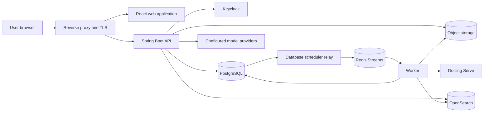
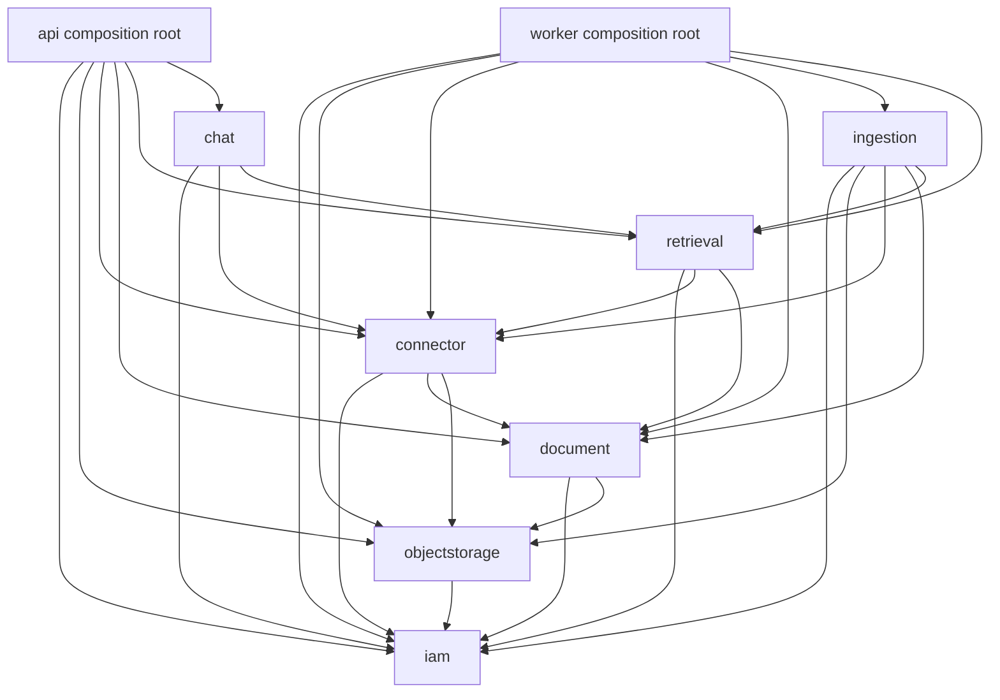
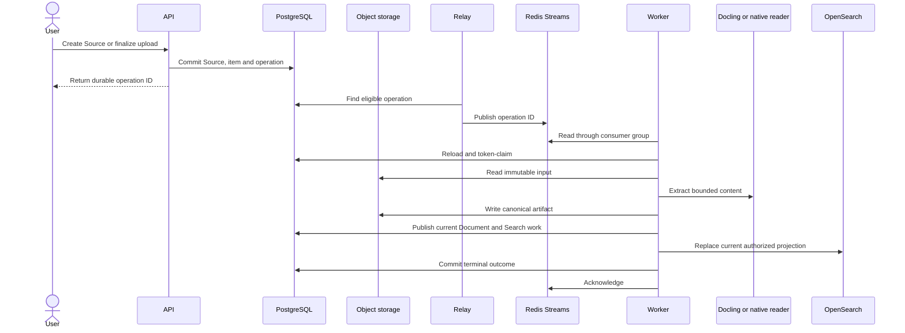
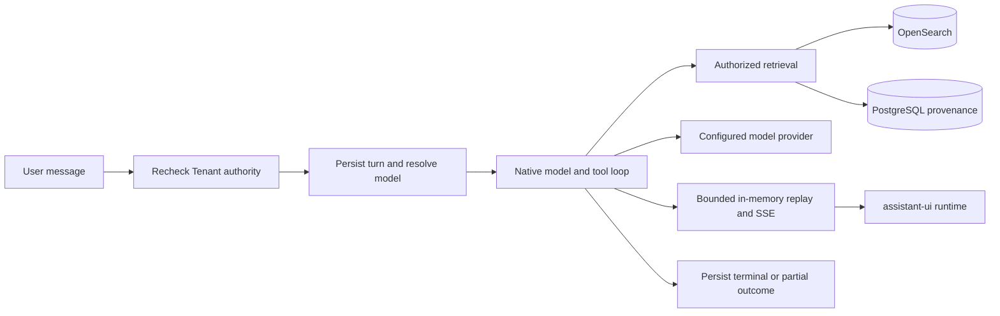
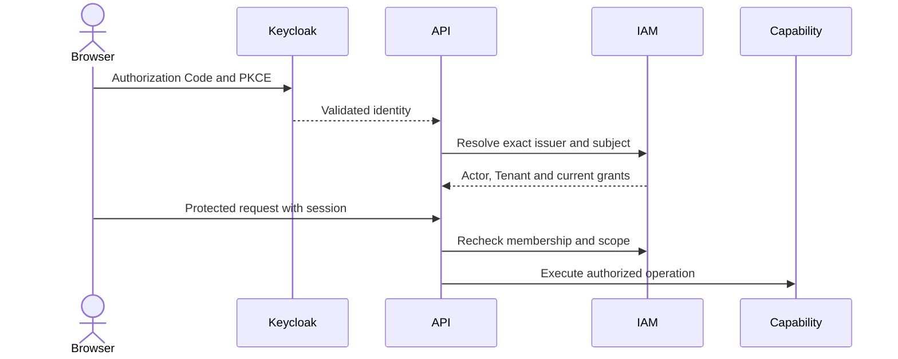
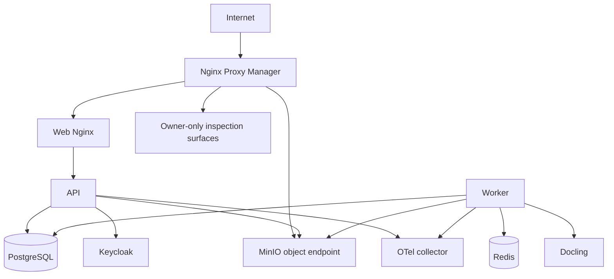

# MemoryOS architecture

This document describes the architecture implemented by the current repository. Detailed behavior belongs in capability [specifications](docs/specs), verification evidence belongs in [test matrices](docs/tests), operating procedures belong in [runbooks](docs/runbooks), and future direction belongs in the [vision](docs/vision.md#target-architecture). Accepted rationale is recorded in [ADRs](docs/decisions).

## Runtime overview

The web application's account-language and safe error boundary is documented in [localization](docs/specs/localization.md). Chat's lazy code/diagram renderers and bounded persisted read-only presentations reuse the existing native tool loop, authorized history and responsive reader panel; see [Chat renderers](docs/specs/chat.md#message-renderers-and-read-only-presentations).

The API and worker are separate deployables. The API owns HTTP, browser sessions, authorization, business commands, Chat inference and Flyway. The worker owns durable background execution for source synchronization, ingestion, cleanup and Search projection. The web application is a separate Vite/React deployable served by Nginx.

## Why the system has these components

| Choice | Reason | Operational consequence |
| --- | --- | --- |
| Controlled modular monolith | Current capabilities need shared transactions and explicit in-process contracts more than independent service scaling | Spring Modulith and ArchUnit enforce boundaries; split a service only after an accepted operational need |
| PostgreSQL as business authority | Authorization, ownership, commands, claims, retries and final outcomes need transactional consistency | Redis and OpenSearch can be rebuilt without inventing business state |
| Redis Streams for work delivery | Consumer groups, acknowledgement and pending-message recovery fit independent API and worker processes | Delivery is at least once; consumers must tolerate redelivery and acknowledge only after durable commit |
| Object storage for bytes and artifacts | Large immutable inputs and extraction results do not belong in request bodies or relational rows | PostgreSQL retains metadata, ownership, checksums and lifecycle fences |
| OpenSearch as a projection | Hybrid text/vector retrieval needs an index optimized for ranking | Index contents never grant access; reads remain Tenant and Source scoped |
| Docling out of process | Parsing and OCR have a different dependency, resource and failure profile from the JVM | Calls are bounded and retryable; parser failure does not take down the API |
| Keycloak for identity, MemoryOS for authorization | External identity and local Tenant/Group/capability policy change independently | Every protected operation resolves current MemoryOS authority |

Redis Streams is not an event-sourcing log and does not own operation status. PostgreSQL records eligible work before dispatch, the relay publishes stable identifiers, and workers reload and token-claim the authoritative row. Lost or duplicated delivery is recovered through durable rediscovery, leases and idempotent completion.

## Code and capability boundaries

Arrows show allowed use of public capability contracts. Capability internals, persistence models and provider-specific types do not cross these boundaries. Application services own authorization, validation, orchestration and transaction boundaries. Concrete capability repositories own SQL/JPA persistence, row mapping, locks, claims and bulk writes. Cross-capability JPA relationships and single-implementation repository interfaces are avoided.

| Gradle module | Responsibility |
| --- | --- |
| `core` | Seven capability implementations and public contracts; no dependency on `connector` or a deployable |
| `connector` | Shared provider integration and bounded content extraction bundle; depends only on public `core` APIs |
| `api` | HTTP, security, migrations and interactive Chat composition |
| `worker` | Redis/db-scheduler composition and durable background work |

| Capability | Owns | Detailed contract |
| --- | --- | --- |
| `iam` | Actor identity, Tenant membership, invitations, Users, Groups and authorization | [Identity](docs/specs/identity.md), [Tenant](docs/specs/tenant.md), [Invitation](docs/specs/invitation.md) |
| `objectstorage` | Upload reservations, stored objects, adoption, discard and cleanup | [Object storage](docs/specs/object-storage.md) |
| `connector` | Sources, credentials, provider selection, items, synchronization and Source–Group associations | [Connector](docs/specs/connector.md) |
| `document` | Current Document metadata, canonical extraction artifact and current chunk identity | [Document](docs/specs/document.md) |
| `ingestion` | Durable selection, synchronization, extraction, indexing and cleanup orchestration | [Ingestion](docs/specs/ingestion.md) |
| `retrieval` | Embedding/OpenSearch adapters, authorized Search and document passages | [Search](docs/specs/search.md) |
| `chat` | Personas, projects, sessions, message trees, model catalog, files, sharing and feedback | [Chat](docs/specs/chat.md), [model catalog](docs/specs/chat-models.md) |

## Durable ingestion and Search projection

FILE uploads use checksum-bound presigned PUT directly from the browser to object storage. Google Drive synchronization acquires provider content into tracked immutable raw snapshots before ingestion; ingestion never depends on a later provider read. Current Documents replace prior representations, while retained run/attempt records preserve observable processing history. Extraction success and Search readiness are separate states.

The standalone OCR image owns a thin Serve composition and PDF backend/pipeline extensions for conservative pre-layout orientation. Worker retains its byte-only API boundary; its bounded adapter preserves raw document JSON and source-frame metadata rather than routing it through the SDK's closed document model. The [OCR recipe](infrastructure/deployment/ocr/README.md) and [Document contract](docs/specs/document.md) distinguish corrected coordinates, original provenance and unresolved financial periods. Image publication and deployment remain separate operational decisions.

Search uses the current authorized Document generation. PostgreSQL holds bounded chunk text and provenance; OpenSearch holds BM25/vector projection data. Query filters narrow an already authorized scope and never create authority. Search results remain source passages; answer generation belongs to Chat.

## Chat execution and retrieval

Chat inference runs in the API process and does not use the ingestion worker or Redis journal. PostgreSQL owns sessions, message branches, command identity, outcome, deadline and model metadata. A bounded in-memory buffer supports live SSE and short replay; committed database state remains the recovery boundary. Stop is local cancellation for the active process, with persisted partial/terminal outcome semantics.

Private Chat files reuse Object Storage, Document extraction and passage readers while remaining Chat-owned and owner-authorized. General Search excludes private file chunks. Sharing exposes allowed transcript descriptors without granting access to underlying private bytes or passages.

## Identity and authorization

Keycloak is the browser credential store and enterprise identity broker. MemoryOS binds the exact validated `(issuer, subject)` to an Actor and owns Tenant membership, Group grants, capability implications and resource scope. Email, provider role presentation and indexed metadata never substitute for authorization. IAM mutations advance the Tenant authorization revision so the browser can discard revoked private state.

Google authorization is a separate Connector credential flow. Its callback cannot replace the signed-in Actor or infer identity from email. Provider tokens are encrypted or transient and do not become application-session authority.

## Data ownership and consistency

| Store | Authoritative for | Rebuildable or derived |
| --- | --- | --- |
| PostgreSQL | Identity bindings, authorization, Sources, operations, current Documents, Chat state and lifecycle evidence | No |
| Object storage | Immutable raw inputs, canonical extraction artifacts and private file bytes | Bytes are authoritative; associations and lifecycle remain in PostgreSQL |
| Redis Streams | Background delivery and pending consumer-group state | Yes, from eligible PostgreSQL operations |
| OpenSearch | Searchable text/vector projection | Yes, from current authorized Document generations |
| Keycloak | External authentication and broker configuration | MemoryOS authorization is separate |

Flyway owns schema evolution and runs from the API composition root. Released migrations are append-only; local or historical review databases with divergent unpublished histories are not upgrade targets. Verification uses fresh disposable databases or an explicit data-preserving migration plan.

## Deployment and operations

Base Compose owns PostgreSQL, MinIO, Keycloak, Redis-dependent application services, API, worker and web. Staging adds protected inspection and observability surfaces; production exposes none of them. API and worker images remain distinct, use bounded resources and report readiness for their owned dependencies. Exact deployment, recovery and evidence boundaries are in the [CI/CD runbook](docs/runbooks/ci-cd.md) and [delivery matrix](docs/tests/delivery.md).

Structured logs, metrics and traces flow through OpenTelemetry to the independently operated LGTM stack. Telemetry carries correlation and operation-origin identifiers but never changes authorization, durable claims or acknowledgement semantics. See the [observability policy](docs/guidelines/observability.md).

The public `vadan.app` landing site is a separate static image and Compose project. It is released and operated independently from the MemoryOS application; see the [landing runbook](docs/runbooks/landing.md).

## Current boundary and future direction

The implemented system has no multi-Tenant switcher, dynamic broker administration, audit evidence viewer, SCIM, Google document ACL enforcement, reader identity linking, MCP server, GraphRAG engine or durable memory-management surface. These are candidate capabilities rather than implied parts of the current runtime.

The [target architecture](docs/vision.md#target-architecture) describes the intended evolution and its decision gates. New capability or dependency edges require an accepted design, an ADR when implementation starts, boundary-test updates and a production runtime path.
