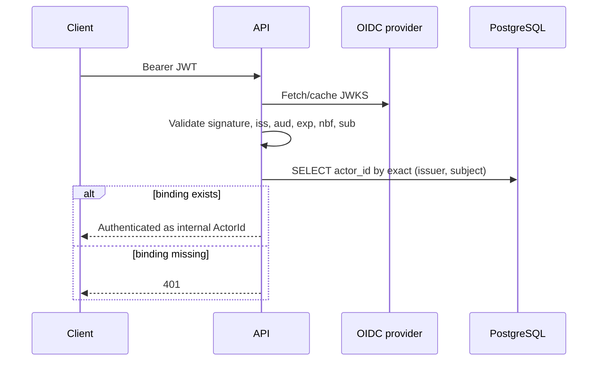

# MemoryOS architecture

This document describes the system implemented in this repository. Product intent lives in [docs/vision.md](docs/vision.md); rationale lives in [ADRs](docs/decisions/).

## System shape

MemoryOS is a controlled Spring Modulith monolith built as three flat Gradle modules:

| Module | Runtime role | Dependency rule |
| --- | --- | --- |
| `core` | Capability model, public contracts, capability-owned persistence | Must not depend on a deployable |
| `api` | Spring Boot HTTP composition root | Depends on `core` |
| `worker` | Spring Boot background-processing composition root | Depends on `core` |

`api` and `worker` are separate deployables. The worker currently starts and exits without a scheduler or job processor.

## Capability boundaries

`core` contains seven Spring Modulith modules: `identity`, `authorization`, `knowledge`, `ingestion`, `retrieval`, `assistant`, and `audit`. A capability root package is its public API. Capability-owned persistence lives beneath that capability and cannot be imported by another capability.

The enforced dependency graph is defined by [ADR 0001](docs/decisions/0001-controlled-modular-monolith.md) and verified by Spring Modulith and ArchUnit tests.

## Authentication and actor resolution

The API is a stateless OAuth2 Resource Server.

`GET /api/identity/me` returns only the authenticated `actorId`. `GET /actuator/health` is public. Every other request requires authentication.

The repository currently implements binding reads, not an account-linking or administrative write flow. A product write path must prove control of the new external identity, authorize the current actor or administrator, write transactionally, and emit audit evidence before it is added.

## Identity persistence

Flyway migration `V1__create_identity_tables.sql` owns two PostgreSQL tables:

- `actors`: internal UUID identity.
- `external_identity_bindings`: exact `(issuer, subject)` primary key referencing `actors.id` with `ON DELETE RESTRICT`.

`JdbcExternalIdentityStore` implements `ExternalIdentityResolver` with one exact lookup. Case normalization, email/username matching, implicit actor creation, and silent rebinding are not implemented.

API startup requires datasource and OIDC configuration and runs Flyway validation/migration. The shared PostgreSQL port is loopback-only; local access uses an SSH tunnel. Operational details are in [the development runtime runbook](docs/runbooks/development-runtime.md).

## External identity provider

The shared Keycloak deployment contains a dedicated `memoryos` realm and public client `memoryos-integration` using Authorization Code with PKCE S256. Desired state under `infrastructure/keycloak/` reconciles only that client and its audience mapper; the application has no Keycloak administrator credential.

## Deferred components

No OpenFGA client, model provider, connector, MCP server, GraphRAG engine, production application deployment, account-linking endpoint, or background processing loop exists yet. Add each only through a capability-owned vertical slice with a verified production path.
