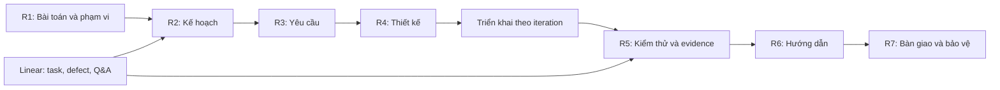

# Hồ sơ đồ án SEP490 — MemoryOS

Theo dõi biên soạn và các phần còn thiếu: [MEM-85](https://linear.app/memory-os/issue/MEM-85).

Bộ mẫu do chủ dự án cung cấp, nhập ngày 12/09/2026. Đã giữ nguyên 8 tệp gốc trong `templates/`; [manifest.json](manifest.json) ghi kích thước và SHA-256 để kiểm tra tính toàn vẹn. Bỏ qua tệp khóa Word `~$...`. Đây là mẫu và hướng dẫn, chưa phải báo cáo MemoryOS đã điền hoặc đã nghiệm thu.

## Bộ mẫu hiện có

| Tệp | Mục đích |
| --- | --- |
| [Student Guide](<templates/SEP490 StudentGuide_Fall 2023.docx>) | Yêu cầu đầu ra, mốc tuần, đánh giá, quy định ngôn ngữ |
| [Report 1 — Project Introduction](<templates/Report1_Project Introduction.docx>) | Bối cảnh, cơ hội, hệ thống tương tự, vision, phạm vi và giới hạn |
| [Report 2 — Project Management Plan](<templates/Report2_Project Management Plan.docx>) | WBS, effort, rủi ro, chất lượng, phân công, giao tiếp và quản lý cấu hình |
| [Lịch mẫu PDF](<templates/Report2_Sample Project Schedule.pdf>) | Bản đọc lịch dự án, 2 trang |
| [Lịch mẫu ProjectLibre](<templates/Report2_Sample Project Schedule.pod>) | Tệp lịch có thể chỉnh sửa; giữ nguyên bản gốc |
| [Report 3 — SRS](<templates/Report3_Software Requirement Specification.docx>) | Actors/use cases, screen flow, phân quyền, ERD, yêu cầu chức năng, phi chức năng, business rules và messages |
| [Project Tracking](<templates/Report3_Project Tracking.xlsx>) | Bốn sheet: WBS, Issues, Defects, Q&A |
| [Weekly Report](<templates/Project Weekly Report_GroupName.xlsx>) | Báo cáo tuần theo task, người phụ trách, trạng thái và ghi chú; sheet mẫu Wx |

## Cách xây dựng hồ sơ MemoryOS

| Đầu ra | Nội dung phải chuẩn bị | Nguồn đối chiếu trong dự án |
| --- | --- | --- |
| R1 — Introduction | Bài toán khách hàng, nhóm, so sánh giải pháp, mục tiêu, tính năng và phần loại trừ | [Vision](../../vision.md), phạm vi đã chốt với giảng viên/khách hàng |
| R2 — PMP | WBS/ước lượng, mốc, trách nhiệm D/R/S/I, rủi ro, quality plan, training, giao tiếp, versioning | [Roadmap](../../roadmap.md), [conventions](../../conventions.md), issue và milestone Linear |
| R3 — SRS | Actors, use cases, luồng màn hình, quyền thao tác, chức năng nền, ERD, validation, ngoại lệ, NFR đo được | [Capability specs](../../specs/), giao diện và hành vi đã kiểm chứng |
| R4 — SDD | Kiến trúc hệ thống, database, thiết kế chi tiết, class/sequence và rationale | [Architecture](../../../ARCHITECTURE.md), [decisions](../../decisions/), capability specs |
| R5 — Test Documentation | Test plan, UT/IT/ST/UAT, test cases, kết quả, defect và giới hạn nghiệm thu | [Test matrices](../../tests/), verification của increment, kết quả chạy thực tế |
| R6 — User Guides | Cài đặt, cấu hình, hướng dẫn người dùng theo tác vụ, xử lý lỗi | [Runbooks](../../runbooks/), hướng dẫn sử dụng và ảnh giao diện cần biên soạn |
| R7 — Final Product/Report | Tổng hợp R1–R6, mã nguồn, database scripts, gói chạy, test/defect records, tracking và slide bảo vệ | Phiên bản bàn giao được chốt và bằng chứng tương ứng |

Chỉ dùng dữ liệu đã xác minh để ghi trạng thái hoàn thành. Tách rõ đã có code, đã triển khai và đã nghiệm thu. Kiến trúc tương lai được đánh dấu là đề xuất; không đưa vào phần đã thực hiện. Các bảng người dùng mẫu trong Word/Excel không phải thành viên dự án MemoryOS.

## Thiếu gì và cần chốt gì

- Chưa có mẫu R4, R5 (Unit Test, Test Report, Test Documentation), R6 và R7 trong bộ được cung cấp. Cần bổ sung mẫu đúng học kỳ trước khi đóng gói bản nộp.
- Student Guide là Fall 2023; các mẫu báo cáo có dữ liệu ví dụ 2019 và lịch mẫu 2021. Xác nhận yêu cầu học kỳ hiện tại với giảng viên, không dùng các ngày mẫu làm deadline thực tế.
- Theo Student Guide được cung cấp, báo cáo và bảo vệ dùng tiếng Anh. Hướng dẫn điều phối này dùng tiếng Việt; bản nộp cần tuân theo ngôn ngữ được giảng viên xác nhận.
- Cần tên/mã đề tài, mã nhóm, danh sách thành viên và giảng viên, ngày bắt đầu, deadline thực tế, khách hàng và phạm vi được duyệt. Chưa tự điền những thông tin này.
- Guide gọi phần 7 là Software Product và ở mốc cuối là Final Project Report; khi nhận mẫu R7 cần đối chiếu cách đóng gói cụ thể.

## Mốc tham khảo từ Student Guide

| Cuối tuần | Đầu ra |
| --- | --- |
| 1 | R1 |
| 2 | R2 |
| 3 | Tổng quan R3, cập nhật R1/R2, schedule/tracking |
| 5 | Tổng quan R4, test plan R5, demo code/database, cập nhật báo cáo |
| 7 / 9 / 11 | Ba software packages; cập nhật SRS, design, UT/IT, defects và tracking |
| 13 | Full package, system testing và cập nhật báo cáo |
| 14 | R6 và tracking |
| 15 | R7, sản phẩm cuối, tài liệu kiểm thử, tracking và slide bảo vệ |

Đây là mốc tương đối từ tài liệu được cung cấp, chưa phải lịch được nhóm hoặc giảng viên phê duyệt.

## Quy trình duy trì

1. Giữ nguyên `templates/`. Khi bắt đầu viết, tạo bản làm việc trong `reports/` theo số R1–R7; báo cáo tuần để trong `weekly/`, bản bàn giao chốt để trong `submissions/`. Chỉ tạo các thư mục này khi có nội dung thật.
2. Chốt R1 và phạm vi trước; lập PMP/WBS; viết SRS; đối chiếu design và tests; biên soạn user guides rồi đóng gói cuối kỳ.
3. Theo dõi task, owner, deadline, blockers, defects và Q&A trên Linear. Ghi mã issue vào Notes của tracking/weekly report để truy vết; bản Excel là snapshot phục vụ nộp, cần ghi ngày chốt dữ liệu.
4. Với mỗi yêu cầu, giữ chuỗi truy vết: yêu cầu/use case → issue → thiết kế/implementation → test case → bằng chứng. Không tự gán coverage hoặc kết quả Pass khi chưa chạy.
5. Mỗi bản nộp ghi version, ngày, người viết/review và Record of Changes; thay toàn bộ tên/ngày/nội dung ví dụ. Báo cáo phải tự đầy đủ, không chỉ dẫn người chấm sang code hoặc Linear để đọc nội dung bắt buộc.

## Công cụ vẽ của nhóm

Mã nguồn [Visual Paradigm MCP](../../../../tools/visual-paradigm-mcp/README.md) được quản lý cùng repo tại `tools/visual-paradigm-mcp/`. Xem [ghi chú nhập tool](../../../../tools/visual-paradigm-mcp/IMPORT.md). Mỗi thành viên cài Visual Paradigm/plugin trên máy mình. Lưu file dự án và ảnh xuất vào `diagrams/` khi bắt đầu vẽ.
