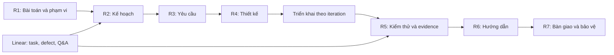

# Hồ sơ đồ án SEP490 — MemoryOS

Theo dõi biên soạn và các phần còn thiếu: [MEM-85](https://linear.app/memory-os/issue/MEM-85).

Bộ mẫu R1–R7 hiện hành do chủ dự án cung cấp ngày 14/09/2026 (`SEP490 Templates-20260914`), nhập vào repo ngày 15/09/2026. Bộ này thay các mẫu R1/R2/R3, Project Tracking và Weekly Report nhập ngày 12/09/2026. Student Guide Fall 2023 và lịch mẫu R2 cũ không có bản mới nên vẫn giữ để tham khảo. Tệp gốc giữ nguyên trong `templates/`; [manifest.json](manifest.json) ghi kích thước và SHA-256. Đây là mẫu và hướng dẫn, chưa phải báo cáo MemoryOS đã điền hoặc đã nghiệm thu.

## Bộ mẫu hiện có

| Tệp | Mục đích |
| --- | --- |
| [Report 1 — Project Introduction](<templates/Report-1_Project Introduction.docx>) | Thông tin dự án, stakeholders, bối cảnh sản phẩm, giải pháp hiện có, giải pháp đề xuất, phạm vi và giới hạn |
| [Report 2 — Project Management Plan](<templates/Report-2_Project Management Plan.docx>) | Phạm vi, giả định/ràng buộc, ước lượng chi phí/thời gian, capacity, mục tiêu, rủi ro; phương pháp, chất lượng, đào tạo, phân công, giao tiếp, quản lý cấu hình |
| [Report 3 — SRS](<templates/Report-3_Software Requirement Specification.docx>) | Context diagram, business flow (BF-xx), ERD và data business rules, actors/use cases, permission matrix, screen/external API/background job inventory, UC specifications, functional và non-functional requirements |
| [Report 4 — SDS](<templates/Report-4_Software Design Specification.docx>) | Kiến trúc, package diagram, database design, class/sequence diagram theo tính năng, thiết kế bảo mật và hiệu năng |
| [Report 5.0 — Test Documentation](<templates/Report-5.0_Test Documentation.docx>) | Phạm vi, chiến lược, môi trường, milestone kiểm thử, dữ liệu test, test case và báo cáo defect |
| [Report 5.1 — Unit Test](<templates/Report-5.1_Unit Test.xls>) | Cover, danh sách test case, thống kê, sheet theo module |
| [Report 5.2 — Integration Test](<templates/Report-5.2_Integration Test.xlsx>) | Cover, test case, thống kê, sheet theo tính năng, SecurityTest |
| [Report 5.3 — System Test FRs](<templates/Report-5.3_System Test_FRs.xlsx>) | Cover, test case, thống kê, sheet theo workflow |
| [Report 5.4 — System Test NFRs](<templates/Report-5.4_System Test_NFRs.xlsx>) | Kịch bản Security và Performance (target/actual, công cụ) |
| [Report 5.5 — Acceptance Test Scripts](<templates/Report-5.5_Acceptance Test Scripts.xlsx>) | Kịch bản UAT theo business flow và ghi nhận exploratory testing |
| [Report 6 — Software User Guides](<templates/Report-6_Software User Guides.docx>) | Cài đặt, bắt đầu sử dụng, hướng dẫn theo vai trò và workflow chính |
| [Report 7 — Final Project Document](<templates/Report-7_Final Project Document.docx>) | Chương 1–6: giới thiệu, kế hoạch, phân tích yêu cầu, thiết kế, gói bàn giao (test/quality, source, database, tài liệu, known issues), kết luận |
| [Project Tracking](<templates/Project_Tracking_Template.xlsx>) | Bốn sheet: WBS, Q&A, Issues, Defects |
| [Weekly Report](<templates/Project_Weekly_Report_Template.xlsx>) | Sheet Wx: status, project issues, kế hoạch tuần sau, đề xuất |
| [Meeting Minutes](<templates/Meeting_Minutes_Template.docx>) | Thông tin chung, thành phần, mục tiêu, thảo luận, quyết định, action items, rủi ro, cuộc họp tiếp theo |
| [Student Guide Fall 2023](<templates/SEP490 StudentGuide_Fall 2023.docx>) | Bản cũ: yêu cầu đầu ra, đánh giá, quy định ngôn ngữ |
| [Lịch mẫu PDF](<templates/Report2_Sample Project Schedule.pdf>) · [ProjectLibre](<templates/Report2_Sample Project Schedule.pod>) | Bản cũ: lịch dự án mẫu |

## Cách xây dựng hồ sơ MemoryOS

| Đầu ra | Nội dung phải chuẩn bị | Nguồn đối chiếu trong dự án |
| --- | --- | --- |
| R1 — Introduction | Bài toán khách hàng, stakeholders, so sánh giải pháp hiện có, giải pháp đề xuất, tính năng và phần loại trừ | [Vision](../../vision.md), phạm vi đã chốt với giảng viên/khách hàng |
| R2 — PMP | Ước lượng, capacity, mục tiêu, rủi ro, phương pháp, quality plan, phân công, giao tiếp, quản lý tài liệu/source/hạ tầng | [Roadmap](../../roadmap.md), [conventions](../../conventions.md), [operating model](../../guidelines/operating-model.md), issue và milestone Linear |
| R3 — SRS | Context diagram, business flows, ERD, actors/use cases, permission matrix, screen/API/background job inventory, UC specs, FR/NFR | [Capability specs](../../specs/), [diagrams](diagrams/), giao diện và hành vi đã kiểm chứng |
| R4 — SDS | Kiến trúc, package diagram, database, class/sequence theo tính năng, thiết kế bảo mật và hiệu năng | [Architecture](../../../ARCHITECTURE.md), [decisions](../../decisions/), capability specs, Flyway migrations |
| R5 — Test (5.0–5.5) | Test plan; unit, integration, system FR/NFR, UAT; kết quả, defect và giới hạn nghiệm thu | [Test matrices](../../tests/), [testing guidelines](../../guidelines/testing.md), verification của increment, kết quả chạy thực tế |
| R6 — User Guides | Cài đặt, cấu hình, hướng dẫn theo vai trò và workflow, xử lý lỗi | [Runbooks](../../runbooks/), hướng dẫn sử dụng và ảnh giao diện cần biên soạn |
| R7 — Final Project Document | Tổng hợp R1–R6 theo 6 chương, milestone kế hoạch/thực tế, gói bàn giao, known issues, kết luận và future work | Phiên bản bàn giao được chốt và bằng chứng tương ứng |
| Tracking / Weekly / Minutes | WBS, issues, defects, Q&A; báo cáo tuần; biên bản họp | Linear (task, owner, deadline, blocker), kết quả họp nhóm/giảng viên |

Chỉ dùng dữ liệu đã xác minh để ghi trạng thái hoàn thành. Tách rõ đã có code, đã triển khai và đã nghiệm thu. Kiến trúc tương lai được đánh dấu là đề xuất; không đưa vào phần đã thực hiện. Các dữ liệu ví dụ trong mẫu (hệ thống tuyển dụng, InventoryFlow, đơn hàng, VnPay/SePay...) không phải nội dung MemoryOS.

## Mốc thời gian

### Lịch dự án theo thông tin chủ dự án (15/09/2026)

- Dự án đã chạy khoảng **3 tuần**: tuần 1 bắt đầu khoảng tuần 24/08/2026, hiện là tuần 4.
- Bàn giao **SEP490 là mốc cuối dự án**, còn khoảng **14 tuần**: khoảng tuần 21/12/2026.
- Tổng thời lượng như vậy là khoảng 17 tuần, dài hơn lịch 14 tuần trong mẫu R2 và khác mô tả "timeline 3 tháng". **Cần chốt ngày bắt đầu, ngày nộp R7 và ngày bảo vệ với giảng viên** trước khi dùng các mốc dưới làm deadline.

### Giai đoạn tham khảo từ mẫu R2

| Giai đoạn (tuần theo mẫu) | Đầu ra |
| --- | --- |
| 1. Initiating (tuần 1) | R1 |
| 2. Planning & Initial Requirements (tuần 2–3) | R3 SRS v0.9 (tổng quan), prototype, R2 PMP v1.0 |
| 3. Software Design (tuần 4–5) | POC, R4 SDS v1.0 (high-level), R5 test plan, R3 SRS v1.0 (chi tiết iteration 1) |
| 4. Implementation (tuần 6–11) | 3 iteration × 2 tuần; mỗi iteration: SDS chi tiết, code + unit test, integration test, SRS cho iteration kế tiếp, software package; iteration 3 thêm system test cases |
| 5. Verification & Validation (tuần 12–13) | R5 system test report, hỗ trợ acceptance test, R6 user guides, final software package |
| 6. Closing (tuần 14) | R7 Final Project Report, slide bảo vệ |

Mẫu R2 cũng yêu cầu freeze SRS sau tuần 5 và kiểm tra coverage theo iteration. Đây là lịch tham khảo, chưa phải lịch được nhóm hoặc giảng viên phê duyệt.

### Tình trạng so với mẫu

Theo lịch mẫu, đến tuần 3 lẽ ra đã có R1, R2 v1.0 và R3 v0.9. Ngày 15/09/2026 repo chưa có thư mục `reports/`, tức chưa có bản làm việc nào của R1–R7. Mới có [context diagram và các luồng nghiệp vụ chính](diagrams/) cho R3 (MEM-86).

## Thiếu gì và cần chốt gì

- Chốt lịch thật: ngày bắt đầu, số tuần, mốc nộp từng report, ngày bảo vệ (xem mục trên).
- Student Guide mới nhất chưa có; bản đang giữ là Fall 2023. Xác nhận yêu cầu học kỳ hiện tại và tiêu chí chấm với giảng viên.
- Ngôn ngữ nộp: Student Guide cũ yêu cầu tiếng Anh; mẫu mới có tiêu đề tiếng Anh nhưng ví dụ R5.4/R5.5 viết tiếng Việt. Hướng dẫn này dùng tiếng Việt; bản nộp theo ngôn ngữ giảng viên xác nhận.
- Cần tên/mã đề tài, mã nhóm, danh sách thành viên và giảng viên, khách hàng và phạm vi được duyệt. Chưa tự điền những thông tin này.
- Mẫu Unit Test là `.xls` (Excel 97–2003); giữ nguyên định dạng khi nộp nếu không có yêu cầu khác.

## Quy trình duy trì

1. Giữ nguyên `templates/`. Khi bắt đầu viết, tạo bản làm việc trong `reports/` theo số R1–R7; báo cáo tuần để trong `weekly/`, biên bản họp trong `minutes/`, bản bàn giao chốt để trong `submissions/`. Chỉ tạo các thư mục này khi có nội dung thật.
2. Chốt R1 và phạm vi trước; lập PMP; viết SRS; đối chiếu design và tests; biên soạn user guides rồi đóng gói cuối kỳ.
3. Theo dõi task, owner, deadline, blockers, defects và Q&A trên Linear. Ghi mã issue vào Notes của tracking/weekly report để truy vết; bản Excel là snapshot phục vụ nộp, cần ghi ngày chốt dữ liệu.
4. Với mỗi yêu cầu, giữ chuỗi truy vết: business flow/use case → issue → thiết kế/implementation → test case → bằng chứng. Không tự gán coverage hoặc kết quả Pass khi chưa chạy.
5. Mỗi bản nộp ghi version, ngày, người viết/review và Change Log; thay toàn bộ tên/ngày/nội dung ví dụ. Báo cáo phải tự đầy đủ, không chỉ dẫn người chấm sang code hoặc Linear để đọc nội dung bắt buộc.

## Công cụ vẽ của nhóm

Mã nguồn [Visual Paradigm MCP](../../../../tools/visual-paradigm-mcp/README.md) được quản lý cùng repo tại `tools/visual-paradigm-mcp/`. Xem [ghi chú nhập tool](../../../../tools/visual-paradigm-mcp/IMPORT.md). Mỗi thành viên cài Visual Paradigm/plugin trên máy mình. Lưu file dự án và ảnh xuất vào `diagrams/`.
