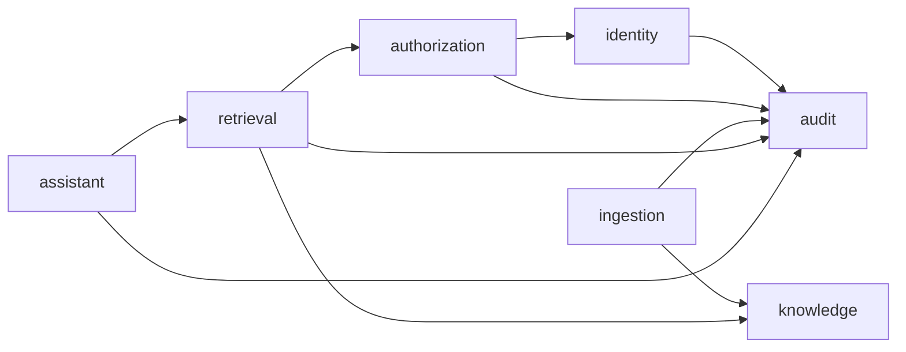

# ADR 0001: Controlled modular monolith

- Status: Accepted
- Date: 2026-08-17
- Decision owner: MemoryOS

## Context

MemoryOS is being rebuilt in a new repository. The legacy OrgMemory repository is evidence for security invariants and failure modes, not a template to copy. The foundation needs strong capability boundaries and separate API and worker runtimes without recreating the legacy system's infrastructure breadth before a business slice requires it.

## Decision

Use three flat Gradle modules at the repository root:

- `core`: capability code and capability-owned persistence.
- `api`: HTTP composition root.
- `worker`: background-processing composition root.

`core` is a Spring Modulith application with seven closed modules:

- `identity`
- `authorization`
- `knowledge`
- `ingestion`
- `retrieval`
- `assistant`
- `audit`

A module's root package is its public API. Capability-owned persistence belongs directly under that capability, for example `knowledge.persistence`, and another capability must not import it. MEM-5 does not require an `internal` package-name segment or decide the placement of other implementation types. Modules may use only declared dependencies. The initial dependency direction is acyclic:

Spring Framework, JPA, and Spring Data may be used inside the capability that owns a real vertical slice. We will not create duplicate domain and persistence models or repository adapters without demonstrated pressure.

Placement of provider integrations and their SDKs is deferred until a concrete vertical slice establishes the required ownership, lifecycle, and runtime boundaries.

The API and worker depend on `core`; `core` never depends on a deployable. The future UI remains one deployable with product and admin route boundaries until its threat model or operations require separate deployment. MCP remains deferred.

Spring Modulith verification and focused ArchUnit rules enforce the boundaries.

## Consequences

- The repository starts with three build boundaries rather than an adapter module for every possible provider.
- Capability-owned persistence has a concrete, enforceable location.
- API and worker can evolve and deploy independently while sharing one business model.
- Non-persistence implementation and provider packaging remain open decisions backed by concrete future requirements.
- A new module dependency edge requires an explicit architecture change and test update.
