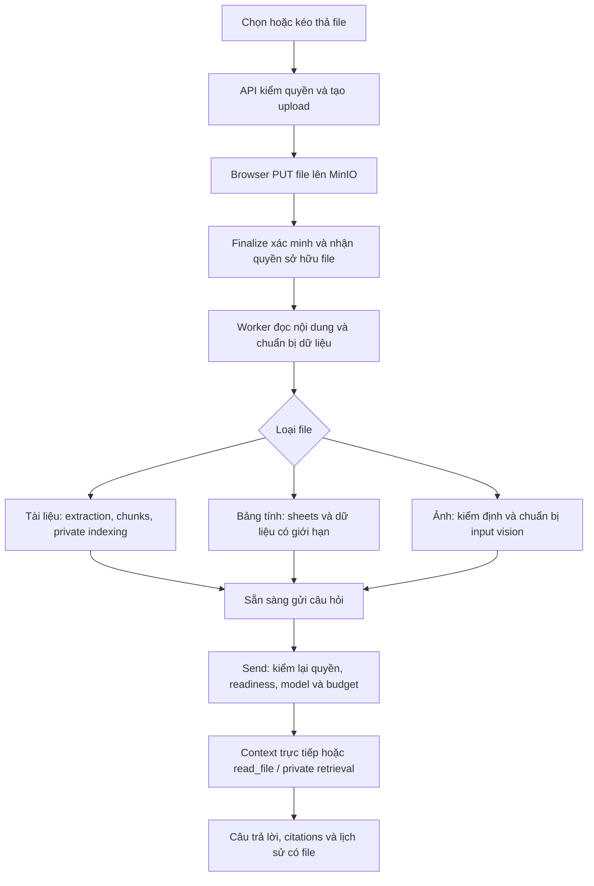

# MEM-81 — Attachments production theo Onyx

Ngày đối chiếu source: 2026-09-10; cập nhật quyết định ngày 2026-09-11. Người dùng đã chốt giới hạn theo Onyx: mặc định 100 MiB/file, trần triển khai mặc định 250 MiB; yêu cầu triển khai production cho phạm vi đã chọn. Sau đó người dùng yêu cầu tách toàn bộ attachments thành [MEM-81](https://linear.app/memory-os/issue/MEM-81), Backlog, để xử lý các chức năng MEM-11 khác trước. Đây là issue riêng có quan hệ related với MEM-11, không chặn PR MEM-11. Việc tách này thay thế quyết định gộp attachments vào PR MEM-11 trước đó.

Phần ánh xạ dưới đây là kế hoạch, chưa phải schema/runtime đã giao; các khác biệt với reference được ghi rõ, không coi đề xuất là quyết định kiến trúc đã được chấp nhận. [Chat design](../mem-11-production-chat/design.md) giữ nền kiến trúc đã chốt; [plan](plan.md) giữ thứ tự triển khai issue này. MEM-11 giao Persona và Projects với instructions/quản lý hội thoại trước; MEM-81 sở hữu file gắn message/Persona/Project cùng toàn bộ readiness, context/read_file/vision, retrieval và lifecycle. Không tạo schema/API/UI file dự phòng trong PR MEM-11; giữ yêu cầu không tách worktree.

## Kết quả người dùng nhận được

Người dùng chọn hoặc kéo thả file vào composer, xem tiến trình từng file, gửi câu hỏi khi các file đã dùng được, nhận câu trả lời trên đúng file và mở lại nguồn từ lịch sử. Có thể dùng lại file của mình, hỏi tiếp, sửa câu hỏi hoặc regenerate mà không upload/xử lý lại file. File đính kèm là tài nguyên riêng tư; không tự xuất hiện trong Source hoặc Search chung của Tenant.

## Bằng chứng Onyx

Checkout `.tmp/onyx` tại `40eb240df370688ed6eeedc1272116e7829554ac`; các đường dẫn dưới đây tương đối với checkout đó.

| Luồng đã đọc | Source | Hành vi cần giữ |
| --- | --- | --- |
| Upload độc lập với session | `backend/onyx/server/features/projects/api.py:174`; `backend/onyx/db/projects.py:56`; `backend/onyx/server/features/projects/projects_file_utils.py:160` | Multipart qua backend; API đã trích text/đếm token để admission trước khi dispatch indexing. File có UserFile/owner, có thể upload trước khi tạo Chat và dùng lại trong Project/Persona |
| Theo dõi trạng thái | `backend/onyx/db/enums.py:294`; `web/src/sections/input/AppInputBar.tsx:348` và `:769` | UI phân biệt upload/processing; chặn gửi khi file còn xử lý, không coi thành công HTTP upload là sẵn sàng hỏi |
| File của message | `backend/onyx/chat/chat_utils.py:98` và `:757` | Text được đưa vào context theo message gắn file; bảng tính dùng metadata + tool; ảnh là input hình ảnh |
| File vượt context | `backend/onyx/chat/llm_loop.py:528`; `backend/onyx/tools/tool_implementations/file_reader/file_reader_tool.py:147` | Giữ metadata của file bị loại khỏi context, cho phép đọc lại qua tool; `read_file` giới hạn tối đa 16000 ký tự/lần |
| File Persona/Project | `backend/onyx/chat/process_message.py:313` và `:376` | Custom Persona dùng files riêng kể cả rỗng; default Persona mới dùng Project. Nhóm context files đủ chỗ thì nạp; vượt ngưỡng chuyển thành phạm vi tìm kiếm; baseline ngưỡng 60% context còn lại sau phần reserve |
| Quyền file | `backend/onyx/file_store/utils.py:310`; `file_reader_tool.py:122` | Xác thực quyền file trước send; tool chỉ chấp nhận IDs trong tập file được phép của lượt |
| Xóa và liên kết | `backend/onyx/server/features/projects/api.py:517`; `backend/onyx/background/celery/tasks/user_file_processing/tasks.py:859` | Kiểm liên kết Project/Persona trước xóa, trạng thái DELETING và cleanup retry; lỗi xóa blob không làm mất metadata cần để retry |
| Giới hạn upload | `backend/onyx/configs/app_configs.py:63`; `backend/onyx/server/settings/store.py:97` | Onyx mặc định 100 MiB/file, trần cấu hình mặc định 250 MiB và có giới hạn token theo cấu hình/model |

Các kiểm tra UI của Onyx ở `web/tests/e2e/chat/chat_file_uploads.spec.ts` có mock trạng thái/provider; dùng để đối chiếu hành vi giao diện, không lấy chúng làm bằng chứng runtime của MemoryOS.

## Những phần MemoryOS đã có và cần mở rộng

- `ObjectUploadService`: initiate → signed PUT tới MinIO → verify → adopt/discard; key do server tạo, size/type/checksum ràng buộc với upload. Đề xuất tái sử dụng đường này; khác biệt với multipart API của Onyx được đánh giá bên dưới.
- `ObjectUploadSpecification` hiện hard-code 10 MiB. Chưa thể hứa upload 100 MiB chỉ bằng đổi UI. Cần truyền giới hạn được server chọn cho consumer và đồng bộ admission, extractor/worker bounds; không để client tự tăng cap.
- `DefaultIngestionCoordinator` hiện claim/publish qua `ConnectorIndexingPort`, chưa nhận file Chat. Tái sử dụng worker, delivery/lease/retry và extractor hiện có nhưng bổ sung workload/đầu vào thực cho user file. Không tạo Source giả cho mỗi file hoặc chạy job chỉ trong RAM của API.
- `DocumentCommandPort` và extraction artifacts có thể dùng lại. Publication, cleanup và Search projection hiện gắn provenance/eligibility của Source; phải bổ sung reference của user file và điều kiện không xóa nhầm Document/artifact còn được dùng.
- `DocumentSearchService` hiện dựa vào `SourceDocumentAccessResolver`. Cần đường retrieval cho tập user-file documents đã được Chat xác thực, lọc phạm vi trước query và kiểm lại identity/generation trước trả kết quả. Retrieval không được phụ thuộc ngược vào Chat hoặc xem UUID do model gửi là quyền đọc.
- Chat hiện chỉ lưu text và nguồn retrieval; chưa có message-file relation, multimodal input, file reader tool hay API/UI attachment.

## Ánh xạ production sang MemoryOS

| Trách nhiệm ở Onyx | Triển khai tương đương đề xuất trong MemoryOS |
| --- | --- |
| UserFile và liên kết message/Persona/Project | Chat sở hữu UserFile cùng các liên kết PostgreSQL; migration additive, quyền Tenant/owner, identity và generation của nội dung đã xử lý |
| File store | ObjectStorage/MinIO hiện có giữ raw immutable và artifacts; Chat sở hữu vòng đời file sau adoption |
| Background file processing/indexing | Mở rộng ingestion/SEARCH/cleanup trên worker hiện có; công việc và claim trong PostgreSQL, Redis Streams chỉ chuyển tín hiệu có thể phát lại; không chuyển vòng Chat sang worker |
| Text, bảng và ảnh | Dùng Docling/OCR, Tika và table readers hiện có, bổ sung reader cho format còn thiếu trong baseline; chuẩn bị image input có bounds và model capability thực |
| File context và read_file | Mở rộng ChatTurnSetup/native messages, tool registry và provider adapter đang chạy; direct text, metadata của file bị loại khỏi context, đọc tiếp có giới hạn, images thật |
| Search trong file được chọn | OpenSearch và embedding hiện có, phân biệt nguồn dữ liệu riêng tư; filter trên cả lexical/vector trước ranking, rồi kiểm identity/generation/quyền trước đưa cho model |
| UI và vận hành | assistant-ui upload/status/history/preview; trạng thái bền vững qua restart, cleanup retry và quan sát riêng upload/processing/retrieval/model |

### Khác biệt triển khai cần thể hiện rõ

Yêu cầu là upload tới giới hạn đã chốt, readiness đúng và không làm nghẽn Chat đang chạy. Onyx nhận multipart và parse/đếm token ngay trong API: ưu điểm là một upload route và báo lỗi nội dung ngay trong phản hồi. MemoryOS đã có signed PUT, verification/adoption và worker extraction. Đề xuất giữ browser → MinIO, đưa parse/đếm token vào worker: tránh đưa bytes/CPU parse của file lớn qua API Chat và dùng lại lifecycle có sẵn. Chi phí là thêm bước finalize, quản lý upload bỏ dở/CORS, và lỗi nội dung xuất hiện ở trạng thái processing thay vì ngay trong phản hồi upload. UI phải chặn send khi file chưa dùng được; API cũng kiểm readiness. Phương án bám Onyx sát hơn là multipart qua API với spool/parse được giới hạn, nhưng phải thêm đường truyền bytes, quyền object-store và tài nguyên parse cho API. Bằng chứng để chọn đề xuất là luồng lớn 100/250 MiB, lỗi upload/finalize và worker restart không làm mất trạng thái hoặc làm Chat vi phạm giới hạn tài nguyên; đây là khác biệt đang đề xuất, không gọi là Onyx đang dùng presigned PUT.

Riêng file lớn, `DoclingSourceContentExtractor` hiện đọc toàn bộ input vào `byte[]` và tạo base64 JSON; `ObjectUploadSpecification`, constraint `stored_objects` từ V21, Tika và cấu hình Docling cũng còn giới hạn 10 MiB. Phải sửa đường xử lý tương ứng cùng policy/constraint, không tăng đồng loạt cap của Google hoặc Source FILE. Đề xuất dùng streaming hoặc file tạm có quota và cleanup, gửi Docling bằng multipart file, giữ bound cho response/artifacts. [Docling Serve có file endpoint](https://github.com/docling-project/docling-serve/blob/main/docs/usage.md); cần kiểm đúng image/client đã pin trong integration thực trước khi kết luận adapter hiện có đáp ứng. Chọn giới hạn job đồng thời theo memory/disk budget và đo peak RSS, không dùng số virtual threads làm giới hạn bộ nhớ.

[Spring AI hỗ trợ media trong UserMessage](https://docs.spring.io/spring-ai/reference/api/multimodality.html), nhưng ChatTurnSetup hiện giữ native Embabel messages dạng text. Công việc phải nối media xuyên suốt setup → native execution → provider request và accounting; có lớp Media trong thư viện chưa chứng minh binding MemoryOS giữ ảnh. Không thêm một vòng inference riêng chỉ để xử lý attachment.

## Luồng đề xuất

### 1. Dữ liệu và ownership

Đề xuất `UserFile` thuộc Chat, tương tự tên và vai trò của Onyx. Mỗi file có UUID, Tenant, uploader/owner, tên gốc, loại thực, kích thước/checksum, raw StoredObject reference, Document/artifact hoặc image reference phù hợp, processing/index status, thông tin token và timestamps. Bytes đã finalize là immutable; thay nội dung là file mới.

Quan hệ message-file có thứ tự và ràng buộc cùng Tenant. File có thể được tham chiếu bởi nhiều message/nhánh và liên kết Persona/Project đã được MEM-11 triển khai; không sao chép bytes cho mỗi nhánh. Khi send, attachment IDs là một phần fingerprint của client request identity. Retry cùng request không tạo file/message/job thứ hai; cùng request ID nhưng đổi attachments phải conflict.

Public file/job contracts và composition phải giữ dependency một chiều: Chat sở hữu quyền và liên kết; worker thực thi qua public contracts; ObjectStorage/Document/Retrieval không truy ngược dịch vụ Chat. Chỉ bổ sung các dependency có consumer thật, kiểm bằng Modulith/ArchUnit.

### 2. Upload, xử lý và API

Routes dự kiến dưới `/api/chat/files` (tên chính thức chốt khi generate contract): tạo upload, finalize, đọc/batch statuses, liệt kê file của mình, preview/download có quyền và yêu cầu xóa. Send nhận thêm `attachmentIds`; history trả metadata file và trạng thái hiện tại đủ cho UI. Client không gửi bucket/key/Document ID thay cho quyền file.

Tách trạng thái upload khỏi trạng thái nội dung và khả năng search. UI trình bày Đang tải → Đang xử lý → Sẵn sàng, hoặc Lỗi/Đang xóa. Tài liệu cần private retrieval chỉ sẵn sàng sau khi index đã xác nhận; ảnh hoặc kiểu đọc trực tiếp có thể sẵn sàng theo đường riêng mà không giả trạng thái indexed. File lỗi phải hiện lý do và thao tác thử lại/gỡ; gửi bằng API trực tiếp cũng phải kiểm trạng thái, không chỉ disable nút trên UI.

Finalize phải adopt raw object, lưu UserFile và công việc bền vững trong transaction phù hợp sau khi provider verification hoàn tất. Extraction/model/storage IO nằm ngoài transaction. Worker retry, redelivery, process restart và kết quả đến muộn đều bị ràng buộc bởi claim/version; file đang xóa không được publish trở lại.

### 3. Loại nội dung

| Loại | Cách xử lý đề xuất |
| --- | --- |
| PDF, DOCX, PPTX | Dùng Docling/extraction pipeline hiện có, lưu artifact/chunks/provenance; không parse lại mỗi câu hỏi. PDF scan đi qua OCR của pipeline thực |
| TXT/Markdown và các file được xác nhận là text | Dùng reader bounded; lưu text inert, không thực thi nội dung code/config/HTML. Danh sách định dạng được công bố theo các reader đã kiểm |
| CSV/TSV/XLSX; XLSM nếu reader xác nhận hỗ trợ | Dùng structured table readers; metadata gồm sheet/range và đọc dữ liệu có giới hạn qua tool. Không nạp cả workbook vào prompt hoặc chạy macro/code Python. Các phép tính toàn bộ bảng không được tuyên bố đúng chỉ từ một đoạn được đọc |
| PNG/JPEG/WebP | Kiểm actual type/dimensions/decompression bounds, giữ raw và input vision phù hợp; truyền ảnh thật qua binding hỗ trợ vision, tính vào budget. Model không hỗ trợ phải báo rõ/chọn model phù hợp; không giả ảnh thành text bằng filename |

Onyx còn có các định dạng ngoài những reader MemoryOS đang có, như EML/EPUB. Cần lập bảng accepted/rejected theo source và reader thực; khác biệt định dạng phải được nêu trước khi chốt phạm vi, không mặc định toàn bộ format Onyx đã được MemoryOS hỗ trợ.

### 4. Đưa file vào model và tools

- File text gắn message được đưa vào context ở vị trí của message đó và chỉ trong nhánh đang chọn. File nằm ở nhánh khác không đi theo khi edit/regenerate/chuyển nhánh. Full transcript và liên kết file trong DB không bị cắt theo context model.
- Giữ file identity/metadata khi nội dung bị loại vì context cap. Bổ sung native tool `read_file(fileId, start, length)` có consumer thật, tối đa 16000 ký tự/lần theo reference và còn bị chặn bởi token/deadline/cycle budget; trả vị trí tiếp tục cùng nguồn/provenance. Không âm thầm chỉ lấy đầu file rồi coi là đã đọc hết.
- Text trong giới hạn có thể được nạp trực tiếp; bảng tính dùng metadata và tool đọc; ảnh là multimodal input. Các mảnh file được lấy qua tool giữ provenance cho nguồn/citation trong cùng câu trả lời.
- Persona/Project context files giữ precedence đã chốt. Dùng tổng token và phần context dành riêng để quyết định nạp hoặc private retrieval; giữ ngưỡng baseline 60% sau reserve nhưng luôn tuân trần context/output/history/tool của binding hiện tại. Không nới context model để file vừa prompt.
- Private retrieval dùng cùng OpenSearch/embedding/ranking hiện có, với namespace/phạm vi tài liệu được phép cho lượt. Không tạo index hoặc embedding engine thứ hai. Search chung và mọi broad query phải loại private user files trước ranking; allowlist/revalidation cho file có quyền áp dụng trước model, progress và reader.
- Việc đọc file, search, helper và câu trả lời dùng chung native accounting/Stop/deadline; metadata ghi rõ phần chưa đọc/không có nội dung để model không tự suy diễn.

### 5. Lịch sử, quyền và cleanup

- Upload được trước khi có conversation nhưng luôn có owner/Tenant từ lúc initiate. Send, status, preview/download, tool read, Project/Persona link và delete đều kiểm quyền server; đổi model không mở rộng quyền file.
- Reload hiển thị đúng tên, loại, trạng thái và file của từng message. Gỡ khỏi composer là gỡ lựa chọn; file đã finalize vẫn là UserFile của người dùng và có thể dùng lại, không tự bị xóa như upload thất bại.
- Upload chưa được adopt/đã bỏ dở dùng expiry và cleanup của ObjectStorage. Đề xuất file đã finalize được giữ tới khi chủ sở hữu xóa hoặc chính sách retention được cấu hình; không tự đặt TTL 24 giờ cho file hợp lệ. Xóa conversation gỡ liên kết, không xóa file vẫn thuộc Project/Persona hoặc được sử dụng nơi khác.
- Xóa file có liên kết Project/Persona trả thông tin đang được dùng để người dùng gỡ liên kết trước, theo baseline Onyx. Khi xóa thực: đánh dấu DELETING và chặn sử dụng mới, gỡ projection, raw/artifacts và metadata bằng công việc retry được; không mất dấu bytes khi MinIO xóa lỗi.
- Historical answer vẫn đọc được nếu attachment đã xóa/hết quyền; reader báo file không còn khả dụng. Chia sẻ transcript không tự cấp quyền tải attachment; grant cụ thể của sharing được chốt cùng nhóm sharing.

### 6. Giới hạn đã chốt ngày 2026-09-11

Người dùng yêu cầu áp dụng chính sách Onyx: **100 MiB/file mặc định (104857600 bytes)** và **250 MiB trần triển khai mặc định (262144000 bytes)**. Đây là quyết định về giới hạn; runtime hiện vẫn chưa được nâng. MEM-81 phải giao hỗ trợ toàn đường đi, không để cap mới chỉ có trên giao diện hoặc hoãn đường xử lý 250 MiB sang một đợt sau.

Giữ hai tầng như Onyx: giới hạn hiệu lực do quản trị cấu hình, fallback 100 MiB khi chưa đặt; operator cấu hình trần của deployment, mặc định 250 MiB. Giới hạn hiệu lực luôn được clamp theo trần, kể cả cấu hình đã lưu từ trước; 0/unset không mang nghĩa upload vô hạn. Trần 250 MiB là mặc định có thể cấu hình ở deployment, không phải hằng số tuyệt đối của reference. API trả policy hiệu lực cho UI và thực thi ở initiate/verification; client không chọn hoặc tự nâng policy. Việc giảm cap không tự xóa file đã adopt; upload chưa hoàn tất phải được kiểm theo policy có hiệu lực với kết quả rõ ràng.

Migration và object-upload contract phải tách policy của Chat khỏi Source FILE/Google/native snapshot, đồng thời giữ integrity/adoption/cleanup guards. Những consumer khác giữ chính sách admission hiện có. Đồng bộ cap với reverse proxy của đường upload thực tế, signature/actual bytes, worker readers, Docling request limit và resource budgets; không sửa migration đã chạy và không lấy max-binary-bytes của Google làm policy Chat.

Giới hạn bytes, pages/cells/pixels, token per-file/tổng context, số file/job đồng thời và deadline phải được kiểm trên đúng đường xử lý. Upload thành công không hứa một tài liệu bất kỳ dưới 100 MiB luôn parse được; vượt giới hạn nào phải trả đúng lý do. Các giá trị chưa được đo/chốt không được ghi như giới hạn Onyx hoặc runtime đã có.

## Thứ tự thực hiện trong MEM-81

1. Hoàn tất bảng format/behavior parity và các khác biệt triển khai còn cần quyết định; giới hạn 100/250 MiB đã chốt. Cập nhật design/spec theo quyết định được chấp nhận.
2. Migration UserFile, message/Persona/Project references và processing/delete ownership; mở rộng ObjectStorage adoption/cleanup và Document references với tests transaction/cleanup thực.
3. Upload/status/read/delete API và worker processing cho file riêng tư; nối extractor/chunks/private projection, các bounds và retry/cancel thực.
4. Attachment-aware send/history/idempotency/branch context; native read_file, private search và multimodal binding; sửa citation/source reader với quyền file.
5. UI upload/drop/select recent/status/remove/preview, attachment rendering trong history và edit/regenerate; nối Persona/Project cùng model capability checks.
6. Kiểm các contract mới ở boundary nhỏ nhất và luồng MinIO → worker → model → citation/history thật; đối chiếu coverage đã có thay vì tạo một phase chạy lại toàn bộ tests. Review/CI/deployment thuộc thay đổi MEM-81; không chặn giao phần MEM-11 đã tách.

## Điều kiện hoàn thành

- Text nhỏ, tài liệu nhiều trang, bảng tính và ảnh đi đúng đường đọc; sự kiện file sẵn sàng phản ánh trạng thái xử lý thực.
- File dài hoặc bị loại khỏi context vẫn đọc tiếp được; facts ở giữa/cuối file có provenance; không báo đã đọc hết workbook từ một phần dữ liệu.
- Follow-up, edit/regenerate/đổi nhánh/Persona/Project giữ đúng tập file; retry không lặp side effect; reload không làm mất file hoặc tạo upload mới.
- Actor khác/Tenant khác/ID giả/private file không lọt vào Search chung, prompt, progress hoặc reader; chia sẻ transcript không tự mở quyền file.
- PUT/finalize timeout, hỏng checksum, extraction/index failure, restart/redelivery, Stop, concurrent delete/use và MinIO cleanup failure có kết quả đúng và retry an toàn.
- Kiểm thực tế file lớn theo cap được chốt và memory/worker concurrency; không lấy fixture hoặc HTTP 200 làm bằng chứng hoàn thành.
- Kiểm biên mặc định 100 MiB và cấu hình 250 MiB bằng file hợp lệ trong format/processing bounds; từ chối cap + 1 byte và config vượt ceiling. Kiểm giảm ceiling, provider size/checksum mismatch và admission của Source FILE/Google không bị nới nhầm.
- Đo riêng upload, queue wait, extraction/OCR, embedding/indexing, từ send đến token đầu và tổng lượt; so upload lần đầu với hỏi tiếp file đã READY. Hỏi tiếp không tự parse/embed lại khi bytes và processing generation không đổi. Ghi latency và peak RAM/disk thực, không đặt SLO hoặc cam kết tốc độ từ source của Onyx.
