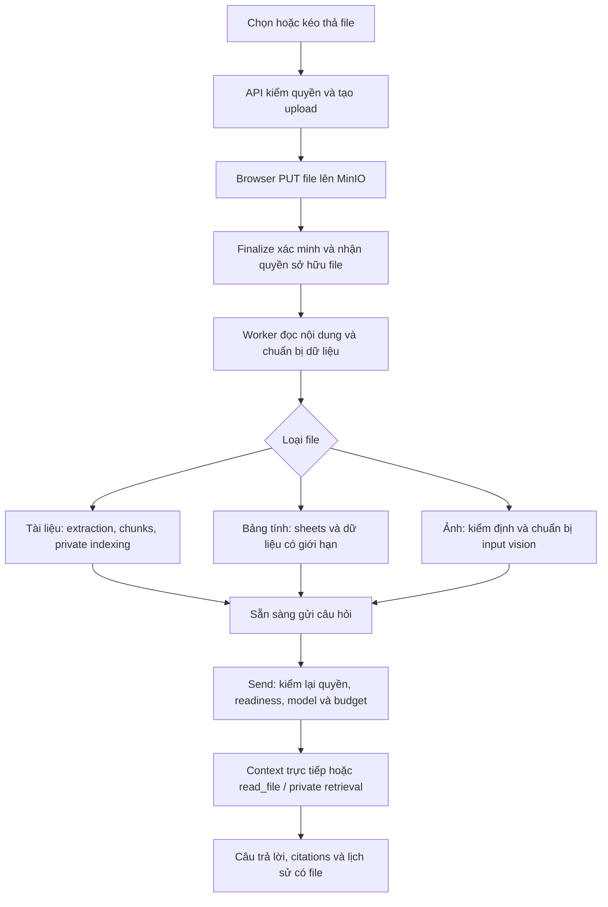

# MEM-81 — Attachments production theo Onyx

CI/delivery follow-up 2026-09-12: người dùng đã duyệt sửa CI, merge và staging sau gates. Backend fixture pull chuyển Docker Hub sang Quay với cùng MinIO digest; browser dùng hai CI shard cách ly, vẫn một worker/shard và không bỏ test. Không đổi baseline attachment hoặc OCR; [plan](plan.md#ci-merge-và-staging-được-duyệt--2026-09-12) giữ thứ tự delivery. Các giới hạn publication sau đây là lịch sử trước yêu cầu mới.

CD hardening trong cùng scope: kiểm login, actor, Tenant và Source permissions trước rollout; lỗi chỉ ghi phase an toàn. Recovery phải chọn rõ transaction cũ qua manual dispatch, full smoke runtime hiện hành rồi gọi `finish` sẵn có để kiểm lại image/health và ownership reservation. Không có auto-unlock, auto-restore database hoặc cấp quyền IAM ngầm.

Publication scope 2026-09-12: người dùng duyệt nhiều commit trong một PR review, giữ một cột message `files JSONB`, parser/component reuse và các khác biệt Onyx đã chốt. Không thêm thiết kế runtime trong bước publish. OCR checkout, deploy, merge và Linear closure nằm ngoài quyền lần này; [plan](plan.md#publication-được-duyệt--2026-09-12) ghi thứ tự commit và [verification](verification.md) ghi evidence, không coi PR là release acceptance.

## Phép kiểm được chọn ngày 2026-09-12

Chỉ live vision và đo tài nguyên; OCR được người dùng hoãn. Reuse API/native adapter và extractor hiện có, test-only opt-in harness, không thêm runtime profile/endpoint hoặc thay baseline. Vision dùng dữ liệu tổng hợp có đáp án chỉ xuất hiện trong pixels. Resource measurement tách tạo corpus khỏi xử lý, ghi RAM process khác Java heap, temp khác raw fixture, nhiều caller khác nhiều extraction thực chạy; kết quả local không tự thành sizing hay SLO production.

Ngày đối chiếu source: 2026-09-10; cập nhật quyết định ngày 2026-09-11. Người dùng đã chốt giới hạn theo Onyx: mặc định 100 MiB/file, trần triển khai mặc định 250 MiB; yêu cầu triển khai production cho phạm vi đã chọn. Sau đó người dùng yêu cầu tách toàn bộ attachments thành [MEM-81](https://linear.app/memory-os/issue/MEM-81), Backlog, để xử lý các chức năng MEM-11 khác trước. Đây là issue riêng có quan hệ related với MEM-11, không chặn PR MEM-11. Việc tách này thay thế quyết định gộp attachments vào PR MEM-11 trước đó.

Phần ánh xạ dưới đây là kế hoạch, chưa phải schema/runtime đã giao; các khác biệt với reference được ghi rõ, không coi đề xuất là quyết định kiến trúc đã được chấp nhận. [Chat design](../mem-11-production-chat/design.md) giữ nền kiến trúc đã chốt; [plan](plan.md) giữ thứ tự triển khai issue này. MEM-11 giao Persona và Projects với instructions/quản lý hội thoại trước; MEM-81 sở hữu file gắn message/Persona/Project cùng toàn bộ readiness, context/read_file/vision, retrieval và lifecycle. Không tạo schema/API/UI file dự phòng trong PR MEM-11; giữ yêu cầu không tách worktree.

Ngày 2026-09-11 người dùng chọn làm attachments trước Code Interpreter và yêu cầu chi tiết hóa increment; sau đó đã yêu cầu bắt đầu code. Nền source của lần lập kế hoạch được kiểm tại MemoryOS `0310a24c03b162a34673b1e5c407aa6745bfc48e`, Onyx `40eb240df370688ed6eeedc1272116e7829554ac`. MEM-11 đã được người dùng nghiệm thu và đóng theo [ghi nhận trên Linear](https://linear.app/memory-os/issue/MEM-11); dùng editor/Project/sharing hiện có làm đầu vào, không mở lại nghiệm thu MEM-11. Checkpoint implementation bên dưới và [ma trận nghiệm thu](verification.md) phân biệt code local, kết quả test và runtime chưa nghiệm thu.

## Kết quả người dùng nhận được

### Implementation local sau yêu cầu bắt đầu code

Phần đầu đang triển khai gồm UserFile/upload và worker lifecycle; toàn bộ kết quả người dùng mô tả bên dưới **chưa hoàn tất**. D1 dùng signed PUT và finalize; D2 dùng public `UserFileWorkPort` do Chat sở hữu, Ingestion gọi port và worker chỉ import service/repository cần thiết. Chat không phụ thuộc Ingestion, không scan Chat inference trong worker. D3 dùng FK `chat_user_file.document_id` và kiểm reference ngay trong Document cleanup; không tạo usage registry.

Đường plaintext chọn cách nhỏ nhất cho consumer tiếp theo: lưu `DocumentContent.normalizedText` vào `chat_user_file.plaintext` trong cùng transaction publish Document và hoàn thành claim. Giống Onyx ở việc giữ plaintext đã xử lý để không extraction lại mỗi lượt; khác physical storage (PostgreSQL TEXT thay file-store plaintext object) và producer (worker hiện có). Trade-off: tăng dung lượng/IO PostgreSQL; plaintext dùng bound 2 triệu ký tự hiện có của extractor, canonical artifact vẫn giữ cấu trúc/provenance. Chưa có runtime cache-miss fallback hoặc tool `read_file`; không tuyên bố đã đạt parity.

`READY` của checkpoint này chỉ xác nhận extraction/publication, **không** xác nhận private index sẵn sàng. Search readiness, links Persona/Project và message `files JSONB` còn phải nối trước nghiệm thu. DELETE làm file unavailable rồi cleanup raw/artifact/projection bất đồng bộ; chưa coi trạng thái receipt là bằng chứng mọi bytes đã bị xóa.

Người dùng chọn hoặc kéo thả file vào composer, xem tiến trình từng file, gửi câu hỏi khi các file đã dùng được, nhận câu trả lời trên đúng file và mở lại nguồn từ lịch sử. Có thể dùng lại file của mình, hỏi tiếp, sửa câu hỏi hoặc regenerate mà không upload/xử lý lại file. File đính kèm là tài nguyên riêng tư; không tự xuất hiện trong Source hoặc Search chung của Tenant.

## Bằng chứng Onyx

Checkout `.tmp/onyx` tại `40eb240df370688ed6eeedc1272116e7829554ac`; các đường dẫn dưới đây tương đối với checkout đó.

| Luồng đã đọc | Source | Hành vi cần giữ |
| --- | --- | --- |
| Upload độc lập với session | `backend/onyx/server/features/projects/api.py:174`; `backend/onyx/db/projects.py:56`; `backend/onyx/server/features/projects/projects_file_utils.py:160` | Multipart qua backend; API đã trích text/đếm token để admission trước khi dispatch indexing. File có UserFile/owner, có thể upload trước khi tạo Chat và dùng lại trong Project/Persona |
| Theo dõi trạng thái | `backend/onyx/db/enums.py:294`; `web/src/sections/input/AppInputBar.tsx:348` và `:769` | UI phân biệt upload/processing; chặn gửi khi file còn xử lý, không coi thành công HTTP upload là sẵn sàng hỏi |
| File của message | `backend/onyx/chat/chat_utils.py:98` và `:757` | Text được đưa vào context theo message gắn file; bảng tính dùng metadata + tool; ảnh là input hình ảnh |
| File vượt context | `backend/onyx/chat/llm_loop.py:528`; `backend/onyx/tools/tool_implementations/file_reader/file_reader_tool.py:147` | Giữ metadata của file bị loại khỏi context, cho phép đọc lại qua tool; `read_file` giới hạn tối đa 16000 ký tự/lần |
| File Persona/Project | `backend/onyx/chat/process_message.py:313` và `:376` | Custom Persona dùng files riêng kể cả rỗng; default Persona mới dùng Project. Nhóm context files đủ chỗ thì nạp; vượt ngưỡng chuyển thành phạm vi tìm kiếm; baseline ngưỡng 60% context còn lại sau phần reserve |
| Quyền file | `backend/onyx/file_store/utils.py:310`; `file_reader_tool.py:122` | Xác thực quyền file trước send; tool chỉ chấp nhận IDs trong tập file được phép của lượt |
| Xóa và liên kết | `backend/onyx/server/features/projects/api.py:517`; `backend/onyx/background/celery/tasks/user_file_processing/tasks.py:859` | Kiểm liên kết Project/Persona trước xóa, trạng thái DELETING và cleanup retry; lỗi xóa blob không làm mất metadata cần để retry |
| Giới hạn upload | `backend/onyx/configs/app_configs.py:63`; `backend/onyx/server/settings/store.py:97` | Onyx mặc định 100 MiB/file, trần cấu hình mặc định 250 MiB và có giới hạn token theo cấu hình/model |

Các kiểm tra UI của Onyx ở `web/tests/e2e/chat/chat_file_uploads.spec.ts` có mock trạng thái/provider; dùng để đối chiếu hành vi giao diện, không lấy chúng làm bằng chứng runtime của MemoryOS.

## Những phần MemoryOS đã có và cần mở rộng

### Quyết định tái sử dụng frontend — 2026-09-12

Áp dụng [chính sách component/library reuse](../../../conventions.md#component-and-library-reuse) đã được người dùng chốt. Dùng component Attachment/File và hook preview do assistant-ui cung cấp, cùng attachment runtime/adapter hiện có; chỉ nối lifecycle signed PUT → finalize → worker và reader có quyền của MemoryOS. Người dùng đồng ý thêm Zustand để giữ `useShallow` trong hook `useAttachmentSrc` upstream; đây là dependency có consumer cụ thể, không phải quyết định chuyển Chat hoặc upload sang global Zustand store. Giữ phiên bản package đã pin, chỉ điều chỉnh design tokens, tiếng Việt và quyền đọc khi tích hợp component.

- `ObjectUploadService`: initiate → signed PUT tới MinIO → verify → adopt/discard; key do server tạo, size/type/checksum ràng buộc với upload. Đề xuất tái sử dụng đường này; khác biệt với multipart API của Onyx được đánh giá bên dưới.
- `ObjectUploadSpecification` hiện hard-code 10 MiB. Chưa thể hứa upload 100 MiB chỉ bằng đổi UI. Cần truyền giới hạn được server chọn cho consumer và đồng bộ admission, extractor/worker bounds; không để client tự tăng cap.
- `DefaultIngestionCoordinator` hiện claim/publish qua `ConnectorIndexingPort`, chưa nhận file Chat. Tái sử dụng worker, delivery/lease/retry và extractor hiện có nhưng bổ sung workload/đầu vào thực cho user file. Không tạo Source giả cho mỗi file hoặc chạy job chỉ trong RAM của API.
- `DocumentCommandPort` và extraction artifacts có thể dùng lại. Publication, cleanup và Search projection hiện gắn provenance/eligibility của Source; phải bổ sung reference của user file và điều kiện không xóa nhầm Document/artifact còn được dùng.
- `DocumentSearchService` hiện dựa vào `SourceDocumentAccessResolver`. Cần đường retrieval cho tập user-file documents đã được Chat xác thực, lọc phạm vi trước query và kiểm lại identity/generation trước trả kết quả. Retrieval không được phụ thuộc ngược vào Chat hoặc xem UUID do model gửi là quyền đọc.
- Chat hiện chỉ lưu text và nguồn retrieval; chưa có message-file relation, multimodal input, file reader tool hay API/UI attachment.

## Ánh xạ production sang MemoryOS

| Trách nhiệm ở Onyx | Triển khai tương đương đề xuất trong MemoryOS |
| --- | --- |
| UserFile và liên kết message/Persona/Project | Chat sở hữu UserFile cùng các liên kết PostgreSQL; migration additive, quyền Tenant/owner, identity và generation của nội dung đã xử lý |
| File store | ObjectStorage/MinIO hiện có giữ raw immutable và artifacts; Chat sở hữu vòng đời file sau adoption |
| Background file processing/indexing | Mở rộng ingestion/SEARCH/cleanup trên worker hiện có; công việc và claim trong PostgreSQL, Redis Streams chỉ chuyển tín hiệu có thể phát lại; không chuyển vòng Chat sang worker |
| Text, bảng và ảnh | Dùng Docling/OCR, Tika và table readers hiện có, bổ sung reader cho format còn thiếu trong baseline; chuẩn bị image input có bounds và model capability thực |
| File context và read_file | Mở rộng ChatTurnSetup/native messages, tool registry và provider adapter đang chạy; direct text, metadata của file bị loại khỏi context, đọc tiếp có giới hạn, images thật |
| Search trong file được chọn | OpenSearch và embedding hiện có, phân biệt nguồn dữ liệu riêng tư; filter trên cả lexical/vector trước ranking, rồi kiểm identity/generation/quyền trước đưa cho model |
| UI và vận hành | assistant-ui upload/status/history/preview; trạng thái bền vững qua restart, cleanup retry và quan sát riêng upload/processing/retrieval/model |

### Khác biệt triển khai cần thể hiện rõ

Yêu cầu là upload tới giới hạn đã chốt, readiness đúng và không làm nghẽn Chat đang chạy. Onyx nhận multipart và parse/đếm token ngay trong API: ưu điểm là một upload route và báo lỗi nội dung ngay trong phản hồi. MemoryOS đã có signed PUT, verification/adoption và worker extraction. Đề xuất giữ browser → MinIO, đưa parse/đếm token vào worker: tránh đưa bytes/CPU parse của file lớn qua API Chat và dùng lại lifecycle có sẵn. Chi phí là thêm bước finalize, quản lý upload bỏ dở/CORS, và lỗi nội dung xuất hiện ở trạng thái processing thay vì ngay trong phản hồi upload. UI phải chặn send khi file chưa dùng được; API cũng kiểm readiness. Phương án bám Onyx sát hơn là multipart qua API với spool/parse được giới hạn, nhưng phải thêm đường truyền bytes, quyền object-store và tài nguyên parse cho API. Bằng chứng để chọn đề xuất là luồng lớn 100/250 MiB, lỗi upload/finalize và worker restart không làm mất trạng thái hoặc làm Chat vi phạm giới hạn tài nguyên; đây là khác biệt đang đề xuất, không gọi là Onyx đang dùng presigned PUT.

Riêng file lớn, `DoclingSourceContentExtractor` hiện đọc toàn bộ input vào `byte[]` và tạo base64 JSON; `ObjectUploadSpecification`, constraint `stored_objects` từ V21, Tika và cấu hình Docling cũng còn giới hạn 10 MiB. Phải sửa đường xử lý tương ứng cùng policy/constraint, không tăng đồng loạt cap của Google hoặc Source FILE. Đề xuất dùng streaming hoặc file tạm có quota và cleanup, gửi Docling bằng multipart file, giữ bound cho response/artifacts. [Docling Serve có file endpoint](https://github.com/docling-project/docling-serve/blob/main/docs/usage.md); cần kiểm đúng image/client đã pin trong integration thực trước khi kết luận adapter hiện có đáp ứng. Chọn giới hạn job đồng thời theo memory/disk budget và đo peak RSS, không dùng số virtual threads làm giới hạn bộ nhớ.

[Spring AI hỗ trợ media trong UserMessage](https://docs.spring.io/spring-ai/reference/api/multimodality.html), nhưng ChatTurnSetup hiện giữ native Embabel messages dạng text. Công việc phải nối media xuyên suốt setup → native execution → provider request và accounting; có lớp Media trong thư viện chưa chứng minh binding MemoryOS giữ ảnh. Không thêm một vòng inference riêng chỉ để xử lý attachment.

## Luồng đề xuất

### 1. Dữ liệu và ownership

Đề xuất `UserFile` thuộc Chat, tương tự tên và vai trò của Onyx. Mỗi file có UUID, Tenant, uploader/owner, tên gốc, loại thực, kích thước/checksum, raw StoredObject reference, Document/artifact hoặc image reference phù hợp, processing/index status, thông tin token và timestamps. Bytes đã finalize là immutable; thay nội dung là file mới.

Người dùng chốt lưu file của message trong **một cột `files JSONB` chứa mảng descriptors có thứ tự**, theo Onyx; không tạo bảng nối message–file. Descriptor nhận diện UserFile và giữ metadata tối thiểu để render lịch sử; không chứa raw bytes, storage credentials hoặc signed URL. Server kiểm IDs/ownership/readiness trước khi lưu, không tin metadata client làm authority. File có thể được tham chiếu bởi nhiều message/nhánh và liên kết Persona/Project; không sao chép bytes cho mỗi nhánh. Khi send, ordered attachment IDs là một phần fingerprint của client request identity. Retry cùng request không tạo file/message/job thứ hai; cùng request ID nhưng đổi attachments phải conflict.

JSONB giữ thứ tự bằng thứ tự phần tử; không cần cột ordinal hoặc bảng quan hệ riêng cho message files. PostgreSQL không cung cấp FK từ từng ID bên trong mảng này tới UserFile: validation thuộc application transaction. EDIT tạo message/JSONB mới, REGENERATE giữ tập file của user message gốc. Khi file bị xóa, descriptor lịch sử có thể còn và render unavailable, tương tự Onyx. Liên kết Persona/Project là quan hệ riêng, không bị quyết định một cột của message chuyển thành JSONB theo.

Public file/job contracts và composition phải giữ dependency một chiều: Chat sở hữu quyền và liên kết; worker thực thi qua public contracts; ObjectStorage/Document/Retrieval không truy ngược dịch vụ Chat. Chỉ bổ sung các dependency có consumer thật, kiểm bằng Modulith/ArchUnit.

### 2. Upload, xử lý và API

Routes dự kiến dưới `/api/chat/files` (tên chính thức chốt khi generate contract): tạo upload, finalize, đọc/batch statuses, liệt kê file của mình, preview/download có quyền và yêu cầu xóa. Send nhận thêm `attachmentIds`; history trả metadata file và trạng thái hiện tại đủ cho UI. Client không gửi bucket/key/Document ID thay cho quyền file.

Tách trạng thái upload khỏi trạng thái nội dung và khả năng search. UI trình bày Đang tải → Đang xử lý → Sẵn sàng, hoặc Lỗi/Đang xóa. Tài liệu cần private retrieval chỉ sẵn sàng sau khi index đã xác nhận; ảnh hoặc kiểu đọc trực tiếp có thể sẵn sàng theo đường riêng mà không giả trạng thái indexed. File lỗi phải hiện lý do và thao tác thử lại/gỡ; gửi bằng API trực tiếp cũng phải kiểm trạng thái, không chỉ disable nút trên UI.

Finalize phải adopt raw object, lưu UserFile và công việc bền vững trong transaction phù hợp sau khi provider verification hoàn tất. Extraction/model/storage IO nằm ngoài transaction. Worker retry, redelivery, process restart và kết quả đến muộn đều bị ràng buộc bởi claim/version; file đang xóa không được publish trở lại.

### 3. Loại nội dung

| Loại | Cách xử lý đề xuất |
| --- | --- |
| PDF, DOCX, PPTX | Dùng Docling/extraction pipeline hiện có, lưu artifact/chunks/provenance; không parse lại mỗi câu hỏi. PDF scan đi qua OCR của pipeline thực |
| TXT/Markdown và các file được xác nhận là text | Dùng reader bounded; lưu text inert, không thực thi nội dung code/config/HTML. Danh sách định dạng được công bố theo các reader đã kiểm |
| CSV/TSV/XLSX; XLSM nếu reader xác nhận hỗ trợ | Dùng structured table readers; metadata gồm sheet/range và đọc dữ liệu có giới hạn qua tool. Không nạp cả workbook vào prompt hoặc chạy macro/code Python. Các phép tính toàn bộ bảng không được tuyên bố đúng chỉ từ một đoạn được đọc |
| PNG/JPEG/WebP | Kiểm actual type/dimensions/decompression bounds, giữ raw và input vision phù hợp; truyền ảnh thật qua binding hỗ trợ vision, tính vào budget. Model không hỗ trợ phải báo rõ/chọn model phù hợp; không giả ảnh thành text bằng filename |

Onyx còn có các định dạng ngoài những reader MemoryOS đang có, như EML/EPUB. Cần lập bảng accepted/rejected theo source và reader thực; khác biệt định dạng phải được nêu trước khi chốt phạm vi, không mặc định toàn bộ format Onyx đã được MemoryOS hỗ trợ.

### 4. Đưa file vào model và tools

- File text gắn message được đưa vào context ở vị trí của message đó và chỉ trong nhánh đang chọn. File nằm ở nhánh khác không đi theo khi edit/regenerate/chuyển nhánh. Full transcript và liên kết file trong DB không bị cắt theo context model.
- Giữ file identity/metadata khi nội dung bị loại vì context cap. Bổ sung native tool `read_file(fileId, start, length)` có consumer thật, tối đa 16000 ký tự/lần theo reference và còn bị chặn bởi token/deadline/cycle budget; trả vị trí tiếp tục cùng nguồn/provenance. Không âm thầm chỉ lấy đầu file rồi coi là đã đọc hết.
- Text trong giới hạn có thể được nạp trực tiếp; bảng tính dùng metadata và tool đọc; ảnh là multimodal input. Các mảnh file được lấy qua tool giữ provenance cho nguồn/citation trong cùng câu trả lời.
- Persona/Project context files giữ precedence đã chốt. Dùng tổng token và phần context dành riêng để quyết định nạp hoặc private retrieval; giữ ngưỡng baseline 60% sau reserve nhưng luôn tuân trần context/output/history/tool của binding hiện tại. Không nới context model để file vừa prompt.
- Private retrieval dùng cùng OpenSearch/embedding/ranking hiện có, với namespace/phạm vi tài liệu được phép cho lượt. Không tạo index hoặc embedding engine thứ hai. Search chung và mọi broad query phải loại private user files trước ranking; allowlist/revalidation cho file có quyền áp dụng trước model, progress và reader.
- Việc đọc file, search, helper và câu trả lời dùng chung native accounting/Stop/deadline; metadata ghi rõ phần chưa đọc/không có nội dung để model không tự suy diễn.

### Nguồn nội dung của read_file — đối chiếu cụ thể

Source Onyx tại baseline đã ghi ở đầu design:

| Điểm vào | Hành vi quan sát được |
| --- | --- |
| `backend/onyx/file_store/utils.py#load_user_file` | Đọc plaintext đã lưu trong file store trước; nếu không có/không đọc được hoặc entry rỗng thì fallback bytes gốc. File dạng metadata-only như bảng giữ type ban đầu dù đã lấy plaintext |
| `backend/onyx/tools/tool_implementations/file_reader/file_reader_tool.py#run` | Chỉ nhận PLAIN_TEXT hoặc TABULAR. PLAIN_TEXT decode text; TABULAR gọi `extract_file_text` trên content loader vừa trả. Sau đó cắt theo start/length, tối đa 16000 ký tự, trả vị trí tiếp tục |
| `backend/onyx/chat/chat_utils.py#_get_or_extract_plaintext` | Đây là đường chuẩn bị context riêng: cache miss gọi extractor rồi lưu text, trừ khi worker đang sở hữu việc tạo canonical plaintext của key đó |

Không gộp ba đường trên thành phát biểu "read_file cache miss luôn parse/OCR mọi file gốc". Nếu loader fallback raw PDF/DOCX và type vẫn DOC, `read_file` từ chối đọc như text; nhánh extraction khi chuẩn bị context là một caller khác. Cũng không kết luận mọi lần đọc bảng đều đọc raw gốc: loader có thể đã trả plaintext nhưng giữ TABULAR type.

Có thể bám cách Onyx: đề xuất `read_file` ưu tiên plaintext đã chuẩn bị; text đó lấy từ output của extractor/worker hiện có. Canonical structured artifact tiếp tục phục vụ indexing và provenance; không bắt buộc xây một artifact-reader framework hoặc thêm tool sheet/range riêng chỉ để thực hiện đọc ký tự. Với bảng, tái sử dụng reader hiện có để tạo text khi đường fallback thực sự cần. Phần cache-miss behavior cho file lớn và cách lưu plaintext còn cần chốt theo D4/D6; không tự chuyển OCR nặng sang luồng Chat hoặc hứa fallback parse tức thời. Hỏi đáp trên file READY có plaintext vẫn không parse/embed lại. Sheet/range provenance đã có vẫn được giữ; schema tool riêng chỉ bổ sung nếu consumer đã chọn thực sự cần và cách read_file đơn giản không đáp ứng.

### Reuse Source / Spring AI ETL — chốt sau audit 2026-09-12

Source và UserFile giữ admission, quyền và claim/publication riêng; dùng chung extraction, canonical artifact, chunking và Search projection. Không thêm ETL framework hoặc generic coordinator. Giữ Docling Java SDK và Spring AI embedding/tokenizer đang có; chưa thay bằng Arconia DoclingDocumentReader vì reader gom convert/chunk và materialize bytes/Base64. Binary input dùng disk-backed ở nơi cần, không nâng Source FILE khỏi 10 MiB. Chuẩn hóa consumer để đọc cả `table.cells` native và `table.table_cells` Docling; không bỏ kiểu/cached value/merge/provenance đã có. First publication và reload phải giữ cùng nhãn UserFile. Index retry đọc artifact/chunks, không OCR lại. OCR manifests hiện có được giữ nguyên; auth/engine và giới hạn service/ingress phải được đồng bộ trong bước triển khai được phép, không suy ra hỗ trợ 250 MiB từ Java admission.

Implementation reuse: XLSX/XLSM dùng chính canonical mapper POI của Source với `OPCPackage` file-backed READ và preflight ZIP/XML dùng chung; bỏ `ChatTableExtractor` SAX riêng làm mất type/date/merge/provenance. CSV/TSV dùng chung Commons CSV với bound trước khi parser cấp phát record. Giữ full POI trên XML đã admission thay vì viết thêm SAX handler để tái tạo contract; chỉ cân nhắc SAX nếu corpus/heap đo được chứng minh cần. Source admission không thay đổi. Chunk convention v2 làm Search đổi index identity và backfill từ artifact; cần tính cả chi phí embedding và khoảng thời gian coverage chưa đầy đủ khi rollout.

### 5. Lịch sử, quyền và cleanup

- Upload được trước khi có conversation nhưng luôn có owner/Tenant từ lúc initiate. Send, status, preview/download, tool read, Project/Persona link và delete đều kiểm quyền server; đổi model không mở rộng quyền file.
- Reload hiển thị đúng tên, loại, trạng thái và file của từng message. Gỡ khỏi composer là gỡ lựa chọn; file đã finalize vẫn là UserFile của người dùng và có thể dùng lại, không tự bị xóa như upload thất bại.
- Upload chưa được adopt/đã bỏ dở dùng expiry và cleanup của ObjectStorage. Đề xuất file đã finalize được giữ tới khi chủ sở hữu xóa hoặc chính sách retention được cấu hình; không tự đặt TTL 24 giờ cho file hợp lệ. Xóa conversation gỡ liên kết, không xóa file vẫn thuộc Project/Persona hoặc được sử dụng nơi khác.
- Xóa file có liên kết Project/Persona trả thông tin đang được dùng để người dùng gỡ liên kết trước, theo baseline Onyx. Khi xóa thực: đánh dấu DELETING và chặn sử dụng mới, gỡ projection, raw/artifacts và metadata bằng công việc retry được; không mất dấu bytes khi MinIO xóa lỗi.
- Historical answer vẫn đọc được nếu attachment đã xóa/hết quyền; reader báo file không còn khả dụng. Chia sẻ transcript không tự cấp quyền tải attachment; grant cụ thể của sharing được chốt cùng nhóm sharing.

### 6. Giới hạn đã chốt ngày 2026-09-11

Người dùng yêu cầu áp dụng chính sách Onyx: **100 MiB/file mặc định (104857600 bytes)** và **250 MiB trần triển khai mặc định (262144000 bytes)**. Đây là quyết định về giới hạn; runtime hiện vẫn chưa được nâng. MEM-81 phải giao hỗ trợ toàn đường đi, không để cap mới chỉ có trên giao diện hoặc hoãn đường xử lý 250 MiB sang một đợt sau.

Giữ hai tầng như Onyx: giới hạn hiệu lực do quản trị cấu hình, fallback 100 MiB khi chưa đặt; operator cấu hình trần của deployment, mặc định 250 MiB. Giới hạn hiệu lực luôn được clamp theo trần, kể cả cấu hình đã lưu từ trước; 0/unset không mang nghĩa upload vô hạn. Trần 250 MiB là mặc định có thể cấu hình ở deployment, không phải hằng số tuyệt đối của reference. API trả policy hiệu lực cho UI và thực thi ở initiate/verification; client không chọn hoặc tự nâng policy. Việc giảm cap không tự xóa file đã adopt; upload chưa hoàn tất phải được kiểm theo policy có hiệu lực với kết quả rõ ràng.

Migration và object-upload contract phải tách policy của Chat khỏi Source FILE/Google/native snapshot, đồng thời giữ integrity/adoption/cleanup guards. Những consumer khác giữ chính sách admission hiện có. Đồng bộ cap với reverse proxy của đường upload thực tế, signature/actual bytes, worker readers, Docling request limit và resource budgets; không sửa migration đã chạy và không lấy max-binary-bytes của Google làm policy Chat.

Giới hạn bytes, pages/cells/pixels, token per-file/tổng context, số file/job đồng thời và deadline phải được kiểm trên đúng đường xử lý. Upload thành công không hứa một tài liệu bất kỳ dưới 100 MiB luôn parse được; vượt giới hạn nào phải trả đúng lý do. Các giá trị chưa được đo/chốt không được ghi như giới hạn Onyx hoặc runtime đã có.

## Thứ tự thực hiện trong MEM-81

Thứ tự, checklist có thể thực thi, đường dẫn cần sửa và điều kiện ra khỏi mỗi bước nằm trong [plan](plan.md). Đây là các bước của cùng một increment production; một bước upload/processing hoàn thành chưa đủ để nghiệm thu MEM-81.

## Đối chiếu source hiện tại — 2026-09-11

Đường dẫn MemoryOS dưới đây tương đối với repository root. Đây là điểm vào để triển khai, không phải danh sách lớp phải tạo hoặc danh sách thay đổi đã thực hiện.

| Boundary | Bằng chứng đang có | Việc MEM-81 phải giải quyết |
| --- | --- | --- |
| Upload và kích thước | `core/src/main/java/io/memoryos/objectstorage/ObjectUploadSpecification.java` có cap 10 MiB; `core/src/main/resources/db/migration/V21__add_tracked_object_writes.sql` ràng buộc BINARY 10 MiB và NATIVE_SNAPSHOT 32 MiB | Policy được consumer phía server chọn; sửa cả admission, stored object/upload constraints và actual-byte verification, giữ giới hạn của Source/Google |
| Extraction | `connector/src/main/java/io/memoryos/provider/file/DoclingSourceContentExtractor.java` tạo base64 từ bytes; `SpreadsheetSourceContentExtractor.java` đọc bytes tối đa 10 MiB, nhận XLSX/CSV, có kiểm ZIP và cached formula values | File lớn cần giới hạn RAM/disk và đường đọc phù hợp ở từng reader; không suy từ một overload InputStream thành streaming toàn đường đi |
| Worker | `core/src/main/java/io/memoryos/ingestion/application/DefaultIngestionCoordinator.java` claim qua `ConnectorIndexingPort`; `OperationWorkload.java` chưa có user-file work; `worker/src/main/java/io/memoryos/worker/MemoryOsWorkerApplication.java` không scan Chat | Thêm consumer xử lý file có ownership rõ, composition hẹp và dispatch/claim thật; không scan toàn Chat làm nạp cả model executor/catalog vào worker |
| Document cleanup | `core/src/main/java/io/memoryos/document/persistence/JdbcDocumentRepository.java#removeUnreferenced` chỉ kiểm mapping Connector trước xóa | Giữ Document/artifact còn được UserFile dùng; giải quyết invariant này trước khi publish UserFile Document đầu tiên |
| Retrieval | `core/src/main/java/io/memoryos/retrieval/DocumentSearchService.java` dùng `SourceDocumentAccessResolver`; `SearchIngestionCoordinator.java` dùng generation và index identity khi publish READY | Bổ sung scope private xuyên projection/query/reader/reconciliation; việc worker index xong không tự tạo quyền Chat |
| Send và native context | `core/src/main/java/io/memoryos/chat/ChatCommand.java` yêu cầu text cho SEND/EDIT; `application/ChatTurnPersistence.java` lưu command và nhánh; `execution/ChatTurnSetup.java` chỉ tạo native message từ text | Attachment IDs đi xuyên command fingerprint, admission, branch history, native messages và context budget; cần quyết định riêng về gửi chỉ có file |
| Web transport | `web/src/features/chat/chat-transport.ts` chỉ lấy text parts và từ chối text rỗng; `chat-thread.tsx` là composer hiện tại | Nối attachment adapter/parts với upload server và history, giữ request identity, session promotion và một SSE reader |
| Workspace | `ChatProjectService.java`, `ChatPersonaService.java`, `ChatWorkspaceService.java`, `ChatCollaborationService.java` đã có ownership/revision và sharing transcript | Mở rộng liên kết file trên contract thật; giữ custom Persona precedence và quyền đọc độc lập với shared transcript |

### Bảng định dạng để hoàn tất trước khi công bố API

Onyx khai báo trong `backend/onyx/file_processing/file_types.py`; admission thực nằm ở `categorize_uploaded_files` trong `server/features/projects/projects_file_utils.py`. Có tên trong danh sách không đủ chứng minh mọi input của định dạng đều parse được.

| Nhóm | Bằng chứng reference / MemoryOS | Hành động trong increment |
| --- | --- | --- |
| PDF, DOCX, PPTX | Onyx có trong document extensions; MemoryOS có Docling adapter | Kiểm tài liệu thường, scan tiếng Việt/Anh, hỏng/password và đầu vào lớn qua đúng Docling đã triển khai |
| TXT, MD và text/config/code | Onyx còn MDX, CONF, LOG, JSON, XML, YAML/YML, SQL và thử nhận dạng nội dung text với extension khác; MemoryOS hiện có Tika path hẹp hơn | Lập accepted/rejected table theo reader thực, giữ nội dung inert; không chạy code hoặc tải tài nguyên ngoài từ tài liệu |
| CSV, TSV, XLSX, XLSM | Onyx phân loại bảng; MemoryOS `SpreadsheetSourceContentExtractor` hiện chỉ nhận XLSX/CSV | Bổ sung/kiểm TSV, XLSM và metadata/sheet/range; macro không chạy, formula dùng giá trị đã lưu và ghi rõ giới hạn, không hứa recalculation |
| PNG, JPG/JPEG, WebP | Onyx có các image extensions này; MemoryOS native Chat chưa truyền ảnh | Kiểm MIME thực, orientation/dimensions, decoding và provider vision request; không dùng tên file làm nội dung thay thế |
| EML, EPUB, HTML | Có trong Onyx document extensions, chưa xác minh đường đọc tương đương của MemoryOS | Kiểm reader và bổ sung phần cần thiết; mọi loại bỏ so với baseline phải được nêu/chốt, không tự đánh dấu out of scope |
| Ảnh nhúng trong PDF/DOCX | `projects_file_utils.py` có nhánh phụ thuộc cấu hình image extraction và giới hạn ảnh nhúng | Đối chiếu cấu hình/reference và nhu cầu trong baseline; không mặc định OCR text đã tương đương phân tích ảnh nhúng |

Code Interpreter, sandbox, chạy Python/macro, tính toán toàn workbook và sinh file bằng code nằm ngoài MEM-81. Onyx `_load_context_user_files_for_tools` trong `chat/process_message.py` chuẩn bị bảng cho code interpreter; MemoryOS chỉ nhận phần đọc bảng đã chọn, cần ghi rõ khác biệt này thay vì tuyên bố đầy đủ parity phân tích bảng. Không tạo sẵn execution service hoặc artifact framework cho issue sau.

## Mô hình dữ liệu và ranh giới transaction đề xuất

| Khái niệm | Quan hệ / owner | Invariant và consumer |
| --- | --- | --- |
| Upload đang chờ | ObjectStorage, có Tenant/Actor và StoredObject reservation | Chưa phải file sẵn sàng; chỉ actor được phép mới finalize; browser không chỉ định storage key hoặc policy |
| UserFile | Chat, một owner/Tenant và một raw object immutable | Identity file giữ nguyên qua processing retry; thay bytes là upload/file mới; mọi query actor-facing lọc ownership |
| Nội dung đã xử lý | Document/artifact hoặc image representation có generation | Mỗi lần publish phải còn đúng raw identity/claim; không dùng kết quả generation cũ cho lượt mới |
| File của message | Một cột `files JSONB` trên message, mảng descriptors có thứ tự; Chat sở hữu | Application kiểm Tenant/owner và IDs trong transaction; không có FK cho từng phần tử JSONB; message gốc không đổi khi EDIT |
| File của Persona/Project | Quan hệ nhiều-nhiều trong Chat, dùng revision của editor | Custom Persona lấy tập riêng kể cả rỗng; builtin Persona dùng Project; thay link không tự đổi lượt đã được admission |
| Công việc xử lý/xóa | Owner ghi operation và trạng thái trong PostgreSQL; worker claim qua public contract | Durable receipt, lease/token, bounded attempts và conditional finish; Redis chỉ chuyển tín hiệu, không giữ bản duy nhất của trạng thái |

Tên bảng mới, enum, migration number và DTO cuối cùng chốt khi triển khai; lấy migration tiếp theo của main lúc đó, không mặc định V37 luôn còn trống. Message files đã chốt một cột JSONB; FK/uniqueness chỉ áp dụng cho các quan hệ relational thực, không tuyên bố DB kiểm UserFile IDs bên trong JSONB. Application service sở hữu authorization và transaction, concrete persistence repository sở hữu SQL/claims. Dùng JPA khi lifecycle thực hưởng lợi, JDBC cho mechanics; không nhân đôi model/entity/mapper hoặc tạo một interface cho mỗi repository.

Các điểm commit phải kiểm được:

1. Initiate lưu reservation trước khi cấp thông tin PUT. PUT có thể xong mà phản hồi bị mất; trạng thái server là căn cứ retry.
2. Finalize kiểm bytes/checksum bên ngoài transaction dài, sau đó reauthorize và adopt + lưu UserFile + công việc trong transaction phù hợp. Lỗi sau verification không để raw object mất owner/cleanup; lặp finalize trả lại cùng file/receipt.
3. Worker claim trong transaction ngắn, đọc storage/parse ngoài transaction, publish có điều kiện trên claim và trạng thái file. Search readiness chỉ đúng khi current generation khớp index identity.
4. SEND/EDIT/REGENERATE resolve tập file hợp lệ cùng settings/branch dưới cơ chế concurrency của Chat. Fingerprint bao gồm file IDs theo thứ tự; cùng request ID khác files phải conflict trước tạo reply mới.
5. Delete chặn sử dụng mới trước khi cleanup ngoài DB. Worker cũ không publish hồi sinh; lỗi xóa blob/projection giữ operation và metadata để retry. Chỉ bỏ reference khi đúng owner đã release.

### Trạng thái có thể quan sát

Đây là trạng thái nghiệp vụ dự kiến; không yêu cầu gom upload, content và Search vào một enum DB.

| Trạng thái UI | Sự thật phía server | Thao tác / phục hồi |
| --- | --- | --- |
| Đang tải | Reservation tồn tại; PUT/finalize chưa xác nhận | Retry đúng chặng; PUT hết hạn lấy authorization mới theo cùng contract đã chốt, không giữ signed URL lâu dài |
| Đang xử lý | File đã adopt, job chưa xong hoặc private index cần thiết chưa sẵn sàng | Poll theo batch có bounds; reload lấy status bền vững; API chưa nhận lượt cần file này |
| Sẵn sàng | Đủ artifact/image/table và, nếu đường sử dụng cần search, current private projection | Có thể chọn/gửi khi model và quyền phù hợp; không tự parse/embed lại mỗi lượt |
| Lỗi | Upload/processing/index failure có mã an toàn và khả năng retry rõ | File lỗi không làm mất file khác trong composer; retry input hỏng khác retry hạ tầng |
| Đang xóa / Không còn khả dụng | File bị chặn sử dụng hoặc đã mất quyền/nội dung | Transcript cũ vẫn đọc được; reader không trả bytes; cleanup tiếp tục theo operation thật |

File đang processing được attach vào Persona/Project như thế nào và send có chờ toàn bộ context files hay không phải đối chiếu reference trong D4; không âm thầm bỏ file chưa READY rồi trả lời như đã đọc. Stop của Chat dừng inference/tools của lượt, không tự hủy upload/processing độc lập đã được người dùng tạo.

## Contract cho các consumer

Routes `/api/chat/files` mới là dự kiến. Bảng này mô tả use case trước khi generate HTTP contract; status/error code chính thức được chọn theo conventions và có kiểm mapping.

| Consumer / command | Input và kết quả cần dùng | Consistency / lỗi cần thể hiện |
| --- | --- | --- |
| Composer: đọc policy | Giới hạn bytes hiệu lực, loại file hỗ trợ, bounds đã công bố | Backend là authority; UI không tự lấy cap từ constant khác |
| Composer: initiate / finalize | Metadata/checksum và request identity → upload receipt; finalize → file ID/status receipt | Quyền, mismatch, hết hạn, cap thay đổi; mất response không tạo file/job thứ hai; accepted processing chưa phải READY |
| Composer / workspace: recent và batch status | Cursor, filters có bounds hoặc danh sách IDs có bounds → metadata/status/actions hiện tại | Không quét tất cả file vào RAM; không lộ existence/tên file của owner khác; background failure trả qua status |
| File reader: preview / download | File ID và vị trí nội dung cần xem → nội dung được quyền đọc | Server resolve storage; không persist signed URL trong transcript; nội dung active như HTML không chạy cùng origin ứng dụng |
| Workspace: link / unlink | Persona/Project ID, file IDs và expected revision | Quyền cả hai đầu, stale editor conflict, validate whole change trước commit; không tự chia sẻ file qua builtin Persona |
| Chat: send / edit / regenerate | Command hiện tại cộng ordered attachment IDs theo semantics của thao tác | Readiness/capability/admission, retry identity, giữ file của message cũ; regenerate kế thừa tập file từ đúng user message |
| History / shared view | Selected branch và file metadata đủ render | Reader authorization độc lập sharing; file unavailable không làm toàn transcript lỗi |
| Library / workspace: delete / retry | File/operation identity → trạng thái có thể quan sát | Còn liên kết thì trả thông tin để gỡ; concurrent use/delete có winner rõ; retry không làm sống lại file DELETING |

Tool `read_file` chỉ nhận file trong tập được phép của lượt; giữ giới hạn 16000 ký tự và provenance/next position. Đọc bảng trả sheet/range cùng dấu hiệu còn dữ liệu; tên tool/schema cuối cùng dùng abstraction native đang chạy và không đăng ký tool chưa có consumer. Khi context vượt budget mà model không có tool capability, trả kết quả admission rõ hoặc yêu cầu model phù hợp; không cắt đầu file rồi giả đã dùng đầy đủ.

## Các quyết định triển khai cần hoàn tất

Người dùng đã đồng ý thứ tự attachments trước interpreter và yêu cầu chi tiết hóa kế hoạch. Điều này không tự xác nhận mọi đề xuất kỹ thuật bên dưới. Các lựa chọn thường lệ trong scope được xử lý khi triển khai; chỉ đưa ra quyết định sản phẩm/khác biệt kiến trúc có ảnh hưởng thực cần người dùng chọn. Không tạo ADR khi mới lập kế hoạch.

| ID | Vấn đề và đề xuất | Chi phí / lựa chọn đối chiếu | Bằng chứng để khép quyết định |
| --- | --- | --- | --- |
| D1 | Giữ signed PUT + API adoption + worker parsing để dùng đường upload hiện có cho file lớn | Onyx multipart/API parsing đơn giản hơn ở số bước và lỗi admission tức thời; đề xuất cần finalize/CORS, recovery và status processing | Đường 100/250 MiB qua proxy/storage/extractor thật, retry sau mất phản hồi và đo API/worker RAM; xem phân tích ở phần khác biệt |
| D2 | Chat giữ UserFile, worker chỉ nạp services/persistence cần xử lý file; hướng khả thi là Ingestion dùng public file-work contract của Chat, Chat dùng public ObjectStorage/Document/Retrieval và không phụ thuộc ngược Ingestion | Thêm dependency edges phải được ghi nhận; tránh cycle và scan toàn Chat. Lựa chọn khác là worker composition nối coordinator riêng dùng các public contracts, với chi phí orchestration/claim trùng lặp cần đánh giá | Context map của caller thật, bean graph hai composition roots và Modulith/ArchUnit; chọn một hướng trước khi tạo schema/port |
| D3 | Document phải bảo vệ reference của cả Source lẫn UserFile; chọn sửa nhỏ nhất ở ownership/cleanup hiện có | Không mặc định thêm usage registry hay migrate Source sang mô hình reference mới. JSONB message files không phải cơ chế giữ Document sống: UserFile còn tồn tại sở hữu reference nội dung của nó; cần kiểm release/cleanup tại boundary đó | Kiểm publication/delete race và artifact cleanup với hai loại consumer; Source regression, không import Chat persistence từ Document; chỉ thêm cấu trúc mới khi có gap cụ thể |
| D4 | Hoàn tất format/behavior parity: EML/EPUB/HTML, text extensions, TSV/XLSM, ảnh nhúng, file-only send, processing context files | Không mặc định loại bỏ format hoặc áp UX hạn chế. File-only cần sửa validation/title/transport; ảnh nhúng có thêm extraction/budget cost | Source caller và UI Onyx tương ứng, reader/provider thực; ghi accepted/rejected và khác biệt đã chọn trước khi công bố UI/API |
| D5 | Giữ quyền private hiện có khi nối Persona/Project/sharing; builtin Persona là tài nguyên dùng chung nên không tự cấp file của một owner cho mọi người | Cần chốt hành vi file của builtin Persona theo baseline/consumer thật, không mở rộng thành permission matrix mới; shared transcript chỉ cấp quyền transcript như contract hiện tại | Cases owner/reader/builtin/custom, link/update cùng revision và kiểm không mở rộng tập file của lượt |
| D6 | Byte cap đã chốt; pages/cells/pixels/output/temp disk/concurrency/token và deadline phải có bounds đo được theo đường xử lý | Không lấy giới hạn Source/Google hoặc một constant Onyx áp đồng loạt; cap bytes lớn không bảo đảm mọi tài liệu parse được | Đo từng reader trên fixture hợp lệ, rejected limits có lý do; triển khai cấu hình có consumer thật, không tạo mode tạm |

## Điều kiện hoàn thành

Checkpoint tiếp tục 2026-09-12: native HTTP image payload, non-vision markers, history DTO `fileId`, sent-attachment primitive và edit identity đã nối. Onyx `llm_step.py` chỉ bật cap Azure theo opt-in; MemoryOS không thêm cap provider chung. `projects_file_utils.py` dùng 144 triệu pixels làm guard, còn 2048 là cap **ước lượng token**, không phải từ chối ảnh đầu vào. MemoryOS bỏ nhầm giới hạn 2048 đầu vào: dùng ImageIO + TwelveMonkeys WebP 3.15.0 trong tiến trình Tika hiện có, pixel guard 144 triệu, decoded sampling dài tối đa 2048, heap 512 MiB/timeout 90s; raw giữ nguyên. Đây là kiểm định ảnh, không tạo một image-store/normalization framework. Byte cap ảnh 20 MiB và token heuristic 4096 vẫn là policy MemoryOS, không nhận là giống công thức patch-token của Onyx. Reader từ chối khi nhận diện nhiều frame; APNG/animation parity chưa được nghiệm thu. Resource bound có thể từ chối ảnh phức tạp dù bytes nằm trong cap.

HTML/EML/EPUB cũng reuse child-process lifecycle của Source Tika. Child nhận đường dẫn spool bounded thay vì serialize file lớn vào byte array; response mang cả canonical JSON. Source vẫn dùng protocol input 10 MiB, heap/timeout/cleanup hiện có. Không thay OCR manifests. Citation browser dùng file reader hiện có; shared transcript không cấp quyền đọc bytes. Bằng chứng và các điều kiện runtime còn mở nằm trong verification, không lấy checkpoint code làm release acceptance.

Trạng thái local 2026-09-12: browser history reader đã dùng `File` upstream, `ChatDialog` hiện có và hook object-URL dùng chung với attachment preview. Reader gọi plaintext cửa sổ 16.000 Unicode code points hoặc raw download qua API owner-private, không đọc storage key trong browser. `ConfirmDialog` hiện có thay xác nhận xóa của trình duyệt. Đây là phần đã triển khai của quyết định reuse; preview ảnh chưa phải native vision và không thay đổi điều kiện nghiệm thu bên dưới.

- Text nhỏ, tài liệu nhiều trang, bảng tính và ảnh đi đúng đường đọc; sự kiện file sẵn sàng phản ánh trạng thái xử lý thực.
- File dài hoặc bị loại khỏi context vẫn đọc tiếp được; facts ở giữa/cuối file có provenance; không báo đã đọc hết workbook từ một phần dữ liệu.
- Follow-up, edit/regenerate/đổi nhánh/Persona/Project giữ đúng tập file; retry không lặp side effect; reload không làm mất file hoặc tạo upload mới.
- Actor khác/Tenant khác/ID giả/private file không lọt vào Search chung, prompt, progress hoặc reader; chia sẻ transcript không tự mở quyền file.
- PUT/finalize timeout, hỏng checksum, extraction/index failure, restart/redelivery, Stop, concurrent delete/use và MinIO cleanup failure có kết quả đúng và retry an toàn.
- Kiểm thực tế file lớn theo cap được chốt và memory/worker concurrency; không lấy fixture hoặc HTTP 200 làm bằng chứng hoàn thành.
- Kiểm biên mặc định 100 MiB và cấu hình 250 MiB bằng file hợp lệ trong format/processing bounds; từ chối cap + 1 byte và config vượt ceiling. Kiểm giảm ceiling, provider size/checksum mismatch và admission của Source FILE/Google không bị nới nhầm.
- Đo riêng upload, queue wait, extraction/OCR, embedding/indexing, từ send đến token đầu và tổng lượt; so upload lần đầu với hỏi tiếp file đã READY. Hỏi tiếp không tự parse/embed lại khi bytes và processing generation không đổi. Ghi latency và peak RAM/disk thực, không đặt SLO hoặc cam kết tốc độ từ source của Onyx.
