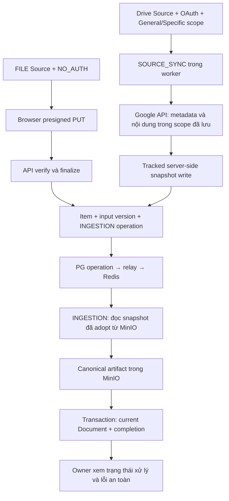

# FILE và Google Drive: cùng một pipeline ingestion

Trạng thái: **Đã triển khai credential tái sử dụng, Automatic interval độc lập, General/Specific và phản hồi thao tác trên cùng pipeline Google Drive.** V18–V20 giữ nguyên Source gốc, credential, ba Google Sheets/Documents và chu kỳ một phút đã chọn, không yêu cầu consent lại. Backend/frontend/browser gates đã pass; runtime thật tạo General bằng credential cũ, chuyển sang Specific một Sheet rồi index thành công, không chạy quét toàn My Drive. Specific chưa lưu không hiện Saved scope trống; General vẫn hiện tóm tắt phạm vi. Sync, reindex, remove và delete đã được kiểm tra trên Source tạm; Source này đã xóa, Source gốc và credential được kiểm tra giữ nguyên. Mọi toast tự tắt sau năm giây kể cả khi hover, focus hoặc pane Orca mất focus; phản hồi phân biệt nhận yêu cầu với hoàn tất và giữ đúng kết quả sau điều hướng. Owner yêu cầu chia commit và push nhánh Drive. Bằng chứng và giới hạn xác minh nằm trong [plan.md](plan.md); không PR, merge, đóng các issue có phạm vi rộng hơn hoặc deploy dùng chung.

Phạm vi tham chiếu: [MEM-9](https://linear.app/memory-os/issue/MEM-9), [MEM-10](https://linear.app/memory-os/issue/MEM-10), [MEM-60](https://linear.app/memory-os/issue/MEM-60), [MEM-63](https://linear.app/memory-os/issue/MEM-63). **Người dùng đã thu hẹp delivery trong cuộc trao đổi: chỉ acquisition, sync, extraction và current Document; chưa làm phân quyền tài liệu.** Vì vậy đây không phải toàn bộ acceptance của MEM-10/MEM-60 và không được đóng các issue đó như đã hoàn thành. Baseline đọc: `origin/main` tại `09d738ed7e42d077d312e5c3ee184eb4ab5f8b11`. Không phải bằng chứng runtime hoặc deployment của Google Drive.

## 1. Quyết định đã chốt

Giữ kiến trúc đã có của FILE. Google Drive là provider thứ hai của cùng mô hình Source/Item/Document, khác ở cách lấy dữ liệu. Không dựng một pipeline Document, object storage hay worker khác cho Drive. Reader identity, source ACL và document-read API/UI được hoãn theo yêu cầu người dùng.

- `Source` là tên API/UI của `ConnectorCredentialPair`; một Source có nhiều Item.
- FILE dùng `NO_AUTH`; Drive dùng credential Google OAuth độc lập trong Tenant. Một credential có thể dùng cho nhiều Google Drive Source; mỗi Source giữ connector, selection và trạng thái đồng bộ riêng.
- Drive file ID xác định Item; checksum xác định nội dung đầu vào. Hai Drive file cùng bytes không được gộp.
- `ConnectorItem` có input versions/snapshots. `Document` chỉ giữ trạng thái hiện hành, ID ổn định; không khôi phục `document_versions`, `current_version_id` hoặc PostgreSQL `normalized_text`.
- PostgreSQL giữ Tenant ownership, operations, checkpoints và references. MinIO giữ bytes/snapshots và canonical artifacts. Redis chỉ giao identifiers; db-scheduler điều phối công việc bền vững. Không thêm ACL persistence/synchronization trong delivery này.
- OpenSearch là downstream đã chọn của sản phẩm, nhưng chunking/embedding/projection/retrieval không thuộc delivery này. `INDEXED` ở đây không có nghĩa search-ready.

### Điều chỉnh được người dùng chấp thuận sau review

- Học luồng OAuth credential của Onyx: owner upload/paste Google Web OAuth client JSON trước consent; client ID/secret gắn với credential dùng chung, không lấy từ app mặc định của server. Không thêm service account hoặc domain-wide delegation trong yêu cầu này.
- Secret app và refresh grant phải được mã hóa với context Tenant/credential; không lưu plaintext secret trong browser storage, session database, response hoặc logs. Consent pin app theo continuation; audience và refresh dùng đúng app đó. Reconnect có thể dùng lại app đã lưu hoặc nhận JSON thay thế; không fallback sang global client.
- Credential cũ thiếu app phải chuyển sang cần reauthorization rõ ràng, không tự nhận app mặc định làm credential do owner cung cấp. Giữ Source, selection và stored documents; fenced work cũ không được publish.
- Không có My Drive/Shared with me browser hoặc API liệt kê candidates. Specific nhận tối đa 20 HTTPS links file/folder không chồng lặp; parse ID tại server rồi xác minh qua Google API cố định, tuyệt đối không fetch URL tùy ý. Không nhận My Drive/Shared Drive root hoặc wildcard như link Specific. General dùng My Drive root thật do server resolve bằng credential hiện tại; không bao gồm Shared with me, Shared Drives hoặc tài khoản khác.
- Sync chỉ enumerate các roots và descendants trong scope đã lưu, giữ durable pagination/frontier, fencing và complete-generation pruning. Dùng reconciliation định kỳ thay cho Changes feed toàn tài khoản; không tải metadata/nội dung ngoài scope. Specific hỗ trợ Shared Drive folders qua link cụ thể với `supportsAllDrives`, không enumerate danh sách drives hay directory/ACL.
- UI phải nói rõ giới hạn ingestion theo link không đồng nghĩa token Google có per-folder permission. FILE, MinIO lifecycle, extraction và document-read boundary giữ nguyên.
- Checkout tham chiếu do người dùng chỉ định là `E:/Project/onyx`, chỉ đọc. Áp dụng bố cục, design tokens, primitives và tương tác Onyx cho shell, Sources, invitation và session/access screens hiện có; giữ thương hiệu MemoryOS. Không dựng Chat/Search/Agents hay màn hình tính năng chưa có backend.
- Chỉ port nội dung được MIT cho phép; giữ attribution khi sử dụng code/assets đáng kể. Không copy phần `ee` theo giấy phép Enterprise hoặc thương hiệu Onyx.
- Phạm vi ban đầu chỉ port giao diện Onyx. Sau review Select credential, người dùng chấp thuận thêm backend credential độc lập và tái sử dụng cho nhiều Source; các tính năng Onyx khác vẫn ngoài phạm vi.
- Scheduler giữ mặc định 5 phút và lệnh đồng bộ thủ công. Sau khi người dùng chấp thuận, Automatic interval trở thành cấu hình riêng cho Source; due check vẫn mỗi phút và không cam kết thời điểm worker bắt đầu chính xác.
- Không thêm `Indexing Start Date` (lọc tài liệu theo modified time), lịch pruning độc lập hoặc pause của Onyx như controls không có backend. MemoryOS vẫn prune trong mỗi reconciliation hoàn chỉnh; phạm vi theo chế độ General/Specific đã lưu.
- Sau review bố cục, các trang wide dùng chung token chiều rộng 80rem và cùng gutter; không override riêng trang Existing sources khiến Add a source lệch lề. Bảng Sources dành đủ chỗ cho tiêu đề thống kê và chỉ cuộn ngang trong vùng bảng trên màn hình hẹp.
- Giữ sidebar setup, modal và upload-or-paste control từ checkout tham chiếu. Review mới chốt picker có đúng bốn thông tin Onyx: ID, Name, Created, Last Updated; UUID rút gọn, name/email không lặp, ngày không kèm giờ. Màn hình hẹp xếp metadata thành nhóm có nhãn, không ép bảng cuộn ngang. Reconnect/revoke/delete và số Source nằm sau Manage, không thành cột riêng. OAuth chỉ tạo/reconnect credential; Connector step đặt tên Source và chọn links rồi mới tạo Source.
- Review tiếp theo tách radio chọn credential thành cột riêng trước ID, không đặt cạnh Name. Hướng dẫn dài về synchronization và selected content nằm trong popover dấu hỏi cạnh tiêu đề; giữ trạng thái, số links, lỗi validation và cảnh báo thao tác nguy hiểm hiển thị đúng ngữ cảnh.
- File rows không có hành vi click nên không tô nền hover cả hàng. Chỉ Reindex/Remove thể hiện hover/focus qua Button chung; tránh nền hàng che mất nền hover của Reindex trong dark mode.
- Save selection nằm bên phải ngay dưới phần chỉnh sửa links, không có đường kẻ hoặc thanh footer riêng. Reload saved selection, khi cần, đứng trước nút Save; giữ nguyên validation và revision-conflict guards.
- Credentials luôn có chevron hiển thị trong summary: xuống khi đóng, lên khi mở. Khi mở, nhãn chuyển từ Manage connection sang Close thay vì biến mất; cả summary giữ native pointer/keyboard toggle.
- Review FILE XLSX phát hiện admission dùng JDK ZipInputStream từ chối ZIP64 streaming data descriptors của workbook nhỏ dù POI mở được. Đọc ZIP qua central directory bằng Commons Compress đã có trong runtime; giữ kiểm tra kích thước thực/CRC, XML an toàn, số entry, tổng giải nén và compression ratio. Không chuyển XLSX sang Google API hoặc bỏ admission.
- Runtime recovery cũng phát hiện aggregate lấy lỗi từ mọi attempt FAILED trong lịch sử. Source chỉ tổng hợp lỗi của item hiện còn FAILED ở current version; reindex thành công bỏ lỗi đã phục hồi nhưng giữ lỗi thật của item khác và không xoá lịch sử operation.
- Người dùng chấp thuận cấu hình Automatic interval theo từng Google Drive Source: số phút nguyên dương (mặc định 5, tối thiểu 1), Owner chỉnh tại Synchronization; không cron, không chế độ tắt tự động và không đổi Synchronize now.
- V19 thêm `sync_interval_minutes` và `schedule_revision` riêng cho lịch. `GET .../google-drive` trả `syncIntervalMinutes`/`scheduleRevision`; `PUT .../google-drive/schedule` nhận `{syncIntervalMinutes}` với `If-Match` của schedule revision và trả configuration mới. Không dùng scope revision cho lịch vì không được hủy sync/index hoặc vô hiệu Document khi đổi chu kỳ.
- Save lịch tính lại `next_sync_at` từ thời điểm lưu; các nhánh enqueue, postpone, finish và terminal failure dùng chu kỳ đang lưu. Công việc đang chạy vẫn hoàn tất bình thường và áp dụng chu kỳ mới cho lần sau. Giữ Tenant/Owner, CSRF, locking và revision-conflict guards; stale editor phải reload rõ ràng, không ghi đè ngầm.
- Theo phản hồi modal của người dùng, redirect URI và cấu hình Google Cloud nằm trong `Setup instructions` đóng mặc định, không phải trường hoặc bước riêng của mỗi Source. Reuse credential không yêu cầu upload JSON hoặc consent lại; service account vẫn ngoài scope.
- Phản hồi thao tác phân biệt nhận yêu cầu, kết quả terminal và chưa xác minh được kết quả; không suy ra thành công từ spinner hoặc aggregate `pendingWork`. Reindex, sync, remove và delete quan sát chính operation được trả về. Save selection và Automatic interval giữ errors/conflicts và drafts tại editor. Dùng Radix đã có, không thêm dependency: notification provider chung cho phép thông báo tạo/xóa Source đi cùng điều hướng, còn thông báo thông thường bị xóa khi đổi trang và observers bị hủy khi rời Source. Mọi toast tự đóng sau năm giây, không dừng timer khi hover, focus hoặc pane Orca mất focus; vẫn có nút đóng sớm bằng bàn phím.
- Bổ sung theo screenshot Synchronize now: thay inline acknowledgement bằng cùng toast lifecycle cho nhận yêu cầu và kết quả operation SYNC_SOURCE. Thành công của acquisition không chứng minh INGESTION đã hoàn tất; notification nói rõ indexing có thể còn chạy, còn Current work/Files tiếp tục polling riêng.
- Kiểm tra cuối mở rộng phản hồi tới upload/finalization, tạo Source, revoke/delete/reconnect credential và refresh/reload do người dùng yêu cầu. Upload được tiếp nhận không có nghĩa indexing đã hoàn tất. Thành công kết nối chỉ được xác nhận sau callback hợp lệ và đọc được credential đang active; lỗi trong confirmation/OAuth dialog giữ alert tại dialog. Không tạo toast cho navigation, mở/đóng editor hoặc polling nền.

### General / Specific — phạm vi mới được chấp thuận

- Bổ sung `scopeMode` với `GENERAL` và `SPECIFIC` trên cùng Source/pipeline. `GENERAL` chỉ là cây My Drive của tài khoản OAuth đang kết nối: root thật và descendants; không tự lấy Shared with me, Shared Drives hoặc Drive của mọi người trong tổ chức. Không khôi phục Changes feed toàn tài khoản.
- `SPECIFIC` giữ 1–20 link file/folder không chồng lặp. `GENERAL` gửi `links: []`; server resolve `metadata("root")` của chính credential, xác minh My Drive root và lưu root thật để dùng chung durable traversal. Configuration công khai trả `scopeMode` và `roots: []` cho General, không biến root hệ thống thành link do người dùng chọn.
- V20 thêm mode mặc định `SPECIFIC`, không đổi roots, credential, interval, Item hoặc Document của Source hiện có. Source thật với ba Sheets vẫn là Specific và chu kỳ một phút.
- Create và replace-root contract bắt buộc có `scopeMode`; dùng lại endpoint `/google-drive/roots`, scope revision/If-Match và toàn bộ tenant/owner/CSRF guards. Đổi mode là đổi scope: cancel/fence generation và publication cũ, rồi reconciliation dưới scope mới mới được prune.
- General phải kiểm chứng root đang lưu thuộc My Drive hiện tại trước traversal. Không tìm được/xác minh được root hoặc enumeration chưa hoàn tất không phải bằng chứng để prune. Credential changes, cancellation, pagination, retry và current Document tiếp tục theo pipeline hiện tại.
- UI có General/Specific tại bước tạo Source và Selected content. Mặc định Specific; General giải thích phạm vi toàn My Drive và ẩn link editor. Việc đổi mode trong editor chỉ là draft tới khi Save selection thành công; refresh không ghi đè draft và không thay đổi interval.
- Chưa thêm Everyone's My Drive, service account, ACL/document-read, My Drive browser, shared-drive discovery, pipeline riêng hoặc dependency mới. Thay đổi này supersede giới hạn trước đây chỉ nhận selected roots; các giới hạn khác giữ nguyên.

### Credential dùng chung: contract và invariant đã chốt

- Dùng lại `credentials`, `google_drive_credentials`, `connectors` và `connector_credential_pairs`; V18 thêm tên credential, bỏ giới hạn Google một-per-Tenant, giữ singleton `NO_AUTH` bằng partial uniqueness. Không sửa migration đã áp dụng; giữ IDs, encrypted payload, revisions, roots, Items và Documents hiện có.
- `CredentialId` là public identifier riêng, không dùng `SourceId` thay thế. OAuth preparation, encrypted continuation context, reconnect/revoke và optimistic credential revision đều định danh credential. Account/client replacement fence mọi Source liên quan trong cùng transaction.
- Owner-only API: list credential metadata, start/complete consent, revoke và delete credential; không trả tokens/client secret/ciphertext. Delete bị chặn khi credential còn Source tham chiếu. Source cleanup chỉ tháo Source và connector tương ứng, không tự xóa credential không còn liên kết.
- Source creation nhận credential ID, tên, `scopeMode` bắt buộc và links theo mode; xác minh Google metadata ngoài SQL transaction, sau đó kiểm tra lại tenant/credential authority và commit Source, validated roots cùng sync intent atomically. Lỗi validation không để lại Source nửa tạo.
- Cùng credential không đồng nghĩa chia sẻ item identity: item/document vẫn source-scoped. Không thêm account-wide discovery, ACL, pause/pruning/start-date controls hoặc cross-tenant credential sharing.
- Refresh payload rotation không đổi authority revision; credential revoke/reconnect/authentication failure phải fence tất cả Source đang dùng, kể cả pending acquisition/publication. Rà soát lock ordering và cleanup để không tạo deadlocks hoặc xóa credential của Source khác.

## 2. Hai đầu vào, một luồng xử lý chung

**FILE không đổi giao thức:** browser upload trực tiếp; API chỉ authorization/finalization, không nhận bytes và không publish Redis.

**Drive không giả lập FILE upload:** SOURCE_SYNC lấy nội dung ngoài transaction; ghi snapshot đã xác minh vào MinIO; transaction tiếp nhận snapshot tạo input version và INGESTION. INGESTION chỉ đọc snapshot đã lưu, không gọi lại Google. Khi Google tạm ngừng sau acquisition, một INGESTION còn hợp lệ vẫn xử lý được; revoke hoặc mất eligibility thì không được publish.

## 3. Ownership và nơi đọc code

| Vùng | Trách nhiệm | Giới hạn |
| --- | --- | --- |
| `api/.../source` | Source commands, OAuth callback, roots selection và response contracts | Không crawl, parse hoặc chứa SQL |
| `core/identity` | Actor và binding đăng nhập hiện có; giữ nguyên | Không thêm reader linking hoặc Actor/Google ACL mapping |
| `core/connector/application` | Source/Credential lifecycle, selection, tiếp nhận Item/snapshot, source authorization | Không import provider SDK hoặc persistence của capability khác |
| `core/connector/persistence` | SQL, roots/frontier/checkpoint, input identity, claims và conditional transitions | Không gọi Google/MinIO; không thêm ACL tables |
| `core/objectstorage` | Object IO và lifecycle trước adoption của raw input | Không quyết định Source/Document permissions |
| `core/ingestion/application` | SOURCE_SYNC và INGESTION orchestration qua public contracts; leases và transaction coordination | Không sở hữu SQL hoặc Google SDK |
| `core/document` | Current Document, canonical artifact tracking/adoption/cleanup | Không thêm document-read endpoint hoặc source permission model |
| `connector/.../provider/google` | OAuth/Drive/Sheets/Docs protocol, paging và snapshot acquisition | Không tự publish Document hoặc quyết định quyền Actor |
| `connector/.../provider/file` và adapters đọc bảng thực sự cần thiết | Đọc bounded binary/native snapshot thành canonical blocks | Không remote reread trong INGESTION; không registry/plugin framework |
| `worker` | Composition, recurring scans/relays, Redis consumer groups | Không là authority store |

Các điểm baseline đã được mở rộng trong implementation:

- `SourceController`: `/api/sources/file`, `/{sourceId}/uploads`, `/{sourceId}/uploads/{uploadId}/finalize`.
- `DefaultSourceManagementService.finalizeUpload`: verify ngoài transaction; lock Pair, adopt/discard, Item/version, operation và receipt trong transaction.
- `DefaultObjectUploadService`: browser presign/verify/adopt và abandoned-upload cleanup.
- `ObjectStorage.write`: dùng lại conditional PUT/checksum; `ObjectWriteService` bổ sung reservation/adoption/cleanup, V13 phân biệt binary 10 MiB với native 32 MiB.
- `IndexWork` và `SourceContentExtractor`: đã mang `SourceInputDescriptor` để route binary/native snapshot và provenance; không có provider SDK type trong core contract.
- `DefaultIngestionCoordinator.processIndex`: mở object, extract, stage artifact; publish Document và complete operation trong một transaction, rollback khi claim cũ.
- `DefaultSourceDocumentAccessResolver` / `JdbcSourceDocumentRepository`: hiện chỉ grant FILE PUBLIC cho membership đang hoạt động; chưa có Google principal matching.

Giữ bốn Gradle modules. API nhận integration bundle `:connector` theo ADR 0006 nhưng không compose parser; worker compose extractor. Google callback dùng controller/security chain riêng, giữ nguyên Keycloak login và Actor-only session thay vì port toàn bộ Spring OAuth success-handler chain của donor. `document` phụ thuộc public `tenant` và `objectstorage`; architecture/README đã được hợp nhất với current Document/V12.

## 4. Acquisition và transaction boundaries

Không dùng `ObjectUploadService` hoặc `source_uploads` cho worker acquisition. Đây là browser protocol và receipt. Cũng không dùng `ExtractionArtifactPort` để giữ raw snapshot: nó quản lý đầu ra đã extraction.

`ObjectWriteService`, `DefaultObjectWriteService` và `JdbcObjectWriteRepository` triển khai server-write lifecycle hẹp trong `objectstorage`, dùng lại `ObjectStorage`, `StoredObjectReference` và persistence primitives nội bộ. Connector sở hữu input association, adoption transaction và retention sau adoption. Browser uploads, raw server writes và extracted artifacts vẫn có ownership/lifecycle riêng.

| Mốc | Transaction và side effect |
| --- | --- |
| Chấp nhận lệnh | PG commit selection revision hoặc sync intent cùng SOURCE_SYNC operation; chưa liên hệ Redis |
| Thu thập input | Google paging/download ngoài SQL transaction; checkpoint/frontier bền vững và lease renewal |
| Trước PUT | Commit staged object + writer claim/evidence + metadata/checksum; key do server sinh |
| Ghi input | Conditional PUT rồi inspect checksum/size/media; ngoài transaction; persist positive write completion |
| Nhận input | Một transaction kiểm tra sync claim, credential/selection revision và current item; adopt object + create/converge input version + enqueue INGESTION |
| Publish | Một transaction kiểm tra current input/source eligibility và ingestion claim; thay current Document/reference + complete operation |
| Ngắt kết nối/remove | Vô hiệu input/mapping và cancel/supersede work trong PG trước async deletion; giữ cleanup lifecycle đang có |

Crash/timeout không chứng minh PUT đã dừng. Acquisition cleanup phải token-fenced, không chọn object đã adopt, và giữ uncertain-write tombstone để xóa lại late PUT. Tham khảo invariant đã có ở artifact cleanup, không copy nguyên mô hình Document sang raw storage. Retry tìm lại durable state; duplicate/stale snapshot được discard, không gắn vào Item.

Binary input giữ giới hạn **10 MiB**, kể cả FILE và Drive. Native snapshot có envelope riêng tối đa **32 MiB**, tối đa 200.000 represented cells, 100 tabs, 256 requests và 120 giây acquisition; vượt giới hạn phải fail rõ, không cắt ngầm. Đây là admission bounds đã kiểm bằng fixtures, không phải benchmark Google thật. V13 giữ binary/browser 10 MiB; V14 thêm credential revisions; V15 thêm sync/checkpoint/input fencing và deferred attempts; V16 yêu cầu owner OAuth app; V17 bỏ Changes state; V18 cho phép tái sử dụng credential và giữ dữ liệu hiện có. Không sửa migration đã áp dụng hoặc thêm cấu hình lịch.

## 5. Source synchronization và extraction input

### Selection và checkpoint

- Specific nhận tối đa 20 HTTPS links file/folder không chồng lặp, không My Drive/Shared Drive root hoặc browser liệt kê tài khoản; file/folder cụ thể trong Shared Drive được hỗ trợ. General resolve và lưu My Drive root thật của credential, đồng thời xác minh lại root trước traversal. Dùng strong revision/`If-Match` cho atomic mode/root replacement.
- Mỗi sync reconcile trong roots và descendants của scope đã lưu, commit theo page trên durable frontier. Không có Changes start token, replay hoặc account-wide cursor. Kiểm tra membership trước acquisition/publication; General không vượt ra ngoài My Drive của tài khoản đang kết nối.
- Chỉ prune sau traversal hoàn chỉnh dưới authority hiện tại. Giữ due check mỗi phút và manual sync; các lần đồng bộ tiếp theo dùng Automatic interval đã lưu của Source, mặc định 5 phút.
- Scope shrink vô hiệu hóa input/mapping bị loại và ngăn công việc cũ publish. Nếu không chứng minh được một Item vẫn thuộc selected roots thì không tiếp nhận/publish cho tới khi reconcile.
- Không crawl hoặc reconcile ACL. Khi provider từ chối đọc/mất credential, ghi outcome an toàn và xử lý source/input lifecycle; không tuyên bố đã phát hiện mọi remote permission change. Lỗi từng item không làm mất tiến độ items khác, nhưng enumeration chưa đầy đủ không được prune như complete generation.
- SOURCE_SYNC là workload mới của dispatcher/consumer hiện có. Thêm stream/group, relay và due-source scan theo conventions; không tạo Google-specific queue service hoặc executor polling song song.
- Enumeration lỗi một phần chỉ giải phóng input đã adopt và được xác nhận trong generation hiện tại; không prune unseen items, để lần reconcile sau vẫn tìm lại phần lỗi. Index trên đúng input/scope/credential được defer cho đến khi membership xác nhận, không mất attempt hoặc tiêu extraction retry budget.
- Refresh-token rotation bình thường chỉ đổi `payload_revision`; reauthorization/revoke đổi `credential_revision`. CAS thất bại của refresh cũ không được ghi đè grant hoặc vô hiệu hóa rotation đã thắng.

### Input descriptor

Persist `SourceInputDescriptor` cùng input version, phân biệt `BINARY`, `GOOGLE_SHEETS` và `GOOGLE_DOCS`, mang provider file/version/source URL. `IndexWork` đưa descriptor cùng stored bytes vào router. Snapshot JSON và native reader nằm trong provider bundle; không cần thêm Google snapshot model hoặc SDK/Jackson type vào core.

Snapshot serializer phải giữ source metadata cần thiết và nội dung thực tế; observation timestamps/checkpoint không được làm thay đổi content fingerprint vô ích. Provider revision và SHA-256 object là hai khái niệm khác nhau.

| Input | Đường xử lý trong delivery |
| --- | --- |
| Google Sheets | Sheets API snapshot; native reader giữ tabs, sparse cells, raw/effective/formatted values, formulas, merges và ranges |
| Google Docs | Docs API snapshot; native reader giữ tabs/headings/paragraphs/lists/tables/element provenance; không export DOCX thay native reader |
| Google Slides | Export PPTX một lần vào raw storage, sau đó dùng Docling hiện có |
| PDF/DOCX/PPTX | Bounded binary snapshot → Docling hiện có |
| XLSX/CSV | Bounded Java table readers; không để CSV rơi vào plain-text parser rồi mất table semantics |
| TXT/Markdown | Adapter text/Tika hiện có |

Multi-call native acquisition phải so revision trước/sau, retry có giới hạn hoặc trả inconsistency rõ; không hứa Google cung cấp atomic snapshot khi API không bảo đảm. Output vẫn là canonical `memoryos-extraction-v1`, mở rộng provenance/cell semantics có fixture tương thích. Không giả provenance, chạy formula, làm Group directory expansion, Shared Drive/shortcut support hay OCR feature mới.

## 6. Phân quyền tài liệu: ngoài phạm vi đợt này

Người dùng yêu cầu chỉ lấy tài liệu về indexing/extraction. Không thêm reader Google linking, ACL snapshots/grants, USER/DOMAIN/GROUP matching, permission freshness, Groups/data scopes hoặc API/UI đọc tài liệu theo quyền.

- Vẫn dùng authentication và Tenant/Owner management checks của main để tạo Source, kết nối Google, chọn roots và chạy sync. Không tắt bảo vệ hiện có.
- Google OAuth ở đây chỉ cấp quyền cho connector lấy dữ liệu, độc lập với SSO đăng nhập. Không sửa Identity contract hoặc tạo/merge Actor theo email.
- Không biến dữ liệu Google thành FILE PUBLIC hoặc tạo read grants cho Tenant. Read model phải thể hiện chưa có quyền đọc được cấu hình, không hiển thị PUBLIC/SYNC như tính năng đã hoạt động.
- Existing PUBLIC resolver phải tiếp tục chỉ áp cho FILE; Drive không được vô tình lọt qua generic mapping/query sau khi ingestion complete. Không thêm fallback grant hoặc public download URL. Đây là giữ ranh giới hiện tại, không phải triển khai source ACL.
- Nghiệm thu nội dung bằng canonical artifact private qua công cụ/test được ủy quyền; UI của đợt này là Owner source management và trạng thái xử lý, không document viewer cho members.
- Source disconnect, input removal, phạm vi root và claim fencing vẫn cần cho tính đúng đắn của ingestion/cleanup. Chúng không thay thế source ACL enforcement hoặc remote-revoke freshness.

Phần phân quyền sẽ cần thiết kế/acceptance riêng khi người dùng đưa trở lại phạm vi. Chưa chốt Google linking như một quyết định bắt buộc cho đợt đó. Không dựng placeholder service hoặc runtime mode tạm để chờ tính năng.

## 7. Chọn code từ nhánh cũ

| Nhóm | Xử lý |
| --- | --- |
| Spring OAuth integration, request-scoped token handling, callback correlation | Port chọn lọc và kiểm lại concurrent/replay/session binding; không copy security configuration toàn khối |
| AES-GCM + Tenant/credential AAD, credential revision CAS | Reuse thuật toán; đối chiếu key delivery và refresh lifecycle. Donor chưa persist rotated refresh token trả về từ refresh grant |
| Bounded Google HTTP và provider revision double-read | Reuse acquisition primitives; dùng selected-root pagination/frontier, không port Changes feed hoặc permission enumeration ngoài scope |
| Sparse Sheets model và bounded fetch | Adapt thành snapshot/native reader; không giữ branch đặc biệt publish Document riêng |
| Manifest/link-column/approval frontend và persistence | Không port; thay bằng selected roots |
| “Frontier” MANIFEST/TARGET chỉ ghi tiến độ | Không coi là resumable folder traversal; viết đúng frontier của selected roots |
| Group/data-scope authority, Document history, fake browser acquisition receipt | Không port |
| Google Docs export DOCX, Slides export PDF | Không dùng cho target; Docs native, Slides PPTX |

## 8. Phạm vi bàn giao và điều kiện chốt

Delivery lần này phải ingest/extract thật: OAuth/selection → stored snapshots → worker → current Document/artifact → trạng thái xử lý và cleanup. Không đưa Google provider chỉ cấu hình nhưng không ingest được vào UI. Authorized read đã được người dùng hoãn rõ; không coi việc thiếu nó là đã hoàn tất MEM-10/MEM-60.

Người dùng đã chấp thuận pipeline chung, server-write lifecycle, native routing và phạm vi source management/processing; cho phép fresh local database sau khi bảo toàn dữ liệu cũ, port chọn lọc và E2E corpus Drive cũ bằng browser Orca. Implementation, regression fixes và bằng chứng được ghi trong [plan.md](plan.md). Canonical docs mô tả code đã triển khai; chúng không thay thế kiểm chứng runtime của từng corpus và failure path.

Bản triển khai chi tiết: [file map thực tế, phần giữ main và phần port donor](plan.md#file-level-implementation-map). Ledger phân biệt regression fixtures, FILE/MinIO/Docling runtime và Google live acceptance chưa hoàn thành.

Nguồn đọc chính: [Linear FILE architecture](https://linear.app/memory-os/document/kien-truc-upload-va-indexing-file-trong-memoryos-54c1f99e3ae7), các issue đầu tài liệu, và main [Connector](../../../specs/connector.md), [Object storage](../../../specs/object-storage.md), [Document](../../../specs/document.md), [Ingestion](../../../specs/ingestion.md). Linear FILE architecture pin commit cũ `6a9e1e0`; current Document/Docling phải đối chiếu main/V12 thay vì copy các đoạn lịch sử.

## 9. Đánh giá phương án: cải thiện gì, trả giá gì?

Không gọi một cơ chế sai chỉ vì nó được viết cho FILE. Phân biệt: main đúng với consumer hiện tại nhưng thiếu extension cho Drive; donor khác contract được chấp thuận; và tối ưu vận hành chưa có số đo.

| Hiện trạng hoặc phương án | Đánh giá và phương án đề xuất | Cải thiện quan sát được | Chi phí/trade-off |
| --- | --- | --- | --- |
| Viết lại queue bằng PostgreSQL-only | Đơn giản hơn nếu xây một ứng dụng upload nhỏ từ đầu, nhưng không chọn cho increment này. Giữ relay/Redis và claim authority của main | Không mất các recovery/fencing semantics đã có; thêm workload không thêm một execution topology | Vẫn phải vận hành PG, Redis và relay; chưa có số đo để tuyên bố nhanh hơn PG-only |
| Dùng lại browser upload receipt cho Drive | Không đúng ownership: không có browser PUT/finalize. Thêm lifecycle server-write hẹp trong objectstorage, không thêm backend hoặc broker | Crash/retry/adoption có nghĩa rõ; raw snapshot được dọn độc lập khỏi browser receipt | Cần persistence/fencing cho server writes; ưu tiên mở rộng primitives hiện có, không dựng generic ingestion framework |
| Dùng artifact tracker để lưu cả raw và extracted | Không chọn: input retention và output-reference replacement khác nhau. Giữ hai loại tài nguyên và chia sẻ IO | Reindex không mất input; thay artifact không xóa raw; cleanup không nhầm consumer | Hai lifecycle cần invariant tests riêng. Chỉ hợp nhất primitives khi có cùng semantics thật, không ép cùng state machine |
| Dùng hash như FILE để xác định Drive Item | Sai identity khi áp sang Drive. Dùng Drive file ID cho Item, hash cho input content | Hai file giống bytes giữ quyền/provenance riêng; file sửa nội dung giữ Document ID | Thêm remote identity/upsert; không đổi FILE dedup contract |
| Giữ manifest/link-column làm abstraction cho Google Source | Không phù hợp roots selection. Dùng trực tiếp file/folder roots và resumable frontier | Người dùng chọn đúng nguồn; restart tiếp tục page; không cần Sheets trung gian để ingest Docs/PDF | Phải triển khai traversal, overlap và move handling thực sự thay vì chỉ sửa tên DTO |
| Đọc Google lại khi extraction retry | Không chọn. Hoàn thành immutable API snapshot trước khi enqueue INGESTION | Retry có thể kiểm chứng trên cùng input; outage Google không làm mất input đã nhận | Tốn raw snapshot storage và snapshot schema/consistency checks |
| Port ACL/Groups trước khi chứng minh ingestion | Không chọn theo scope mới của người dùng. Không port authority query cũ, không thêm reader linking; giữ Drive ngoài existing FILE PUBLIC read | Tập trung kiểm chứng input và extraction; không tuyên bố phân quyền giả hoặc mở dữ liệu thành PUBLIC | Chưa có member document read; không thể đóng đầy đủ MEM-10/MEM-60, phần đọc tài liệu cần delivery riêng |
| Giữ doc version history/normalized text để dễ debug | Không khôi phục các phần main/V12 đã bỏ. Giữ current Document và input/operation provenance | Không có hai nguồn content authority hoặc lịch sử output mơ hồ; replacement/cleanup dễ theo dõi | Debug dựa vào input + operation + current artifact; không cung cấp lịch sử mọi extraction output |
| Tách nhiều Gradle modules hoặc generic provider registry ngay | Chưa có bằng chứng cần; giữ provider folders và explicit composition theo ADR 0006 | Luồng gọi và owner dễ tìm; không thêm interface/factory chỉ để chuyển tiếp | API chấp nhận dependency cost của bundle có Google; đo image/SDK conflicts trước khi tách |

Các invariant đã được triển khai và kiểm bằng regression coverage: native admission không nới FILE; raw writes giữ late-write tombstones và atomic adoption; Drive không được FILE PUBLIC grant; refresh rotation không làm mất publication authority; reconciliation deferral không tiêu retry budget. Đây không phải benchmark hoặc chứng minh đã chạy toàn bộ corpus Google thật. Identity-linking/ACL vẫn ngoài delivery.
