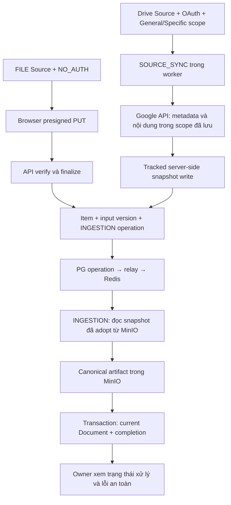

# FILE và Google Drive: cùng một pipeline ingestion

## Main refresh for publication — 2026-09-09

The user approved merging main `287ca9c` (Chat and trusted-broker JIT admission), then explicitly requested any newer main changes before publication. The follow-up fetch found `3f236d5` (Search PRs #83/#87), including the Search workspace/filter/preview, semantic-candidate threshold and test/cache fixes. Source/Google Drive conflicts prioritize `HEAD`: preserve its setup, authorization, pagination, credentials, group associations and stale-state guards. Integrate main Chat/JIT/Search around those contracts and regenerate OpenAPI/clients rather than choosing one generated side.

Main now owns applied migrations V1–V20. Reconcile the unpublished Drive chain by moving V18–V29 to V21–V32 without changing SQL bodies or main migration contents, and update migration-target fixtures and current documentation. This continues the prior branch-integration numbering policy; it does not authorize rewriting an existing database's Flyway history.

Keep the existing review databases and running backend build outputs untouched. Verification must use isolated build outputs and disposable databases with the combined schema. Starting the new migration layout on an old review database is explicitly excluded; a later authorized runtime cutover requires its own data-preserving plan. No PR, merge-to-main, shared deployment, Google mutation or MEM closure is authorized by this publication request.

## Source detail consistency — 2026-09-09

User-approved follow-up on the integrated branch: use the Users/Groups pagination treatment for Files and both indexing histories, with an actual current/total page indicator; enlarge the Source's top-level Drive logo; give each major section an icon-backed heading; promote Credentials to the same heading hierarchy with a key icon instead of a second Drive logo; and align Group associations with the plain section/table surfaces above it.

Files and Source-run pages now expose required `totalItems` metadata counted within the same authorized Tenant/Source and filters, independent of the current cursor. Cursor navigation and bounded item loading remain; totals are not derived from successfully indexed Documents or by fetching every page. File-attempt pages already expose `totalItems`. `TablePagination` is shared across Users, Groups and Source views, preserving row-size choices and pending/error guards. A count that invalidates the current page resets navigation, and narrow-screen Previous/Next controls remain grouped. The page and count are separate read-committed statements, not a cross-request snapshot.

Rendered-browser verification exposed a cache boundary: after retention or external removal invalidates a later page, the shared 30-second cache window could restore an obsolete first-page total. All three Source cursor queries now use zero stale time so returning to a cached page refreshes its rows/count. The Files recovery regression and a retained FILE-history regression both failed with `1 / 2` instead of `1 / 1` before this fix and passed afterward.

No extraction fix, credential migration, Source mutation, permission-policy change or database migration is included. The current review runtime uses the separately approved clean `memoryos_main_review` database; preserve user-created Sources and the old review database. Verify totals at the repository/API boundary and inspect the actual web surface in desktop/mobile and light/dark modes.

Historical integration snapshot below: the earlier combined FILE/Drive implementation was locally verified at the recorded backend/frontend/browser and isolated runtime boundaries in [the prior integration ledger](plan.md#isolated-main-integration--2026-09-09), including cleanup and unresolved host Docker/WSL instability. Its migration references use V18–V29 and remain historical. The publication refresh above owns the current V21–V32 Drive layout and new verification. Historic Owner wording describes the original review persona; current Google management uses global `SOURCES_MANAGE`, generic reads use global/scoped `SOURCES_READ`, and reusable credentials remain Tenant-owned. The increment remains active; no PR merge or deployment is implied.

## Wider upstream delivery boundaries retained

The `fb835f9` planning notes tracked MEM-9/MEM-10/MEM-63/MEM-76 with `nhuxuanviet27102004` under MEM-60. Their unchecked work packages described wider integration and acceptance, not absence of the implementation preserved at `290357a`. The user-approved ingestion-only slice remains narrower than full MEM-10/MEM-60: Google ACL collection/enforcement, verified reader binding and authorized Google document reads are not implemented. Do not infer provider principal identity from email or equate a Drive permission ID with an OIDC subject. Future USER/DOMAIN/ANYONE support requires explicit supported-principal evidence; unresolved groups, unbound principals and incomplete/stale ACLs deny. Remote revocation freshness and permission-only updates without reparsing remain separately designed acceptance, not promises of instantaneous revocation.

Retain the full format scope: native Sheets and Docs snapshots, Slides export to PPTX, downloaded PDF/DOCX/PPTX through Docling, bounded Java XLSX/CSV readers, and the existing UTF-8 TXT/Markdown route. Native Workspace content is not an original binary download. Detect mixed provider revisions rather than publishing known inconsistent multi-request snapshots; retain provider identity, acquisition time, input evidence/checksum and provenance. Unsupported objects remain explicit outcomes, never empty successes. General stays within the credential's actual My Drive; Specific supports explicit shared-with-me files/folders and explicit files/folders inside Shared Drives, not account-wide/whole-Shared-Drive discovery. Shortcuts, group-directory expansion, service accounts, write-back, push notifications, image-only input, audio/video and archives are not added.

MEM-61 supplies the current Document/artifact lifecycle. MEM-46 owns bounded current chunk text/provenance in PostgreSQL and embedding vectors only in OpenSearch; former MEM-62/47/48/49/50 are absorbed there. Chat remains MEM-11 (including MEM-71/72). The current extraction schema embeds image data; no separate image-object store, Document-version ledger, parser-profile uniqueness or PostgreSQL vector store is introduced.

Actual Tasco data remains unavailable. Recorded-response fixtures and synthetic provider documents do not establish customer-data acceptance. Wider release evidence still requires cross-format provenance/limits, sanitized real-account acquisition/resync/revoke, allowed/denied/stale ACL cases in their separate delivery, and exact-SHA runtime acceptance. No claim of SDK compatibility, resource sufficiency, OCR quality or production readiness follows from planning or from fixture-only proof. Onyx/OrgMemory references inform lifecycle/checkpoint and parser contracts, not wholesale runtime or authority copying; pinned inspected reference commits remain in the branch evidence.

Trạng thái: **MEM-76 đã triển khai và hoàn tất nghiệm thu cục bộ cho selection bất đồng bộ có quota, selection/Files phân trang và run history acquisition → indexing trên pipeline hiện có.** V27/V28/V29 là migrations additive sau V26. Backend gate cuối thực thi lại toàn bộ tests, frontend check và 39 E2E scenarios đã pass. Đã đo root/history và traversal 100.000 known unchanged files riêng biệt; UI thật trên 100.000 item rows chỉ tải/render trang hiện hành, giữ pending receipt qua reload và thao tác upload/reindex/remove qua đổi trang. Desktop/mobile/light/dark chạy qua Keycloak owner login với PostgreSQL/Redis/MinIO/API/worker thật, nhưng Google là controlled fixtures, không phải live Google hay Orca embedded-browser proof. Increment và các issue rộng hơn vẫn active; không push/PR/merge/deploy hay thay Source thật/mạng người dùng. Bằng chứng, cleanup và giới hạn nằm trong [plan](plan.md#mem-76-verification--2026-09-08).

Phạm vi tham chiếu: [MEM-9](https://linear.app/memory-os/issue/MEM-9), [MEM-10](https://linear.app/memory-os/issue/MEM-10), [MEM-60](https://linear.app/memory-os/issue/MEM-60), [MEM-63](https://linear.app/memory-os/issue/MEM-63). **Người dùng đã thu hẹp delivery trong cuộc trao đổi: chỉ acquisition, sync, extraction và current Document; chưa làm phân quyền tài liệu.** Vì vậy đây không phải toàn bộ acceptance của MEM-10/MEM-60 và không được đóng các issue đó như đã hoàn thành. Baseline đọc: `origin/main` tại `09d738ed7e42d077d312e5c3ee184eb4ab5f8b11`. Không phải bằng chứng runtime hoặc deployment của Google Drive.

**Nguồn dữ liệu:** chưa nhận dữ liệu Tasco thực tế. Các Google documents của những lần nghiệm thu trước đều tự tạo/mô phỏng; provider thật không đồng nghĩa dữ liệu Tasco. Trạng thái preservation V26 và các gate/live runs cũ dưới đây là lịch sử. MEM-76 không restore baseline ba roots: folder `1. VETC` và selection người dùng đã sửa phải được giữ nguyên. Không dùng history fixtures để tuyên bố Google capacity hoặc live discovery → approval → synchronization đã đạt.

## Enterprise source operations proposal

Theo dõi phát sinh: [MEM-76 — Mở rộng Google Drive selection và bổ sung lịch sử đồng bộ có kết quả chính xác](https://linear.app/memory-os/issue/MEM-76/mo-rong-google-drive-selection-va-bo-sung-lich-su-djong-bo-co-ket-qua), assign Nhữ Xuân Việt; thuộc MEM-60, liên quan MEM-9/MEM-10/MEM-39/MEM-64. Issue lưu bối cảnh và các phương án không chọn; design/plan tại đây là nguồn chi tiết.

**Được duyệt triển khai ngày 2026-09-08; implementation và nghiệm thu cục bộ đã hoàn tất.** Phần dưới ghi contract hiện có và reasoning đã duyệt, không phải tuyên bố deployment/production capacity. Final backend/frontend, actual UI, isolated runtime và controlled root/history/corpus evidence được phân biệt rõ trong [enterprise plan](plan.md#enterprise-source-operations-plan).

### Mục tiêu và giới hạn

- Owner quản lý được nhiều roots mà không phải đọc danh sách folder/file trộn lẫn; biết chính xác phạm vi nào đang có hiệu lực và bản chỉnh sửa nào đang chờ xác minh.
- Mỗi lượt đồng bộ có lịch sử bền vững, kết quả acquisition và indexing riêng, số liệu có định nghĩa và lỗi đủ để hành động. Thành công với không thay đổi khác với không có dữ liệu, đang xử lý hoặc không biết kết quả.
- Giữ Source/Item/current Document, singleton Tenant, IAM global `SOURCES_MANAGE` authorization, PostgreSQL authority, Redis delivery, MinIO và provider bundle hiện có. Không dựng generic workflow/audit framework, queue platform hay pipeline Drive thứ hai.
- Không mở rộng OAuth scope, không account-wide browser, service account, ACL/document-read, chunking/embedding/search hoặc thay đổi General/Specific sau tạo. Enterprise ingestion không đồng nghĩa tài liệu đã an toàn để phục vụ người đọc; Drive tiếp tục RESTRICTED cho tới delivery phân quyền riêng.
- Giữ Source người dùng hiện tại và selection do người dùng sửa, gồm folder `1. VETC`; không restore baseline ba roots cũ. Không sửa mạng/hosts, credential hay dữ liệu Google trong delivery UI/history.

### A. Selection rõ ràng, không nhân đôi nguồn dữ liệu

- Một Source, một selection revision, một Edit → Save/Cancel. Hiển thị hai nhóm root `Folders (n)` và `Files (n)`, folder trước, sort ổn định theo tên/ID. Số nhóm đếm roots chọn trực tiếp, không đếm toàn bộ descendants.
- Folder nói rõ bao gồm file/subfolder trong phạm vi được hỗ trợ; file nói rõ được chọn trực tiếp. Linked-document branches giữ provenance và tập approval ID chung; phân biệt `Selected directly`, `Included via folder`, `Approved linked document` thay cho cùng một nhãn Already included ở mọi hàng.
- Chỉ vẽ quan hệ cha/con đã được lưu/xác minh. Không biến nhóm folder thành cây Google Drive toàn tài khoản và không ngụ ý đã biết mọi descendants khi chưa duyệt xong. Root grouping không thay đổi overlap rejection hoặc cấp quyền loại trừ từng con.
- Giữ một bulk-paste input nhận cả link file và folder; MIME do provider xác minh quyết định nhóm, không đoán bằng URL. Danh sách read-only là bề mặt chính; links gốc để copy nằm trong disclosure, không trình bày cả cây lớn lẫn textarea dài ở trạng thái nghỉ.
- Danh sách lớn có tìm kiếm theo tên, lọc `FOLDER`/`FILE`/`LINKED` và cursor pagination trong đúng Source. Response pin scope/discovery/credential revisions; status polling chỉ lấy configuration/counts/pending operation, không tải lại toàn bộ roots/candidates. Provenance đi cùng các rows của trang; chỉ render quan hệ đã lưu.
- Edit lấy một bounded complete `selection-draft` riêng, giữ links và approval IDs độc lập với search/trang/polling. Save gửi toàn selection cùng revisions, không chỉ trang đang xem. Cancel trước submit chỉ bỏ draft, không ghi. Sau `202`, rời màn hình không hủy validation; receipt lookup phục hồi accepted operation. Không có command Cancel validation công khai; proposal mới supersede proposal cũ và authority/lifecycle changes fence pending work.

### B. Thay giới hạn 20 bằng quota và xác minh bền vững

- Backend `GoogleDriveSelectionPolicy` thay cap 20: `maxExplicitRootsPerSource` mặc định 1.000, cấu hình 1–10.000; `maxRequestBytes` mặc định 3.145.728 bytes, cấu hình 1.024–4.194.304; `maxLinkedDocuments` là 500. API thực thi byte bound và service tính UTF-8 payload budget độc lập; UI đọc policy endpoint thay vì giữ quota thứ hai.
- Default 1.000 là cấu hình đã triển khai, **không phải Google capacity hoặc production throughput đã chứng minh**. Ma trận 20/21/100/1.000 mixed roots với shared ancestors, depth 40/100, approvals, overlap và quota rejection đã đo trên services/PostgreSQL với provider-port fixture; [matrix chuẩn](../../../tests/connector.md#measured-selection-and-history-capacity--2026-09-08) giữ số đo và giới hạn JDBC/pooling/heap. [Traversal 100.000 known unchanged files](../../../tests/ingestion.md#controlled-100k-file-traversal) là phép đo riêng qua HTTP adapter; history probe 100.000 summaries và UI fixture 100.000 metadata rows không phải 100.000 acquired/indexed files. Folder descendants không tiêu quota explicit root; discovery/input/parser bounds giữ độc lập.
- Tách parse/shape/quota validation nhanh khỏi provider verification. Create và Save selection nhận một durable selection-change operation, trả `202`; API không chờ hàng trăm/nghìn metadata/ancestor calls. Dùng cùng nền PG → relay → Redis → fenced claim, thêm logical workload `GOOGLE_DRIVE_SELECTION_VALIDATION` cùng exhaustive routing/config hiện có; không giữ transaction trong lúc gọi Google, fire-and-forget task hoặc queue platform thứ hai.
- Operation giữ immutable proposed roots/approval IDs, initiating actor, credential authority, expected active scope/discovery revision, policy snapshot và receipt chống submit trùng. Create receipt chứa operation và reserved Source ID nhưng chưa có Source row hoạt động; chỉ điều hướng sau khi operation thành công. Giữ generic operation polling, không nhét run counters vào DTO đó. Edit giữ selection hiện hành trong lúc xác minh; proposal mới supersede proposal pending cũ, activation đúng một lần.
- Worker checkpoint metadata, entries và ancestor traversal trong PostgreSQL; serialize selection claims theo credential và không giữ transaction khi gọi Google. Mỗi batch tối đa 32 metadata calls/30 giây giữa bounded calls; operation tối đa `min(100000, maxRoots*64+4096)` requests, `min(50000, maxRoots*32+4096)` metadata, 200.000 ancestor checkpoints và 3.600.000 ms elapsed budget. Quota/unavailable/inconsistent failures giữ checkpoint, backoff 30 giây, terminal ở failure thứ năm; batch continuation không tiêu failure budget. Đây là selection budgets, không đổi acquisition 256 calls/120 giây của từng input.
- Chỉ activation transaction mới kiểm tra lại Tenant → credential → Source, global `SOURCES_MANAGE` hiện hành, revisions, mode và kết quả verification; atomically thay roots + approvals, tăng scope revision và fence/schedule theo contract hiện có. Invalid/inaccessible/overlapping/oversized/stale/cancelled proposal không thay active roots, lịch hoặc Document. Credential revoke/reconnect/deletion và source deletion phải xử lý cả pending intents.
- Cut over toàn bộ create/save DTO, operation result, OpenAPI, generated clients và tests cùng đợt. Không giữ đường synchronous cho ít links và asynchronous cho nhiều links, không alias API cũ. General vẫn chỉ là My Drive thực và mode vẫn bất biến.
- Linked-content discovery có các budget riêng (hiện 100 inputs/500 candidates); tăng root quota không được ngầm công bố discovery toàn bộ corpus. UI phải nêu coverage/budget và trạng thái snapshot; global bound failure giữ snapshot cũ và báo rõ thất bại. Đợt này không tăng mọi parser/discovery bound hoặc thêm account-wide discovery.

### C. Lịch sử lượt chạy là dữ liệu sản phẩm, không phải logs

- Với Drive, `source_sync_attempts` là anchor lượt synchronization; `index_attempts` là operation xử lý input version. Không gọi trực tiếp danh sách item operations là toàn bộ run history. Giữ kết thúc operation acquisition như hiện tại để không khóa scheduler đến khi mọi extraction xong; read model thêm trạng thái hoàn tất end-to-end riêng.
- Mỗi run có ID, trigger (scheduled/manual/initial), actor nếu có, thời điểm queued/started/acquisition-completed/run-completed, scope và credential revision. Trạng thái đọc phân biệt Queued, Acquiring, Retry scheduled, Recovery pending, Indexing, Succeeded, Completed with errors, Failed và Superseded/Cancelled. Lease hết hạn là Recovery pending, không giả vờ worker còn chạy; unavailable status read không tự trở thành Failed.
- Thêm nullable tenant-safe `index_attempts.source_sync_attempt_id` tại đúng transaction adopt input/tạo automatic INDEX attempt. INDEX đã trỏ tới input version nên không cần một bảng liên kết/version-origin thứ hai; FILE/manual reindex để null. Run sau quan sát cùng input đang xử lý chỉ ghi `alreadyPending`, không sở hữu hay đếm publication của operation cũ. Không dựng attribution lịch sử bằng timestamp/revision/current item.
- Counter contract: `scanned` là unique file IDs, không folder/page/retry; `acquired` là new/changed input versions do run tiếp nhận; `published` là các child operations do run tạo đã publish thành công; `unchanged` là input không đổi, không chứng minh indexing cũ thành công. `alreadyPending`, acquisition/indexing `failed`, `skipped`, `removed` có nghĩa riêng; removed chỉ chốt từ reconciliation đầy đủ. Không cộng các counter chồng lấp thành tổng Documents hoặc dựng phần trăm từ tổng chưa biết.
- Counters trên run cập nhật cùng durable transitions, idempotent theo run/file/version/attempt và claim; giữ được summary khi item cleanup xóa attempt/version. Complete, terminal failure, true supersede và bulk cancellation đều chốt child counters đúng một lần; reconciliation deferral không terminal, không tiêu retry budget. Run hoàn tất khi acquisition và children do nó khởi tạo terminal; manual retry/reindex mới không sửa history đã đóng. Dữ liệu legacy thiếu attribution/counter/trigger hiển thị Unknown hoặc `—`, không backfill số 0 từ current Documents.
- Summary hiện hành tách `Current activity`, `Last completed run` và `Last successful run`. Giữ lỗi run trước nhìn thấy khi một run mới chỉ vừa bắt đầu; trạng thái Indexing không tự xóa bằng chứng thất bại. `INDEXED` vẫn chỉ là extraction artifact hiện hành, không tuyên bố search-ready.
- Lỗi có phase và mã an toàn: provider authentication/permission/rate limit, storage read/write/connectivity/TLS, extraction, publication. File lỗi và lỗi toàn run khác nhau; sự cố storage không hướng người dùng sửa link Drive. Owner xem file/name đã biết, stage, attempt/run ID và hướng xử lý; không đưa raw exception, token, signed URL, bytes hoặc object path nội bộ lên UI.
- `/api/sources/{sourceId}/runs` trả cursor pages với required `totalItems`, filter status/time/trigger và ba summaries độc lập; `/{runId}` trả một run, `/{runId}/errors` phân trang safe errors. Page mặc định 25, tối đa 100, keyset `(created_at, id)` giảm dần trong tenant/source/filter; lỗi dùng `(occurred_at, id)`. `/index-attempts` vẫn là paged item-processing history, generic operation polling không nhận run counters. Concrete query repository đọc bounded rows, không materialize full frontier/history/stacktrace; count riêng dùng cùng filtered projection và bỏ cursor/limit, không thay bằng current Document count.
- Retention đã triển khai: `memoryos.connector.run-history.summary-retention=P90D`, `detail-retention=P14D`; batch tối đa 100. Compact outcomes/errors/frontier khi acquisition và owned children terminal; `detailsExpired` nói rõ detail đã hết hạn. Không prune live children, current-input attempts, upload receipts hoặc lỗi hiện chưa phục hồi; protected references có thể giữ summary quá 90 ngày. Terminal counters tồn tại độc lập với item cleanup. Source deletion dọn history theo dependency order; đây không phải compliance audit hoặc giữ provider content sau xóa.

### D. Bề mặt và mức độ thay đổi

- Theo yêu cầu ngày 2026-09-09, bỏ toàn bộ `Run history` khỏi giao diện Source: summaries, filters, table, detail/error view và polling tương ứng. Xóa component và browser scenario riêng của bề mặt này, không chỉ ẩn bằng CSS. Giữ backend run APIs/counters/retention, Synchronize now, interval, selection, Files và item-processing history; không thay đổi dữ liệu hoặc selection người dùng.
- Lịch sử xử lý file đổi thành bảng `Indexing attempts` gọn theo Onyx: Queued, Status, Completed, Error message. Không giả cột New Docs/Total Docs vì mỗi row là một input-version attempt. Không lặp UUID/type/nhãn thời gian thành card; giữ ID trong tooltip thời gian và giải thích trong help popover. Page size 5 mặc định, chọn 5/10/25/50; truyền size vào API, reset cursor khi đổi size/Source, Previous/Next theo cursor thật, không suy diễn tổng số trang.
- Follow-up 2026-09-09: Automatic interval là ô thứ năm trong khung thông tin Source, cùng Source status, Access, Documents indexed và Last indexed successfully. Google Drive giữ ownership của query/draft/save; dùng chung SourceSummaryCard với FILE, không portal hoặc bản sao state. Synchronization bên dưới chỉ giữ actions/help/errors. Page indicator của Indexing attempts đổi thành current/total; tổng phải lấy từ backend, không suy diễn từ cursor.
- Follow-up selection/discovery 2026-09-09: làm gọn Selected content thành một danh sách, mỗi provider file ID chỉ xuất hiện một lần trong read model (root có ưu tiên, vẫn giữ origins). Linked counts/filter/paging phải dùng cùng tập đã loại root trùng, không lọc riêng ở frontend. Hiển thị số tài liệu riêng biệt khác với số vị trí liên kết; nhóm origins theo tài liệu cha và gộp các vị trí, không lặp raw Root/Parent IDs. Đưa mô tả scope/discovery budgets/revisions vào help đặt ngay cạnh tiêu đề, giữ lỗi và pending state nhìn thấy. Kiểm tra dữ liệu discovery thực tế riêng với browser fixtures; không sửa selection, interval hoặc nội dung Google.
- Expanded-state correction 2026-09-09: Selected content có một heading/help do panel sở hữu, kể cả khi mở saved links hoặc Edit. Copy saved root links chỉ mở field read-only có nhãn và số link, không nhúng lại heading/scope/help hoặc quota của editor. Creation vẫn giữ heading/help và lựa chọn scope; detail giữ nguyên draft, validation và quyền ghi.
- Folder-first selection follow-up 2026-09-09: thay danh sách mặc định bằng cây mở theo nhu cầu: selected folder → folder/file thực tế → linked targets và vị trí trong file. Không dựng folder contents chỉ từ origins vì như vậy làm mất file không chứa link. Endpoint đọc nhánh nằm trong Source hiện hành; listing metadata trực tiếp từ Google chỉ sau khi xác minh global `SOURCES_MANAGE`, credential và parent thuộc selected roots hoặc file đã duyệt. Không tải content, mở rộng selection hay tạo approval khi mở cây. Không cho link folder trở thành authority.
- Root/branch pages bị giới hạn và cursor gắn tenant/Source, parent, scope/discovery/credential revisions; kiểm tra lại authority sau provider I/O. Root tree giữ file đã duyệt nhưng mất nguồn tham chiếu; target xuất hiện theo các đường dẫn thật nhưng approval vẫn là một tập theo provider ID. Folder metadata là hiện tại, linked targets là snapshot discovery cuối cùng; nhánh không có kết quả không được giả là đã scan toàn bộ. Search/type filters giữ unique selection index hiện có và hiển thị kết quả phẳng, không giả hierarchy từ một trang lọc.
- Linked target có action rõ `Select for sync` ngay tại dòng; action chỉ mở đầy đủ draft và chọn ID tương ứng. Save selection và validation hiện có mới cấp quyền đồng bộ; Cancel không ghi. File đã nằm trong root hiển thị Included, không cần duyệt thêm. Bỏ Technical paths và toàn bộ raw Root/Parent IDs khỏi UI, giữ location người dùng hiểu được và không khôi phục hai subtitle đã bỏ.
- Indexing clarity follow-up 2026-09-09: người dùng chỉ ra Files không có thời gian dễ thấy, Latest item attempt không rõ vai trò, và Indexing attempts chỉ có Succeeded nhưng không cho biết kết quả. Files phải mô tả corpus hiện tại cùng thời gian indexing thật trên từng dòng; chi tiết attempt chỉ giải thích lần xử lý của file đó. Với Drive, history trong cùng bề mặt hiện hành đổi sang mỗi lần Source chạy và counters thật từ run API, không phục hồi dashboard Run history/cards đã bỏ.
- Đối chiếu Onyx từ `.tmp/onyx/` để phân biệt ý nghĩa một attempt và các counters; không sao chép nhãn New Docs/Total Docs nếu MemoryOS không có đúng dữ liệu. Tách queued/start/completion, trạng thái acquisition với indexing end-to-end, no changes với unknown/legacy và lỗi. FILE Source giữ per-file history được gọi tên chính xác; không gọi API Google-only. Bổ sung kiểm chứng cùng cây selection trong một lần integration, không đổi selection hoặc chạy reindex/sync của người dùng chỉ để tạo số liệu.
- Latest presentation follow-up 2026-09-09: đổi `Copy saved root links` thành `File and folder links`; chuyển Edit selection và editor vào disclosure dưới cây, chỉ hiện Edit khi mở. Select for sync tự mở disclosure nhưng vẫn giữ focus tại checkbox của target; Cancel quay về control khởi tạo. Bỏ subtitle đếm selected folders/files/linked documents ngay trên cây, không bỏ lỗi, reference locations hoặc thời gian discovery.
- Density follow-up 2026-09-09: Files chỉ hiển thị tên, size, status, Last indexed và actions; chuyển Added/attempt times vào disclosure ngay tại Last indexed, không lặp subtitle dưới từng tên file. History bỏ trigger và câu giải thích indexing lặp lại; chỉ mở Details cho counters phụ khác 0 hoặc chưa biết và retry có thật. Không có Details rỗng cho run không thay đổi; giữ counters chính, completion/duration, lỗi và trạng thái Unknown đúng nghĩa.
- Files pagination follow-up 2026-09-09: bỏ dòng `Page 1 · ... files on this page · Newest first`, đưa Rows (5/10/25/50/100, mặc định 25), current page và previous/next icon buttons xuống dưới bảng. Đổi size reset cursor/stack; giữ keyset API, không giả tổng trang. Upload/finalize quay về trang đầu với size đang chọn, không làm mất observer của reindex/removal.
- Timestamp simplification follow-up 2026-09-09: remove the entire Last indexed disclosure and retain only the current-version success timestamp. Place Source-run duration beside completion on the same non-wrapping line. Remove the obsolete file-detail component and its test; retain timestamp accessibility and existing run error/unknown behavior. No API or persistence change.
- Independent link approval follow-up 2026-09-09: Select for sync loads the complete draft but never opens the root-links disclosure or editor. Approval-only Save/Cancel/reload controls appear below the tree. Explicit Edit selection alone opens the root editor, reusing any existing draft without dropping approvals; reload preserves the editing mode. Both paths use the existing full-selection validation, revision fencing and submission recovery.
- Reversible saved approval follow-up 2026-09-09: show Deselect for sync for approved linked targets instead of hiding their action. It loads the full pinned draft and removes only that approval; Save commits through existing validation and Cancel preserves the saved selection. Already-selected unavailable targets may be deselected, but cannot be reapproved while unavailable. Targets included by roots remain governed by root selection rather than an ineffective independent toggle.
- `No changes` cần traversal đầy đủ; nếu indexing từ run trước còn pending/lỗi thì hiển thị riêng, không ngụ ý toàn Source đã khỏe. Run không tạo child có indexing `Not required`, khác `Succeeded` có publication. Tổng Documents hiện tại của Source nằm ở summary riêng, không trộn với số xử lý của một run.
- Dùng Synchronize now với selection/credential hiện hành và Reindex item hiện có để phục hồi; không thêm nút replay run cũ có thể phục hồi scope hoặc credential đã hết quyền. Lỗi lịch sử vẫn giữ sau khi run mới thành công.
- V27 lưu selection intents/receipts/checkpoints; V28 thêm nullable legacy run metadata, exact child attribution, counters, retained safe errors và indexed history/retention queries; V29 thêm Files keyset/latest-attempt indexes. Không sửa V1–V26 hoặc reset database người dùng. Legacy Unknown là bằng chứng thiếu thật, không phải execution shim. HTTP/OpenAPI/generated clients và worker dispatch cut over cùng đợt; final drift/backend/frontend gates đã thực thi và ghi trong plan.
- Không thêm ADR ở bước đề xuất. Phạm vi này thuộc MEM-9 (selection), MEM-10 (sync/history), MEM-60 (nghiệm thu tích hợp); MEM-63 chỉ cần bảo toàn reader/output contract. Các issue rộng hơn không được đóng bởi plan hoặc bởi UI đẹp.

### E. Files phân trang — phạm vi bổ sung được người dùng duyệt

- Người dùng yêu cầu hoàn thiện luồng qua UI và duyệt bổ sung server-side pagination cho Files. Vấn đề đã khắc phục: đường `JdbcSourceQueryRepository.detail` cũ tải toàn bộ items và Source detail render toàn bộ rows; selection/history pagination không tự sửa được giới hạn này.
- Clean cutover: `GET /api/sources/{sourceId}` và kết quả `POST /api/sources/file` trả `SourceSummary` trực tiếp, không chứa items và không giữ wrapper một field. Xóa `SourceDetail`/`SourceDetailResponse`; migrate mọi caller/test.
- Reuse `GET /api/sources/{sourceId}/items`, operation ID `listSourceItems`, đổi response thành `SourceItemPage { items, nextCursor }`; query `cursor`, `size` mặc định 25, tối đa 100. Thứ tự `created_at DESC, id DESC`; cursor gắn Tenant/Source/kind, stable khi có upload mới, không OFFSET hoặc COUNT toàn corpus cho từng page.
- Persistence sở hữu SQL/cursor/index; application giữ IAM Source/Tenant authorization. Bound candidate rows trước version/latest-attempt projection để không join/render toàn corpus rồi mới limit. Migration additive V29 chỉ bổ sung index cần thiết.
- UI lấy summary và Files page riêng. Status polling không tải item corpus; chỉ page hiện hành được refresh khi có processing/mutation. Previous/Next, loading/error/empty, keyboard/mobile và source/cursor changes giữ đúng context; không thêm search hay virtualized-only workaround.
- Upload/finalize đưa người dùng về page đầu để thấy file mới; reindex/remove tiếp tục theo đúng item/operation ID dù đổi page. Mutation invalidates summary/current page/history theo contract; không làm mất pending operation, receipt recovery hoặc draft selection.
- Nghiệm thu đã hoàn tất: PostgreSQL/API page bounds, cursor isolation và insert-between-pages; real UI với 100.000 seeded item rows chỉ tải/render 25 rows hiện hành, Previous/Next ổn định. UI upload/reindex/remove qua đổi trang và pending validation → reload → revision-3 activation chạy end-to-end với runtime thật. Đây là UI/query capacity fixture và controlled Google boundary, không phải 100.000 Documents đã acquire/index thật; [matrix chuẩn](../../../tests/connector.md#real-ui-files-pagination-over-100k-items) giữ ID/counters và giới hạn.

## 1. Quyết định đã chốt

Giữ kiến trúc đã có của FILE. Google Drive là provider thứ hai của cùng mô hình Source/Item/Document, khác ở cách lấy dữ liệu. Không dựng một pipeline Document, object storage hay worker khác cho Drive. Reader identity, source ACL và document-read API/UI được hoãn theo yêu cầu người dùng.

- `Source` là tên API/UI của `ConnectorCredentialPair`; một Source có nhiều Item.
- FILE dùng `NO_AUTH`; Drive dùng credential Google OAuth độc lập trong Tenant. Một credential có thể dùng cho nhiều Google Drive Source; mỗi Source giữ connector, selection và trạng thái đồng bộ riêng.
- Drive file ID xác định Item; checksum xác định nội dung đầu vào. Hai Drive file cùng bytes không được gộp.
- `ConnectorItem` có input versions/snapshots. `Document` chỉ giữ trạng thái hiện hành, ID ổn định; không khôi phục `document_versions`, `current_version_id` hoặc PostgreSQL `normalized_text`.
- PostgreSQL giữ Tenant ownership, operations, checkpoints và references. MinIO giữ bytes/snapshots và canonical artifacts. Redis chỉ giao identifiers; db-scheduler điều phối công việc bền vững. Không thêm ACL persistence/synchronization trong delivery này.
- OpenSearch là downstream đã chọn của sản phẩm, nhưng chunking/embedding/projection/retrieval không thuộc delivery này. `INDEXED` ở đây không có nghĩa search-ready.

### Điều chỉnh được người dùng chấp thuận sau review

- Học luồng OAuth credential của Onyx: owner upload/paste Google Web OAuth client JSON trước consent; client ID/secret gắn với credential dùng chung, không lấy từ app mặc định của server. Không thêm service account hoặc domain-wide delegation trong yêu cầu này.
- Secret app và refresh grant phải được mã hóa với context Tenant/credential; không lưu plaintext secret trong browser storage, session database, response hoặc logs. Consent pin app theo continuation; audience và refresh dùng đúng app đó. Reconnect có thể dùng lại app đã lưu hoặc nhận JSON thay thế; không fallback sang global client.
- Credential cũ thiếu app phải chuyển sang cần reauthorization rõ ràng, không tự nhận app mặc định làm credential do owner cung cấp. Giữ Source, selection và stored documents; fenced work cũ không được publish.
- Không có My Drive/Shared with me account browser. Specific nhận HTTPS file/folder links trong backend policy (mặc định 1.000 roots), không chồng lặp; parse ID tại server và xác minh bất đồng bộ qua fixed Google APIs, tuyệt đối không fetch URL tùy ý. Không nhận whole-drive root hoặc wildcard trong Specific. General dùng My Drive root thật của credential, không bao gồm Shared with me/Shared Drives/tài khoản khác.
- Sync chỉ enumerate các roots và descendants trong scope đã lưu, giữ durable pagination/frontier, fencing và complete-generation pruning. Dùng reconciliation định kỳ thay cho Changes feed toàn tài khoản; không tải metadata/nội dung ngoài scope. Specific hỗ trợ Shared Drive folders qua link cụ thể với `supportsAllDrives`, không enumerate danh sách drives hay directory/ACL.
- UI phải nói rõ giới hạn ingestion theo link không đồng nghĩa token Google có per-folder permission. FILE, MinIO lifecycle, extraction và document-read boundary giữ nguyên.
- Checkout tham chiếu do người dùng chỉ định là `E:/Project/onyx`, chỉ đọc. Áp dụng bố cục, design tokens, primitives và tương tác Onyx cho shell, Sources, invitation và session/access screens hiện có; giữ thương hiệu MemoryOS. Không dựng Chat/Search/Agents hay màn hình tính năng chưa có backend.
- Chỉ port nội dung được MIT cho phép; giữ attribution khi sử dụng code/assets đáng kể. Không copy phần `ee` theo giấy phép Enterprise hoặc thương hiệu Onyx.
- Phạm vi ban đầu chỉ port giao diện Onyx. Sau review Select credential, người dùng chấp thuận thêm backend credential độc lập và tái sử dụng cho nhiều Source; các tính năng Onyx khác vẫn ngoài phạm vi.
- Scheduler giữ mặc định 5 phút và lệnh đồng bộ thủ công. Sau khi người dùng chấp thuận, Automatic interval trở thành cấu hình riêng cho Source; due check vẫn mỗi phút và không cam kết thời điểm worker bắt đầu chính xác.
- Không thêm `Indexing Start Date` (lọc tài liệu theo modified time), lịch pruning độc lập hoặc pause của Onyx như controls không có backend. MemoryOS vẫn prune trong mỗi reconciliation hoàn chỉnh; phạm vi theo chế độ General/Specific đã lưu.
- Sau review bố cục, các trang wide dùng chung token chiều rộng 80rem và cùng gutter; không override riêng trang Existing sources khiến Add a source lệch lề. Bảng Sources dành đủ chỗ cho tiêu đề thống kê và chỉ cuộn ngang trong vùng bảng trên màn hình hẹp.
- Giữ sidebar setup, modal và upload-or-paste control từ checkout tham chiếu. Review mới chốt picker có đúng bốn thông tin Onyx: ID, Name, Created, Last Updated; UUID rút gọn, name/email không lặp, ngày không kèm giờ. Màn hình hẹp xếp metadata thành nhóm có nhãn, không ép bảng cuộn ngang. Reconnect/revoke/delete và số Source nằm sau Manage, không thành cột riêng. OAuth chỉ tạo/reconnect credential; Connector step đặt tên Source và chọn links rồi mới tạo Source.
- Review tiếp theo tách radio chọn credential thành cột riêng trước ID, không đặt cạnh Name. Hướng dẫn dài về synchronization và selected content nằm trong popover dấu hỏi cạnh tiêu đề; giữ trạng thái, số links, lỗi validation và cảnh báo thao tác nguy hiểm hiển thị đúng ngữ cảnh.
- File rows không có hành vi click nên không tô nền hover cả hàng. Chỉ Reindex/Remove thể hiện hover/focus qua Button chung; tránh nền hàng che mất nền hover của Reindex trong dark mode.
- Save selection nằm bên phải ngay dưới phần chỉnh sửa links, không có đường kẻ hoặc thanh footer riêng. Reload saved selection, khi cần, đứng trước nút Save; giữ nguyên validation và revision-conflict guards.
- Credentials luôn có chevron hiển thị trong summary: xuống khi đóng, lên khi mở. Khi mở, nhãn chuyển từ Manage connection sang Close thay vì biến mất; cả summary giữ native pointer/keyboard toggle.
- Review FILE XLSX phát hiện admission dùng JDK ZipInputStream từ chối ZIP64 streaming data descriptors của workbook nhỏ dù POI mở được. Đọc ZIP qua central directory bằng Commons Compress đã có trong runtime; giữ kiểm tra kích thước thực/CRC, XML an toàn, số entry, tổng giải nén và compression ratio. Không chuyển XLSX sang Google API hoặc bỏ admission.
- Runtime recovery cũng phát hiện aggregate lấy lỗi từ mọi attempt FAILED trong lịch sử. Source chỉ tổng hợp lỗi của item hiện còn FAILED ở current version; reindex thành công bỏ lỗi đã phục hồi nhưng giữ lỗi thật của item khác và không xoá lịch sử operation.
- Người dùng chấp thuận cấu hình Automatic interval theo từng Google Drive Source: số phút nguyên dương (mặc định 5, tối thiểu 1), Owner chỉnh tại Synchronization; không cron, không chế độ tắt tự động và không đổi Synchronize now.
- V24 thêm `sync_interval_minutes` và `schedule_revision` riêng cho lịch. `GET .../google-drive` trả `syncIntervalMinutes`/`scheduleRevision`; `PUT .../google-drive/schedule` nhận `{syncIntervalMinutes}` với `If-Match` của schedule revision và trả configuration mới. Không dùng scope revision cho lịch vì không được hủy sync/index hoặc vô hiệu Document khi đổi chu kỳ.
- Save lịch tính lại `next_sync_at` từ thời điểm lưu; các nhánh enqueue, postpone, finish và terminal failure dùng chu kỳ đang lưu. Công việc đang chạy vẫn hoàn tất bình thường và áp dụng chu kỳ mới cho lần sau. Giữ Tenant/IAM, CSRF, locking và revision-conflict guards; stale editor phải reload rõ ràng, không ghi đè ngầm.
- Theo phản hồi modal của người dùng, redirect URI và cấu hình Google Cloud nằm trong `Setup instructions` đóng mặc định, không phải trường hoặc bước riêng của mỗi Source. Reuse credential không yêu cầu upload JSON hoặc consent lại; service account vẫn ngoài scope.
- Phản hồi thao tác phân biệt nhận yêu cầu, kết quả terminal và chưa xác minh được kết quả; không suy ra thành công từ spinner hoặc aggregate `pendingWork`. Reindex, sync, remove và delete quan sát chính operation được trả về. Save selection và Automatic interval giữ errors/conflicts và drafts tại editor. Dùng Radix đã có, không thêm dependency: notification provider chung cho phép thông báo tạo/xóa Source đi cùng điều hướng, còn thông báo thông thường bị xóa khi đổi trang và observers bị hủy khi rời Source. Mọi toast tự đóng sau năm giây, không dừng timer khi hover, focus hoặc pane Orca mất focus; vẫn có nút đóng sớm bằng bàn phím.
- Bổ sung theo screenshot Synchronize now: thay inline acknowledgement bằng cùng toast lifecycle cho nhận yêu cầu và kết quả operation SYNC_SOURCE. Thành công của acquisition không chứng minh INGESTION đã hoàn tất; notification nói rõ indexing có thể còn chạy, còn Current work/Files tiếp tục polling riêng.
- Kiểm tra cuối mở rộng phản hồi tới upload/finalization, tạo Source, revoke/delete/reconnect credential và refresh/reload do người dùng yêu cầu. Upload được tiếp nhận không có nghĩa indexing đã hoàn tất. Thành công kết nối chỉ được xác nhận sau callback hợp lệ và đọc được credential đang active; lỗi trong confirmation/OAuth dialog giữ alert tại dialog. Không tạo toast cho navigation, mở/đóng editor hoặc polling nền.

### General / Specific — phạm vi mới được chấp thuận

- Bổ sung `scopeMode` với `GENERAL` và `SPECIFIC` trên cùng Source/pipeline. `GENERAL` chỉ là cây My Drive của tài khoản OAuth đang kết nối: root thật và descendants; không tự lấy Shared with me, Shared Drives hoặc Drive của mọi người trong tổ chức. Không khôi phục Changes feed toàn tài khoản.
- `SPECIFIC` nhận explicit file/folder links theo policy backend; `GENERAL` gửi `links: []`. Worker selection verification resolve `metadata("root")`, xác minh My Drive và lưu root thật để dùng cùng traversal. Configuration chỉ trả summary/mode/counts; paged selection và complete draft không biến root hệ thống của General thành link do người dùng chọn.
- V25 thêm mode mặc định `SPECIFIC`, không đổi roots, credential, interval, Item hoặc Document của Source hiện có. Source thật với ba Sheets vẫn là Specific và chu kỳ một phút.
- Create và replace-root contract bắt buộc có `scopeMode`; mode được chọn một lần khi tạo Source. `/google-drive/roots` chỉ chấp nhận mode đang lưu, không cho General ↔ Specific; từ chối trước khi gọi Google hoặc thay đổi state. Specific vẫn cho sửa links với scope revision/If-Match và Tenant/IAM/CSRF guards. Persistence không cập nhật mode khi replace roots; việc thay links vẫn cancel/fence generation và publication cũ trước reconciliation.
- General phải kiểm chứng root đang lưu thuộc My Drive hiện tại trước traversal. Không tìm được/xác minh được root hoặc enumeration chưa hoàn tất không phải bằng chứng để prune. Credential changes, cancellation, pagination, retry và current Document tiếp tục theo pipeline hiện tại.
- Theo review Onyx tiếp theo, UI chỉ có General/Specific tại bước tạo Source, mặc định Specific. Selected content hiển thị mode đã lưu, không radio hoặc mode draft; General không có link editor hay Save selection. Specific vẫn cho sửa links, giữ draft/conflict handling và Automatic interval độc lập. Muốn mode khác phải tạo Source mới; không tự chuyển hoặc migrate Source hiện có.
- UI polish được owner yêu cầu: lỗi lưu/reload selection nằm dưới File or folder links và gắn với textarea, không xuất hiện ở Synchronization; giữ toast kết quả hiện có. Bỏ nhãn Saved scope dư thừa, giữ thông tin mode read-only và dùng icon theo MIME cho saved roots thay nhãn `(file)`/`(folder)`. Theo ảnh review tiếp theo, icon phải là khối màu đặc với dấu trắng theo loại file, không dùng icon nét viền; SVG cục bộ phân biệt Sheets/Docs/Slides, Office, PDF/CSV và folder, không tải asset ngoài. Không đổi dữ liệu hoặc backend contract.
- Review Selected content tiếp theo yêu cầu khóa links ở detail mặc định bằng read-only để vẫn copy được. Edit selection mở draft có revision hiện tại; chỉ lúc này mới có Save selection/Cancel. Cancel bỏ draft/lỗi/conflict, không gửi write; Save thành công khóa lại, lỗi save giữ editor mở. Reload saved selection cập nhật draft theo bản đã lưu và tiếp tục edit. Focus chuyển vào textarea khi mở và về Edit selection khi đóng; creation vẫn nhập links trực tiếp, General không có editor. Thay đổi UI này không triển khai cây khám phá tài liệu liên kết đã thảo luận.
- Chưa thêm Everyone's My Drive, service account, ACL/document-read, My Drive browser, shared-drive discovery, pipeline riêng hoặc dependency mới. Thay đổi này supersede giới hạn trước đây chỉ nhận selected roots; các giới hạn khác giữ nguyên.

### Cây tài liệu liên kết — triển khai theo yêu cầu tiếp theo

- Selected content thay danh sách roots phẳng bằng cây mở rộng tại chỗ. Cây luôn xem được; Edit selection mở bản nháp links và checkbox, Save selection lưu cả hai atomically, Cancel chỉ bỏ bản nháp. Creation và General giữ luồng hiện có.
- Theo phản hồi screenshot, Edit selection dùng secondary button có đường bao rõ; links chỉ xem có nền trong suốt, không resize và nhãn Read only. Giữ padding 12px ngang/8px dọc cả khi focus để copy và khi Edit; không đổi Save/Cancel hoặc quyền sửa. Lỗi Google ở Synchronization không lặp lại dưới tên Source; giữ lỗi loại khác và lỗi từng file.
- Discover linked documents là lệnh global `SOURCES_MANAGE` đọc nội dung thật của các file trong roots và các linked documents đã được duyệt. Chỉ tìm liên kết trong nội dung, không biến cây này thành browser toàn tài khoản hoặc cơ chế loại trừ con của folder. Newly discovered targets không tự được tải nội dung, phê duyệt hay đồng bộ; muốn khám phá sâu hơn thì duyệt target rồi Discover tiếp.
- Provider bundle đọc hyperlink, công thức và text trong native Sheets/Docs cùng các định dạng binary đã hỗ trợ, giữ provenance vị trí. Server parse Google URLs bằng quy tắc hiện có và chỉ truy cập fixed Google API hosts. Không thực thi công thức, theo redirect hay tải website tùy ý.
- PostgreSQL lưu discovery metadata/edges riêng với approved targets, deduplicate theo Drive file ID trong từng Source. Cùng target có thể xuất hiện dưới nhiều cha nhưng chỉ có một lựa chọn và một Item. Targets đã được duyệt vẫn nằm trong scope qua các lần sync/khám phá sau cho tới khi owner bỏ chọn; target không còn provenance hiện hành phải vẫn có nhóm hiển thị để bỏ chọn.
- `rootId` ghi scan anchor thật: explicit root, hoặc chính approved input đang được đọc; `parentId` ghi tài liệu chứa liên kết. Cây nối descendants theo `parentId`, chỉ dùng `rootId` để gắn file nằm trong folder root. Không chiếu lại ancestry từ discovery cũ. Nhánh orphan là approved targets không còn reachable từ roots hiện hành, kể cả các targets tạo thành vòng lặp; mọi đường render có cycle guard riêng.
- Tài liệu nằm sẵn trong roots/folder descendants được đánh dấu already included, không có checkbox giả có thể loại trừ nó. Liên kết tới folder, shortcut, định dạng không hỗ trợ hoặc tài liệu không truy cập được không được duyệt thành document target. Folder traversal hiện hành không thay đổi.
- Discovery giới hạn 100 content files, 500 targets, 2.000 provenance edges và 512 metadata/list calls; deadline 120 giây được kiểm tra giữa các provider/parser calls có giới hạn riêng và trước publication. Vượt giới hạn giữ nguyên discovery cũ, không trình bày kết quả bị cắt như đầy đủ. API reverse proxy cho phép 300 giây để call đang chạy kết thúc rồi trả lỗi deadline. Discovery không thay đổi scope revision, lịch hay work; metadata có revision riêng để chặn kết quả cũ. Lưu roots/approved IDs kiểm tra owner, source, credential, scope và discovery hiện hành trước commit, tăng scope revision và dùng lại fencing/reconciliation.
- Approved targets được seed vào frontier SOURCE_SYNC cùng roots nhưng chỉ cấp exact-file membership, không trở thành ancestor/folder traversal authority. Không thêm queue, ingestion pipeline, ACL/read grants hoặc chế độ runtime tạm. Refresh/status polling không bỏ draft; discovery/save thất bại không làm mất lựa chọn đang sửa.

### Credential dùng chung: contract và invariant đã chốt

- Dùng lại `credentials`, `google_drive_credentials`, `connectors` và `connector_credential_pairs`; V23 thêm tên credential, bỏ giới hạn Google một-per-Tenant, giữ singleton `NO_AUTH` bằng partial uniqueness. Không sửa migration đã áp dụng; giữ IDs, encrypted payload, revisions, roots, Items và Documents hiện có.
- `CredentialId` là public identifier riêng, không dùng `SourceId` thay thế. OAuth preparation, encrypted continuation context, reconnect/revoke và optimistic credential revision đều định danh credential. Account/client replacement fence mọi Source liên quan trong cùng transaction.
- Owner-only API: list credential metadata, start/complete consent, revoke và delete credential; không trả tokens/client secret/ciphertext. Delete bị chặn khi credential còn Source tham chiếu. Source cleanup chỉ tháo Source và connector tương ứng, không tự xóa credential không còn liên kết.
- Source creation nhận `requestId`, credential ID, tên, mode và links; admission commit immutable candidate/receipt với reserved Source ID, không tạo Source hoạt động. Worker xác minh metadata ngoài transaction, checkpoint/retry rồi activation transaction kiểm tra lại owner/tenant/credential/claim và commit Source/roots/initial sync atomically. Lỗi validation giữ receipt truy vấn được nhưng không để lại Source nửa tạo.
- Cùng credential không đồng nghĩa chia sẻ item identity: item/document vẫn source-scoped. Không thêm account-wide discovery, ACL, pause/pruning/start-date controls hoặc cross-tenant credential sharing.
- Refresh payload rotation không đổi authority revision; credential revoke/reconnect/authentication failure phải fence tất cả Source đang dùng, kể cả pending acquisition/publication. Rà soát lock ordering và cleanup để không tạo deadlocks hoặc xóa credential của Source khác.

## 2. Hai đầu vào, một luồng xử lý chung

**FILE không đổi giao thức:** browser upload trực tiếp; API chỉ authorization/finalization, không nhận bytes và không publish Redis.

**Drive không giả lập FILE upload:** SOURCE_SYNC lấy nội dung ngoài transaction; ghi snapshot đã xác minh vào MinIO; transaction tiếp nhận snapshot tạo input version và INGESTION. INGESTION chỉ đọc snapshot đã lưu, không gọi lại Google. Khi Google tạm ngừng sau acquisition, một INGESTION còn hợp lệ vẫn xử lý được; revoke hoặc mất eligibility thì không được publish.

## 3. Ownership và nơi đọc code

| Vùng | Trách nhiệm | Giới hạn |
| --- | --- | --- |
| `api/.../source` | Source commands, OAuth callback, roots selection và response contracts | Không crawl, parse hoặc chứa SQL |
| `core/identity` | Actor và binding đăng nhập hiện có; giữ nguyên | Không thêm reader linking hoặc Actor/Google ACL mapping |
| `core/connector/application` | Source/Credential lifecycle, selection, tiếp nhận Item/snapshot, source authorization | Không import provider SDK hoặc persistence của capability khác |
| `core/connector/persistence` | SQL, roots/frontier/checkpoint, input identity, claims và conditional transitions | Không gọi Google/MinIO; không thêm ACL tables |
| `core/objectstorage` | Object IO và lifecycle trước adoption của raw input | Không quyết định Source/Document permissions |
| `core/ingestion/application` | SOURCE_SYNC và INGESTION orchestration qua public contracts; leases và transaction coordination | Không sở hữu SQL hoặc Google SDK |
| `core/document` | Current Document, canonical artifact tracking/adoption/cleanup | Không thêm document-read endpoint hoặc source permission model |
| `connector/.../provider/google` | OAuth/Drive/Sheets/Docs protocol, paging và snapshot acquisition | Không tự publish Document hoặc quyết định quyền Actor |
| `connector/.../provider/file` và adapters đọc bảng thực sự cần thiết | Đọc bounded binary/native snapshot thành canonical blocks | Không remote reread trong INGESTION; không registry/plugin framework |
| `worker` | Composition, recurring scans/relays, Redis consumer groups | Không là authority store |

Các điểm baseline đã được mở rộng trong implementation:

- `SourceController`: `/api/sources/file`, `/{sourceId}/uploads`, `/{sourceId}/uploads/{uploadId}/finalize`.
- `DefaultSourceManagementService.finalizeUpload`: verify ngoài transaction; lock Pair, adopt/discard, Item/version, operation và receipt trong transaction.
- `DefaultObjectUploadService`: browser presign/verify/adopt và abandoned-upload cleanup.
- `ObjectStorage.write`: dùng lại conditional PUT/checksum; `ObjectWriteService` bổ sung reservation/adoption/cleanup, V18 phân biệt binary 10 MiB với native 32 MiB.
- `IndexWork` và `SourceContentExtractor`: đã mang `SourceInputDescriptor` để route binary/native snapshot và provenance; không có provider SDK type trong core contract.
- `DefaultIngestionCoordinator.processIndex`: mở object, extract, stage artifact; publish Document và complete operation trong một transaction, rollback khi claim cũ.
- `DefaultSourceDocumentAccessResolver` / `JdbcSourceDocumentRepository`: hiện chỉ grant FILE PUBLIC cho membership đang hoạt động; chưa có Google principal matching.

Giữ bốn Gradle modules. API nhận integration bundle `:connector` theo ADR 0006 nhưng không compose parser; worker compose extractor. Google callback dùng controller/security chain riêng, giữ nguyên Keycloak login và Actor-only session thay vì port toàn bộ Spring OAuth success-handler chain của donor. `document` phụ thuộc public `tenant` và `objectstorage`; architecture/README đã được hợp nhất với current Document/V12.

## 4. Acquisition và transaction boundaries

Không dùng `ObjectUploadService` hoặc `source_uploads` cho worker acquisition. Đây là browser protocol và receipt. Cũng không dùng `ExtractionArtifactPort` để giữ raw snapshot: nó quản lý đầu ra đã extraction.

`ObjectWriteService`, `DefaultObjectWriteService` và `JdbcObjectWriteRepository` triển khai server-write lifecycle hẹp trong `objectstorage`, dùng lại `ObjectStorage`, `StoredObjectReference` và persistence primitives nội bộ. Connector sở hữu input association, adoption transaction và retention sau adoption. Browser uploads, raw server writes và extracted artifacts vẫn có ownership/lifecycle riêng.

| Mốc | Transaction và side effect |
| --- | --- |
| Chấp nhận lệnh | PG commit selection revision hoặc sync intent cùng SOURCE_SYNC operation; chưa liên hệ Redis |
| Thu thập input | Google paging/download ngoài SQL transaction; checkpoint/frontier bền vững và lease renewal |
| Trước PUT | Commit staged object + writer claim/evidence + metadata/checksum; key do server sinh |
| Ghi input | Conditional PUT rồi inspect checksum/size/media; ngoài transaction; persist positive write completion |
| Nhận input | Một transaction kiểm tra sync claim, credential/selection revision và current item; adopt object + create/converge input version + enqueue INGESTION |
| Publish | Một transaction kiểm tra current input/source eligibility và ingestion claim; thay current Document/reference + complete operation |
| Ngắt kết nối/remove | Vô hiệu input/mapping và cancel/supersede work trong PG trước async deletion; giữ cleanup lifecycle đang có |

Crash/timeout không chứng minh PUT đã dừng. Acquisition cleanup phải token-fenced, không chọn object đã adopt, và giữ uncertain-write tombstone để xóa lại late PUT. Tham khảo invariant đã có ở artifact cleanup, không copy nguyên mô hình Document sang raw storage. Retry tìm lại durable state; duplicate/stale snapshot được discard, không gắn vào Item.

Binary input giữ giới hạn **10 MiB**, kể cả FILE và Drive. Native snapshot có envelope riêng tối đa **32 MiB**, tối đa 200.000 represented cells, 100 tabs, 256 requests và 120 giây acquisition; vượt giới hạn phải fail rõ, không cắt ngầm. Đây là admission bounds đã kiểm bằng fixtures, không phải benchmark Google thật. V18 giữ binary/browser 10 MiB; V19 thêm credential revisions; V20 thêm sync/checkpoint/input fencing và deferred attempts; V21 yêu cầu owner OAuth app; V22 bỏ Changes state; V23 cho phép tái sử dụng credential và giữ dữ liệu hiện có. Không sửa migration đã áp dụng hoặc thêm cấu hình lịch.

## 5. Source synchronization và extraction input

### Selection và checkpoint

- Specific nhận nonoverlapping HTTPS file/folder links theo backend policy, không whole-drive root hoặc account browser; explicit Shared Drive file/folder vẫn hỗ trợ. General resolve/lưu My Drive root qua durable validation rồi xác minh lại trước traversal. Save pin scope `If-Match`, discovery và credential revisions; mode bất biến, activation mới thay roots/approvals atomically.
- Mỗi sync reconcile trong roots và descendants của scope đã lưu, commit theo page trên durable frontier. Không có Changes start token, replay hoặc account-wide cursor. Kiểm tra membership trước acquisition/publication; General không vượt ra ngoài My Drive của tài khoản đang kết nối.
- Chỉ prune sau traversal hoàn chỉnh dưới authority hiện tại. Giữ due check mỗi phút và manual sync; các lần đồng bộ tiếp theo dùng Automatic interval đã lưu của Source, mặc định 5 phút.
- Scope shrink vô hiệu hóa input/mapping bị loại và ngăn công việc cũ publish. Nếu không chứng minh được một Item vẫn thuộc selected roots thì không tiếp nhận/publish cho tới khi reconcile.
- Không crawl hoặc reconcile ACL. Khi provider từ chối đọc/mất credential, ghi outcome an toàn và xử lý source/input lifecycle; không tuyên bố đã phát hiện mọi remote permission change. Lỗi từng item không làm mất tiến độ items khác, nhưng enumeration chưa đầy đủ không được prune như complete generation.
- SOURCE_SYNC là workload mới của dispatcher/consumer hiện có. Thêm stream/group, relay và due-source scan theo conventions; không tạo Google-specific queue service hoặc executor polling song song.
- Enumeration lỗi một phần chỉ giải phóng input đã adopt và được xác nhận trong generation hiện tại; không prune unseen items, để lần reconcile sau vẫn tìm lại phần lỗi. Index trên đúng input/scope/credential được defer cho đến khi membership xác nhận, không mất attempt hoặc tiêu extraction retry budget.
- Refresh-token rotation bình thường chỉ đổi `payload_revision`; reauthorization/revoke đổi `credential_revision`. CAS thất bại của refresh cũ không được ghi đè grant hoặc vô hiệu hóa rotation đã thắng.

### Input descriptor

Persist `SourceInputDescriptor` cùng input version, phân biệt `BINARY`, `GOOGLE_SHEETS` và `GOOGLE_DOCS`, mang provider file/version/source URL. `IndexWork` đưa descriptor cùng stored bytes vào router. Snapshot JSON và native reader nằm trong provider bundle; không cần thêm Google snapshot model hoặc SDK/Jackson type vào core.

Snapshot serializer phải giữ source metadata cần thiết và nội dung thực tế; observation timestamps/checkpoint không được làm thay đổi content fingerprint vô ích. Provider revision và SHA-256 object là hai khái niệm khác nhau.

| Input | Đường xử lý trong delivery |
| --- | --- |
| Google Sheets | Sheets API snapshot; native reader giữ tabs, sparse cells, raw/effective/formatted values, formulas, merges và ranges |
| Google Docs | Docs API snapshot; native reader giữ tabs/headings/paragraphs/lists/tables/element provenance; không export DOCX thay native reader |
| Google Slides | Export PPTX một lần vào raw storage, sau đó dùng Docling hiện có |
| PDF/DOCX/PPTX | Bounded binary snapshot → Docling hiện có |
| XLSX/CSV | Bounded Java table readers; không để CSV rơi vào plain-text parser rồi mất table semantics |
| TXT/Markdown | Adapter text/Tika hiện có |

Multi-call native acquisition phải so revision trước/sau, retry có giới hạn hoặc trả inconsistency rõ; không hứa Google cung cấp atomic snapshot khi API không bảo đảm. Output vẫn là canonical `memoryos-extraction-v1`, mở rộng provenance/cell semantics có fixture tương thích. Không giả provenance, chạy formula, làm Group directory expansion, Shared Drive/shortcut support hay OCR feature mới.

## 6. Phân quyền tài liệu: ngoài phạm vi đợt này

Người dùng yêu cầu chỉ lấy tài liệu về indexing/extraction. Không thêm reader Google linking, ACL snapshots/grants, USER/DOMAIN/GROUP matching, permission freshness, Groups/data scopes hoặc API/UI đọc tài liệu theo quyền.

- Vẫn dùng authentication và Tenant/IAM management checks của main để tạo Source, kết nối Google, chọn roots và chạy sync. Không tắt bảo vệ hiện có.
- Google OAuth ở đây chỉ cấp quyền cho connector lấy dữ liệu, độc lập với SSO đăng nhập. Không sửa Identity contract hoặc tạo/merge Actor theo email.
- Không biến dữ liệu Google thành FILE PUBLIC hoặc tạo read grants cho Tenant. Read model phải thể hiện chưa có quyền đọc được cấu hình, không hiển thị PUBLIC/SYNC như tính năng đã hoạt động.
- Existing PUBLIC resolver phải tiếp tục chỉ áp cho FILE; Drive không được vô tình lọt qua generic mapping/query sau khi ingestion complete. Không thêm fallback grant hoặc public download URL. Đây là giữ ranh giới hiện tại, không phải triển khai source ACL.
- Nghiệm thu nội dung bằng canonical artifact private qua công cụ/test được ủy quyền; UI của đợt này là Owner source management và trạng thái xử lý, không document viewer cho members.
- Source disconnect, input removal, phạm vi root và claim fencing vẫn cần cho tính đúng đắn của ingestion/cleanup. Chúng không thay thế source ACL enforcement hoặc remote-revoke freshness.

Phần phân quyền sẽ cần thiết kế/acceptance riêng khi người dùng đưa trở lại phạm vi. Chưa chốt Google linking như một quyết định bắt buộc cho đợt đó. Không dựng placeholder service hoặc runtime mode tạm để chờ tính năng.

## 7. Chọn code từ nhánh cũ

| Nhóm | Xử lý |
| --- | --- |
| Spring OAuth integration, request-scoped token handling, callback correlation | Port chọn lọc và kiểm lại concurrent/replay/session binding; không copy security configuration toàn khối |
| AES-GCM + Tenant/credential AAD, credential revision CAS | Reuse thuật toán; đối chiếu key delivery và refresh lifecycle. Donor chưa persist rotated refresh token trả về từ refresh grant |
| Bounded Google HTTP và provider revision double-read | Reuse acquisition primitives; dùng selected-root pagination/frontier, không port Changes feed hoặc permission enumeration ngoài scope |
| Sparse Sheets model và bounded fetch | Adapt thành snapshot/native reader; không giữ branch đặc biệt publish Document riêng |
| Manifest/link-column/approval frontend và persistence | Không port; thay bằng selected roots |
| “Frontier” MANIFEST/TARGET chỉ ghi tiến độ | Không coi là resumable folder traversal; viết đúng frontier của selected roots |
| Group/data-scope authority, Document history, fake browser acquisition receipt | Không port |
| Google Docs export DOCX, Slides export PDF | Không dùng cho target; Docs native, Slides PPTX |

## 8. Phạm vi bàn giao và điều kiện chốt

Delivery lần này phải ingest/extract thật: OAuth/selection → stored snapshots → worker → current Document/artifact → trạng thái xử lý và cleanup. Không đưa Google provider chỉ cấu hình nhưng không ingest được vào UI. Authorized read đã được người dùng hoãn rõ; không coi việc thiếu nó là đã hoàn tất MEM-10/MEM-60.

Người dùng đã chấp thuận pipeline chung, server-write lifecycle, native routing và phạm vi source management/processing; cho phép fresh local database sau khi bảo toàn dữ liệu cũ, port chọn lọc và E2E corpus Drive cũ bằng browser Orca. Implementation, regression fixes và bằng chứng được ghi trong [plan.md](plan.md). Canonical docs mô tả code đã triển khai; chúng không thay thế kiểm chứng runtime của từng corpus và failure path.

Bản triển khai chi tiết: [file map thực tế, phần giữ main và phần port donor](plan.md#file-level-implementation-map). Ledger phân biệt regression fixtures, FILE/MinIO/Docling runtime và Google live acceptance chưa hoàn thành.

Nguồn đọc chính: [Linear FILE architecture](https://linear.app/memory-os/document/kien-truc-upload-va-indexing-file-trong-memoryos-54c1f99e3ae7), các issue đầu tài liệu, và main [Connector](../../../specs/connector.md), [Object storage](../../../specs/object-storage.md), [Document](../../../specs/document.md), [Ingestion](../../../specs/ingestion.md). Linear FILE architecture pin commit cũ `6a9e1e0`; current Document/Docling phải đối chiếu main/V12 thay vì copy các đoạn lịch sử.

## 9. Đánh giá phương án: cải thiện gì, trả giá gì?

Không gọi một cơ chế sai chỉ vì nó được viết cho FILE. Phân biệt: main đúng với consumer hiện tại nhưng thiếu extension cho Drive; donor khác contract được chấp thuận; và tối ưu vận hành chưa có số đo.

| Hiện trạng hoặc phương án | Đánh giá và phương án đề xuất | Cải thiện quan sát được | Chi phí/trade-off |
| --- | --- | --- | --- |
| Viết lại queue bằng PostgreSQL-only | Đơn giản hơn nếu xây một ứng dụng upload nhỏ từ đầu, nhưng không chọn cho increment này. Giữ relay/Redis và claim authority của main | Không mất các recovery/fencing semantics đã có; thêm workload không thêm một execution topology | Vẫn phải vận hành PG, Redis và relay; chưa có số đo để tuyên bố nhanh hơn PG-only |
| Dùng lại browser upload receipt cho Drive | Không đúng ownership: không có browser PUT/finalize. Thêm lifecycle server-write hẹp trong objectstorage, không thêm backend hoặc broker | Crash/retry/adoption có nghĩa rõ; raw snapshot được dọn độc lập khỏi browser receipt | Cần persistence/fencing cho server writes; ưu tiên mở rộng primitives hiện có, không dựng generic ingestion framework |
| Dùng artifact tracker để lưu cả raw và extracted | Không chọn: input retention và output-reference replacement khác nhau. Giữ hai loại tài nguyên và chia sẻ IO | Reindex không mất input; thay artifact không xóa raw; cleanup không nhầm consumer | Hai lifecycle cần invariant tests riêng. Chỉ hợp nhất primitives khi có cùng semantics thật, không ép cùng state machine |
| Dùng hash như FILE để xác định Drive Item | Sai identity khi áp sang Drive. Dùng Drive file ID cho Item, hash cho input content | Hai file giống bytes giữ quyền/provenance riêng; file sửa nội dung giữ Document ID | Thêm remote identity/upsert; không đổi FILE dedup contract |
| Giữ manifest/link-column làm abstraction cho Google Source | Không phù hợp roots selection. Dùng trực tiếp file/folder roots và resumable frontier | Người dùng chọn đúng nguồn; restart tiếp tục page; không cần Sheets trung gian để ingest Docs/PDF | Phải triển khai traversal, overlap và move handling thực sự thay vì chỉ sửa tên DTO |
| Đọc Google lại khi extraction retry | Không chọn. Hoàn thành immutable API snapshot trước khi enqueue INGESTION | Retry có thể kiểm chứng trên cùng input; outage Google không làm mất input đã nhận | Tốn raw snapshot storage và snapshot schema/consistency checks |
| Port ACL/Groups trước khi chứng minh ingestion | Không chọn theo scope mới của người dùng. Không port authority query cũ, không thêm reader linking; giữ Drive ngoài existing FILE PUBLIC read | Tập trung kiểm chứng input và extraction; không tuyên bố phân quyền giả hoặc mở dữ liệu thành PUBLIC | Chưa có member document read; không thể đóng đầy đủ MEM-10/MEM-60, phần đọc tài liệu cần delivery riêng |
| Giữ doc version history/normalized text để dễ debug | Không khôi phục các phần main/V12 đã bỏ. Giữ current Document và input/operation provenance | Không có hai nguồn content authority hoặc lịch sử output mơ hồ; replacement/cleanup dễ theo dõi | Debug dựa vào input + operation + current artifact; không cung cấp lịch sử mọi extraction output |
| Tách nhiều Gradle modules hoặc generic provider registry ngay | Chưa có bằng chứng cần; giữ provider folders và explicit composition theo ADR 0006 | Luồng gọi và owner dễ tìm; không thêm interface/factory chỉ để chuyển tiếp | API chấp nhận dependency cost của bundle có Google; đo image/SDK conflicts trước khi tách |

Các invariant đã được triển khai và kiểm bằng regression coverage: native admission không nới FILE; raw writes giữ late-write tombstones và atomic adoption; Drive không được FILE PUBLIC grant; refresh rotation không làm mất publication authority; reconciliation deferral không tiêu retry budget. Đây không phải benchmark hoặc chứng minh đã chạy toàn bộ corpus Google thật. Identity-linking/ACL vẫn ngoài delivery.
