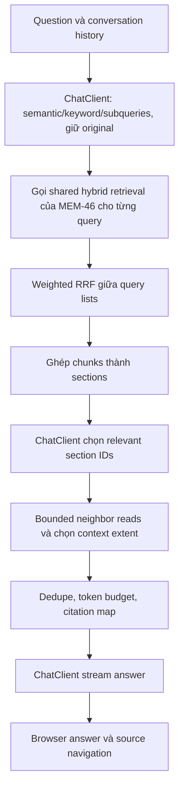
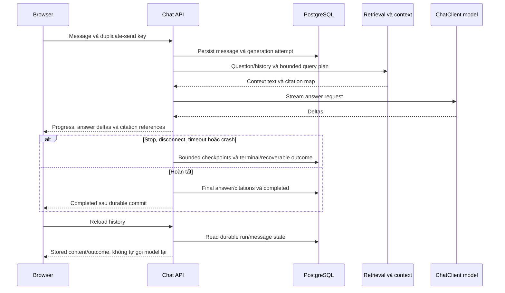

# MEM-11 — Chat production trên Search của MEM-46

Status: tách lại ngày 2026-09-07 theo yêu cầu mới, Todo, assignee `dathip04`, blocked by [MEM-46 Search](https://linear.app/memory-os/issue/MEM-46). Đây là kế hoạch, chưa triển khai Chat. [Plan](plan.md) giữ execution gates; [Search design](../mem-46-search/design.md) giữ indexing/embedding/hybrid foundation.

MEM-11 được mở lại từ Duplicate; tiếp nhận multi-query/weighted RRF và selection/expansion từ MEM-71/72. Chat không chặn completion riêng của Search. Permission-specific design được tạm gác để bàn ở bước tích hợp riêng; dữ liệu hội thoại tiếp tục gắn Tenant/Actor theo nền tảng hiện có.

## Kết quả và luồng

Người dùng hỏi và hỏi tiếp trong hội thoại, nhận câu trả lời streaming với nguồn, có stop/retry/reload/history và trạng thái durable. Production Chat hoàn tất trong issue này; không giao một answer demo rồi để persistence/streaming/context thành phần chưa có owner.

Không tạo vector store/index/embedding ingestion thứ hai. Retrieval primitive và current chunk identity từ MEM-46; khi Chat có consumer thật mới thêm bounded context-read contract và orchestration cần thiết. `retrieval` không phụ thuộc `chat`; Chat không import native OpenSearch/connector persistence.

## Query và context

Typed query plan giữ original question, semantic rewrite, keyword variants và compound-question subqueries; permitted history được dùng để hiểu follow-up. Dedupe và cap fan-out/length/concurrency/latency/cost. Query-generation failure có bounded original-query fallback qua cùng backend.

Weighted RRF dùng rank positions giữa các query lists, tách khỏi lexical/vector fusion bên trong mỗi query. Chốt k/weights/duplicate-query semantics/ties từ evaluation, không sao chép Onyx defaults thành quality claim. Ghép adjacent/overlapping chunks trong cùng current artifact; giữ heading/table/provenance.

Structured selection và extent decisions chỉ dùng server-owned candidate IDs/ranges; kiểm schema, allowlist/range/dedup và budget. Native structured output phải được test trên approved gateway; malformed output/timeouts có bounded retry/outcome. Neighbor context phải là text thực, không HyDE-generated evidence. Xem [Onyx thực tế](../mem-46-search/onyx-search.md) và [recipe review](../../superseded/mem-46-authorized-rag/spring-ai-recipes-review.md).

## Conversation và streaming production

Persist conversation/message/generation/citation bindings trong PostgreSQL, có Tenant/Actor ownership, retention/delete và abandoned-run convergence. Same send key không tạo trùng lượt; explicit retry là linked attempt mới. Không hứa exactly-once external model billing qua mọi crash. Model context window không thay product transcript; không thêm JDBC ChatMemory database độc lập hoặc hardcode ID `DEMO` như recipe.

Streaming thật qua API/proxy/browser: buffering/heartbeat/backpressure/idle timeout, cancellation/disconnect và checkpoint cadence. Phân biệt completed/partial/canceled/interrupted/failed; không replay một answer dở khi reload hoặc báo completed trước final commit. Citation IDs bind với current Document/artifact/chunk/provenance; artifact thay đổi có stale/unavailable outcome, không bịa lịch sử nguồn.

Source text là evidence, không điều khiển tools hay policy. Model/retrieved/completion content không vào generic telemetry; integrate MEM-25 cho audit safe IDs/outcomes. Detailed source/history/revoke permission design để rà ở integration sau theo yêu cầu, không mở rộng framework quyền trong lần này.

## Thư mục/thư viện và completion

`core/chat/application` giữ conversation/query/context/answer orchestration, `core/chat/persistence` là concrete JDBC; `api/.../chat` giữ conversation/message/stream/cancel/citation routes; `web/src/features/chat` giữ UI. Migrations trong `core/src/main/resources/db/migration` cho chat state. Tạo package cùng consumer thật, không predeclare runtime trong Search issue.

Spring AI `spring-ai-client-chat` theo BOM đã resolve ở Search, approved ChatModel từ MEM-66; role-specific clients cho query/selection/answer, shared transport/observations và advisor scope explicit. Không automatic RAG advisor mở retrieval khác, Embabel, MCP/OpenAPI registry hoặc autonomous actions để chạy luồng này.

MEM-46 Search là dependency triển khai; MEM-66/67 là model contracts liên quan; MEM-25 audit integration thuộc Chat. Native Google input coverage tái sử dụng Search/provider acceptance. Chat completion cần real model/index/API/browser, quality/groundedness/citation support, concurrent sends/retry/crash/stream/reload/load/cost/backup/rollback và exact-SHA production evidence; đây là gate riêng của MEM-11.
