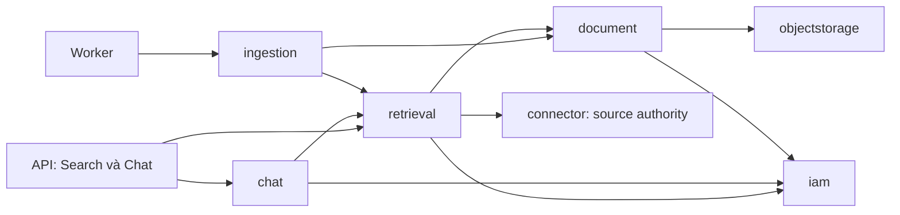

# MEM-46 — Cấu trúc thư mục, thư viện và kế hoạch triển khai

> Superseded combined planning draft — 2026-09-07: the user split delivery into [MEM-46 Search](../mem-46-search/design.md) and [MEM-11 production Chat](../mem-11-production-chat/design.md). Search has its own completion gate and is implemented first. The narrative below records earlier combined research; statements requiring both modes to close MEM-46 are no longer execution instructions. Read [Onyx Search details](../mem-46-search/onyx-search.md) for the verified UI/SearchTool/API distinction.

Direction accepted 2026-09-07; planning artifacts only. [Design](design.md) owns architecture/storage decisions, [plan](plan.md) owns execution gates, [flow](flow.md) explains the data path, and [Search/Chat contract](search-and-production-chat.md) owns the two user-facing modes and production requirements. The [Spring AI recipes review](spring-ai-recipes-review.md) records concrete examples to reuse or adapt and their limits.

## 1. Những gì đã chốt

Theo yêu cầu mới, ưu tiên đọc [luồng chức năng Search/Chat](search-chat-core-flow.md): embedding, hybrid và cách mở rộng từ recipe lên multi-query. Phần permission chi tiết để bàn ở bước tích hợp sau.

- Một increment MEM-46: **Search production làm trước**, Chat production làm tiếp trên cùng retrieval; hoàn tất khi cả hai có evidence runtime.
- **OpenSearch:** searchable chunk text, actual vector arrays, metadata/ACL projection và source identity. Một vector store dùng chung cho hai chế độ.
- **PostgreSQL:** IAM/quyền, Source/Document, current chunk text/provenance, model/input/index identity, operation progress/completion và conversation/message/generation/citation data. Không có vector columns hoặc pgvector.
- **MinIO:** raw files và extraction JSON; repository snapshot OpenSearch có cấu hình, retention và restore drill. Snapshot chứa backup của vector index; không xây thêm embedding artifact ledger.
- Spring AI gọi model; application services giữ authorization, chunk/index lifecycle và retrieval/answer orchestration. Scope hiện tại không cần Embabel hoặc admin MCP/OpenAPI action registry.

## 2. Cấu trúc dự kiến khi viết code

Giữ bốn Gradle modules `core`, `connector`, `api`, `worker` và ứng dụng `web`. Các package có chữ “mới” chỉ được tạo cùng implementation/consumer thật, không scaffold thư mục rỗng trong lần lập kế hoạch này. Class names dưới đây là gợi ý phân trách nhiệm, chưa phải API đã tồn tại.

```text
core/src/main/java/io/memoryos/
  document/                         mở rộng capability đang có
    application/                    artifact reader, StructuredChunker, current chunk publication
    persistence/                    concrete JDBC chunk repositories, hashes/provenance
  ingestion/                        mở rộng worker orchestration đang có
    application/                    chunk/index coordination, lease/retry/cancel/cleanup
    persistence/                    durable work/claim mechanics theo ownership hiện có
  retrieval/                        capability mới, dùng chung Search và Chat
    [public contracts]              SearchRequest/SearchResult, authorized evidence/context reads,
                                    indexing/reconciliation operations cho ingestion
    application/                    authorized hybrid search, RRF, current evidence validation
    embedding/                      batch/query embedding, model/input validation
    opensearch/                     native mapping, bulk writer, hybrid query, aliases/rebuild
    persistence/                    concrete JDBC index-generation/progress metadata khi cần
  chat/                             capability mới
    [public contracts]              conversation/message/generation và citation use cases
    application/                    query planning, context selection/expansion, answer orchestration
    persistence/                    concrete JDBC conversations/messages/runs/citation bindings

core/src/main/resources/db/migration/
  [next migrations]                 chunks, indexing metadata/work và chat; không có vector arrays

api/src/main/java/io/memoryos/api/
  search/                           Search HTTP controller và typed request/result contract
  chat/                             conversation/message/stream/cancel/citation HTTP surface
  [configuration]                   query embedding, chat model và read client composition

worker/src/main/java/io/memoryos/worker/
  [existing execution packages]     đăng ký indexing/reconcile/cleanup consumers thực
  [configuration]                   batch embedding, OpenSearch writer, limits/readiness

web/src/features/
  search/                           search page, filters, result list, snippets và source opening
  chat/                             conversation list, messages, streaming composer và citations
web/src/components/app-shell/       mode selector và navigation dùng shell hiện có
web/src/routes/                     authenticated Search/Chat routes
web/src/lib/hey-api/                client sinh từ backend OpenAPI

infrastructure/deployment/          OpenSearch service, TLS/secrets/resources và snapshot setup
docs/runbooks/                      search-index recovery và chat operations khi có runtime
```

Không tạo Gradle module `vectorstore`, `agent`, `ai-platform` hoặc generic integration registry. `core` có thể dùng trực tiếp Spring AI/native client bên trong capability; public results không trả raw SDK objects hoặc SQL entities. SQL/locks/claims ở concrete `persistence` repositories, orchestration/authorization ở application services. Không thêm interface repository chỉ để bọc một implementation.



Sơ đồ chỉ vẽ các cạnh liên quan mới, không thay bản đồ đầy đủ của capability đang có. `document` không import retrieval/connector/ingestion; `retrieval` không import ingestion/chat. Ingestion phối hợp publish chunk + durable index intent qua public capability operations trong transaction. Query planning và LLM section selection/extent ở `chat`; retrieval thực hiện ranking, authorized search và neighbor reads. Các public contracts tồn tại vì có consumer thật giữa capability, không vì muốn tạo tầng framework-neutral.

## 3. Thư viện

| Phần | Thư viện/coordinate | Cách dùng |
| --- | --- | --- |
| Baseline hiện có | Java 25, Spring Boot 4.1.1, Spring Modulith 2.1.0 | Giữ cấu trúc và dependency boundaries của repo |
| AI version alignment — mới | `org.springframework.ai:spring-ai-bom:2.0.1` | Một BOM cho các module thực sự dùng; kiểm convergence với Boot/OTLP |
| Model interfaces — mới | `org.springframework.ai:spring-ai-model` | `EmbeddingModel` và request/response types bên trong `core` |
| Chat client — mới khi làm Chat | `org.springframework.ai:spring-ai-client-chat` | Typed query plan/section decisions và answer streaming |
| Approved gateway — mới | `org.springframework.ai:spring-ai-starter-model-openai` nếu MEM-66 xác nhận protocol | Provider/client composition trong API/worker; explicit endpoints/routes/credentials, chỉ bật model consumers cần thiết |
| Search client — mới | `org.opensearch.client:opensearch-java` | Native bulk precomputed vectors, BM25/k-NN/hybrid, mappings, aliases và recovery; không dùng VectorStore.add sau khi tự embed |
| HTTP transport | `org.apache.httpcomponents.client5:httpclient5`, `ApacheHttpClient5Transport` | TLS/auth/pooling/bounded timeouts; version align qua platform/compatibility test, không copy version cũ trong ví dụ docs |
| PostgreSQL | Spring JDBC/JdbcClient, PostgreSQL driver, Flyway đang có | Concrete persistence, claim/generation fencing, current chunks và chat data |
| Durable worker | Spring Data Redis và db-scheduler 16.12.0 đang có | Relay IDs, claim/retry/reconcile; không thay worker bằng agent loop |
| File/object storage | AWS SDK S3 đang có, MinIO runtime | Artifact read/lifecycle; snapshot repository do OpenSearch cấu hình, không viết lại snapshot bằng app SDK |
| Web | React 19.2.8, TanStack Router/Query, Radix, Tailwind và Hey API đang có | Hai chế độ, server-generated API client và trạng thái UI; stream dùng contract HTTP riêng được kiểm chứng |
| Verification | JUnit/Modulith/ArchUnit/Testcontainers, Vitest/Playwright đang có | Real PostgreSQL/Redis/MinIO/OpenSearch boundaries và browser tests |

Spring AI 2.0.x hỗ trợ Boot 4.0/4.1 theo tài liệu hiện hành. Tài liệu OpenSearch Java hiện minh họa client 3.9.0 và khuyên Apache HttpClient 5 transport; đây là candidate để resolve/test, không phải dependency đã thêm hoặc đã chứng minh chạy với cluster của MemoryOS. Pin server image và client version cùng nhau sau kiểm compatibility. Kiểm cả Jackson mapper/JSON-P dependencies với Boot 4; mapper SDK phải được cấu hình rõ, không thay global Boot mapper để vá xung đột. Không lấy đoạn Context7 còn ghi client 2.6.0 làm version target.

Sources: [Spring AI compatibility/BOM](https://docs.spring.io/spring-ai/reference/getting-started.html), [model module](https://github.com/spring-projects/spring-ai/blob/v2.0.1/spring-ai-model/pom.xml), [chat client module](https://github.com/spring-projects/spring-ai/blob/v2.0.1/spring-ai-client-chat/pom.xml), [OpenSearch Java client/transport](https://docs.opensearch.org/latest/clients/java/).

Model name/revision, dimension, tokenizer và query/document instructions theo kết quả MEM-66/MEM-67; không mặc định Qwen chat model cũng là embedding model. Tokenizer dependency chỉ được chọn khi biết model cần gì. Không thêm generic TokenTextSplitter thay structured chunker hoặc chọn library embedding khác chỉ để có thêm abstraction.

## 4. Contract và dữ liệu cần có

| Capability | Contract hoặc persisted state dự kiến |
| --- | --- |
| Document | Current chunk set/text, policy/tokenizer identity, ordinal/hash, typed values/provenance, artifact/generation và reader protection |
| Indexing/retrieval | Durable operation identity/claim, model/input identity, physical index/schema generation, per-batch progress và verified completion; actual vectors nằm trong index |
| Search | Actor/Tenant + query + allowed filters + bounded pagination -> document-grouped authorized results/snippets/source locators |
| Context retrieval | Allowed current evidence IDs/ranges -> bounded passages/neighbors, revalidated before model/consumer |
| Chat | Private conversation/message/generation state, duplicate-send key, checkpoints/terminal outcome và bound citations; message bodies không phải telemetry |

Tên bảng/migration number chốt lúc triển khai theo current schema, không preallocate version khi nhánh khác còn có migrations. Dữ liệu source JSON vẫn là input có thể rechunk; PostgreSQL current chunk text là derived output mới của MEM-46, không khôi phục DocumentVersion history hoặc full extracted-text column đã bỏ ở V12.

## 5. Thứ tự làm trong một increment

1. **Chốt runtime contract:** exact model/routes, OpenSearch server/client/transport, token/cost/time budgets, schema/fencing, snapshot RPO/RTO và Search API. Resolve dependencies và chạy integration smoke với dữ liệu synthetic được phép.
2. **JSON -> searchable index:** reader protection, structured chunking, current chunk publication + durable intent, worker embedding batch và native bulk; per-item verification/completion, cleanup/retry/reconcile và backup/restore/regeneration.
3. **Search production đầu tiên:** actual mode/UI/API, query embedding + BM25/vector, authorized results/snippets, filters/pagination và mở nguồn. Kiểm một tài liệu được phép và một tài liệu bị cấm, revoke sau index, stale artifact, model/index outage và restore. Đo quality/latency. Không bật Chat placeholder như tính năng đã chạy.
4. **Chat trên retrieval chung:** conversation persistence, multi-query/weighted RRF, section selection/neighbor expansion, streaming/stop/retry/reload/history và citations/audit. Kiểm partial answer, crash, concurrent sends và source revoke giữa các model calls.
5. **Production acceptance:** FILE và native Google khi dependency đã sẵn sàng; golden Vietnamese evaluation, real gateway/browser, permission races, load/cost, snapshots/restores, alerts/runbooks/rollback và deployment evidence đúng SHA. MEM-46 chỉ hoàn tất khi cả Search và Chat đạt contract.

Model/runtime phụ thuộc MEM-66/MEM-67, native Google/ACL phụ thuộc MEM-9/MEM-10/MEM-63, audit phụ thuộc MEM-25. Có thể làm FILE trước, nhưng không bỏ integration acceptance thuộc scope để đóng sớm. Mỗi bước được kiểm chứng trong cùng plan, không tạo issue “baseline trước, nâng cao sau” để chuyển phần đã nhận thành nợ.

Lần cập nhật này chỉ tạo/cập nhật tài liệu increment và Linear; kiểm Markdown links, Mermaid và diff. Khi có code/config/migration thật, áp dụng IDE static checks, Gradle wrapper `clean check`, frontend/OpenAPI/browser gates, CI/review và runtime evidence như plan.
