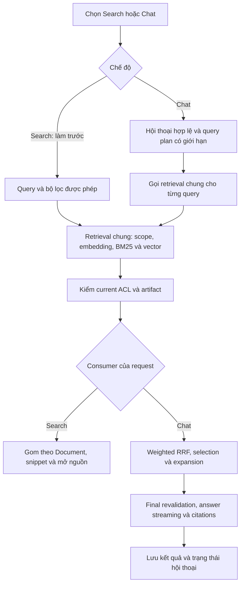
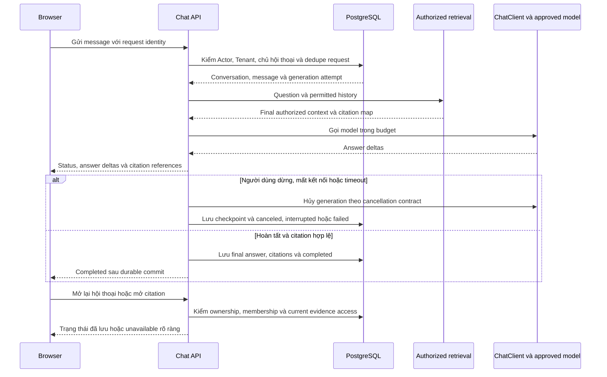
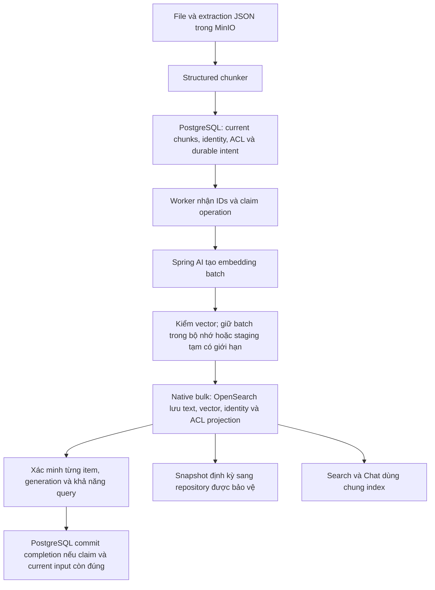
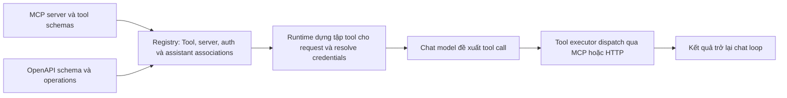

# MEM-46 — Search trước, Chat production và phương án vector store

> Superseded combined planning draft — 2026-09-07: the user split delivery into [MEM-46 Search](../mem-46-search/design.md) and [MEM-11 production Chat](../mem-11-production-chat/design.md). Search has its own completion gate and is implemented first. The narrative below records earlier combined research; statements requiring both modes to close MEM-46 are no longer execution instructions. Read [Onyx Search details](../mem-46-search/onyx-search.md) for the verified UI/SearchTool/API distinction.

Cập nhật yêu cầu ngày 2026-09-07. **Đã chốt:** có hai chế độ Search và Chat; triển khai Search trước; Chat production hoàn tất trong cùng MEM-46. **Storage đã được người dùng chọn:** OpenSearch giữ vector trực tiếp theo hướng Onyx; PostgreSQL giữ chunk text, quyền, metadata/trạng thái và hội thoại, không giữ mảng vector; MinIO giữ file/JSON và repository snapshot được cấu hình/kiểm chứng. Triển khai một đường lưu vector này.

Đây là kế hoạch, chưa có runtime Search/Chat mới. `web/src/features/identity/new-session-page.tsx` hiện vẫn là composer bị disabled. [Design](design.md), [plan](plan.md), [flow](flow.md) và [cấu trúc triển khai](implementation-map.md) cùng dùng phương án đã chốt; 11 sơ đồ trong flow đã được đổi sang OpenSearch giữ vector.

## 1. Hai chế độ dùng chung retrieval

Phần đang chốt trước là [luồng chức năng và hybrid/embedding](search-chat-core-flow.md); permission chi tiết trong tài liệu này giữ lại để rà sau theo yêu cầu mới.

| Chế độ | Người dùng làm gì | Hệ thống trả gì | Model được dùng |
| --- | --- | --- | --- |
| Search — Tìm tài liệu | Nhập từ khóa/câu tìm kiếm, lọc nguồn/loại/ngày nếu metadata thực có, mở kết quả | Danh sách tài liệu, đoạn khớp, tiêu đề, nguồn, thời gian có thật và vị trí trong tài liệu | Embedding query cho hybrid search; mặc định không gọi ChatModel tạo query hoặc viết câu trả lời |
| Chat — Hỏi đáp có nguồn | Đặt câu hỏi, hỏi tiếp trong hội thoại, mở citation | Câu trả lời streaming có nguồn, lịch sử hội thoại và trạng thái xử lý thực | ChatClient tạo query plan, chọn/mở rộng context và tạo answer; EmbeddingModel cho query |

Search nhanh là một hành vi sản phẩm có chủ đích. Multi-query/RRF và LLM selection/expansion vẫn được làm đầy đủ trong Chat; không bắt người chỉ muốn tìm file chờ toàn bộ các bước tạo câu trả lời. Cả hai dùng cùng current chunks, OpenSearch index, authorization và retrieval mechanics. Không tạo một search backend hoặc một bản ACL riêng cho mỗi chế độ.

Sơ đồ ghép thể hiện hai consumer; request Search chỉ đi đến kết quả tài liệu, không đi tiếp sang nhánh Chat. Các tên trong sơ đồ là trách nhiệm dự kiến, chưa phải tên class có sẵn.

Search đầu tiên phải có API/browser/worker thật: tải tài liệu -> extraction -> chunk -> embedding -> index -> tìm -> mở đúng nguồn. Trả document results có snippet từ passage đã authorize, loại trùng theo current Document và giữ evidence identity để mở đúng passage. Highlight được escape/sanitize; không render HTML nguồn tùy ý. Query/filter/pagination chỉ đi qua server scope; facets/counts không được lấy từ tập chưa kiểm quyền. Cursor/ranking phải có giới hạn và xử lý thay đổi quyền/index generation rõ ràng.

UI giữ hai chế độ như ảnh tham chiếu. Khi đang hoàn thiện Search, không bật Chat như thể đã hoạt động; bản hoàn tất MEM-46 phải có cả hai chế độ thật. Khi chuyển chế độ hoặc chuyển từ một kết quả sang Chat, truyền query/selected evidence IDs rồi authorize lại ở server, không dùng snippet trong browser làm bằng chứng quyền.

## 2. Chat production là phần bắt buộc của delivery

Production chat không phụ thuộc việc chọn Embabel. Với phạm vi hỏi đáp đã xác định, Spring AI và application services điều phối luồng; agent framework chỉ cần được chọn khi có use case điều phối công cụ hoặc phân tích nhiều bước cụ thể.

- Conversation, message, generation attempt và citation bindings lưu trong PostgreSQL, gắn Tenant/Actor; user khác không đọc được qua ID đoán được. Conversation retention/delete và dữ liệu nguồn bị revoke có contract chung cho UI, lịch sử và model input.
- Một request bị gửi lại dùng cùng identity không tạo hai lượt trả lời hoặc hai lần tính phí ngoài ý muốn. Retry do người dùng chủ động là attempt mới có liên kết; retry SDK/worker/structured output cùng chịu một ngân sách.
- Có streaming thật qua API/reverse proxy: kiểm buffering, heartbeat/idle timeout, backpressure, giới hạn kết nối và disconnect propagation. Lưu checkpoint có giới hạn; không cần transaction cho từng token. Refresh đọc state đã lưu, không tự chạy lại model. Crash phải chuyển run bỏ dở thành trạng thái rõ, không giữ `running` vô hạn hoặc phát hai terminal outcomes.
- Có loading, tìm nguồn, tạo câu trả lời, dừng, interrupted/partial, thiếu bằng chứng, search/model unavailable và citation unavailable. Một request lỗi không được hiển thị như đã hoàn tất. Nếu phát incremental citations, chỉ IDs đã bind ở server được dùng.
- Trước mỗi lần đưa history/evidence vào model và khi mở lịch sử/citation, kiểm lại quyền hiện hành. Với assistant message phụ thuộc nguồn đã revoke hoặc artifact thay thế, xác định hide/redact hoặc loại khỏi history dùng tiếp; không tái gửi nguyên transcript cũ qua model. Nội dung đã gửi tới người dùng trước revoke không thể thu hồi.
- Prompt, source passages, completion và tool payload không vào logs/traces thông thường. Audit lưu actor/Tenant, outcome, model/index/evidence identity an toàn, latency/token usage và correlation theo contract MEM-25. Chat message storage là dữ liệu sản phẩm có quyền truy cập/retention, khác với bật prompt capture trong telemetry.
- Go-live cần evidence cùng implementation SHA: auth/ACL/revocation races, actual gateway, real browser streaming/reload/cancel, concurrency/latency/cost, backup/restore, upgrade/rollback, secrets/TLS/rate limits và vận hành/alerting. Không đóng MEM-46 chỉ vì demo trả lời được trên local hoặc staging.

## 3. Luồng đã chọn: vector lưu ở OpenSearch

**OpenSearch hỗ trợ vector store:** text field phục vụ lexical/BM25; `knn_vector` giữ embedding để tìm gần nghĩa; cùng record có filter metadata và provenance. Có thể ghi embeddings tạo ngoài OpenSearch nên Spring AI tiếp tục gọi model, native client ghi vector đã tính. Không cần pgvector hoặc model chạy bên trong OpenSearch. [Vector index](https://docs.opensearch.org/latest/vector-search/creating-vector-index/), [hybrid search](https://docs.opensearch.org/latest/vector-search/ai-search/hybrid-search/index/).

| Store | Trong phương án này giữ gì |
| --- | --- |
| MinIO | Raw file, canonical extraction JSON; có thể làm repository snapshot OpenSearch nếu cấu hình tương thích và kiểm restore thực tế |
| PostgreSQL | Identity/membership/ACL, Source/Document/current chunk text và provenance, embedding model/input identity, operations/checkpoints/completion; conversation/message/run/citation data. **Không giữ mảng vector** |
| OpenSearch | Searchable text, actual vectors, filter metadata/ACL projection và evidence identity; primary/replica copies phục vụ search |

Đây là học theo cách đặt **vector** của Onyx, không sao chép toàn bộ data model. MemoryOS vẫn giữ current chunk text trong PostgreSQL theo contract đang thiết kế; JSON/chunks giúp tạo lại index. `input_hash` và `model_id` là thông tin nhận dạng, không thay thế được actual vector khi muốn rebuild mà không gọi model.

Onyx checkout `06aa2b09cc4aa5135fa2627e5235814e996f1514`: `embed_and_stream` dùng `ChunkBatchStore` tạo thư mục tạm, ghi embedded batches; `write_chunks_to_vector_db_with_backoff` ghi backend và `post_index` cập nhật bookkeeping. Schema OpenSearch có text/content vector/title vector. Factory chọn Vespa/OpenSearch theo config/migration, không chứng minh mọi deployment chỉ dùng OpenSearch. [Pipeline](https://github.com/onyx-dot-app/onyx/blob/06aa2b09cc4aa5135fa2627e5235814e996f1514/backend/onyx/indexing/indexing_pipeline.py), [temporary batches](https://github.com/onyx-dot-app/onyx/blob/06aa2b09cc4aa5135fa2627e5235814e996f1514/backend/onyx/indexing/chunk_batch_store.py), [schema](https://github.com/onyx-dot-app/onyx/blob/06aa2b09cc4aa5135fa2627e5235814e996f1514/backend/onyx/document_index/opensearch/schema.py), [factory](https://github.com/onyx-dot-app/onyx/blob/06aa2b09cc4aa5135fa2627e5235814e996f1514/backend/onyx/document_index/factory.py).

Lợi ích là bỏ một durable vector copy và cơ chế lưu/cleanup bytes tương ứng trong PostgreSQL, giảm WAL/backup/I/O. Đổi lại, chi phí phục hồi và retry phụ thuộc vào những vector còn dùng được ở OpenSearch/snapshot hoặc model để tính lại. Không có transaction nguyên tử giữa PostgreSQL và OpenSearch:

1. Commit durable intent trước model/search IO; output chỉ searchable khi identity và authority còn hợp lệ. Stale/partial batch không làm cả document được đánh dấu ready.
2. Bulk thành công nhưng timeout hoặc crash trước PostgreSQL completion: reload operation, kiểm record IDs/input/model/generation thực trong index trước khi kết luận hoặc retry. Nếu không còn output tin cậy thì re-embed trong budget. Không hứa embedding exactly-once.
3. Request ghi muộn phải bị fencing/versioning tại index hoặc cô lập bằng generation identity; kiểm claim trước/sau write đơn lẻ không đủ chống stale network write ghi đè output mới. Reconcile và truy vấn đối chiếu current authority; revoke/delete không chờ cleanup mới có hiệu lực.
4. Không dùng `OpenSearchVectorStore.add()` sau khi đã tự embed vì đường add đó tự embed thêm. Native bulk vẫn cần dù vector không lưu PostgreSQL.

| Sự cố/thay đổi | Cách phục hồi trong phương án OpenSearch vector |
| --- | --- |
| Một node mất, còn replica hợp lệ | Khôi phục phân bố shard theo topology; replica phải nằm ở failure domain phù hợp |
| Mất index nhưng có snapshot tương thích | Restore vào index mới, reconcile với current PostgreSQL/ACL/delete và catch up thay đổi sau snapshot, rồi mới cutover |
| Đổi mapping/engine, model/input giữ nguyên và index nguồn còn đọc được | Có thể tái dùng vector; kiểm vector thật có thể đọc/copy được, mapping/dimension/version tương thích và không có pipeline tự embedding lại |
| Mất cả index lẫn snapshot dùng được | Đọc current chunks hoặc rechunk JSON nếu cần, gọi đúng model để tạo lại vector; phụ thuộc giữ được model/runtime và thời gian xử lý |
| Đổi embedding model, instructions hoặc input | Tạo embedding mới và index tương thích; cùng dimension không có nghĩa cùng embedding space |

OpenSearch Reindex đọc source documents để ghi index đích; phải bảo toàn dữ liệu cần cho vector reuse, kiểm `_source`/stored-vector behavior theo version và settings thật. Replica giúp availability, không thay backup trước xóa nhầm hoặc hỏng toàn cluster. Snapshot repository cần retention, quyền đọc/ghi và failure-domain độc lập với sự cố muốn chịu được; MinIO trên cùng máy có thể vẫn mất cùng OpenSearch. Chốt RPO/RTO, đo và diễn tập restore/re-embedding trước production. [Reindex](https://docs.opensearch.org/latest/api-reference/document-apis/reindex/), [snapshot/restore và S3-compatible repository](https://docs.opensearch.org/latest/tuning-your-cluster/availability-and-recovery/snapshots/snapshot-restore/).

**Quyết định đã chốt:** OpenSearch làm nơi giữ/search vector, backup bằng snapshot; PostgreSQL giữ authority, current chunk text và processing/chat state. Không tạo schema mảng vector trong PostgreSQL. Các tài liệu và Linear cùng dùng hướng này; còn phải đo và kiểm chứng các yêu cầu phục hồi trước production.

## 4. MCP Actions và OpenAPI Actions trong Onyx

Hai màn hình là phần quản trị tool/action integrations. `Tool` trong PostgreSQL giữ tên/schema, enabled, ownership/persona associations và thông tin liên kết auth/MCP server. Một OpenAPI schema có thể tạo nhiều callable operations; MCP server có nhiều tool definitions. Đăng ký là bước cấu hình, còn runtime dựng callable tool theo request và credentials rồi chat loop mới thực thi.

Đã đối chiếu `db/models.py::Tool`, `tools/tool_constructor.py`, `CustomTool` và `MCPTool`; chat `llm_loop.py` gọi `run_tool_calls`. [Tool model](https://github.com/onyx-dot-app/onyx/blob/06aa2b09cc4aa5135fa2627e5235814e996f1514/backend/onyx/db/models.py#L4013), [constructor](https://github.com/onyx-dot-app/onyx/blob/06aa2b09cc4aa5135fa2627e5235814e996f1514/backend/onyx/tools/tool_constructor.py#L386), [OpenAPI adapter](https://github.com/onyx-dot-app/onyx/blob/06aa2b09cc4aa5135fa2627e5235814e996f1514/backend/onyx/tools/tool_implementations/custom/custom_tool.py#L277), [MCP adapter](https://github.com/onyx-dot-app/onyx/blob/06aa2b09cc4aa5135fa2627e5235814e996f1514/backend/onyx/tools/tool_implementations/mcp/mcp_tool.py#L144).

Tool registry quản lý những gì có thể gọi; agent orchestration quyết định gọi bước nào; hệ thống đích và application policy quyết định thao tác nào được phép. Việc có registry không tự yêu cầu Embabel. Câu hỏi về hai màn hình này là research đối chiếu; chưa mở rộng MEM-46 thành triển khai admin registry, external tool execution hoặc source writes. Search và grounded Chat vẫn là delivery hiện tại.

## 5. Thứ tự triển khai và nghiệm thu

1. Áp dụng storage đã chốt, xác định model/version/capacity và contract Search/Chat; hoàn thiện chunking, model integration và index lifecycle dùng chung.
2. Làm **Search production trước**: actual API, mode/search UI, bộ lọc, kết quả/snippet và mở nguồn; kiểm Allow/Deny/Revoke, native FILE/Google dependency, outage, index recovery và relevance/latency. Đây là sản phẩm Search hoạt động thực, không phải placeholder để che retrieval chưa có.
3. Làm Chat trên cùng retrieval: multi-query/RRF, selection/expansion, conversation persistence, streaming/stop/retry/history, citations và audit; chạy browser/runtime/quality tests.
4. Nghiệm thu production của cả hai chế độ trong cùng MEM-46; ghi deployment/restore/load/permission evidence gắn đúng SHA. Search là ưu tiên thực hiện và kiểm chứng đầu tiên; không đánh dấu MEM-46 hoàn tất hoặc bỏ phần Chat còn lại.
