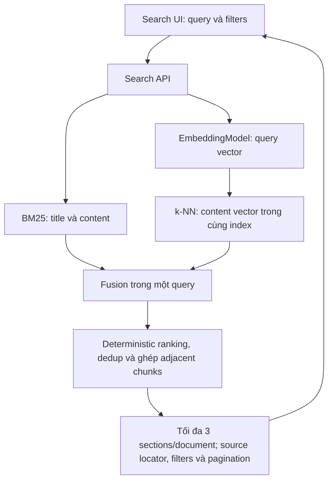

# MEM-46 — Search từ canonical JSON đến kết quả tìm kiếm

Status: pipeline Search đã deploy và [MEM-46](https://linear.app/memory-os/issue/MEM-46) đang In Progress sau khi PR #83 được mở; không merge `main` trước quyết định của người dùng. Từ ngày 2026-09-08, phần hoàn thiện UI/UX, nghiệm thu Search và OpenSearch Dashboards được giao cho `phamnhatanh811`; i18n thuộc MEM-74 và không nằm trong increment này. Công việc tiếp tục trên nhánh `phamnhatanh811/mem-46-trien-khai-search-tu-json-embedding-va-opensearch-den-giao`. [MEM-11](https://linear.app/memory-os/issue/MEM-11) là Chat riêng, Todo và phụ thuộc Search.

Quyết định này thay yêu cầu cũ hoàn tất Search và Chat trong một issue. Search được nghiệm thu/đóng theo contract riêng, không phải chờ answer streaming hoặc LLM context expansion. Phần permission chi tiết tạm để bàn sau; tiếp tục dùng IAM/session/source boundaries hiện có, không thêm cơ chế permission mới trong bước lập kế hoạch này.

## Phạm vi hoàn thiện UI/UX và Dashboards

Search có workspace riêng, không dùng bố cục hội thoại của Chat. Trạng thái chưa tìm kiếm theo reference Onyx: brand mark, câu dẫn `How can I help?` và một ô tìm kiếm chính được căn giữa trong vùng nội dung; filter/result chrome chưa xuất hiện để giữ một hành động chính. Search composer không có nút `+` hoặc attachment/Source action vì các chức năng đó thuộc Chat hoặc khu vực quản trị Source, không phải truy vấn Search. Composer giữ voice input dựa trên Web Speech API của trình duyệt và nút submit Search. Voice input thêm transcript vào controlled query để người dùng kiểm tra, không tự submit, không tải audio lên server; trạng thái listening, unsupported, permission-denied và lỗi đều có semantics/feedback rõ ràng. Sau submit, cùng trang chuyển sang bố cục làm việc có ô query ở đầu, Radix filter menus gọn cho khoảng thời gian/loại tệp, danh sách kết quả và file-type facets trên desktop. Ô Search dùng FLIP transition để dock từ vị trí giữa lên đầu theo vị trí layout thật; filter và results xuất hiện nhẹ, còn `prefers-reduced-motion` tắt chuyển động không thiết yếu. Mobile ưu tiên query và kết quả, ẩn facet phụ; mọi filter vẫn truy cập được từ toolbar. Việc đổi trạng thái không thay Search API hoặc đưa answer generation vào MEM-46.

Search result cards phải ưu tiên khả năng quét: hiển thị đoạn trích ngắn quanh từ khớp và nhấn mạnh literal match bằng React text nodes, không dựng HTML từ nội dung tài liệu và không biến kết quả thành câu trả lời sinh bởi LLM. Semantic-only hits vẫn được hiển thị nhưng không tạo highlight giả. Metadata chỉ dùng trường API hiện có; MIME được đổi thành nhãn loại tệp thân thiện, còn prefix `Title: <filename>` do chunker tạo chỉ được bỏ khi khớp chính xác, có thể xác định được.

Document reader dùng Radix Dialog hiện có. Trên desktop đây là modal lớn có vùng nội dung cuộn; trên màn hình nhỏ nó gần toàn màn hình. Dialog phải hiện ngay khi chọn kết quả, giữ nguyên scroll của danh sách, trap focus, đóng bằng Escape/overlay/nút đóng và trả focus về trigger hoặc ô tìm kiếm dự phòng. Preview tiếp tục hiển thị faithful plain text passages từ API. API hiện không cung cấp block kind, heading hierarchy hay table cells, nên renderer không được suy đoán cấu trúc bảng/list từ khoảng trắng; rich structured rendering cần thay đổi contract riêng nếu được duyệt.

Rà soát Search bao gồm apply/reset filters, loading/cancel/retry/empty, paging, chuyển section, đóng/mở reader, keyboard/focus và mobile overflow. `aria-live` chỉ thông báo trạng thái ngắn, không bọc toàn bộ danh sách kết quả. OpenSearch Dashboards được provision index pattern/saved view cho `memoryos-chunks*` qua đường operator được hỗ trợ; inspector chỉ đọc global tenant và dữ liệu Search, không được cấp quyền tạo saved object hoặc quyền ghi/xóa document.

[Plan](plan.md) giữ checklist Search; [Onyx cụ thể](onyx-search.md) phân biệt Search UI, SearchTool trong Chat và Search API. [Chat design](../mem-11-production-chat/design.md) giữ phần còn lại. Bộ [thiết kế gộp cũ](../../superseded/mem-46-authorized-rag/design.md) chỉ là research/history; completion gate cũ không còn áp dụng.

## Kết quả cần có

Rà soát ngày 2026-09-08: sửa diagnostics ngoài nhóm SQL thiếu datasource; dùng import rõ ràng và `JdbcClient` cho toàn bộ chunk persistence theo yêu cầu người dùng. Ghi chunks bằng INSERT nhiều dòng, tối đa 128 chunks mỗi statement, trong cùng transaction publication; không thêm JDBC adapter hay chuyển sang ghi từng chunk riêng lẻ. Shared Search YAML tiếp tục là cấu hình chung của API và worker; bổ sung metadata để IDE nhận diện các thuộc tính. Chuyển cả observability YAML và Logback XML từ root `config/observability` vào `core/src/main/resources`, bỏ custom resource source sets ở hai deployables.

Người dùng nhập query trên Search, nhận tài liệu/đoạn khớp, metadata và nguồn có thật, dùng filter/pagination rồi mở kết quả. Luồng thật chạy từ current extraction JSON qua worker, embedding model, OpenSearch, API và browser. Default Search dùng một query hybrid; không cần ChatModel để viết lại query/chọn context/viết answer.




## Storage và vòng đời

| Nơi | Trách nhiệm |
| --- | --- |
| PostgreSQL | Source/Document, current chunk text/provenance, model/input/index identity, durable intent/claim/progress/completion; không có vector arrays |
| OpenSearch | Searchable text, actual vectors, title/source/metadata/generation; một search backend dùng chung với Chat sau này |
| MinIO | File/JSON và OpenSearch snapshot repository được cấu hình/test; không thêm embedding-artifact ledger |

V17 và `DocumentChunkService` đã bổ sung persisted current chunks; không khôi phục DocumentVersion/history hoặc extracted full-text column đã bỏ. Chunker đọc canonical blocks qua bounded artifact reader, giữ heading, row/header, giá trị bảng và locator thực; token splitting dùng cửa sổ đọc giới hạn và giữ Unicode. Không flatten cả JSON hoặc startup-ingest bằng Tika. [Search spec](../../../specs/search.md) là contract implementation hiện hành.

Commit chunk publication + indexing intent trước external IO; Redis chỉ mang identifiers. Validate embedding response count/index association/dimension/finite values/model revision/query-document instructions. Bulk ghi vectors đã validate bằng native client; `OpenSearchVectorStore.add()` không dùng cho batch đã tự embed vì đường add sẽ gọi embedding lại.

Không có transaction nguyên tử qua PostgreSQL/OpenSearch. Index-side versioning hoặc generation-isolated records chặn late network writes; kiểm từng bulk item, completeness và searchable identity trước completion. Reconcile uncertain writes sau timeout/crash, dùng output còn hợp lệ hoặc re-embed batch thiếu. Không hứa exactly-once model calls. Replace/delete và cleanup phải hoạt động cùng worker hiện có; ACL-only metadata change không cần rechunk/re-embed.

Recovery cùng input/model: readable index -> usable snapshot + catch-up -> regenerate từ current chunks/artifacts nếu mất cả hai. Model/instruction/input đổi thì re-embed dù dimension không đổi. Verify current generation/completeness trước alias cutover; đo snapshots/replicas/retention, RPO/RTO và regeneration cost. Snapshot cùng host cần failure-domain/copy phù hợp với mục tiêu recovery.

## Hybrid và contract tái sử dụng

### Ghép adjacent chunks thành sections — scope được duyệt 2026-09-08

Search ghép các hits liền nhau của cùng Document/current generation theo `merge_individual_chunks` và `inference_section_from_chunks` trong reference Onyx `06aa2b09c`. Chỉ nối ordinal liên tiếp, giữ thứ tự nội dung trong tài liệu và nối bằng newline; không tự đọc chunk nằm giữa hoặc gọi thêm model. Section giữ điểm/vị trí của hit được xếp hạng cao nhất, khoảng ordinal và provenance riêng từng chunk. Không loại prefix/overlap bằng phỏng đoán.

Ghép toàn bộ candidate hits hợp lệ trước khi chọn tối đa ba sections cho mỗi document card. Giữ thứ hạng document theo hit tốt nhất và pagination theo documents. API Search trả `sections`; preview vẫn trả individual `passages` và mở quanh `matchingOrdinal` của section được chọn. Payload section được giới hạn bởi candidate budget hiện hữu; không cắt nội dung sau ba chunks. Không cần migration/reindex hoặc thay đổi embeddings.


Keyword/BM25 dùng text; semantic dùng query vector với chunk vectors; hybrid kết hợp hai tín hiệu. Embeddings của kho được tạo khi nạp/thay đổi input, mỗi lần tìm chỉ cần embedding query.

Đã chốt một đường runtime theo Onyx: native OpenSearch hybrid gồm BM25 title/content và content-vector k-NN; `normalization-processor` chuẩn hóa `min_max`, kết hợp `arithmetic_mean`, mặc định keyword/vector 0.5/0.5. Java gửi hybrid query qua native client, không tính lại fusion hoặc duy trì Lucene index riêng. Không triển khai RRF trong một query, không dựng hai thuật toán để thử/chọn sau. Trọng số và candidate budget là cấu hình server; query/filters/pagination là contract UI. Verification kiểm chất lượng của đường đã chọn, không phải một nhánh so sánh thuật toán.

### Relevance eligibility — scope bổ sung 2026-09-09

`candidate-limit` là budget thăm dò, không phải lời hứa rằng mọi nearest neighbor đều đủ liên quan để hiển thị. Corpus local cô lập đã tái hiện lỗi: exact phrase có một hit `1.0` nhưng top-K semantic vẫn kéo thêm các tài liệu `0.01158` và `0.0005`; query vô nghĩa vẫn có hit khoảng `0.5` sau min-max vì phép chuẩn hóa phụ thuộc chính candidate set. Vì vậy không dùng combined min-max score làm absolute relevance threshold và không lọc kết quả ở browser.

Semantic clause dùng Faiss radial k-NN với configurable raw `min_score`, mặc định `0.70`, đồng thời giữ `candidate-limit` làm `ef_search` và response/pagination budget. Với `cosinesimil`, OpenSearch score là `(1 + cosine similarity) / 2`, nên mặc định tương đương cosine similarity tối thiểu `0.40`. BM25 vẫn là clause độc lập: exact identifier/phrase có thể khớp dù semantic score thấp. Threshold được hiệu chỉnh bằng local MEM-46 acceptance corpus cho model hiện tại, phải được đánh giá lại khi model hoặc corpus đại diện thay đổi; integration fixture chỉ chứng minh cơ chế loại vector yếu, không thay thế relevance benchmark.

Đối chiếu sản phẩm: Onyx tách internal hybrid candidate pool khỏi final result count nhưng không áp một hybrid score floor cố định trong source tham chiếu; Typesense cung cấp vector `distance_threshold`, còn Meilisearch và Elastic cung cấp result score threshold. MemoryOS chọn native radial threshold vì nó tác động lên tín hiệu cosine ổn định trước min-max fusion, giữ semantic recall tốt hơn so với đặt combined threshold lớn hơn `0.5` vốn sẽ loại cả semantic-only top hit với weights 0.5/0.5.

Embedding được chọn theo ủy quyền ưu tiên chất lượng: OpenAI `text-embedding-3-large`, đầy đủ 3072 chiều, không rút gọn vector. Query và chunks dùng cùng model/dimension/input convention. Một vector float32 có 12 KiB dữ liệu thô trước index/replica/snapshot overhead. API key chỉ ở Infisical `SPRING_AI_OPENAI_API_KEY`, không có trong repo hoặc Linear. Model alias không phải immutable provider revision; local model/index identity ghi rõ model + dimensions + input/chunker convention và phải đổi physical index khi đổi không gian embedding. Nguồn: [OpenAI model](https://developers.openai.com/api/docs/models/text-embedding-3-large), [embedding dimensions](https://developers.openai.com/api/docs/guides/embeddings).

Spring AI recipes được dùng làm reference cho `EmbeddingModel`/`DocumentRetriever` và Java RRF ở Chat sau này. Recipe hybrid ghép Lucene riêng với VectorStore và dùng Java RRF k=60; không copy kiến trúc đó vào Search. Khi MEM-11 cần adapter Spring AI, adapter gọi public retrieval contract và giữ chunk identity/provenance.

`retrieval` cung cấp direct-query search result và supporting text/provenance đủ cho consumer thật là Search. Khi MEM-11 bắt đầu, Chat dùng lại primitive này cho nhiều query; weighted RRF giữa query lists và neighbor-selection orchestration được triển khai cùng consumer Chat, không predeclare API/packages rỗng.

Onyx UI hỗ trợ optional query expansion/LLM suggested documents, nhưng UI default không bật chúng. MemoryOS default Search cũng tập trung direct query; optional LLM Search features chưa được chọn cho scope này. Full multi-query/section selection/expansion là requirement của MEM-11.

## Thư mục và thư viện

```text
core/src/main/java/io/memoryos/
  document/application, persistence   artifact reader, structured chunks/current publication
  ingestion/application, persistence  durable worker/claim/retry/cleanup
  retrieval/application/              direct-query hybrid ranking và result mapping
  retrieval/embedding/                batch/query embedding, identity và validation
  retrieval/opensearch/               native bulk/query/mappings/aliases/recovery
core/src/main/resources/db/migration/ current chunks và index metadata, không có vectors
api/src/main/java/io/memoryos/api/search/ Search HTTP contract
worker/                              existing consumers + model/index composition
web/src/features/search/             page, filters, results và source opening
web/src/components/app-shell/        Search navigation/mode selector
infrastructure/deployment/           OpenSearch và snapshot configuration
```

Giữ bốn Gradle modules hiện tại, tạo capability/package cùng implementation thật. SQL/locks/claims ở concrete persistence repositories; application services giữ validation/orchestration. `document` không phụ thuộc retrieval/ingestion/connector; ingestion dùng public retrieval operations; retrieval không phụ thuộc chat.

Libraries đã resolve/compile: Java 25/Boot 4.1.1/Modulith 2.1.0, Spring AI BOM/OpenAI 2.0.1, native `opensearch-java` 3.9.0 và Apache HttpClient5. Integration dùng OpenSearch server 3.8.0 pinned digest, gồm vector 3072 chiều/Faiss và normalized hybrid thật. Reuse JdbcClient/PostgreSQL/Flyway, Redis/db-scheduler, S3/MinIO, React/TanStack/Hey API. Không thêm ChatClient/Embabel/chat-memory starter. Runtime defaults dùng model OpenAI đã chọn; Key mới được xác minh ngày 2026-09-08 đã trả embedding hợp lệ; corpus quality và full deployed Search vẫn cần nghiệm thu.

## Trạng thái triển khai và giới hạn cần nghiệm thu

Staging rollout được duyệt ngày 2026-09-08: tạo PR, yêu cầu CodeRabbit và deploy đúng SHA của PR; giữ PR mở khi chưa có chỉ đạo merge. Bổ sung native OpenSearch 3.8.0 single-node với TLS, service credential, persistent volume và Security plugin; không mở cổng host/public. Secret/certificate nằm ngoài Git, application password ở Infisical staging. Staging dùng zero replicas trên một node; không coi đây là HA hoặc snapshot acceptance. Bỏ Dockerfile COPY root config đã chuyển vào core. Kiểm tra lại embedding provider, giữ rõ trạng thái 401 nếu credential chưa được thay.

Người dùng bổ sung Dashboards + SSO: dùng OpenSearch Dashboards 3.8.0 và native OpenID Connect với realm MemoryOS hiện có. Client chỉ nhận scope role `memoryos-inspector`; map sang quyền đọc dữ liệu `memoryos-chunks*` và giao diện read-only, giữ identity server Dashboards riêng để quản lý saved objects. Không tự grant role cho người dùng. Proxy HTTPS cho origin staging riêng, node API không mở ra public.

Review PR #79: NPM xác minh certificate TLS của Dashboards qua CA nội bộ; custom inspector role chỉ đọc saved-object indices và global tenant, không kế thừa quyền ghi `kibana_user`. Gia hạn leaf certificates khi còn 30 ngày, giữ CA/DN/service credentials, có backup/rollback và restart kèm health check. Embedding credentials chỉ đi qua HTTPS; Search là application-owned bean, không cung cấp extension override bằng điều kiện registration order. API DTO giữ required response shape mà không đưa Swagger vào core. V17 đã áp dụng trên staging; migration rewrite/maintenance-window và giới hạn nghiệm thu bảng lớn được ghi ở runbook.

Đã kiểm JAR/source JAR `spring-ai-commons:2.0.1`: `DocumentTransformer` chỉ là batch function; `TextSplitter` thêm metadata cha/chunk; `TokenTextSplitter` tokenize toàn đầu vào, có ngưỡng bỏ text ngắn và đưa phần dư vào chunk cuối khi hết `maxNumChunks`. Giữ structured chunker hiện tại để bảo đảm 768 tokens kể cả prefix, bounded lookahead và table provenance; không thêm wrapper chỉ để implement interface.

- Đã có pipeline JSON/chunks → durable SEARCH workload → embedding/native index, Search API, giao diện Search, passage preview, tách extraction/search status và bounded repair/sweep.
- Trang xem kết quả đọc passages hiện tại trong PostgreSQL; chưa phải đường tải file gốc hoặc mở native Google document.
- Model/input space đổi chọn physical index khác và rebuild dần; chưa có cutover model không gián đoạn. Index cũ giữ để operator quyết định retention sau verification.
- Có Compose OpenSearch dùng cho development trên loopback; server dùng managed TLS endpoint. Chưa provision snapshot repository hoặc nghiệm thu production restore/RPO/RTO.
- Chi tiết run và pending gates ở [verification](verification.md). MEM-46 vẫn In Review; không đóng bằng test embeddings hoặc browser fixture.

Nguồn thư viện: [Spring AI compatibility](https://docs.spring.io/spring-ai/reference/getting-started.html), [OpenSearch Java client](https://docs.opensearch.org/latest/clients/java/). Recipe/class evidence và source paths ở [Onyx/recipe research](onyx-search.md).

## Scope chuyển và dependencies

- MEM-46 giữ structured chunks, embeddings, provisioning/projection/recovery và direct hybrid Search: former MEM-62/47/48/49/50.
- MEM-11 nhận Chat multi-query/RRF, selection/expansion, answer/citation, conversation persistence/streaming và Chat audit: former MEM-71/72 cùng MEM-11. MEM-71/72 được trỏ Duplicate sang MEM-11.
- MEM-61/current FILE extraction, MEM-24/40 và MEM-43/44 là foundations; MEM-66/67 cung cấp approved model/runtime. MEM-9/10/63 cung cấp Google/native input. FILE làm trước; native Google acceptance trong phạm vi provider đã nhận vẫn cần khi đóng Search toàn phạm vi.
- MEM-25 là audit integration của Chat, chuyển dependency sang MEM-11; không dùng Chat/audit như điều kiện chặn việc chọn thuật toán Search hiện tại. Detailed permission design để rà riêng sau theo yêu cầu.

Search hoàn tất khi pipeline, API/browser, quality và recovery của Search có evidence. Chat có issue và acceptance riêng; không dựng generic agent/tools registry, source writes, GraphRAG hoặc backend thứ hai.

Staging edge administration uses the existing SSH/Docker operator and NPM's documented custom HTTP include. `install-dashboards-proxy.py` manages only the Dashboards origin, obtains its certificate through Certbot and installs scoped renewal; it does not modify NPM accounts, mint authentication tokens or write its database. Existing NPM-managed hosts remain separate.

Authenticated sample ingestion exposed an OpenSearch Security boundary not exercised by the security-disabled integration fixture: global alias lookup checks unrelated indexes and returns 403 for the scoped service identity. Alias inspection now selects the read alias as its index target, preserving the check that it resolves to exactly one physical index. Bulk coordination grants only `indices:data/write/bulk` at cluster scope; document/index writes remain restricted to `memoryos-chunks*`. Human inspector mappings are unchanged. Verify through ordinary authenticated FILE upload, worker indexing and Search/reader requests against staging.
