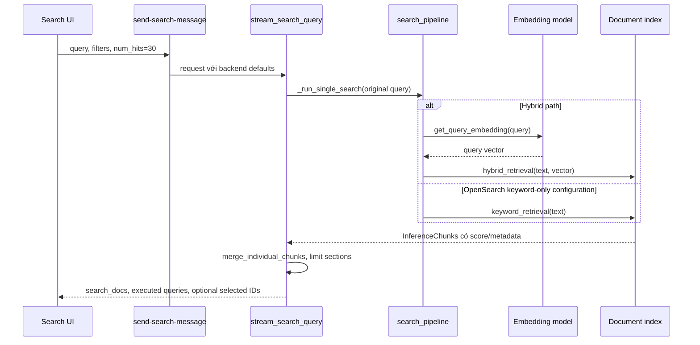
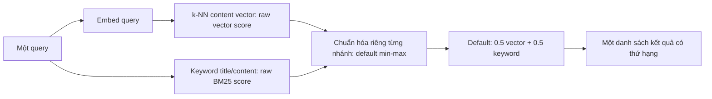
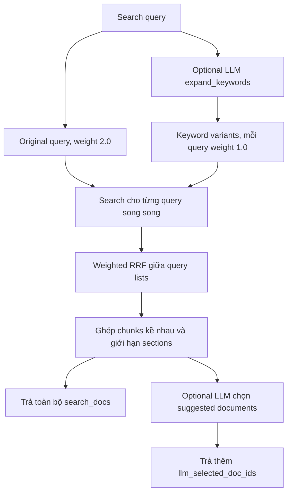
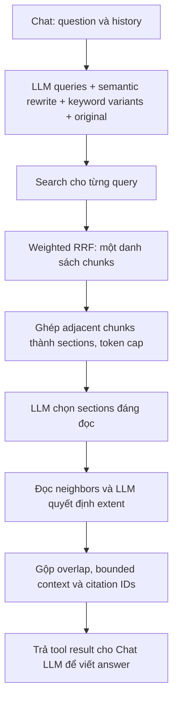

# Onyx Search — Cách triển khai đã đọc trong code

Đọc ngày 2026-09-07 tại Onyx commit `06aa2b09cc4aa5135fa2627e5235814e996f1514`; đây là default/code behavior của snapshot, không phải config đã xác minh trên một deployment cụ thể. Chỉ giải thích model/retrieval/ranking, tạm gác permission. [MEM-46 Search](design.md) và [MEM-11 Chat](../mem-11-production-chat/design.md) là hai scope riêng.

## 1. Search UI thực sự gọi gì?

`QueryControllerProvider.performSearch()` -> `searchDocuments()` -> `POST /api/search/send-search-message` -> `handle_send_search_message()` -> `stream_search_query()`.

UI helper gửi `search_query`, filters, `num_hits=30`, `include_content=false`, `stream=false`. Backend defaults `run_query_expansion=false`, `num_docs_fed_to_llm_selection=None`, `hybrid_alpha=None`. Vì vậy default Search UI không chạy LLM query expansion, không chạy LLM document selection và không tạo câu trả lời. Backend hỗ trợ stream search packets nhưng UI helper đang chọn JSON response.

`search_pipeline()` -> `search_chunks()` -> `_embed_and_hybrid_search()` -> `get_query_embedding()` và `document_index.hybrid_retrieval()`. Nếu `hybrid_alpha=0.0`, `search_chunks()` chọn `_keyword_search()` và không tính embedding. Search UI có env `ONYX_SEARCH_UI_USES_OPENSEARCH_KEYWORD_SEARCH=true` để chọn nhánh keyword khi request không override; mặc định env không bật.

Kết quả là title/semantic identifier, blurb, match highlights, source/link/time/metadata/score và optional content. Merge chunks kề nhau thành sections; không khẳng định luôn chỉ còn một item cho mỗi document. Người dùng mở tài liệu hoặc chuyển sang Chat. Auto mode có bước phân loại Search/Chat riêng; chọn Search trực tiếp không đi qua classifier.

Đối chiếu thêm ngày 2026-09-08: `merge_individual_chunks` nhóm hits theo `document_id`, sort `chunk_id` và ghép đúng các ID chênh nhau 1. `center_chunk` là thành viên xuất hiện sớm nhất trong ranked input; output sections giữ thứ hạng của thành viên đó. `inference_section_from_chunks` nối nguyên `content` bằng newline và giữ danh sách chunks. Không fetch ID bị thiếu, không tự bỏ overlap hay suy luận heading. MemoryOS áp dụng cùng semantics, lọc current generation trước, giữ metadata/provenance của từng chunk và thêm lớp document cards với tối đa ba sections. Preview vẫn đọc chunks riêng theo vị trí match.

Nguồn: [merge_individual_chunks](https://github.com/onyx-dot-app/onyx/blob/06aa2b09cc4aa5135fa2627e5235814e996f1514/backend/onyx/context/search/pipeline.py#L146), [inference_section_from_chunks](https://github.com/onyx-dot-app/onyx/blob/06aa2b09cc4aa5135fa2627e5235814e996f1514/backend/onyx/context/search/utils.py#L57).

Nguồn: [frontend helper](https://github.com/onyx-dot-app/onyx/blob/06aa2b09cc4aa5135fa2627e5235814e996f1514/web/src/ee/lib/search/svc.ts), [Search backend](https://github.com/onyx-dot-app/onyx/blob/06aa2b09cc4aa5135fa2627e5235814e996f1514/backend/ee/onyx/server/query_and_chat/search_backend.py), [request defaults](https://github.com/onyx-dot-app/onyx/blob/06aa2b09cc4aa5135fa2627e5235814e996f1514/backend/ee/onyx/server/query_and_chat/models.py), [search runner](https://github.com/onyx-dot-app/onyx/blob/06aa2b09cc4aa5135fa2627e5235814e996f1514/backend/onyx/context/search/retrieval/search_runner.py).

## 2. Hybrid trong một query: họ gộp như thế nào?

Với OpenSearch, `OpenSearchDocumentIndex.hybrid_retrieval()` gọi `DocumentQuery.get_hybrid_search_query()` và chạy qua normalization search pipeline. Default subquery config gồm content-vector k-NN và keyword trên title/content, trọng số lần lượt 0.5/0.5. Default normalization là min-max, sau đó weighted arithmetic mean. Có cấu hình khác thêm title vector với weights title-vector 0.1, content-vector 0.45, keyword 0.45; z-score là normalization alternative.

Ví dụ minh họa, không phải benchmark: sau normalization, chunk A có BM25=1.0/vector=0.2, chunk B có BM25=0.7/vector=0.9. Điểm cuối A=0.6, B=0.8 nên B lên trên. Không cộng raw BM25=12 với cosine/vector=0.82 vì chúng khác thang đo. Candidate cutoffs cũng ảnh hưởng kết quả; đây không phải so score đầy đủ của mọi document.

Recipe `HybridDocumentRetriever` làm khác: lấy top 10 vector và top 10 Lucene, bỏ độ lớn raw score, cộng `1/(60+rank)` theo Document ID, lấy top 10. Chunk đứng hạng 2 ở cả hai nhánh có thể vượt chunk chỉ đứng hạng 1 ở một nhánh. RRF đơn giản khi score không cùng thang; nó bỏ thông tin khoảng cách điểm giữa các vị trí. Normalized score giữ một phần thông tin đó nhưng chịu ảnh hưởng phân bố score/candidates. Không có kết luận cách nào luôn tốt hơn.

Nguồn: [Onyx query/pipeline](https://github.com/onyx-dot-app/onyx/blob/06aa2b09cc4aa5135fa2627e5235814e996f1514/backend/onyx/document_index/opensearch/search.py), [default config](https://github.com/onyx-dot-app/onyx/blob/06aa2b09cc4aa5135fa2627e5235814e996f1514/backend/onyx/document_index/opensearch/constants.py), [recipe RRF](https://github.com/habuma/spring-ai-recipes/blob/f89baf57e83e2007fb0ccb96852252c1fa1cff6a/hybrid-rag/hybrid-rag/src/main/java/com/example/essentialrag/HybridDocumentRetriever.java), [OpenSearch normalization docs](https://docs.opensearch.org/latest/search-plugins/search-pipelines/normalization-processor/). OpenSearch cũng hỗ trợ [RRF pipeline](https://docs.opensearch.org/latest/vector-search/ai-search/hybrid-search/rrf/); normalization là lựa chọn của Onyx path này, không phải giới hạn của OpenSearch.

## 3. Search UI khi bật các bước LLM tùy chọn

Trong `stream_search_query()`, `run_query_expansion=true` gọi `expand_keywords()`; chạy original và expansions song song qua `_run_single_search()`. Weighted RRF dùng original weight 2.0, mỗi expansion 1.0, k mặc định 50. Không có expansions thì chỉ chạy original và bỏ tầng RRF nhiều query. Expansion lỗi thì dùng original.

Nếu `num_docs_fed_to_llm_selection >= 1`, LLM đánh giá số sections được chỉ định, cố chọn tối đa 3 sections và trả suggested document IDs. Code vẫn trả search_docs từ danh sách sections, không thay toàn bộ list bằng selected IDs. Luồng UI này không gọi bước đọc/mở rộng neighbor context như SearchTool trong Chat và không sinh answer.

Nguồn: [stream_search_query](https://github.com/onyx-dot-app/onyx/blob/06aa2b09cc4aa5135fa2627e5235814e996f1514/backend/ee/onyx/search/process_search_query.py).

## 4. SearchTool trong Chat khác gì?

Chat LLM gọi SearchTool với query/subqueries. Tool dùng history để tạo semantic rewrite và keyword expansions khi được bật, giữ original nếu caller cung cấp, dedupe, chạy searches song song rồi weighted RRF. Weights khác Search UI: semantic 1.3, keyword 1.0, LLM-provided 0.7, original 0.5; k=50. Những giá trị này là defaults snapshot, không phải trọng số đã chọn cho MemoryOS.

RRF tính `sum(weight(query)/(50+rank(chunk,query)))` theo document_id + chunk_id, rank bắt đầu từ 1. Điểm hybrid của query A và B không đem cộng trực tiếp vì mỗi query có normalization/candidate distribution riêng. Hai tầng weights độc lập: 0.5/0.5 trong một query khác 1.3/1.0/0.7/0.5 giữa các query.

Selection trả lời “section nào đáng đọc cho câu hỏi này?”. Expansion trả lời “cần đọc thêm bao nhiêu văn cảnh?”. Ví dụ chunk chứa “chi phí tăng 20%” có thứ hạng cao, nhưng đoạn trước mới ghi kỳ so sánh và đoạn sau giải thích nguyên nhân; Chat cần những đoạn đó để trả lời đủ.

`expand_section_with_context()` thường đọc 2 chunks trên/dưới để LLM chọn extent; tùy kết quả giữ main section, thêm neighbors hoặc mở rộng tới 5 chunks mỗi phía. Tên `FULL_DOCUMENT` ở đây vẫn là bounded neighborhood, không bảo đảm toàn file. Best-document override có thể bỏ bước classify và lấy cửa sổ lớn; wrapper giữ section gốc nếu expansion lỗi/không trả section. Các model decisions có thể được bỏ qua theo override/config.

Nguồn: [SearchTool.run](https://github.com/onyx-dot-app/onyx/blob/06aa2b09cc4aa5135fa2627e5235814e996f1514/backend/onyx/tools/tool_implementations/search/search_tool.py), [weights](https://github.com/onyx-dot-app/onyx/blob/06aa2b09cc4aa5135fa2627e5235814e996f1514/backend/onyx/tools/tool_implementations/search/constants.py), [RRF/expansion helper](https://github.com/onyx-dot-app/onyx/blob/06aa2b09cc4aa5135fa2627e5235814e996f1514/backend/onyx/tools/tool_implementations/search/search_utils.py).

## 5. Search API là đường thứ ba

`POST /api/search` trong `server/features/search/api.py` tạo SearchTool, gọi `run()` và map kết quả thành ranked sections/citation IDs/content/link. Nó dùng các bước retrieval/context của Chat nhưng không gọi final answer generation. Vì vậy “trả danh sách kết quả” không đồng nghĩa “không dùng LLM”. API này khác `/api/search/send-search-message` của UI. [API source](https://github.com/onyx-dot-app/onyx/blob/06aa2b09cc4aa5135fa2627e5235814e996f1514/backend/onyx/server/features/search/api.py).

Áp dụng MemoryOS: MEM-46 làm Search trực tiếp dùng một query hybrid và complete index lifecycle trước; MEM-11 mở rộng từ cùng retrieval lên multi-query/context/answer. Optional LLM Search UI features của Onyx được ghi nhận là reference, chưa tự động thêm vào scope Search.
