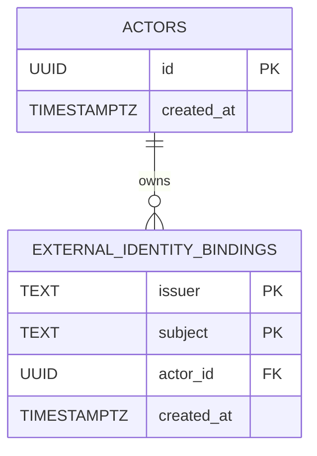

# MEM-7: Persist actors and external identity bindings

- State: In progress
- Linear: [MEM-7](https://linear.app/memory-os/issue/MEM-7/persist-actors-and-external-identity-bindings)
- Pull request: [#3](https://github.com/kl3inIT/MemoryOS/pull/3)

## Problem

MEM-6 proved JWT validation against a dedicated Keycloak realm, but identity resolution was static configuration. Restart-safe knowledge ownership requires a stable internal actor mapped from exact provider identity.

## Outcome

A valid JWT resolves exact `(iss, sub)` through PostgreSQL to an internal `ActorId`. Unknown identities fail closed. Schema and runtime configuration are deployable on the shared server and verified with a real PKCE login.

## Scope

- Flyway schema for `actors` and `external_identity_bindings`.
- Exact database-enforced identity and foreign-key invariants.
- Capability-owned JDBC resolver under `identity.persistence`.
- API datasource and Flyway composition.
- JWT authentication backed by the resolver.
- Shared-server PostgreSQL database/user and loopback-only access.
- Automated repository, authentication, architecture, and smoke verification.
- Real Authorization Code + PKCE verification through shared Keycloak.

## Explicit exclusions

- Account-linking or administrative binding API.
- Provisioning CLI, Spring profile, or one-shot application mode.
- Email/username matching or normalization.
- Silent rebinding.
- Knowledge persistence, OpenFGA, model integration, or worker processing.

## Design

### Data model

The composite identity key is exact and case-sensitive. `ON DELETE RESTRICT` prevents orphaning ownership. PostgreSQL is the concurrency authority.

### Read path

1. Spring Security validates JWT signature and claims.
2. The converter builds `ExternalIdentity(iss, sub)`.
3. `ExternalIdentityResolver` queries exact issuer and subject.
4. Found binding becomes the authenticated `ActorId`; missing binding fails with `401`.

### Write boundary

MEM-7 deliberately exposes no production write surface. A temporary provisioning implementation was removed after review because it had no authorized product use case. Approved bootstrap uses a reviewed transaction from the runbook. Runtime account linking is a separate vertical slice governed by [ADR 0002](../../../decisions/0002-no-speculative-operational-surfaces.md).

## Risks and controls

| Risk | Control |
| --- | --- |
| Cross-provider subject collision | Composite `(issuer, subject)` primary key |
| Rebinding race | Primary key is the final authority; no silent conflict handling |
| Orphaned binding | Foreign key to actor |
| Actor deletion with owned data | `ON DELETE RESTRICT` |
| Secret leakage | Managed password file; no values in repository, tracker, or logs |
| Incomplete account-linking security | No application write surface in this increment |
