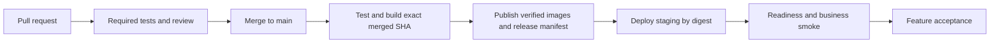

# MEM-70 — Testing and CI/CD

> Completed — reconciled 2026-09-08. Delivered through [PR #81](https://github.com/kl3inIT/MemoryOS/pull/81); closed by the task owner with health-only staging acceptance on 2026-09-08. Business smoke, live rollback rehearsal and automatic deployment activation were not required for this closure and were not performed. GitHub staging deployment credentials remain unconfigured and automatic deployment remains disabled; historical unchecked steps below are not completed evidence. Post-merge evidence: [MEM-70](https://linear.app/memory-os/issue/MEM-70).

## Scope and baseline

Implement the existing [MEM-70](https://linear.app/memory-os/issue/MEM-70) before i18n. The baseline is `d45afa28eba4a3bcde99d1195d2a6bb5ee677129`. Search UI and provider/IAM work remain with their existing owners. Preserve the unrelated dirty roadmap and Google Drive/chunking planning files.

The current workflow runs backend `clean check`, two infrastructure unittest suites, frontend contract/lint/type/unit/build/browser checks, and three image builds. Images are discarded after validation. There is no published release manifest or supported promotion path in the repository. Live staging was previously built again over SSH, so its image identity is not the image tested by CI.

Most Testcontainers classes permit skipping without Docker. Browser tests use HTTP fixtures and currently retry twice in CI. Vitest has an unbounded default worker selection: baseline 52/52 tests passed in 25.34 s on the current Windows host; the same suite with two workers passed in 19.69 s. The historical worker-fork failure has not reproduced, so this is bounded resource usage and a measured local improvement, not proof that a past flaky failure is fixed.

## Intended contracts

1. Mandatory integration checks must fail when required infrastructure is unavailable. Optional live-provider tests have explicit prerequisites, owners and documented evidence boundaries.
2. CI always reports a stable aggregate result. A failed, canceled or skipped required job cannot authorize publication. PR jobs have read-only repository access and no staging credentials.
3. Capture useful test reports on failure, with bounded retention and no runtime secrets in artifacts. Retries do not convert flaky failures into a green gate.
4. Build each application image once, attach the exact source revision, preserve its content identity and promote the same bytes after successful gates. Record release metadata separately from deployment evidence.
5. Staging deployment is explicit and serialized, validates the release before mutations, preserves deployment-owned secrets, backs up the database/configuration and enforces API migration/readiness before worker startup. A rollback uses a compatible recorded artifact; it does not reverse migrations implicitly.

## Proposed delivery flow

The implementation uses GitHub Actions for this sequence, one Bash/Compose script for server operations and the existing Playwright stack for authenticated smoke. It introduces no Python release/deployment framework. The PR commit and merged commit can differ; each receives its own CI evidence. Main image-build jobs preserve their outputs through publication, and the server pulls those images without rebuilding. The implemented workflow is not evidence of first live acceptance; external setup and the first manual deployment remain explicit gates.

### 1. Test boundaries and reliable gates

Inventory each existing suite by contract, real dependencies, isolation, expected duration and evidence boundary. Keep unit tests independently runnable; the repository-wide `clean check` gate requires Docker for its mandatory integration suites. Nineteen current Testcontainers annotations opt out when Docker is missing. Remove that silent-success path from mandatory integration verification.

Keep explicitly optional live-provider checks separate, with an owner, enabling prerequisite and the acceptance gap stated. Browser fixtures protect browser behavior but do not establish real OIDC, object-storage or indexing integration. Retain full Spring contexts where the observable contract needs actual application composition; reduce scope only when equivalent assertions can be demonstrated.

Bound Vitest worker concurrency using the measured baseline, and retain test isolation. Make browser flakiness visible as a failed required gate rather than accepting a later retry as sufficient proof. Capture backend and frontend reports and bounded failure diagnostics. Use deterministic fixtures, polling deadlines and cleanup; do not introduce arbitrary coverage thresholds or another test framework.

### 2. CI execution and diagnostics

Keep backend `clean check`, infrastructure regression checks, frontend contract/lint/type/unit/build/browser checks and production image verification. Add a stable aggregate quality gate that fails if any required dependency fails, is canceled or is unexpectedly skipped. Initially run the complete gate for changes; path-based optimization needs separate evidence that required checks cannot disappear.

Pin action revisions and compatible toolchains, maintain dependency locks, and keep caches free of credentials. PR jobs receive read-only repository access. Cancel obsolete PR runs; deployment execution uses a separate concurrency policy that does not cancel an in-progress environment mutation. Record timing before and after changes, including added publication and smoke costs.

### 3. Immutable release

Build API, worker and web images once for a release candidate and publish their preserved outputs to GHCR only after all required checks succeed on that merged SHA. Record the source revision, CI run and attempt, image references/digests and deployment configuration revision in a release manifest. Verify labels and digests before starting deployment. Correct image source labels to the actual repository as part of this provenance contract.

The manifest is generated by the trusted publication job; a label or user-supplied manifest alone is insufficient release authorization. Mutable convenience tags are not deployment inputs. Retain the previous known-good release and its configuration for rollback. Any future production promotion should consume the accepted release digests, with a separate production authorization policy.

### 4. Staging deployment

Use the existing VPS and Compose deployment. The intended steady state is automatic staging deployment after a successful main release. The first rollout uses a manual trigger through the same deployment implementation so that the path can be exercised before automatic triggering is enabled. A manual rerun selects a verified release; it cannot bypass failed CI or select arbitrary unreviewed source.

Create a GitHub `staging` environment restricted to trusted main releases. Use a dedicated staging deployment identity and a verified SSH host key. Running the reviewed Compose script with sudo gives this identity root-equivalent deployment authority; do not describe it as a general sandbox. Keep application secrets in the existing Infisical/server delivery path. Environment-scoped deployment credentials must never enter PR jobs, image layers, release manifests or reports.

Use one deployment concurrency group and a server-side lock shared by automated deployment and operator reruns. Do not cancel a deployment while it is backing up, migrating or changing services. Reject stale candidates that would overwrite a newer successful release unless an operator explicitly selects the rollback path; do not assume concurrency implies FIFO ordering.

For each deployment:

1. Validate release provenance, image availability, configuration compatibility, current release and available disk space before changing running services.
2. Determine pending Flyway changes and their compatibility/maintenance requirements. Capture a verified database backup and restricted configuration/release record. Quiesce application writers when a consistent rollback point or migration compatibility requires it.
3. Stop the old worker before incompatible schema changes. Start the new API through its normal Flyway path, and require migration success and API readiness before starting the new worker and completing the web rollout.
4. Check API, worker and web readiness and their exact release identity. Then run the authenticated smoke contract below.
5. Record success only after all checks pass. On failure, preserve bounded diagnostics, mark deployment failed, and apply the documented compatibility decision before rollback or recovery.

The current single-instance Compose topology can have a maintenance interruption. Record measured interruption and migration duration; this plan does not promise uninterrupted deployment.

### 5. Staging smoke and rollback

Prepare a dedicated acceptance user in the existing fixed staging Tenant and deterministic synthetic documents using normal supported application paths. Verify its actor ID through the current identity API. The real Playwright flow establishes login, upload, ingestion reaching READY, Search returning the expected document, reader content and anonymous denial. Apply bounded deadlines and cleanup only smoke-owned records; preserve files used for ongoing human acceptance. Multi-user ACL behavior remains covered by its existing integration tests.

Health endpoints and image labels provide infrastructure/revision evidence, while the authenticated flow provides business evidence. A provider failure remains a reported deployment failure or acceptance gap; a fixture response cannot silently substitute for the live flow. Protect smoke credentials and redact browser traces before retaining them.

Exercise rollback to a recorded compatible release and rerun smoke. Image rollback is allowed only when the current database schema and retained configuration remain compatible. Applied Flyway migrations are not automatically reversed or edited. An incompatible schema requires an explicit recovery/restore procedure with its data-loss boundary documented; it must not trigger an unattended database restore.

## Implementation order and external configuration

Deliver test/CI reliability first, then immutable release publication, then staging deployment and rollback. Keep one substantive increment and update its verification evidence as each step completes.

The audit found no GitHub deployment environments, Actions secrets or Actions variables configured. Therefore the staging environment, dedicated deployment identity, host trust and authenticated smoke identity are implementation prerequisites. Prepare their exact configuration before enabling the workflow; do not copy an operator's general SSH identity into CI. Branch-protection changes and production permissions require separate authorization under MEM-70's scope.

The detailed checklist is in [plan.md](plan.md). Implemented policy and operations are recorded in [testing conventions](../../../conventions.md#testing), the [delivery matrix](../../../tests/delivery.md), and the [CI/CD runbook](../../../runbooks/ci-cd.md). Post-merge deployment evidence belongs in Linear.

## Sources and evidence boundary

- [GitHub Actions deployment controls](https://docs.github.com/en/actions/how-tos/deploy/configure-and-manage-deployments/control-deployments): environment restrictions, deployment history and concurrency controls. Their application to MemoryOS above is a project proposal.
- [Docker build best practices](https://docs.docker.com/build/building/best-practices/): build/test images in CI and pin image identity. The release manifest and staging sequence above are MemoryOS-specific design choices.
- [Testing Spring Boot Applications Demystified, Spring I/O 2026](https://2026.springio.net/sessions/testing-spring-boot-applications-demystified/): the issue's research input. Apply conclusions only with references to the speaker's slides or video; CI/CD recommendations must not be attributed to this presentation without source evidence.
