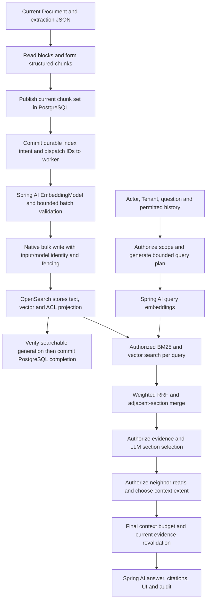

# MEM-46 — Authorized RAG with Spring AI

> Superseded combined planning draft — 2026-09-07: the user split delivery into [MEM-46 Search](../../active/mem-46-search/design.md) and [MEM-11 production Chat](../../active/mem-11-production-chat/design.md). Search has its own completion gate and is implemented first. The narrative below records earlier combined research; statements requiring both modes to close MEM-46 are no longer execution instructions. Read [Onyx Search details](../../active/mem-46-search/onyx-search.md) for the verified UI/SearchTool/API distinction.

Status: design direction accepted on 2026-09-07; implementation pending. One integrated delivery: Search first, then production Chat, from current extraction artifacts to authorized results and cited answers. OpenSearch is the sole durable vector store; PostgreSQL does not keep vector arrays.

Latest sequencing request: focus now on the [functional Search/Chat flow](search-chat-core-flow.md), embeddings and ranking; detailed permission design is deferred for a separate integration discussion. Existing permission notes below are retained for that later review, not additional work being expanded in this planning pass.

Tracking: [MEM-46](https://linear.app/memory-os/issue/MEM-46), assigned to `dathip04`, In Progress. Scope formerly tracked by MEM-62, MEM-47, MEM-48, MEM-49, MEM-50, MEM-71, MEM-72 and MEM-11 is consolidated here. Those tickets are Duplicate for tracking purposes; their functionality is not complete.

Read the [illustrated Vietnamese flow and Onyx comparison](flow.md) for the concrete artifact-to-answer walkthrough, lifecycle/recovery diagrams and storage tradeoffs. This design remains the implementation decision reference.

The [Search-first and production Chat contract](search-and-production-chat.md) records the two-mode requirements and the accepted OpenSearch vector placement. The [implementation map](implementation-map.md) gives the proposed folders, libraries, contracts and implementation order. PostgreSQL-vector and separate MinIO embedding artifacts are alternatives considered, not implementation paths.

## Outcome

An allowed user asks a question about ingested FILE or Google documents and receives a grounded answer with exact supporting passages and source navigation. The same delivery implements structured chunks, approved model calls, durable indexing, hybrid multi-query retrieval, weighted RRF, LLM context selection/expansion, current authorization, citations, UI and audit. Implement and verify stages in dependency order, but do not close or ship a separate partial baseline with the remaining stages left as follow-up debt.

The user-facing delivery has two modes. Search is implemented and verified first: direct-query hybrid retrieval, authorized document results/snippets, supported metadata filters and source navigation, without answer-generation or LLM query planning on its default path. Chat uses the same retrieval mechanics with multi-query/RRF and context selection/expansion, persisted private conversations and real streaming answers. Search and Chat are distinct product behaviors sharing one backend/authority; the full MEM-46 completion gate still includes both. Production chat acceptance includes durable run outcomes, duplicate-send handling, reload/cancel/failure behavior, authorized history, citations, load/recovery evidence and deployment of the verified implementation.

The input already exists: a stable current Document and a checksummed canonical extraction JSON artifact in MinIO. That JSON is extraction output, not an OpenSearch index. Current behavior is recorded in [Document](../../../specs/document.md) and [Ingestion](../../../specs/ingestion.md); this design describes intended changes only.

## Research evidence and version target

Research performed on 2026-09-07:

* MemoryOS uses Spring Boot **4.1.1** and has no Spring AI dependency yet (`gradle/libs.versions.toml`).
* The clean `D:\OrgMemory` reference checkout is commit `db999fab09a2f012f276909878840e1941fa2711`; its catalog pins Spring AI **2.0.0** and Spring Boot **4.1.0**.
* Current official Spring AI reference identifies **2.0.1** as stable and supports Boot **4.0.x/4.1.x**. Proposed MemoryOS dependency target is `spring-ai-bom:2.0.1`, with platform convergence and actual gateway smoke required during implementation. Research is not a dependency-resolution or runtime test.
* Onyx reference is `.tmp/onyx` at `06aa2b09cc4aa5135fa2627e5235814e996f1514`. Its current internal search performs query expansion, parallel retrieval, weighted RRF, section selection and bounded neighboring-context expansion.
* The [Spring AI recipes review](spring-ai-recipes-review.md) pins `habuma/spring-ai-recipes` at `f89baf57e83e2007fb0ccb96852252c1fa1cff6a`. Applicable examples inform query rewriting, rank fusion, typed validation, metadata and client composition; demo memory/advisors do not replace the authorized retrieval or production conversation lifecycle.

Primary references: [Spring AI compatibility and BOM](https://docs.spring.io/spring-ai/reference/getting-started.html), [EmbeddingModel](https://docs.spring.io/spring-ai/docs/2.0.0/api/org/springframework/ai/embedding/EmbeddingModel.html), [ChatClient](https://docs.spring.io/spring-ai/reference/api/chatclient.html), [modular RAG](https://docs.spring.io/spring-ai/reference/api/retrieval-augmented-generation.html), [observability](https://docs.spring.io/spring-ai/reference/observability/index.html), [OpenSearchVectorStore 2.0.1 source](https://github.com/spring-projects/spring-ai/blob/v2.0.1/vector-stores/spring-ai-opensearch-store/src/main/java/org/springframework/ai/vectorstore/opensearch/OpenSearchVectorStore.java).

## Where Spring AI fits

| Stage | Selected mechanism | MemoryOS responsibility |
| --- | --- | --- |
| Read extraction JSON | Existing artifact/object-storage capability, extended with a real bounded read/lifecycle contract | Checksum, current artifact, reader protection, typed blocks and provenance |
| Structured chunking | Application chunker informed by OrgMemory block algorithms | Heading/table semantics, actual model tokenizer, token caps, current chunk publication |
| Document and query embeddings | Spring AI `EmbeddingModel` with explicit request/response handling | Exact approved text, query/document instructions, batching, output validation, durable identity and persistence |
| Projection and hybrid search | Native OpenSearch Java client in one concrete index implementation | Precomputed vector writes, custom mapping, BM25/vector fusion, ACL filters, alias lifecycle and reconciliation |
| Query plan | Spring AI `ChatClient` structured output | Semantic/keyword/subquery types, count/length limits, immutable authorized scope and deduplication |
| Weighted RRF | Deterministic application code | Rank origin, weights, tie handling, identity-aware deduplication and evaluation |
| Section selection/expansion decisions | Spring AI `ChatClient` structured output | Allowlisted evidence IDs, bounded neighbor reads, repeated authorization and final context budget |
| Answer generation | Spring AI `ChatClient` over the approved `ChatModel` | Grounded prompt, citation binding, permitted history, insufficiency outcomes, UI and audit |
| Telemetry | Spring AI observations plus existing Boot/Micrometer/OTLP | Stage outcomes, safe identifiers, bounded labels and content capture disabled |

Spring AI supplies model integration and client utilities. PostgreSQL transactions, Redis execution, source authorization, chunk lifecycle and search-index ownership remain application capabilities. A Spring AI `Document` is an optional transient text/metadata DTO; it must not become the persisted MemoryOS Document or introduce a second artifact/history model.

## Complete runtime flow



### Artifact and chunking

Read the canonical `memoryos-extraction-v1` blocks, not a stringification of the whole JSON. JSON keys, transport metadata and irrelevant source attributes are not automatically embedding input. `ExtractionArtifactPort` currently exposes staging and cleanup only; introduce the bounded read/reader-protection contract with its actual chunking consumer, rather than assuming such a reader already exists or bypassing Document lifecycle through raw MinIO access.

Chunk according to block meaning: prose carries heading context; table chunks preserve row/column/header associations; oversized prose has a bounded recursive split. Define wide tables, merged headers, repeated headers and oversized cells. Preserve typed values and exact provider/page/range provenance separately from the text sent to embedding. Do not replace this with a generic `TokenTextSplitter` over flattened JSON; token utilities may be used only after checking compatibility with the selected model tokenizer and structured-boundary requirements.

Publish a current chunk set atomically against Tenant, Document, current artifact/hash, claim token and source eligibility. Store policy/tokenizer identity, generation, ordinals, content hashes, token counts and true provenance. Generation is a stale-work fence; it does not reintroduce DocumentVersion history, processing profiles or an append-only ledger of every chunk set. Content-stable ACL updates do not require rechunking.

### Embedding calls

Use `EmbeddingModel` directly from the owning concrete application service. Prefer a response-bearing batch call when response indices and model usage are needed. Send only the deliberately constructed chunk text; avoid implicit metadata injection by passing an arbitrary metadata-rich Spring AI Document to the embedder.

Validate response count, index association/order, finite values, dimension, pinned model revision and normalization. Document and query calls share a compatible embedding space while retaining model-required differences in instruction/prefix. PostgreSQL keeps exact input/model identity, durable intent and progress; actual vector arrays are written to OpenSearch only. Keep validated batches bounded in memory or private temporary staging; they are not a durable embedding ledger. Recheck current eligibility before sending content, before index writes and before committing completion. Idempotency and retries belong to the durable operation boundary; SDK retries, structured-output retries and worker retries must fit one explicit overall budget.

Commit indexing intent transactionally with publication of eligible current chunks; dispatch only identifiers through existing Redis execution. Model/index network calls run outside long PostgreSQL transactions. Deterministic record identities include Tenant, Document/artifact, chunk generation and embedding identity. Fence late network writes with index-side versioning or generation-isolated records, not just before/after claim checks. A bulk response must be checked per item and verified against the expected searchable generation before PostgreSQL commits completion/readiness. On timeout/crash after a possible write, reload current intent and reconcile matching index records; reuse verified output when possible, otherwise re-embed the missing batch. Duplicate delivery must not resurrect revoked or superseded evidence, but embedding calls are not promised exactly-once.

API query embeddings use the same selected model identity as the active index. A mismatch is an explicit unavailable/configuration outcome. Do not copy OrgMemory's automatic lexical fallback without selecting and testing that behavior for MemoryOS; the full hybrid flow is the accepted scope.

### What is written to OpenSearch

Each searchable chunk becomes one logical search document containing its text, embedding vector and filter/citation identity. A simplified illustrative payload is:

```json
{
  "tenant_id": "tenant-example",
  "document_id": "document-example",
  "artifact_hash": "sha256-of-current-artifact",
  "chunk_generation": 3,
  "chunk_id": "chunk-example",
  "ordinal": 7,
  "content": "KPI Doanh thu — Quý 2 — Đơn vị A — Mục tiêu: 100 — Thực hiện: 95",
  "content_vector": [0.12, -0.07, 0.31],
  "source_id": "source-example",
  "acl_revision": 4
}
```

The example uses abbreviated synthetic identifiers and a three-number illustrative vector, not the eventual schema or real model dimension. The actual mapping additionally carries the chosen embedding identity, ACL predicates, eligibility, provenance and index schema/generation.

OpenSearch builds lexical indexes from text for BM25 and vector-search structures from the embedding. Retrieval returns the selected chunk's text and provenance; the answer model reads text, not a decoded vector. Original file/canonical JSON remain available through the source/artifact lifecycle, not as binary content in the chunk search index.

Use a concrete native OpenSearch writer/query implementation. In Spring AI 2.0.1, `OpenSearchVectorStore.doAdd` calls `embeddingModel.embed(...)` before building the bulk request. Calling it after MemoryOS has already generated and validated a batch would embed again instead of writing that validated output. Its ordinary similarity-search path embeds the query and builds exact/approximate vector queries; it does not by itself implement this plan's BM25 plus vector plus multi-query RRF, current eligibility checks and alias/rebuild lifecycle. The class does expose native-client access and a precomputed-query-vector similarity overload; those facts do not solve the integrated write/lifecycle contract. Do not claim the library or OpenSearch cannot support customization: the chosen native client is simply the narrower fit for this application.

### Query planning, ranking and authorized context

Use `ChatClient` to produce a bounded structured query plan with semantic reformulations, keyword variants and compound-question subqueries. Keep the original query. A small validated result such as `QueryPlan` carries query kind and text, not authority. All filters originate from server-authorized scope; generated filters can only narrow it. Equivalent-query handling and per-kind weights are explicit and deterministic.

Spring AI offers `MultiQueryExpander`, `RewriteQueryTransformer` and RAG advisor hooks. The selected implementation uses explicit orchestration and typed `ChatClient` output so query families, weights, budgets and revalidation points are visible in one application flow. Do not add `QuestionAnswerAdvisor` or `VectorStoreDocumentRetriever` as a second automatic retrieval path. A custom `DocumentRetriever` could represent the same secured use case, but an advisor wrapper is unnecessary until it has a concrete consumer and a demonstrated benefit. Spring AI's default concatenating document joiner is not the weighted RRF algorithm required here.

Run BM25/vector hybrid retrieval for each variant with mandatory Tenant and authorized source/ACL predicates. Distinguish fusion within a query from weighted RRF across query lists. Merge overlapping or adjacent evidence only when Tenant, Document, artifact and chunk generation match.

Use structured `ChatClient` calls for section selection and context extent decisions. Validate returned IDs against the authorized candidate set; a model-created ID is never permission to fetch. Neighbor reads recheck current authority before the selection/expansion model sees their text. Preserve headers and source locators, discard stale generations, dedupe overlap and apply the final context budget before final evidence revalidation.

Native structured output is enabled only after the actual gateway/model demonstrates support. Otherwise parse/validate bounded output with a clearly limited retry/error path. JSON syntax/schema validation alone does not validate evidence IDs, authorization or relevance.

### Answer and citation contract

`ChatClient` receives an explicit system instruction, the user's permitted question/history and a bounded, numbered set of authorized passages. It returns answer text referencing only supplied citation IDs. Application code validates IDs and maps them to exact Document/artifact/chunk identities and source navigation. An existing allowed citation does not prove every associated claim is supported; evaluation must measure citation support and groundedness.

Use `stream()` for the production answer/browser contract; internal structured stages may use `call()`. Emit source metadata only from the authorized citation map and handle partial answers, cancellation and model failure deliberately. Persist conversation/message/generation identity and bounded checkpoints/final outcomes in PostgreSQL; refresh does not start another model call, and request deduplication prevents duplicate generations. Citation navigation always checks current authority; a replaced artifact yields stale/unavailable evidence rather than silently showing a new passage. Revoke during retrieval/context construction is tested at every next model boundary. Already emitted text cannot be recalled, so the concrete streaming revocation/cancellation contract must be specified rather than promising retroactive secrecy. The companion production Chat contract defines history ownership, interruption, retention and go-live evidence.

No generic tool discovery, automatic model-triggered source writes or new autonomous research loop is required. Previously generated conversation text is also derived evidence: define permitted-history handling under revocation and never treat cached transcript text as authority.

## Capability and dependency placement

Proposed placement during implementation, not packages to create empty in advance:

* `document` owns current artifact access/lifecycle and current chunk text/identity/provenance; concrete persistence repositories own SQL and bulk mechanics. It does not store vector bytes or import Connector/Ingestion/Retrieval internals.
* `ingestion` owns durable orchestration, leases, idempotency, staging/adoption and cleanup. Model/network work happens outside long database transactions; adoption checks the current generation in a short transaction.
* The planned `retrieval` capability owns its concrete OpenSearch index operations, embedding-space/index metadata, authorized query/context reads and ranking. Ingestion coordinates indexing through its public operations; the answer consumer crosses a narrow capability contract, not OpenSearch/ACL repositories. Dependencies flow toward Document/Connector/IAM, never back into Ingestion or Chat.
* The planned `chat` capability owns conversation/message/generation use cases, context/answer orchestration, citation/UI contract and audit integration. These packages are created with working consumers during implementation, not as empty placeholders in this planning change.
* `api` composes query/chat clients and web endpoints; `worker` composes embedding execution and projection. Both reuse approved endpoint/model configuration and existing observability. Use direct Spring AI types where useful; do not copy OrgMemory's framework-neutral port/module hierarchy into this simpler core.

Import one Spring AI BOM. Add only model/client modules actually consumed; the proposed endpoint integration uses the appropriate OpenAI-compatible Spring AI model implementation if MEM-66 confirms that protocol. Embedding and chat can target distinct model routes with different bounded timeouts through the same approved gateway. Spring AI is a client library, not a model server: it does not deploy Qwen/vLLM or replace MEM-66/MEM-67. Do not add vector-store starters, pgvector, MCP, chat-memory persistence or a multi-provider registry solely because Spring AI offers them.

Production conversation/message persistence is now an explicit product requirement. It belongs to the answer capability with application-owned access/retention/history semantics; it is not an automatic ChatMemory advisor that replays an entire transcript without current authorization. Embabel and external action registries are not dependencies of the two selected modes.

Create clients through the configured Boot builder/configurer so observation customizers apply; qualify embedding/chat clients explicitly to prevent an accidental default model. Keep credentials in Infisical-managed configuration and fail closed on missing/incompatible model routes. Model clients may be reusable, but request prompts and authority must remain request-scoped. Result caching is not required for this delivery; any query-embedding reuse must key exact Tenant/model/instruction/input identity and must never cache an authorization grant.

## What to learn from OrgMemory

All paths below are relative to its pinned reference checkout:

| Reference | Reuse as a design/test lesson | Adaptation for MemoryOS |
| --- | --- | --- |
| `components/graph-rag-core/.../chunking/ParagraphSemanticChunker.java` | Heading tracking, table-aware branching and recursive oversized-text handling | Port only selected algorithms/tests to current canonical JSON and true provenance; do not import GraphRAG or its profile/version model |
| `integrations/graph-rag-spring-ai/.../SpringAiTextEmbeddingPort.java` | Bounded batches, output-count and mixed-dimension checks | Add pinned expected dimension, finite-vector/index association, exact input identity and current generation fencing |
| `apps/api/.../knowledge/SpringAiQueryEmbeddingAdapter.java` | Query/index model compatibility and scope-aware embedding identity | Preserve MemoryOS failure contract rather than inheriting its lexical fallback or profile registry |
| `integrations/ai-model-gateways/.../SpringAiChatModelAdapter.java` | Configured `ChatClient`, explicit system/user messages, streaming and safe error boundary | Start with the approved routes actually needed, not its multi-provider, memory, Asset/MCP/tool framework |
| `integrations/graph-rag-opensearch/.../OpenSearchVectorIndex.java` and `OpenSearchLexicalIndex.java` | Native queries with explicit visibility filters and vector/BM25 responsibilities | Use MemoryOS single chunk index and current Document/ACL/generation contract |
| `core/.../knowledge/retrieval/SecureKnowledgeRetrievalStore.java` | Eligibility and source permission are applied in retrieval mechanics | Do not copy PostgreSQL/pgvector SQL, KnowledgeAsset history or OpenFGA ownership into MemoryOS |

## Accepted storage placement and recovery

Vector search runs in OpenSearch. Keeping a second durable embedding copy is a recovery/compute tradeoff, not a prerequisite for Spring AI, hybrid search, permissions or better answer quality.

| Placement of reusable embedding output | Gain | Cost |
| --- | --- | --- |
| OpenSearch only — selected | One durable vector store and simpler persistence; snapshots provide backup | Total index/snapshot loss needs regeneration; source/model availability and CPU time matter |
| PostgreSQL plus OpenSearch — not selected | Atomically adopt vector/output state with chunk/operation identity; rebuild unchanged vectors without the model | Larger tables, WAL, backups, replication and cleanup/retention load |
| MinIO embedding artifact plus PostgreSQL references — not selected | Durable vector reuse with bulk bytes outside the transactional DB | Stage/checksum/adopt/reader protection/orphan cleanup across stores; distinct from an OpenSearch snapshot repository |

For one float32 vector of 1,024 dimensions, 1 million chunks require approximately 4.1 GB decimal of raw vector bytes per copy, before storage encoding, indexes, replicas, backups or multiple model generations. An existing readable search index can support many rebuilds; not every reindex requires re-embedding. A changed embedding model/input does require new output even if the old vector is retained.

The user accepted OpenSearch-only vectors on 2026-09-07. PostgreSQL retains authority, current chunks, input/model/index identities and durable execution/chat state. MinIO retains raw files and canonical extraction JSON. Configure and test OpenSearch snapshots to an S3-compatible repository such as MinIO as part of production recovery; snapshots contain backed-up vectors but are not an application-owned per-chunk embedding artifact store. Measure corpus size, dimension, OpenSearch index/replica/snapshot bytes, RPO/RTO and CPU regeneration cost. A same-host MinIO deployment does not provide host-loss protection without an independent copy/failure domain.

Recovery order for unchanged embedding input/model: reuse vectors from a readable compatible index; otherwise restore a usable snapshot into a new physical index, reconcile current authority/deletes and replay changes after the snapshot; otherwise regenerate from retained current chunks/artifacts using the approved model/runtime. A changed model/instruction/input requires new embeddings even at the same dimension. Keep vector source/copy behavior explicit in mapping/settings and prove no unintended ingest-time re-embedding. Verify completeness, current eligibility, generation and catch-up before fenced alias cutover. Replica availability does not replace snapshots or a restore drill.

This accepted derived-index placement is the user-authorized boundary alongside the existing PostgreSQL business-persistence policy. Reconcile durable implementation facts and the projection/backup distinction in the substantive code change. Record an ADR only after implementation starts; no database migration, deployment or dependency change is claimed by this design update.

## Verification and completion

The [execution plan](plan.md) carries the complete delivery checklist. Close MEM-46 only after the actual API/worker/browser path, permission/revocation races, model payload boundary, synthetic Vietnamese quality evaluation, durability and rebuild have evidence. `clean check`, relevant frontend gates, CI/review and staging proof remain required for the substantive implementation; no runtime claim is made by this planning change.

Native Google end-to-end acceptance depends on MEM-9/MEM-10/MEM-63, audit on MEM-25, model/runtime findings on MEM-66/MEM-67. FILE implementation can proceed while those independent capabilities progress; full completion must not silently drop their selected integration acceptance.

Follow [observability conventions](../../../guidelines/observability.md): keep Spring AI prompt/completion/document/tool-content capture disabled. Verify emitted observations, token/latency metrics and privacy at the actual runtime boundary, including exception paths and SDK retries.
