# MEM-46 — Luồng cụ thể từ JSON đến câu trả lời và đối chiếu Onyx

> Superseded combined planning draft — 2026-09-07: the user split delivery into [MEM-46 Search](../../active/mem-46-search/design.md) and [MEM-11 production Chat](../../active/mem-11-production-chat/design.md). Search has its own completion gate and is implemented first. The narrative below records earlier combined research; statements requiring both modes to close MEM-46 are no longer execution instructions. Read [Onyx Search details](../../active/mem-46-search/onyx-search.md) for the verified UI/SearchTool/API distinction.

Đã chốt: [hai chế độ Search/Chat, Search làm trước, Chat production và OpenSearch giữ vector](search-and-production-chat.md). Các sơ đồ bên dưới đã áp dụng quyết định này. [Cấu trúc triển khai](implementation-map.md) ghi thư mục, thư viện và thứ tự làm trong cùng MEM-46.

Tài liệu này giải thích bằng sơ đồ cho [thiết kế](design.md) và [kế hoạch triển khai](plan.md). MemoryOS hiện đã có current Document và extraction JSON; các bước RAG bên dưới là phạm vi sẽ triển khai trong cùng MEM-46. Tên participant trong sơ đồ thể hiện trách nhiệm logic, không phải khẳng định đã có class, endpoint hoặc queue tương ứng.

Onyx được đọc trực tiếp tại `.tmp/onyx`, commit `06aa2b09cc4aa5135fa2627e5235814e996f1514`; remote HEAD được đối chiếu cùng SHA ngày 2026-09-07. Phần Onyx mô tả code ở snapshot này, không khẳng định mọi deployment đều bật toàn bộ tùy chọn.

## 1. Nhìn toàn bộ luồng: nạp trước, hỏi sau

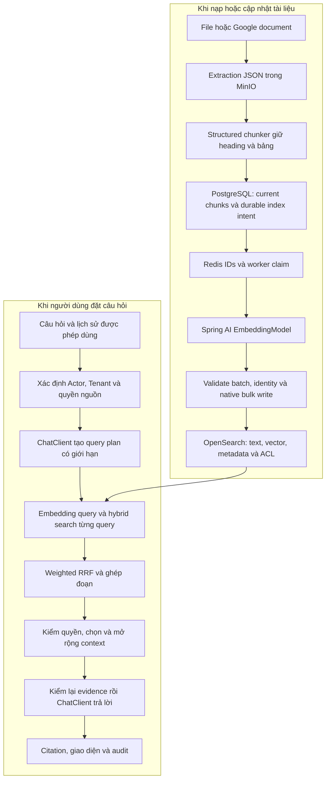

Điểm bắt đầu hiện tại là **B**. JSON là tài liệu đã trích xuất thành cấu trúc; bước kế tiếp là chunking. Khi người dùng hỏi, hệ thống dùng chunk/vector đã lập chỉ mục, không đọc và embedding lại toàn bộ kho tài liệu cho mỗi câu hỏi.

## 2. Ví dụ cụ thể: JSON biến thành những dữ liệu gì

Giả sử tài liệu có tiêu đề **KPI Quý 2 — Đơn vị A**, một bảng ghi mục tiêu doanh thu **100**, thực hiện **95**, và một đoạn giải thích nguyên nhân. Đây là dữ liệu minh họa, không phải số liệu Tasco thực tế. Nếu tài liệu không ghi đơn vị đo thì không tự thêm đơn vị tiền tệ.

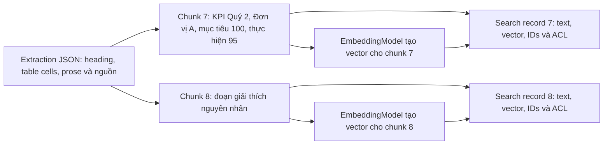

| Dữ liệu | Nội dung chính | Dùng để làm gì |
| --- | --- | --- |
| Extraction JSON | Block, heading, cells, prose, provenance | Đầu vào chuẩn của chunker; có thể rechunk |
| Current chunk | Text có ngữ cảnh, typed values, ordinal, hash, artifact/generation, nguồn | Đơn vị xử lý và evidence có thể trích dẫn |
| Embedding output | Vector, exact input hash, model revision, dimension, normalization | So độ gần nghĩa; có thể tái sử dụng khi dựng index |
| OpenSearch record | Bản text/vector cùng identity, metadata và ACL projection | Tìm kiếm và trả đúng passage/nguồn |
| Answer context | Một tập passage đã kiểm quyền, được đánh số citation | Dữ liệu LLM thực sự đọc để trả lời |

Chunker giữ tên bảng, kỳ, đơn vị tổ chức và header gắn với giá trị. Typed cells/provenance được bảo toàn riêng với chuỗi text embedding. Không serialize toàn bộ JSON gồm keys kỹ thuật và object-storage locator rồi gửi nguyên khối cho model.

## 3. Worker index: làm gì, ghi ở đâu, khi nào được coi là xong

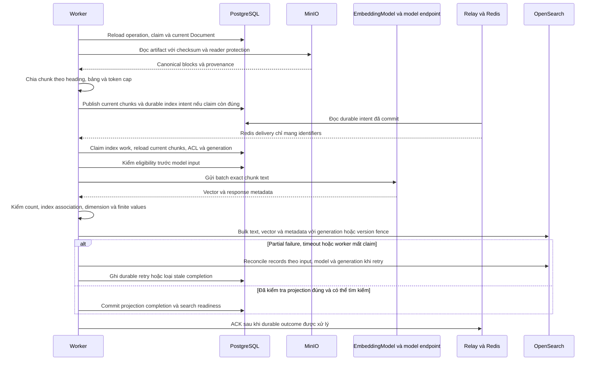

Đây là thứ tự logic; thiết kế retry boundary quyết định bước nào dùng cùng operation hay operation kế tiếp. Không mặc định mỗi ô là một job type hoặc một VM. Model/network calls nằm ngoài transaction dài; lúc commit completion phải kiểm lại claim và current artifact. PostgreSQL không lưu vector. Batch tạm có thể mất khi crash; chỉ tái dùng records đã kiểm đúng trong index, phần chưa có output tin cậy thì tính lại. Cần fence tại index hoặc cô lập generation để chặn network write cũ, không chỉ kiểm claim trước/sau write. Redis ACK xác nhận xử lý delivery; nó không thay PostgreSQL quyết định retry/thành công.

Khi ghi index, dùng vector batch đã validate. Không gọi `OpenSearchVectorStore.add()` sau khi đã tự embed vì đường `doAdd` của Spring AI 2.0.1 tự chạy embedding trước bulk write. Native client ghi đúng batch đã tính; việc bỏ vector khỏi PostgreSQL không thay đổi lý do này. [Mã Spring AI](https://github.com/spring-projects/spring-ai/blob/v2.0.1/vector-stores/spring-ai-opensearch-store/src/main/java/org/springframework/ai/vectorstore/opensearch/OpenSearchVectorStore.java)

## 4. Bên trong search index có cả text và vector

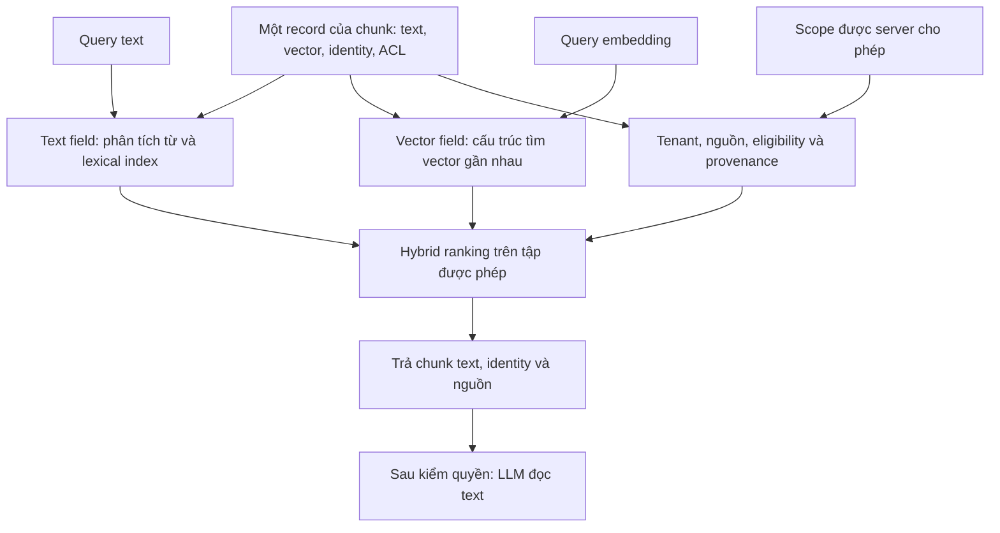

“Ghi nội dung/vector vào search index” là lưu một **bản ghi tìm kiếm có cả hai trường**, rồi xây cấu trúc tìm kiếm tương ứng. Text phục vụ từ khóa/BM25 và nội dung trả về; vector phục vụ tìm gần nghĩa. Hai cấu trúc có thể cùng thuộc một logical OpenSearch index. Không có bước giải mã embedding để lấy lại nguyên văn tài liệu.

Payload minh họa rút gọn; vector ba số chỉ để dễ đọc, không phải dimension đã chọn:

```json
{
  "tenant_id": "tenant-A",
  "document_id": "doc-KPI-Q2",
  "artifact_hash": "hash-artifact-current",
  "chunk_generation": 3,
  "chunk_id": "chunk-7",
  "content": "KPI Quý 2 — Đơn vị A — Doanh thu — Mục tiêu 100 — Thực hiện 95",
  "content_vector": [0.12, -0.07, 0.31],
  "acl_revision": 4,
  "source_id": "source-A"
}
```

Schema thật còn có embedding identity, ACL predicates, ordinal/hash, index generation và source locator. ACL revision đơn lẻ không phải bằng chứng cho phép người hỏi đọc tài liệu.

## 5. Người dùng hỏi: các lời gọi cụ thể

Câu hỏi minh họa: **“Đơn vị A hoàn thành KPI doanh thu quý 2 bao nhiêu phần trăm, và nguyên nhân là gì?”**

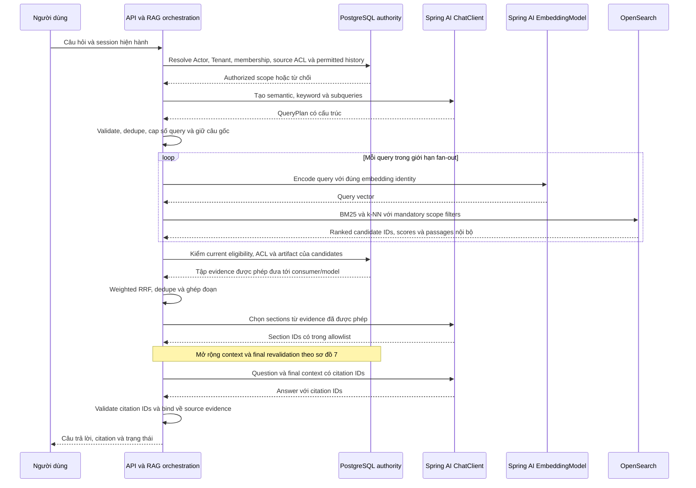

Candidate content/scores chỉ ở trong retrieval boundary cho đến khi kiểm authority xong. Một query do LLM sinh ra không được đổi Tenant hoặc mở rộng quyền nguồn. Tất cả model calls dùng endpoint/model được duyệt, với tổng token/cost/timeout/concurrency budget; sơ đồ không ấn định cố định số lời gọi.

## 6. Hai lần gộp khác nhau: hybrid và weighted RRF

Xem [luồng chức năng Search/Chat](search-chat-core-flow.md) để đọc riêng phần embedding/ranking, tạm gác permission theo yêu cầu mới. Trong Onyx OpenSearch path, fusion bên trong query dùng search pipeline chuẩn hóa và kết hợp score; recipe hybrid dùng RRF hai lists. Weighted RRF giữa các query là một tầng riêng.

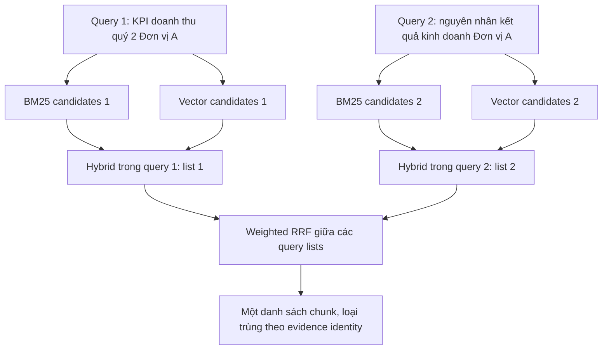

* Hybrid trong một query kết hợp tín hiệu từ khóa và ngữ nghĩa.
* Weighted RRF giữa các query dùng **thứ hạng** trong từng list, tránh cộng trực tiếp những score không cùng thang đo.
* Công thức: `score(chunk) = tổng weight(query) / (k + rank(chunk, query))`; chunk không có trong list thì không cộng điểm. Rank bắt đầu từ 1 trong code Onyx được đọc.

Onyx snapshot dùng `k=50`; weight semantic `1.3`, keyword `1.0`, LLM-provided `0.7`, original `0.5`. Đây là giá trị tham khảo, không phải lựa chọn đã chốt cho MemoryOS. MemoryOS phải đo trên tập câu hỏi tiếng Việt/KPI và định nghĩa xử lý duplicate queries, ties, candidate limits. [RRF code](https://github.com/onyx-dot-app/onyx/blob/06aa2b09cc4aa5135fa2627e5235814e996f1514/backend/onyx/tools/tool_implementations/search/search_utils.py), [constants](https://github.com/onyx-dot-app/onyx/blob/06aa2b09cc4aa5135fa2627e5235814e996f1514/backend/onyx/tools/tool_implementations/search/constants.py)

## 7. Chọn context, đọc thêm và tạo citation

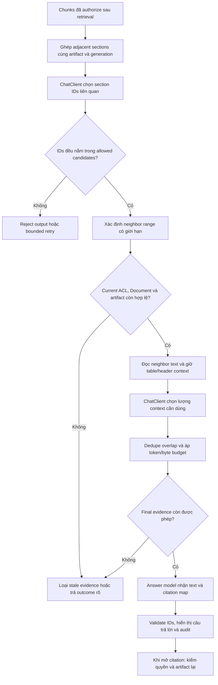

Với ví dụ KPI, retrieval có thể tìm được chunk 7 chứa số liệu và chunk 8 chứa nguyên nhân. Context cuối phải giữ được header để biết 100/95 là cột nào, cùng đoạn giải thích có nguồn. Có thể trả “đạt 95%” từ 95/100; chỉ nêu nguyên nhân nếu passage thực sự hỗ trợ. Citation ID có thật chưa đủ chứng minh mọi kết luận đều được nguồn hỗ trợ; cần kiểm thử groundedness/citation support.

Expansion là đọc thêm **nội dung nguồn đang tồn tại**, không nhờ LLM tự bổ sung một đoạn “ngữ cảnh” rồi coi đó là nguồn. Nếu query/selection model lỗi, chỉ fallback về passage vẫn được phép trong budget; thiếu nguồn thì báo thiếu bằng chứng.

## 8. Tài liệu đổi, quyền đổi hoặc bị xóa

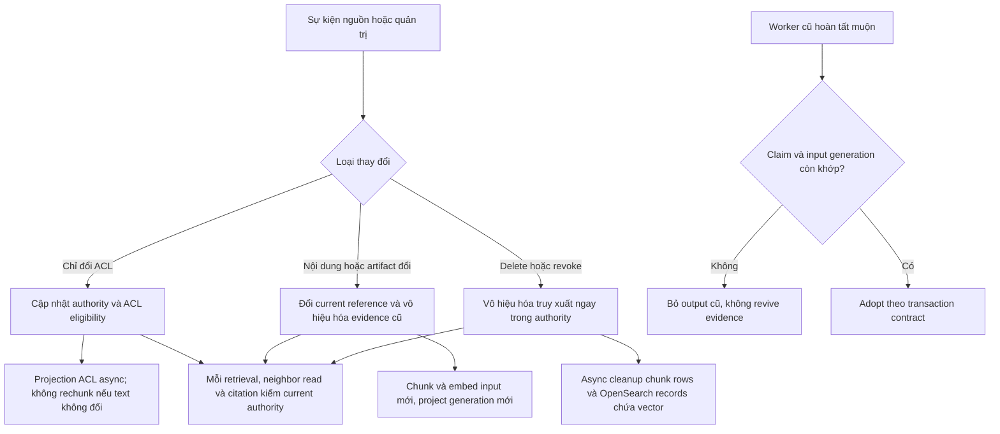

Search index có thể cập nhật chậm hơn authority. Vì vậy xóa khỏi OpenSearch không phải hàng rào quyền duy nhất. Citation gắn artifact cũ không được âm thầm đổi sang nội dung mới. Với streaming, nội dung đã phát ra không thể thu hồi; phải định nghĩa điểm revalidation/cancellation thực tế và xử lý history, thay vì hứa xóa được mọi byte đã gửi.

## 9. Mất index, đổi model và snapshot recovery

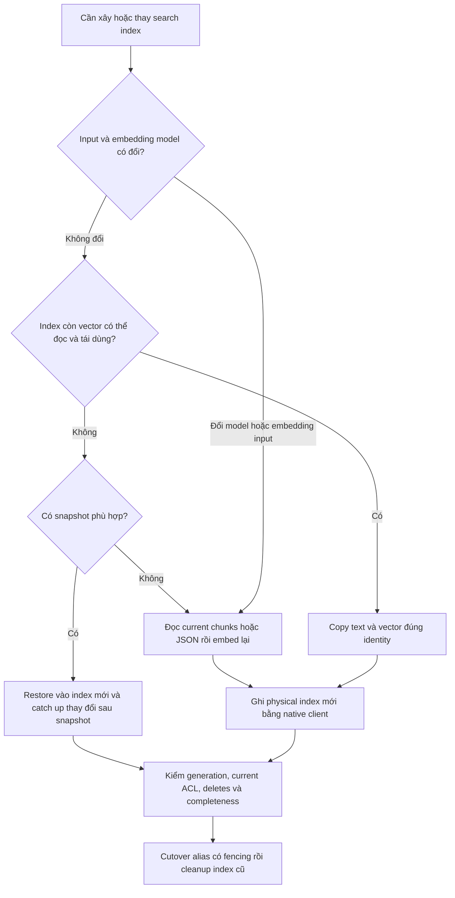

| Phương án | Lợi ích | Chi phí hoặc giới hạn |
| --- | --- | --- |
| OpenSearch giữ vector — đã chọn | Ít bản sao ứng dụng; snapshot giữ bản backup của index | Khi mất cả index/snapshot phải tính lại từ nguồn/artifact/chunks; phụ thuộc model/runtime và CPU |
| PostgreSQL giữ vector — đã cân nhắc, không chọn | Adopt vector cùng state/intent trong transaction; rebuild cùng embedding identity không cần model | Database/WAL/backup/replication lớn hơn; cần retention, cleanup và số đo |
| MinIO embedding artifact riêng — đã cân nhắc, không chọn | Vẫn tái dùng vector nhưng chuyển bulk bytes khỏi DB | Stage/checksum/adopt/reader protection/orphan cleanup; khác với backup index bằng snapshot |

**Đã chọn OpenSearch giữ vector, PostgreSQL giữ authority/chunks/state.** Một triệu vector float32 1.024 chiều có khoảng 4,1 GB raw bytes mỗi bản, chưa tính index/backup/replica. Đo số lượng và recovery budget để cấu hình snapshot, topology và retention. Bảo toàn dữ liệu cần để copy vector trong index theo version/settings thực. Restore cần reconcile với quyền, delete và artifact hiện tại trước khi phục vụ. Replica không thay snapshot; snapshot MinIO cùng máy không tự bảo vệ mất toàn máy. Nếu index cũ còn đọc được thì nhiều kiểu reindex vẫn tái dùng vector, không phải lần nào cũng embedding lại.

## 10. Onyx nạp và lưu dữ liệu như thế nào

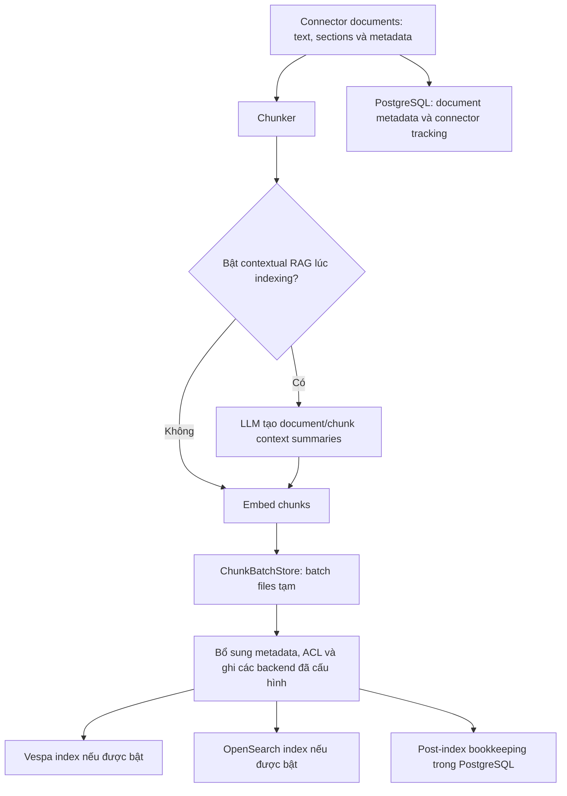

Trong code đã kiểm tra, `indexing_pipeline.py` chunk/enrich/embed rồi gọi `write_chunks_to_vector_db_with_backoff`; `ChunkBatchStore` dùng thư mục tạm và được cleanup. OpenSearch `DocumentChunk` giữ `content`, `content_vector`, optional title/vector, metadata, ACL và source links. MemoryOS học theo cách giữ vector ở search backend này; PostgreSQL vẫn giữ chunk text và lifecycle theo contract riêng của MemoryOS.

Factory có thể ghi các backend đang bật trong quá trình migration; retrieval chọn Vespa hoặc OpenSearch theo trạng thái. Không có nghĩa mọi cài đặt luôn ghi/tìm cả hai. Mã chuyển Vespa sang OpenSearch đọc chunks từ Vespa; PostgreSQL metadata đơn lẻ không được xem là bản sao toàn bộ vectors để rebuild.

Sources: [indexing pipeline](https://github.com/onyx-dot-app/onyx/blob/06aa2b09cc4aa5135fa2627e5235814e996f1514/backend/onyx/indexing/indexing_pipeline.py), [temporary batch store](https://github.com/onyx-dot-app/onyx/blob/06aa2b09cc4aa5135fa2627e5235814e996f1514/backend/onyx/indexing/chunk_batch_store.py), [chunk schema](https://github.com/onyx-dot-app/onyx/blob/06aa2b09cc4aa5135fa2627e5235814e996f1514/backend/onyx/document_index/opensearch/schema.py), [backend factory](https://github.com/onyx-dot-app/onyx/blob/06aa2b09cc4aa5135fa2627e5235814e996f1514/backend/onyx/document_index/factory.py), [migration](https://github.com/onyx-dot-app/onyx/blob/06aa2b09cc4aa5135fa2627e5235814e996f1514/backend/onyx/background/celery/tasks/opensearch_migration/tasks.py).

## 11. Onyx tìm kiếm và chọn context như thế nào

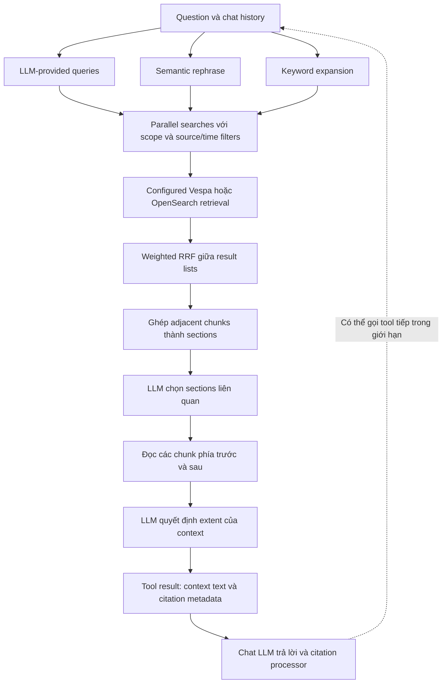

Đây là internal search/chat flow được đọc trong `SearchTool.run`, `search_utils` và `run_llm_loop`; Deep Research và federated/web search là các khả năng riêng. Một số override/config có thể bỏ bớt bước. Bước `FULL_DOCUMENT` trong helper expansion vẫn đọc số chunk xung quanh có giới hạn, không đồng nghĩa luôn đưa toàn bộ file vào prompt. Luồng này dùng LLM selection/expansion; không nên mô tả như mọi request bắt buộc đi qua một cross-encoder reranker.

Nguồn: [search tool](https://github.com/onyx-dot-app/onyx/blob/06aa2b09cc4aa5135fa2627e5235814e996f1514/backend/onyx/tools/tool_implementations/search/search_tool.py), [section expansion](https://github.com/onyx-dot-app/onyx/blob/06aa2b09cc4aa5135fa2627e5235814e996f1514/backend/onyx/tools/tool_implementations/search/search_utils.py), [chat/tool/citation loop](https://github.com/onyx-dot-app/onyx/blob/06aa2b09cc4aa5135fa2627e5235814e996f1514/backend/onyx/chat/llm_loop.py).

## 12. So sánh từng phần với MemoryOS và tradeoff

| Phần | Onyx tại snapshot đã đọc | MemoryOS sẽ làm | Lý do và tradeoff |
| --- | --- | --- | --- |
| Input/chunking | Connector sections -> chunker; contextual summaries có thể bật | Current artifact JSON -> structured chunks giữ bảng và provenance | Tận dụng extraction hiện có; tự chịu trách nhiệm header/tokenizer/lifecycle; contextual summaries lúc nạp chưa nằm trong scope |
| Model integration | LLM/embedding clients trong backend Python của Onyx | Spring AI EmbeddingModel và ChatClient trong Spring Boot | Dùng hệ sinh thái Java hiện có; không cần chuyển model hosting vào ứng dụng |
| Search backend | Vespa/OpenSearch tùy trạng thái migration/config | Một OpenSearch backend, native BM25 + vector | Ít backend/migration machinery; application phải quản lý mapping, filter và index lifecycle |
| Lưu embedding | Đường indexing ghi vector vào search backend, batch store tạm | OpenSearch giữ vector; PostgreSQL giữ current chunks/identity/state; snapshot backup | Giảm DB/WAL/backup vector; mất cả index/snapshot thì phải tạo lại embedding |
| Query generation | LLM-provided, semantic, keyword và original khi có | Typed query plan qua ChatClient, giữ original và giới hạn fan-out | Học query families; model nhỏ/CPU cần đo latency và cost |
| Fusion | Backend hybrid scoring rồi weighted RRF giữa query lists | Tách đúng hai mức và đo weights trên corpus tiếng Việt | Tránh cộng score khác thang; không mặc định weights Onyx là tối ưu |
| Selection/expansion | LLM chọn sections, đọc neighbor chunks và quyết định extent | Cùng chiến lược, bổ sung explicit evidence IDs, budgets và current-state gates | Context hữu ích hơn nhưng thêm model calls/latency; cần chứng minh lợi ích so với fixed top-k |
| Permission ở expansion | Helper `_retrieve_adjacent_chunks` dùng `access_control_list=None` vì tin check trước | Neighbor reads và final evidence kiểm current PostgreSQL authority | Chặn race revoke/stale projection theo contract MemoryOS; thêm authority queries |
| Citation | Tool result và chat citation processing | Citation gắn current artifact/chunk identity, mở lại phải authorize | Phát hiện stale artifact; không hứa giữ historical DocumentVersion |
| Orchestration | Chat có bounded tool loop; Deep Research riêng | Một luồng RAG có giới hạn và error outcomes rõ | Hoàn tất use case đã chọn trước; không thêm autonomous research hoặc source writes |

Nhận xét permission chỉ áp dụng cho helper Onyx được đọc, không phải kết luận rằng toàn hệ thống Onyx không có authorization. Cả hai đều cần giới hạn truy cập nguồn; MemoryOS có contract revalidation riêng cần chứng minh bằng race tests. [Onyx filter construction](https://github.com/onyx-dot-app/onyx/blob/06aa2b09cc4aa5135fa2627e5235814e996f1514/backend/onyx/context/search/pipeline.py)

## 13. Spring AI nằm chính xác ở đâu

| Lời gọi | Spring AI | Input và output | Code ứng dụng phải kiểm |
| --- | --- | --- | --- |
| Embed khi nạp | `EmbeddingModel` | Batch chunk text -> vectors | Scope/egress, count/index association, dimension, finite values, model/input identity và adoption |
| Tạo query plan | `ChatClient` structured output | Question/permitted history -> semantic/keyword/subqueries | Schema và domain bounds, số query, không mở rộng quyền |
| Embed khi hỏi | `EmbeddingModel` | Query text/instruction -> vector cùng không gian với index | Đúng model revision/dimension, không dùng nhầm route |
| Chọn section/extent | `ChatClient` structured output | Allowed evidence -> allowed IDs/ranges | IDs thuộc allowlist, budget, ACL trước neighbor text và final context |
| Trả lời | `ChatClient` call/stream | Question + allowed passages/citation map -> answer | Groundedness, citation IDs, partial/cancel/error và source navigation |

RRF, ACL, chunk lifecycle, PostgreSQL/MinIO/Redis operations và native OpenSearch indexing không do ChatClient tự điều khiển. Spring AI không tự làm model server. OrgMemory là reference cho bounded model calls và client composition; không nhập GraphRAG, pgvector hay profile/version model của nó vào MemoryOS. Chi tiết version/dependency và source paths ở design; model/runtime thực tế vẫn cần MEM-66/MEM-67.

## 14. Điều kiện nghiệm thu của cả luồng

Một delivery chỉ hoàn tất khi ví dụ FILE và native Google thuộc scope chạy qua worker/model/OpenSearch/API/browser thật, trả lời có nguồn và vượt qua Allow/Deny/Revoke/stale artifact, retry/crash/partial bulk, cleanup và index-loss recovery. Đo cả Recall/MRR/nDCG, độ đúng/citation support, p95 latency và model cost; indexing thành công không đủ chứng minh RAG tốt.

Các phần ở sơ đồ là bước nội bộ của cùng MEM-46. Không đóng riêng “embed đã xong” rồi để retrieval/context/citation thành issue triển khai sau. Native providers, gateway/model và audit vẫn giữ dependency/ownership riêng vì là capability dùng chung.
