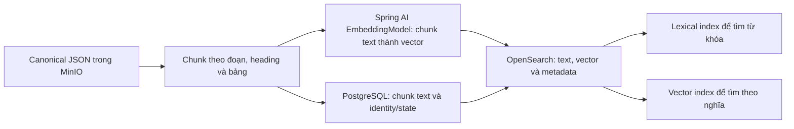
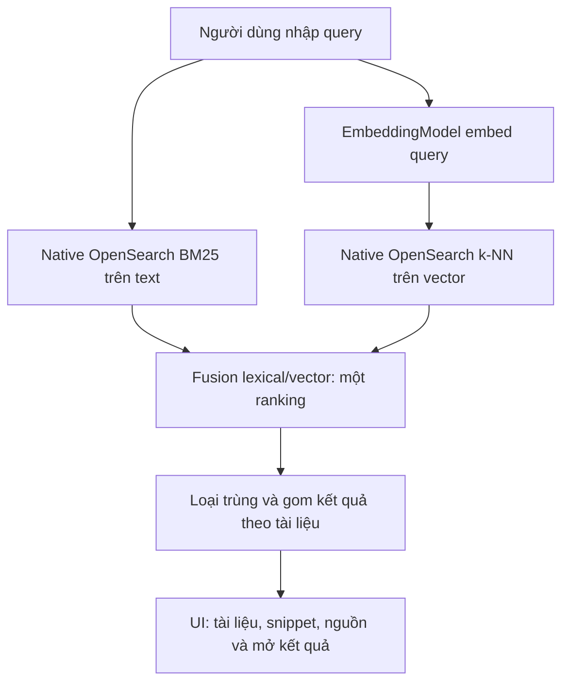
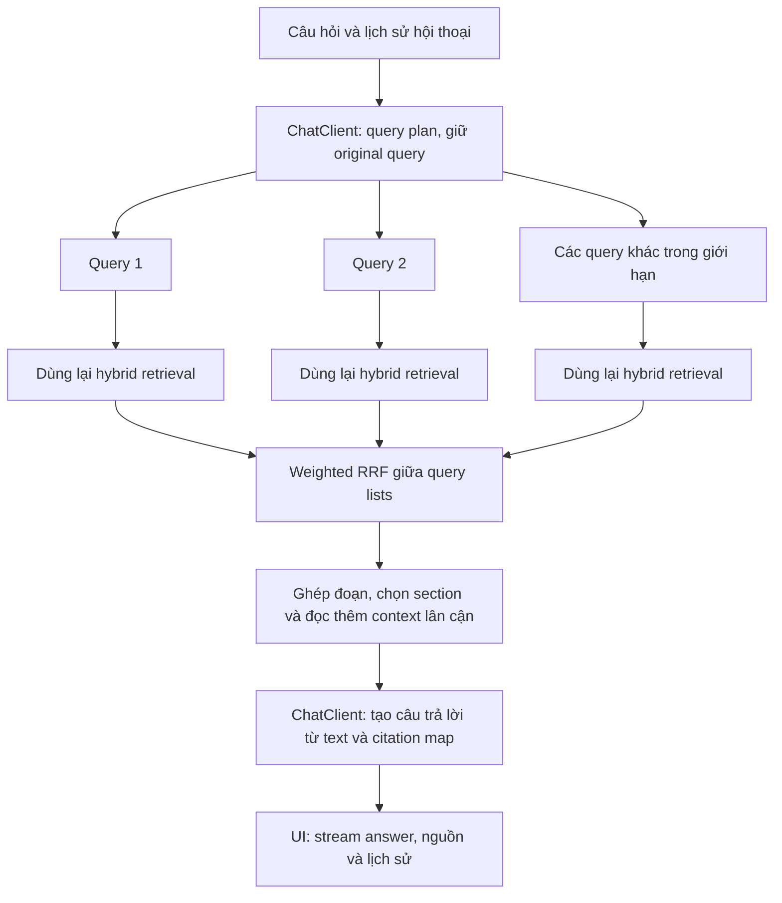

# MEM-46 — Hybrid, embedding và luồng Search/Chat

> Superseded combined planning draft — 2026-09-07: the user split delivery into [MEM-46 Search](../../active/mem-46-search/design.md) and [MEM-11 production Chat](../../active/mem-11-production-chat/design.md). Search has its own completion gate and is implemented first. The narrative below records earlier combined research; statements requiring both modes to close MEM-46 are no longer execution instructions. Read [Onyx Search details](../../active/mem-46-search/onyx-search.md) for the verified UI/SearchTool/API distinction.

Cập nhật theo yêu cầu ngày 2026-09-07: tập trung chốt luồng chức năng và thuật toán; phần permission để bàn riêng sau. Các sơ đồ ở đây chỉ thể hiện dữ liệu/model/ranking. Các ghi chú permission chi tiết trong thiết kế trước là nội dung để rà ở bước tích hợp sau, không phải phần đang mở rộng trong lần này.

Đọc cùng [cấu trúc/thư viện](implementation-map.md), [kế hoạch](plan.md), [recipe review](spring-ai-recipes-review.md) và [đối chiếu Onyx đầy đủ](flow.md).

## 1. Search liên quan gì tới embedding?

Search là chức năng tìm kiếm. Semantic search là một cách tìm theo nghĩa; hybrid search kết hợp semantic với keyword search.

| Cách tìm | Dữ liệu được so sánh | Có cần embedding trong cách làm đang chọn? | Ví dụ phù hợp |
| --- | --- | --- | --- |
| Keyword/BM25 | Từ trong query với text đã lập chỉ mục | Không | Mã `MEM-46`, tên dự án, mã hợp đồng, chữ viết tắt |
| Semantic/vector | Vector query với vector các chunk | Có: embed chunk khi nạp, embed query khi tìm | “chi phí tuyển người” có thể tìm được “ngân sách tuyển dụng” dù khác từ |
| Hybrid | Hai danh sách/tín hiệu bên trên rồi fusion | Có, cho nhánh semantic; nhánh keyword vẫn dùng text | Vừa bắt đúng mã/từ khóa vừa tìm được cách diễn đạt tương đương |

MemoryOS chọn **Search hybrid**, trong đó có semantic search; không phải chỉ vector search. Query dùng embedding model, không cần chat/generative model ở chế độ Search mặc định. Chất lượng tương đồng phụ thuộc model và corpus; không hứa mọi câu đồng nghĩa đều được tìm đúng.

## 2. Nạp dữ liệu một lần, hai chế độ cùng dùng



Đây là sơ đồ logic; worker/retry/bulk/recovery nằm trong design/plan. Embedding chunk được tính khi nội dung/model input thay đổi, không tính lại toàn bộ kho mỗi lần người dùng tìm. Text và vector cùng nằm trong search document để kết quả có thể trả text/source; LLM không giải mã vector để khôi phục tài liệu. PostgreSQL không có bản sao mảng vector.

## 3. Recipe hybrid khác Onyx ở đâu?

Trong [`HybridDocumentRetriever`](https://github.com/habuma/spring-ai-recipes/blob/f89baf57e83e2007fb0ccb96852252c1fa1cff6a/hybrid-rag/hybrid-rag/src/main/java/com/example/essentialrag/HybridDocumentRetriever.java), mỗi lần retrieve chạy một query qua VectorStore và Lucene, lấy top 10 mỗi nhánh rồi RRF ra top 10. RRF dùng thứ hạng, không cộng raw BM25 score với vector score.

```text
Recipe: một query -> [Lucene list, vector list] -> RRF -> một list
Onyx:   nhiều query -> [hybrid list Q1, hybrid list Q2, ...] -> weighted RRF -> một list
```

| Chi tiết | Recipe đã đọc | Onyx tại reference đã đọc |
| --- | --- | --- |
| Backend | VectorStore + LuceneSearch riêng | Backend Vespa hoặc OpenSearch theo config/migration |
| Fusion trong một query | RRF hai ranking lists, k=60, trọng số bằng nhau | Riêng OpenSearch path dùng hybrid query và search pipeline chuẩn hóa/kết hợp score theo trọng số; không phải copy hàm RRF của recipe |
| Trước retrieval | Config hybrid có compression rồi HyDE, biến đổi query nối tiếp | Search tool tổ chức semantic/keyword/LLM-provided/original queries khi có, chạy fan-out có giới hạn |
| Fusion giữa nhiều query | `documentJoiner` trong config flatten các lists; không có weighted multi-query RRF như Onyx | Weighted RRF trên kết quả các query, k=50; semantic/keyword/original có trọng số khác nhau |
| Sau retrieval | RAG advisor đưa kết quả vào prompt; LLM rerank nằm ở recipe khác | Merge sections, LLM chọn section, đọc thêm context lân cận, chọn extent rồi answer/citation loop |

Các trọng số và số lượng query là lựa chọn tuning, không phải định nghĩa của hybrid. Có thể dùng RRF cho fusion lexical/vector của MemoryOS và tiếp tục dùng weighted RRF giữa query lists; đây là hai tầng độc lập. Onyx làm tầng thứ nhất khác tùy backend, nên “học hướng Onyx” không có nghĩa mọi tầng phải dùng RRF hoặc mọi backend cùng một công thức.

Nguồn Onyx: [native hybrid retrieval](https://github.com/onyx-dot-app/onyx/blob/06aa2b09cc4aa5135fa2627e5235814e996f1514/backend/onyx/document_index/opensearch/opensearch_document_index.py), [hybrid normalization pipeline](https://github.com/onyx-dot-app/onyx/blob/06aa2b09cc4aa5135fa2627e5235814e996f1514/backend/onyx/document_index/opensearch/search.py), [multi-query tool](https://github.com/onyx-dot-app/onyx/blob/06aa2b09cc4aa5135fa2627e5235814e996f1514/backend/onyx/tools/tool_implementations/search/search_tool.py), [weighted RRF/expansion](https://github.com/onyx-dot-app/onyx/blob/06aa2b09cc4aa5135fa2627e5235814e996f1514/backend/onyx/tools/tool_implementations/search/search_utils.py). Recipe transformer/joiner: [ChatClientConfig](https://github.com/habuma/spring-ai-recipes/blob/f89baf57e83e2007fb0ccb96852252c1fa1cff6a/hybrid-rag/hybrid-rag/src/main/java/com/example/essentialrag/ChatClientConfig.java).

## 4. Search của MemoryOS



Ví dụ query “ngân sách tuyển dụng quý 2”: BM25 tìm từ khóa/quý, vector tìm cách diễn đạt gần nghĩa. Fusion xếp một danh sách cuối, UI hiển thị tài liệu/đoạn liên quan. Search không tự viết một câu trả lời dài.

Đề xuất triển khai dựa trên recipe: thay LuceneSearch và VectorStore bằng hai native query tới cùng OpenSearch index; dùng RRF ở application làm baseline để đo, có rank/limit/dedup/tie contract rõ. So sánh với native normalized-score hybrid trên cùng corpus trước khi chốt một đường runtime. Không cần thêm một search engine hay persistent vector store khác. Các điều kiện index/cleanup/recovery vẫn thuộc plan hiện có.

## 5. Chat mở rộng từ Search



Ví dụ “so sánh ngân sách tuyển dụng quý 1 và quý 2, vì sao tăng?” có thể tạo query cho quý 1, quý 2 và nguyên nhân điều chỉnh. Mỗi query gọi cùng primitive hybrid dùng bởi Search. Chat gộp kết quả, chọn đủ dữ liệu cho so sánh và trả lời có nguồn. Không cần tạo một vector index riêng cho Chat.

Mở rộng từ recipe theo cách này được: giữ một hàm hybrid retrieval dùng chung; bổ sung query planning, weighted RRF, context selection/expansion ở lớp Chat. Lợi ích là tận dụng một index và thuật toán đã đo; tradeoff là nhiều query/model calls hơn, tăng latency/cost và có thể thêm nhiễu nếu rewrite sai. Vì vậy giữ original query, cap fan-out/context và so sánh quality với direct Search.

## 6. Thứ tự đang chốt

1. JSON -> chunks -> embeddings -> OpenSearch, gồm retry/bulk/recovery thực.
2. Search UI/API với một query hybrid; đo BM25, vector và fusion trên cùng corpus.
3. Chat dùng lại retrieval, thêm multi-query/weighted RRF/context/streaming và conversation persistence.
4. Rà phần permission/integration riêng sau khi luồng chức năng rõ; các checklist chi tiết cũ được giữ để dùng khi đến bước đó.

Đây là thứ tự thiết kế/triển khai trong một MEM-46. Lần cập nhật hiện tại tạo kế hoạch, chưa thêm runtime code hoặc dependency.
