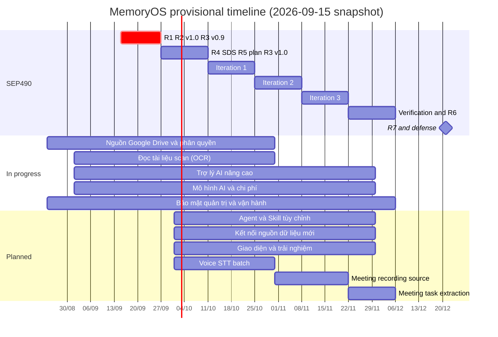

# MemoryOS roadmap

This roadmap records delivery state at increment granularity. Linear is the execution tracker; this file is the repository-facing state and link map. Last reconciled against live Linear and `main` on 2026-09-15. Repository delivery, deployment and authenticated business acceptance remain separate evidence.

## Delivered

| Increment | Outcome | Evidence |
| --- | --- | --- |
| MEM-5 | Controlled Spring Modulith foundation with separate API and worker deployables | [ADR 0001](decisions/0001-controlled-modular-monolith.md) |
| MEM-6 | Dedicated `memoryos` realm and public PKCE client on shared Keycloak | [Runtime runbook](runbooks/development-runtime.md) |
| MEM-7 | PostgreSQL-backed actors and exact external-identity resolution | [Design](increments/completed/mem-7-persist-actors-and-external-identity-bindings/design.md) · [Verification](increments/completed/mem-7-persist-actors-and-external-identity-bindings/verification.md) · [PR #4](https://github.com/kl3inIT/MemoryOS/pull/4) |
| MEM-8 | Deployment-configured singleton Organization bootstrap and initial-owner Authorization Code + PKCE browser session, with active-membership admission and live unprovisioned-user denial | [Design](increments/completed/mem-8-organization-workspace-browser-onboarding/design.md) · [Verification](increments/completed/mem-8-organization-workspace-browser-onboarding/verification.md) · [PR #6](https://github.com/kl3inIT/MemoryOS/pull/6) |
| MEM-12 | Production owner-to-member invitation lifecycle through local Keycloak, with copy/share recovery, fixed memberships, and atomic acceptance | [Design](increments/completed/mem-12-local-keycloak-member-invitation/design.md) · [Verification](increments/completed/mem-12-local-keycloak-member-invitation/verification.md) · [PR #32](https://github.com/kl3inIT/MemoryOS/pull/32) · [PR #37](https://github.com/kl3inIT/MemoryOS/pull/37) |
| MEM-13 | Production Vite/React web foundation and authenticated owner shell over the Spring-owned browser session | [Design](increments/completed/mem-13-production-web-foundation/design.md) · [Verification](increments/completed/mem-13-production-web-foundation/verification.md) · [PR #8](https://github.com/kl3inIT/MemoryOS/pull/8) |
| MEM-14 | Responsive authenticated `New Session` and administration shells using the MemoryOS interaction contract | [Design](increments/completed/mem-14-orgmemory-owner-shell/design.md) · [Verification](increments/completed/mem-14-orgmemory-owner-shell/verification.md) · [PR #11](https://github.com/kl3inIT/MemoryOS/pull/11) |
| MEM-15 | Bounded, filterable, sortable, URL-addressable Organization invitation administration with an accessible TanStack Table | [Design](increments/completed/mem-15-invitation-data-view/design.md) · [Verification](increments/completed/mem-15-invitation-data-view/verification.md) · [PR #29](https://github.com/kl3inIT/MemoryOS/pull/29) · [PR #30](https://github.com/kl3inIT/MemoryOS/pull/30) |
| MEM-16 | Spring Boot 4-native RFC 9457 contract for framework errors and expected capability failures | [Design](increments/completed/mem-16-api-problem-details/design.md) · [Verification](increments/completed/mem-16-api-problem-details/verification.md) · [PR #14](https://github.com/kl3inIT/MemoryOS/pull/14) |
| MEM-17 follow-up | Windows IntelliJ API/worker launch configurations with byte-faithful, concurrent-safe Infisical dev cache synchronization | [Design](increments/completed/mem-17-intellij-dev/design.md) · [Verification](increments/completed/mem-17-intellij-dev/plan.md#local-verification-evidence) · [PR #28](https://github.com/kl3inIT/MemoryOS/pull/28) |
| MEM-18 | Deterministic committed OpenAPI snapshot generated from the live Spring MVC browser API, with backend and Hey API drift gates | [Design](increments/completed/mem-18-backend-generated-openapi/design.md) · [Verification](increments/completed/mem-18-backend-generated-openapi/verification.md) · [PR #16](https://github.com/kl3inIT/MemoryOS/pull/16) |
| MEM-19 | Server-authored Organization invitation authority projection with capability-aware owner/member browser surfaces | [Design](increments/completed/mem-19-frontend-authority-projection/design.md) · [Verification](increments/completed/mem-19-frontend-authority-projection/verification.md) · [PR #32](https://github.com/kl3inIT/MemoryOS/pull/32) |
| MEM-20 | MemoryOS-owned PostgreSQL with isolated application/Keycloak databases, one shared Keycloak runtime, and separated Infisical development/staging environments | [Design](increments/completed/mem-20-shared-keycloak-postgres/design.md) · [Verification](increments/completed/mem-20-shared-keycloak-postgres/verification.md) · [ADR 0004](decisions/0004-memoryos-owned-shared-identity-runtime.md) · [PR #25](https://github.com/kl3inIT/MemoryOS/pull/25) · [PR #26](https://github.com/kl3inIT/MemoryOS/pull/26) |
| MEM-24 | Clean-cut runtime ownership to one deployment-owned Tenant with UUID-preserving V6 migration and Arconia fixed Tenant resolution at the API boundary | [Design](increments/completed/mem-24-tenant-cutover/design.md) · [Verification](increments/completed/mem-24-tenant-cutover/verification.md) |
| MEM-28 | Organization-only membership, invitation, and future resource ownership with the historical Workspace layer removed | [Design](increments/completed/mem-28-organization-only-ownership/design.md) · [Verification](increments/completed/mem-28-organization-only-ownership/verification.md) · [PR #32](https://github.com/kl3inIT/MemoryOS/pull/32) · [PR #33](https://github.com/kl3inIT/MemoryOS/pull/33) |
| MEM-29–33 | Frontend lifecycle hardening across client navigation, persistent authenticated layouts, browser-session query convergence, single-flight invitation creation, and CSP-compatible font assets | [Design](increments/completed/mem-29-33-frontend-lifecycle-hardening/design.md) · [Verification](increments/completed/mem-29-33-frontend-lifecycle-hardening/verification.md) · [PR #35](https://github.com/kl3inIT/MemoryOS/pull/35) |
| MEM-34 | Pre-provisioned local-Keycloak invitees with bounded activation email, exact verified-email acceptance, and recovery-link fallback | [Design](increments/completed/mem-34-keycloak-invited-user-activation/design.md) · [Verification](increments/completed/mem-34-keycloak-invited-user-activation/verification.md) · [PR #36](https://github.com/kl3inIT/MemoryOS/pull/36) |
| MEM-37 | Command-style invitation revocation and consumer-facing Identity/Invitations OpenAPI taxonomy | [Design](increments/completed/mem-37-command-style-invitation-revoke/design.md) · [Verification](increments/completed/mem-37-command-style-invitation-revoke/verification.md) · [PR #38](https://github.com/kl3inIT/MemoryOS/pull/38) |
| MEM-27 | Semantic interaction tokens, action prominence, shared control sizes, and enforced disabled/pending behavior across the production frontend | [Design](increments/completed/mem-27-frontend-interaction-contracts/design.md) · [Verification](increments/completed/mem-27-frontend-interaction-contracts/verification.md) · [PR #40](https://github.com/kl3inIT/MemoryOS/pull/40) |
| MEM-38 | Accessible destructive confirmations with bounded pending, failure, retry, cleanup, and focus-restoration behavior | [Design](increments/completed/mem-38-destructive-confirmations/design.md) · [Verification](increments/completed/mem-38-destructive-confirmations/verification.md) |
| MEM-42 | Worker-owned Redis execution foundation with versioned stream topology, fail-closed readiness, TLS-safe credentials, and no change to PostgreSQL operation authority | [Design](increments/completed/mem-42-redis-runtime/design.md) · [Verification](increments/completed/mem-42-redis-runtime/verification.md) · [PR #43](https://github.com/kl3inIT/MemoryOS/pull/43) |
| MEM-45 | PostgreSQL-backed db-scheduler control plane with Flyway-owned schema, singleton recurring execution, dead-owner recovery, and bounded virtual-thread tasks | [Design](increments/completed/mem-45-db-scheduler-control-plane/design.md) · [Verification](increments/completed/mem-45-db-scheduler-control-plane/verification.md) · [PR #43](https://github.com/kl3inIT/MemoryOS/pull/43) |
| MEM-35 | Tenant-owned FILE Connector/Credential/Pair/Item/Document boundary with PostgreSQL-authoritative durable indexing and cleanup | [Design](increments/completed/mem-35-file-connectors/design.md) · [Verification](increments/completed/mem-35-file-connectors/verification.md) · [PR #39](https://github.com/kl3inIT/MemoryOS/pull/39) |
| MEM-53 | API-owned local PostgreSQL, worker-owned local Redis, and read-only SSO-protected staging inspection surfaces | [Design](increments/completed/mem-53-inspection-tooling/design.md) · [Verification](increments/completed/mem-53-inspection-tooling/verification.md) · [PR #56](https://github.com/kl3inIT/MemoryOS/pull/56) · [hardening PRs #57–59 and #62](https://github.com/kl3inIT/MemoryOS/pull/62) |
| MEM-43/MEM-44/MEM-51 | PostgreSQL-authoritative Redis Stream relay and consumer execution with bounded dispatch, fencing, rediscovery, and no direct business poller | [Design](increments/completed/mem-43-44-51-redis-execution-cutover/design.md) · [Verification](increments/completed/mem-43-44-51-redis-execution-cutover/verification.md) · [PR #63](https://github.com/kl3inIT/MemoryOS/pull/63) |
| MEM-52 | Provider-neutral object storage with MinIO-verified direct FILE uploads, deterministic object lifecycle, and screenshot-faithful Source management | [Design](increments/completed/mem-52-minio-object-storage/design.md) · [Verification](increments/completed/mem-52-minio-object-storage/verification.md) · [PR #64](https://github.com/kl3inIT/MemoryOS/pull/64) · [final UI PR #71](https://github.com/kl3inIT/MemoryOS/pull/71) |
| MEM-57 | Persistent LGTM, structured logging, durable-operation tracing and owner-gated Grafana SSO | [Design](increments/completed/mem-57-staging-observability/design.md) · [PR #73](https://github.com/kl3inIT/MemoryOS/pull/73) · Post-merge runtime evidence in [Linear](https://linear.app/memory-os/issue/MEM-57) |
| [MEM-55](https://linear.app/memory-os/issue/MEM-55) implementation increment | Users directory, verified profiles, application membership lifecycle, real Group editing and STANDARD account presentation; integrated with MEM-36 through PR #78. Linear currently reports MEM-55 In Progress, so issue completion is not claimed here | [Design](increments/completed/mem-55-users-management/design.md) · [Plan](increments/completed/mem-55-users-management/plan.md) · [Verification](increments/completed/mem-55-users-management/verification.md) |
| [MEM-36](https://linear.app/memory-os/issue/MEM-36) | Unified JPA IAM, protected Groups, grant union/implications, scoped managers, and FILE Source associations; delivered with MEM-55 through PR #78 | [Design](increments/completed/mem-36-iam-jpa/design.md) · [Plan](increments/completed/mem-36-iam-jpa/plan.md) · [Combined verification](increments/completed/mem-55-users-management/verification.md) |
| [MEM-56](https://linear.app/memory-os/issue/MEM-56/add-owner-only-minio-console-with-keycloak-sso) | Expose an owner-only, bucket-read-only staging MinIO Console through native Keycloak SSO without widening API, worker, or public object-storage authority | [Design](increments/completed/mem-56-minio-console-sso/design.md) · [Plan](increments/completed/mem-56-minio-console-sso/plan.md) |
| [MEM-64](https://linear.app/memory-os/issue/MEM-64) | Ingestion outcome metrics, initial queue wait and observability conventions | [Design](increments/completed/mem-64-ingestion-observability/design.md) · [Plan](increments/completed/mem-64-ingestion-observability/plan.md) |
| MEM-61 | Current Document and canonical Docling extraction/artifact lifecycle; FILE delivery complete | [Design](increments/completed/docling-structured-extraction/design.md) · [PR #75](https://github.com/kl3inIT/MemoryOS/pull/75) · [Linear](https://linear.app/memory-os/issue/MEM-61) |
| MEM-70 | Testing/CI gates and verified image publication; closed with owner-approved health-only staging acceptance; automatic deployment remains disabled | [Design](increments/completed/mem-70-testing-cicd/design.md) · [PR #81](https://github.com/kl3inIT/MemoryOS/pull/81) · [Final scope and evidence](https://linear.app/memory-os/issue/MEM-70) |
| MEM-75 selected batch | Eight selected dependency updates; Java 25/Node 24 retained; the broader dependency issue remains open | [Design](increments/completed/mem-75-dependency-upgrades/design.md) · [PR #82](https://github.com/kl3inIT/MemoryOS/pull/82) · [Remaining backlog](https://linear.app/memory-os/issue/MEM-75) |
| FILE indexing fix | Redis blocking-read timeout and FILE input alignment | [Design](increments/completed/file-indexing-quick-fix/design.md) · Main commit `16340f0` |
| FILE single-step setup | One form for create/upload/finalize with retained retry state | [Design](increments/completed/file-source-single-step/design.md) · Main commit `422ff1a` |
| Staging Redis inspection | Complete read-only key inspection with verified diagnostic-command boundaries | [Design](increments/completed/staging-redis-inspection/design.md) · Main commit `0279988` |
| [MEM-46](https://linear.app/memory-os/issue/MEM-46) | Current structured chunks, embeddings, native OpenSearch hybrid retrieval, Search API/UI and recovery; Done in Linear | [Design](increments/completed/mem-46-search/design.md) · [Verification](increments/completed/mem-46-search/verification.md) · PRs #83/#87 |
| [MEM-11](https://linear.app/memory-os/issue/MEM-11) | Durable production Chat, grounded retrieval, streaming/replay/Stop, editor/project/sharing/feedback and browser UI; Done in Linear | [Design](increments/completed/mem-11-production-chat/design.md) · [Verification](increments/completed/mem-11-production-chat/verification.md) · PRs #84/#92/#93 |
| [MEM-81](https://linear.app/memory-os/issue/MEM-81) | Private Chat/Persona/Project files, bounded parsing, context/vision/citations and shared readers; Done in Linear | [Design](increments/completed/chat-attachments-production/design.md) · [Verification](increments/completed/chat-attachments-production/verification.md) · PR #102 |
| [MEM-59](https://linear.app/memory-os/issue/MEM-59) | Browser-only Tasco JIT admission with explicit provider allowlist and exact Actor binding; Done in Linear | [Design](increments/completed/mem-59-tasco-jit/design.md) · [Verification](increments/completed/mem-59-tasco-jit/verification.md) |
| [MEM-82](https://linear.app/memory-os/issue/MEM-82) | Separate public `vadan.app` landing deployable and release path; Done in Linear | [Design](increments/completed/mem-82-landing-page/design.md) · [Verification](increments/completed/mem-82-landing-page/verification.md) · PRs #95/#103 |
| [MEM-94](https://linear.app/memory-os/issue/MEM-94) | Backend-computed per-resource `permissions` maps for Sources, Groups and Personas from the write-guard decisions; the web hides controls through a fail-closed `can()` | [Design](increments/completed/mem-94-resource-actions/design.md) · [Plan](increments/completed/mem-94-resource-actions/plan.md) · PR #135 |
| Search generation handover | A reindexed Document stays searchable on its previous ready generation until the replacement is ready, then the replaced chunks are purged | [Design](increments/completed/search-generation-handover/design.md) · [Plan](increments/completed/search-generation-handover/plan.md) · PR #146 |
| [MEM-93](https://linear.app/memory-os/issue/MEM-93) | CHAT_READ/CHAT_WRITE enforcement, membership-only citation passages, measured authorization cost, and per-chunk `access_public`/`access_control_list` with in-place `ACCESS` refresh; Google Drive per-file tokens remain with MEM-88 | [Design](increments/completed/mem-93-chat-search-authorization/design.md) · [Plan](increments/completed/mem-93-chat-search-authorization/plan.md) · [Verification](increments/completed/mem-93-chat-search-authorization/verification.md) · PR #109 · PR #112 · PR #113 · PR #131 |
| [MEM-84](https://linear.app/memory-os/issue/MEM-84) | Consolidated Linear reading set, removed obsolete external-reference material, repaired the documentation lifecycle and added architecture diagrams; Done in Linear | [Design](increments/completed/architecture-documentation-sync/design.md) · [Plan](increments/completed/architecture-documentation-sync/plan.md) · PR #105 |
| Basic Access capability bundle | Persisted SYSTEM_BASIC, enforced direct Search permission, full-enum Admin, protected Onyx-style Groups, scoped manager operations and ordinary-only Source associations; unified Source management preserves independent model management | [Design](increments/completed/basic-access-capabilities/design.md) · [Plan](increments/completed/basic-access-capabilities/plan.md) · [PR verification](increments/completed/basic-access-capabilities/verification.md#pr-106-ci-repair) · PR #106 |
| Docling environment configuration | External service settings retain their defaults; the later Tasco correction supersedes the original fifteen-minute Worker ceiling with an explicit sixty-minute ceiling. Managed configuration is not proof of server rollout | [Design](increments/completed/docling-timeout-configuration/design.md) · [Current contract](specs/ingestion.md#docling-deployment-environment) · Main commit `819c54e` via PR #89 |
| [MEM-74](https://linear.app/memory-os/issue/MEM-74)/[MEM-22](https://linear.app/memory-os/issue/MEM-22) | Scoped Vietnamese/English UI, account language, safe problem presentation, Chat language hints and read-only renderers; Done in Linear | [Design](increments/completed/mem-74-22-i18n-errors/design.md) · [Plan](increments/completed/mem-74-22-i18n-errors/plan.md) · [Verification](increments/completed/mem-74-22-i18n-errors/verification.md) · PR #105 |
| Chat edit and navigation polish | Compact editor, composer `+` menu, grouped Sources toolbar and assistant-ui element follow-ups (regenerate with a model, timing, draft restore, quote, link chips, file status icons) | [Design](increments/completed/chat-edit-navigation-polish/design.md) · [Plan](increments/completed/chat-edit-navigation-polish/plan.md) · Main commits `285f9a0`/`8a9a8be` · PR #145 |
| Chat history search | Owner-authorized full-history conversation search across titles and every persisted text version | [Design](increments/completed/chat-history-search/design.md) · [Plan](increments/completed/chat-history-search/plan.md) · Main commit `cdde9b9` |
| Chat model selector polish | Inherited-default marking and model identity display in the composer picker | [Design](increments/completed/chat-model-selector-polish/design.md) · [Plan](increments/completed/chat-model-selector-polish/plan.md) · Main commit `19aa507` |
| Chat ThreadList runtime | assistant-ui remote thread list runtime for the Chat sidebar and conversation lifecycle; archive later withdrawn | [Design](increments/completed/chat-thread-list-runtime/design.md) · [Plan](increments/completed/chat-thread-list-runtime/plan.md) · Main commits `744ed29`/`15d2eff` |
| [MEM-87](https://linear.app/memory-os/issue/MEM-87) | Source type/provider icons, citation chip previews, Google Drive deep links and a cited PDF page view with outlined Docling boxes in Chat and Search through authorized original-PDF endpoints; Done in Linear | [Design](increments/completed/mem-87-citation-evidence-ux/design.md) · [Plan](increments/completed/mem-87-citation-evidence-ux/plan.md) · PR #145 · PR #153 |
| [MEM-95](https://linear.app/memory-os/issue/MEM-95) | SYSTEM_ADMIN Keycloak identity provider management API, runtime-managed JIT allowlist and admin UI; live realm replay and brokered login acceptance remain separate | [Design](increments/completed/mem-95-idp-admin/design.md) · [Plan](increments/completed/mem-95-idp-admin/plan.md) · PR #139 |
| SEP490 diagrams and MCP typography | Vietnamese context and primary business flow diagrams in the editable VPP, Visual Paradigm plugin typography controls, and CI ignoring documentation/tool-only changes; the wider MEM-86 academic work stays in Linear | [Design](increments/completed/sep490-diagram-typography/design.md) · Main commits `7d593f3`/`026a2e5` |
| SEP490 documentation and diagram tooling | Imported academic templates with recorded SHA-256 and R1–R7 guide, plus Visual Paradigm MCP as an independent Gradle build; MEM-85/MEM-86 deliverables continue in Linear | [Design](increments/completed/sep490-tooling/design.md) · Main commit `3e4e318` |
| [MEM-97](https://linear.app/memory-os/issue/MEM-97) | Chat image generation through a per-tenant image-provider connection (OpenAI Images and Cloudflare Workers AI adapters), owner-authorized artifact storage and serving, streamed progress and a develop-reveal viewer; the MEM-96 research is folded in | [Design](increments/completed/mem-97-chat-image-generation/design.md) · [Research](increments/completed/mem-96-image-generation-research/design.md) · [PR #161](https://github.com/kl3inIT/MemoryOS/pull/161) |
| [MEM-109](https://linear.app/memory-os/issue/MEM-109) | Chat image editing: an `edit_image` tool edits an image generated in the session or an attached image through Cloudflare FLUX.2 klein or OpenAI image edits, with server-side mask compositing that keeps unpainted pixels, edit lineage and a brush-mask dialog; live probes rejected SD 1.5 inpainting | [Design](increments/completed/mem-109-chat-image-editing/design.md) · [PR #193](https://github.com/kl3inIT/MemoryOS/pull/193) |
| [MEM-100](https://linear.app/memory-os/issue/MEM-100) | Persisted tool steps and provider reasoning summaries streamed and replayed in Chat through one tool-neutral activity contract (`tool`/`reasoning` SSE, V59/V60 `chat_message.activity`), rendered with assistant-ui grouped parts in an Onyx-style timeline; live OpenAI reasoning-summary acceptance remains open; Done in Linear | [Design](increments/completed/mem-100-agent-activity-timeline/design.md) · [Plan](increments/completed/mem-100-agent-activity-timeline/plan.md) · PR #160 |
| Chat source reader | Step between Chat sources, open table-row citations on their PDF page, expand a document citation into the preview dialog with Chat authority, and fall back to a whole PDF read with Sentry reporting and pdf.js image decoders; merged in PR #159. Reading the staging Sentry `pdf-view` event remains a post-deployment follow-up | [Design](increments/completed/chat-source-reader/design.md) · [Plan](increments/completed/chat-source-reader/plan.md) |
| Staging deployment simplification | CD deploys and verifies runtime health while authenticated business acceptance remains an explicit owner step | [Design](increments/completed/staging-deploy-simplification/design.md) · Main commit `5bebf2f` |
| Brand splash, loader and direct sign-in | Traced MemoryOS wordmark splash with a CSP-compatible full intro once per tab and a short sheen form on reload, the same short form as the loader for full-page and page-level loads, and signed-out browsers sent to Keycloak after the splash with a redirect-loop guard; merged in PR #157 | [Design](increments/completed/brand-loading-direct-sign-in/design.md) · [Plan](increments/completed/brand-loading-direct-sign-in/plan.md) |
| Keycloak login theme | `memoryos` login theme over `keycloak.v2`: centered white card with the MemoryOS wordmark, email/password, navy sign-in button and a button per configured identity provider; read-only compose mount and realm selection; verified on local Keycloak 26.7.0 and merged in PR #169. Recreating shared Keycloak and replaying the realm script remain operator steps | [Design](increments/completed/keycloak-login-theme/design.md) · [Plan](increments/completed/keycloak-login-theme/plan.md) |
| Search connector rail | Connector Source rail with per-connector counts beside Search results, `sourceTypes` request narrowing within readable Sources, and PDF results opening on their pages; merged in PR #164 | [Design](increments/completed/search-connector-rail/design.md) · [Plan](increments/completed/search-connector-rail/plan.md) |
| CI speedup | PR change-based job selection, template-cloned PostgreSQL fixtures with two core test forks, BuildKit image caches and four browser shards; merged in PR #149 with measured run wall time from 11 m 31 s to 6 m 37 s | [Design](increments/completed/ci-speedup/design.md) · [Plan](increments/completed/ci-speedup/plan.md) |
| [MEM-108](https://linear.app/memory-os/issue/MEM-108) | One `ProviderCard` on the shadcn `Item` for the Models and Web search pages; Web search keeps its single-column layout, OpenAI-compatible connections show their own brand mark, and OpenRouter/Ollama use simple-icons marks; merged in PR #190 | [Design](increments/completed/provider-card-sync/design.md) · [Plan](increments/completed/provider-card-sync/plan.md) · [PR #190](https://github.com/kl3inIT/MemoryOS/pull/190) |

## Active

Chat Web search is implemented locally for the external-provider vertical slice, with assistant-ui controls/progress/citations, bounded PDF text reading, provider-aware tool guidance, browser-local Web preferences and the existing Chat tool loop. Native provider-hosted search and live-provider acceptance remain open. [Design](increments/active/chat-web-search/design.md) · [Plan](increments/active/chat-web-search/plan.md) · [Verification](increments/active/chat-web-search/verification.md).

| Increment | Outcome | Evidence |
| --- | --- | --- |
| Tasco scanned-PDF OCR | FILE/Drive binary admission is 100 MiB; bounded asynchronous extraction and typed terminal failures are implemented. The sixty-minute remote run completed four reports/240 pages with 93/104 strict sampled cells correct. Full 100 MiB remote admission and financial fidelity remain unaccepted; offline recovery is not promoted. Search and Chat are excluded | [Design](increments/active/tasco-scanned-pdf-ocr/design.md) · [Corpus evidence](tests/ingestion.md#sixty-minute-tasco-corpus--2026-09-11) · [Plan](increments/active/tasco-scanned-pdf-ocr/plan.md) |
| Google Drive structured ingestion — active MEM-9/MEM-10/MEM-60/MEM-63 | Reusable OAuth credentials, explicit linked approvals, asynchronous selection, native readers, paginated Source views and owned-index history are merged. Live-provider and customer-data acceptance remains active; MEM-76 is Done | [Design](increments/active/google-drive-structured-ingestion/design.md) · [Verification](increments/active/google-drive-structured-ingestion/plan.md#publication-and-main-refresh--2026-09-09) |
| MEM-58 frontend observability | Optional Sentry Cloud browser error monitoring and trace correlation; rollout configuration and Linear reconciliation remain active | [Design](increments/active/mem-58-frontend-observability/design.md) |
| [MEM-110 MemoryOS interpreter](https://linear.app/memory-os/issue/MEM-110) | Onyx python-sandbox snapshot vendored as `interpreter/` and renamed to `memoryos-interpreter`; staging runtime, authentication, Java `run_python` tool, browser rendering and office output quality remain open | [Design](increments/active/mem-110-memoryos-interpreter/design.md) · [Plan](increments/active/mem-110-memoryos-interpreter/plan.md) |
| [MEM-101 deep research](https://linear.app/memory-os/issue/MEM-101) | Onyx `160f9b143` Deep research mode in Chat (clarification, streamed plan, ≤3 parallel research agents, merged-citation report) plus Chat-wide Onyx timing and uncapped citations; implemented with spans, metrics and integration tests in PR #202; visual review, full `clean check` and staging acceptance remain open; restart survival excluded | [Design](increments/active/mem-101-deep-research/design.md) · [Plan](increments/active/mem-101-deep-research/plan.md) |
| MEM-77 provider/model administration | Backend foundation is merged; catalog administration UI and local OpenAI-compatible provider integration remain active | [Design](increments/active/mem-77-provider-backend/design.md) |
| [MEM-79 standalone OCR](https://linear.app/memory-os/issue/MEM-79) | Vietnamese/English OCR is deployed in the Jmix team namespace; server access, Worker integration and full indexing acceptance remain open | [Deployment runbook](../infrastructure/deployment/ocr/README.md) · [Design](increments/active/mem-79-rancher-ocr/design.md) · [Plan](increments/active/mem-79-rancher-ocr/plan.md) |
| Sign-out without the Keycloak logout page | Application sign-out ends the Keycloak session named by the ID token `sid` through the realm admin API, so the browser returns to MemoryOS sign-in without the provider confirmation page; the provider logout page remains the fallback; managed identity providers enable back-channel logout so a brokered (Tasco) session also ends upstream; implemented locally, not merged | [Design](increments/active/logout-without-keycloak-page/design.md) · [Plan](increments/active/logout-without-keycloak-page/plan.md) |
| Source manager owns Group attachment | Scoped Source authority follows a recorded manager instead of "manages every associated Group": that manager attaches the Source to their own Groups and may start with none, any Group's manager detaches it from their Group, and `SYSTEM_ADMIN` appoints a manager when the previous one loses the role; implemented locally, not merged | [Design](increments/active/source-manager-group-authority/design.md) · [Plan](increments/active/source-manager-group-authority/plan.md) · [ADR 0011](decisions/0011-source-manager-group-attachment-authority.md) |

## Timeline

Planning snapshot of 2026-09-15 ([MEM-115](https://linear.app/memory-os/issue/MEM-115)). Linear projects own the live dates, milestones and issue membership; this section records the agreed shape. **Every date is provisional** until the SEP490 lecturer and each project lead confirm it. The project started around 2026-08-24; SEP490 closing is the final milestone, around the week of 2026-12-21.

| Project | Status | Provisional window | Issues |
| --- | --- | --- | --- |
| Giai đoạn 1: Nền tảng MemoryOS | Completed | → 2026-09-15 | Delivered foundation listed above |
| [SEP490: Hồ sơ và bảo vệ đồ án](https://linear.app/memory-os/project/sep490-f571b6150b5f) | In progress, at risk | 2026-08-24 → 2026-12-21 | MEM-85, MEM-86, MEM-115 |
| Nguồn Google Drive và phân quyền | In progress | → 2026-10 | MEM-60, MEM-9, MEM-10, MEM-63, MEM-88, MEM-89, MEM-90, MEM-104, MEM-105 |
| Đọc tài liệu scan (OCR) | In progress | → 2026-10 | MEM-79 |
| Trợ lý AI nâng cao | In progress | → 2026-11 | MEM-101, MEM-107, MEM-110, MEM-111, MEM-116; candidates MEM-117, MEM-122 |
| Mô hình AI và chi phí | In progress | → 2026-11 | MEM-66, MEM-96, MEM-98, MEM-102, MEM-113, MEM-123 |
| Bảo mật, quản trị và vận hành | In progress | → 2026-12 | MEM-25, MEM-54, MEM-65, MEM-69, MEM-124, MEM-125 |
| Agent và Skill tùy chỉnh | Planned | 2026-10 → 2026-11 | MEM-119, MEM-120 |
| Kết nối nguồn dữ liệu mới | Planned | 2026-10 → 2026-11 | MEM-118 (one or two sources before SEP490) |
| Giọng nói và cuộc họp | Planned | 2026-10 → 2026-12 | MEM-91, MEM-92 |
| Giao diện và trải nghiệm | Planned | 2026-10 → 2026-11 | MEM-23, MEM-26, MEM-39, MEM-78, MEM-106 |
| Tích hợp hệ thống ngoài (MCP, API) | Candidate | Not scheduled before SEP490 | MEM-112, MEM-114, MEM-121 |

SEP490 milestones follow the stage order of the [R2 template](academic/sep490/README.md#giai-đoạn-tham-khảo-từ-mẫu-r2): R1/R2 v1.0/R3 v0.9 (2026-09-27, behind the template's week 3), R4 SDS v1.0 with test plan and R3 v1.0 (2026-10-11), three iteration packages (2026-10-25, 2026-11-08, 2026-11-22), verification and validation with R6 (2026-12-06), and R7 with the defense (2026-12-21).

Known blocking relations recorded in Linear:

- MEM-91 speech-to-text blocks MEM-92 meeting task extraction.
- MEM-110 interpreter blocks MEM-111 artifacts, MEM-120 skills and MEM-122 Craft; MEM-111 also blocks MEM-122.
- MEM-98 usage recording blocks MEM-123 quotas.
- MEM-124 API keys and personal access tokens block MEM-114 public MCP server.

Candidates are recorded so they can be prioritized, not as commitments. Promote one into a committed window only with an issue, an active increment and a confirmed owner.

## IAM follow-ups tracked separately from MEM-55/MEM-36

MEM-36 and MEM-68 are Done. MEM-55, MEM-25 and MEM-69 are In Progress with Nhat (`nhudinhnhat2004`), while MEM-65 remains In Progress with Duc Anh (`anhnd05122004`). MEM-59 is Done. These tracker states are separate from the delivered Users/Groups implementation increment:

| Issue | Follow-up boundary |
| --- | --- |
| [MEM-55](https://linear.app/memory-os/issue/MEM-55) | Linear remains In Progress although the repository implementation increment is under `completed/`; reconcile issue acceptance separately |
| [MEM-68](https://linear.app/memory-os/issue/MEM-68) | Done: bounded provider/broker revocation across bearer tokens and browser sessions |
| [MEM-69](https://linear.app/memory-os/issue/MEM-69) | Absolute browser-session lifetime and reauthentication policy beyond idle timeout |
| [MEM-25](https://linear.app/memory-os/issue/MEM-25) | Audit evidence and viewer after a named consumer/retention/access contract |

## Google Drive delivery in progress

[MEM-60](https://linear.app/memory-os/issue/MEM-60) coordinates the [Google Drive plan](increments/active/google-drive-structured-ingestion/design.md). MEM-9/MEM-10/MEM-60/MEM-63 remain In Progress with `nhuxuanviet27102004`; MEM-76 is Done. The implementation is merged through PR #89, while deployment and live-provider/customer-data acceptance remain separate.

- MEM-9 owns OAuth and source selection; MEM-10 owns source sync and current Document publication. Its wider Google source ACL/authorized-reading acceptance remains outside the user-approved ingestion-only slice and is not delivered by this integration.
- MEM-63 owns [native Sheets/Docs and bounded table readers](increments/active/google-drive-structured-ingestion/native-readers.md). MEM-61 extraction is already delivered and is reused.
- MEM-76 delivered selection scaling and durable sync history; the wider provider acceptance remains with MEM-9/MEM-10/MEM-60/MEM-63.
- Search consumes canonical artifacts under MEM-46; former MEM-62/MEM-47/MEM-48/MEM-49/MEM-50 are Duplicate into Search. MEM-71/MEM-72 are Duplicate into MEM-11 Chat.
- Google Drive's controlled provider tests are separate from live Tasco evidence. The [20 MiB acquisition verification](tests/connector.md#shared-file-and-drive-binary-admission--2026-09-10) admitted the five formerly blocked real binaries, but does not establish Drive OCR/indexing completion. The six-report [authorized FILE verification](increments/active/tasco-scanned-pdf-ocr/design.md) retains its financial-table fidelity limitations; neither result constitutes Search or Chat acceptance.

## Other tracked work

- [MEM-74](https://linear.app/memory-os/issue/MEM-74), Vietnamese/English UI localization, is Todo with `dathip04`.
- [MEM-77](https://linear.app/memory-os/issue/MEM-77) is Todo: the [backend foundation](increments/active/mem-77-provider-backend/design.md) is merged through PR #88; the issue continues catalog administration UI and local OpenAI-compatible provider integration.
- [MEM-83](https://linear.app/memory-os/issue/MEM-83) is In Review for the latest `vadan.app` presentation work; MEM-82 is Done.

- [MEM-75](https://linear.app/memory-os/issue/MEM-75) remains In Progress for the dependency proposals outside the delivered selected batch; it does not keep that completed increment active.

## Superseded planning

The [separate structured-chunking draft](increments/superseded/structured-document-chunking/design.md) is retained as historical input. Its DocumentVersion/profile proposals are not current implementation instructions.

Create or link an issue and add an active increment record before implementation begins.
