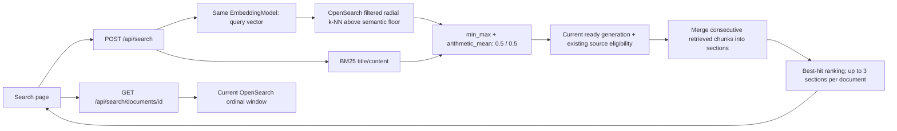

# Search capability contract

MEM-46 implements direct document Search; delivered evidence and remaining production acceptance are tracked in its [verification record](../increments/completed/mem-46-search/verification.md). Chat is delivered separately under MEM-11. The active Basic Access changes add direct Search permission and actor-bound private FILE eligibility; current merge verification is pending.

## Shared runtime configuration

`core/src/main/resources/memoryos-search.yaml` is imported by each deployable's `application.yaml`. It binds environment values to `SearchProperties` (`memoryos.search`); `SearchInfrastructureConfiguration` then creates the embedding model, validation service and native OpenSearch transport/client. `${NAME:default}` uses the environment value when supplied and otherwise the explicit default. API and worker receive the same configuration resource through their `core` dependency, while each process has its own clients and concurrency limits. Infisical supplies `SPRING_AI_OPENAI_API_KEY` to the process environment; the YAML holds only its placeholder. Spring Boot's annotation processor generates property metadata from the configuration records.

The same resources directory owns `memoryos-observability.yaml` and `logback-spring.xml`. The deployables no longer add the repository's former `config/observability` directory as a custom resource root.

## Write path

```mermaid
sequenceDiagram
    participant I as Extraction worker
    participant D as Document / PostgreSQL
    participant W as Ingestion / PostgreSQL
    participant R as Redis SEARCH stream
    participant C as Search worker
    participant E as Spring AI EmbeddingModel
    participant O as OpenSearch
    I->>D: Publish current artifact + new content_generation
    D->>W: Synchronous DocumentChanged in same transaction
    W->>R: Existing dispatch relay publishes identifiers
    R->>C: Delivery; claim + renewable lease
    C->>D: Protected artifact read; current chunk publication
    C->>O: Find surviving vectors for identical input hash
    C->>E: Embed missing inputs only
    E-->>C: Indexed response vectors; validate model/count/dimension/values
    C->>O: Bulk precomputed vectors under generation-isolated IDs
    C->>O: Verify each item and generation chunk count
    C->>D: Fenced completion + mark current generation ready
    C->>R: Acknowledge after durable outcome
```

`DocumentChunkService` checks the canonical artifact's recorded size and SHA-256, reads at most 32 MiB, and uses an expiring artifact reader to protect cleanup. `StructuredDocumentChunker` preserves heading context, table column labels/row headers and source provenance. It splits long Unicode text at code point boundaries within a 768-token `cl100k_base` limit. Current chunks are bounded to 10,000 per document and use `DocumentChunk.CONVENTION`; PostgreSQL does not store vector arrays or a chunk history ledger.

`JdbcDocumentChunkRepository` uses `JdbcClient` for all persistence. Chunk publication locks the current Document, replaces current chunk rows, executes parameter-bound multi-row INSERTs of up to 128 chunks per statement, and updates chunk readiness metadata in one transaction. This is multi-row SQL, not a `JdbcClient.batchUpdate()` API. A later statement failure rolls back earlier inserts and the initial deletion, preserving the previous committed chunk set.

`search_index_operations` uses the same dispatch/delivery/processing token pattern as the existing worker workloads. INDEX and DELETE are durable; DELETE work survives removal of the Document row. A failed INDEX is retried up to three claims with a 30-second dispatch delay, then records FAILED. The projection reconciler may requeue a still-current failed generation after 15 minutes. There is no exactly-once embedding promise.

Spring AI 2.0.1 uses the configured OpenAI embedding endpoint, initially `text-embedding-3-large` with 3072 dimensions. Inputs are explicit strings; `MetadataMode.NONE` prevents an extra metadata-text injection. Batches default to 32 inputs, with two concurrent calls per deployable, a five-second permit wait, and a 30-second provider request timeout. Responses must have the expected model, count, distinct positional indices, dimensions, finite values and nonzero vector norm. Provider exception bodies are not propagated into logs or API errors.

The physical index name hashes endpoint/model/dimensions/chunk convention under the configured index prefix. Each stored chunk ID includes Tenant, Document, generation and ordinal. Mapping uses Faiss HNSW cosine vectors, title/content text with folded subfields, and explicit metadata. A matching existing vector can be reused for unchanged chunk input during retries or metadata-only replacement. The native bulk client writes those vectors directly; it never calls `VectorStore.add()`.

## Read path

Search preview and Chat expansion share `OpenSearchIndexService.document`: one Tenant/document/generation/index-scoped query returns a bounded ordinal window and title/total metadata. It does not call embeddings or load the full PostgreSQL chunk set. Missing documents return 404; incomplete indexed windows return 503. An offset past the end returns an empty page with the real title/count. PostgreSQL still owns canonical chunks for ingestion/reindexing and current-generation readiness.

`DocumentSearchService.ranked` accepts a per-call authorized `SourceSearchScope`, up to eight backend-owned queries, effective `SearchFilters` and cancellation checks. Each call resolves Tenant/source scope and the index alias once, batches embeddings for unique text and runs distinct hybrid queries concurrently (at most four). Identical semantic/keyword text shares IO while retaining separate RRF contributions. Union document IDs receive fresh eligibility/metadata and current-generation checks in batches of at most 1000 before fusion or model/events. RRF is `sum(weight / (50 + rank))`, with first source rank then first query position resolving ties. Duplicate role weights add within each query group. All authorized hits remain available for adjacent-section merging; Chat applies candidate limits after merging. Both groups retain the configured hybrid pipeline (default 50% lexical, 50% vector). Direct Search retains its single-query pagination contract.

`SearchResults` is created only by Retrieval and binds authorized hits to the Actor, Tenant and narrowed Source scope. It merges contiguous document/generation chunks, retaining the best-ranked anchor and complete range/provenance. Chat selects using at most three chunks around that anchor under a total token budget. Window reads accept only a section belonging to that result and read 0–5 neighbors around its boundaries without a database recheck. Chat rechecks active membership, generation and every retained origin for all sections in one batch twice per Search call: after LLM selection (before titles are streamed) and after classification/window IO (before evidence is returned). The measured cost of the previous per-read rechecks is in [MEM-93 verification](../increments/active/mem-93-chat-search-authorization/verification.md). A surviving public mapping cannot authorize metadata from a revoked private origin. Independent previews also recheck current membership, Source permission and generation after the read. Eligible Sources are active PUBLIC FILE or private FILE with current membership in an associated ordinary Group; administrative/creator authority is not a content ACL bypass. Drive and private Chat attachments remain excluded from general Source Search.
Both direct Search application entry points require global `SEARCH_READ` from current IAM authority before accessing providers or document content and recheck it after provider IO. This is implied by Basic's persisted `SYSTEM_BASIC` grant and by Admin's `SYSTEM_ADMIN`; it cannot be stored as a direct Group grant. An active member without Search authority receives an IAM denial. The browser does not mount Search or passage requests without `SEARCH_READ`. Source/document eligibility still filters results and reader content; Search access never grants Source management or unrestricted data visibility. The shared Chat retrieval path retains Chat's membership/resource authorization rather than asserting granular Chat-token enforcement.



`DocumentSearchService` resolves the Actor's active Tenant and executes one native hybrid query. The BM25 clause can independently retain lexical matches. The semantic clause uses Faiss radial k-NN and admits only vectors at or above `memoryos.search.minimum-semantic-score` before min-max fusion; the default `0.70` equals cosine similarity `0.40` because this index's `cosinesimil` score is `(1 + cosine similarity) / 2`. `candidate-limit` remains the HNSW `ef_search`, hybrid pagination depth and response-size budget. This avoids treating every nearest neighbor as relevant and avoids an absolute threshold on query-relative combined min-max scores. Changing the embedding model or representative corpus requires evaluation and possible threshold retuning.

After retrieval, the service batch-checks current ready generations and existing Source eligibility, and sorts deterministic score ties by Document ID/ordinal. For each Document/current generation, it deduplicates ordinals keeping the best hit, sorts by ordinal and merges consecutive retrieved chunks into sections. Gaps stay separate; it does not fetch missing neighbors. Text is joined with a newline in document order, without guessing at repeated prefixes or overlap removal.

Each result exposes `sections`, with `startOrdinal`, `endOrdinal`, `matchingOrdinal`, best-member `score`, combined `content`, and `provenance` entries preserving each member's ordinal and original `provenanceJson`. All ordinals are zero-based and endpoints are inclusive. A section ranks at its best member's position; equal scores use that member's ordinal. Merging precedes the limit of three sections per document, so a contiguous run can contain more than three chunks. Documents retain their best-hit ranking. Section content remains bounded by the query candidate budget; there is no extra three-chunk text truncation. No index migration or embedding call is required for this step.

For example, ranked hits `11, 40, 10` become section `10–11` anchored at match `11`, then section `40`. Adjacent chunks are concatenated with newlines, presented inside one document card and paged by document. Section grouping never widens the actor-authorized Source scope.

`POST /api/search` accepts a trimmed query of 1–1000 characters, up to ten MIME-type filters, optional `updatedSince`, zero-based `page` up to 49 and `pageSize` 1–20. The retrieval budget defaults to 500 and stays fixed across pages; it bounds keyword collection/hybrid pagination/response size and semantic `ef_search`, while the semantic score floor decides vector eligibility. `hasMore` describes the bounded grouped candidate set, not a global exact document count. Paging recomputes retrieval and can reflect concurrent source updates. Server configuration owns hybrid weight, semantic score floor and candidate limits; the browser cannot select a provider/model/backend or arbitrary search DSL.

`GET /api/search/documents/{documentId}?generation=...&from=...` returns up to 20 current passages. Missing, obsolete or ineligible documents return `SEARCH_DOCUMENT_UNAVAILABLE` (404); changed documents require a fresh search. It reads the current extracted passages, not an original-file download URL. Search dependency failures return `SEARCH_UNAVAILABLE` (503), without credentials, provider payloads or query text in diagnostics. Unsafe browser API requests keep the existing same-origin mutation-header requirement. Chat citations read the same passages through `GET /api/chat/documents/{documentId}`, which requires `CHAT_READ` instead of `SEARCH_READ` and applies the same document eligibility and generation checks.

Search is the dedicated `/search` workspace, separate from Chat at the application home: its initial view introduces direct knowledge retrieval and presents one query action without attachment or add-context controls. TanStack Query cancels abandoned requests and associates each response with its complete query/filter/page key. Search results remain visible with an updating indicator while a new query/filter response is resolving; window-focus refetch is disabled and the stale window is 30 seconds to avoid disruptive tab-switch reloads. After submit, the page implements a stable loading state: the submit action becomes a fixed-size spinner and no Cancel control is shown, alongside retry, contained empty/unavailable states, apply/clear filters and paging. The toolbar visibly groups time and file-type filters; desktop exposes a secondary file-type facet. The facet always lists the supported file types and reads counts from the corresponding unfiltered query/time-scope cache, so selecting one type never removes the controls for the others. Cards show a bounded snippet around the first literal full-query or token match, rendered as React text nodes with case-insensitive literal highlights; semantic-only hits do not receive invented highlights. Card hierarchy is title, friendly file type/update metadata, then match context. The exact generated first line `Title: <document title>` is removed, MIME values become friendly file types, and full section content is not mounted in the result list.

The document title opens the best section's match and each related-match control opens its own anchor. The responsive Radix Dialog traps focus, closes by Escape/overlay/control, returns focus to the opening result (or the search input fallback), preserves document order, and can switch among the result's related matches without closing. Preview starts one chunk before `matchingOrdinal`, bounded at zero, and resets when another section is selected in the same document. Its `passages` contract remains individual chunks, up to 20 per page. The API does not expose block kinds, heading hierarchy or table cells, so preview deliberately remains faithful plain text instead of inferring structure from whitespace. The Search composer does not expose Chat controls; the shared shell provides Chat/Search navigation. Source items expose separate `searchStatus` (`WAITING`, `INDEXING`, `READY`, `FAILED`); extraction completion alone does not claim search readiness.

Staging OpenSearch Dashboards owns stable global-tenant saved objects for `memoryos-chunks*`: index pattern `memoryos-chunks` and saved search `memoryos-chunks-inspection`. An idempotent operator provisioner uses the supported Saved Objects API over verified container-local HTTPS with the existing internal Dashboards identity. It never writes `.kibana*` directly. Human `memoryos-inspector` sessions retain `kibana_all_read` and read-only Search index actions; they cannot provision or mutate saved objects or documents.

## Reconciliation and limits

The worker reconciles up to 32 Documents per minute using a rotating cursor. It verifies indexed chunk counts for ready current generations, clears readiness before repair and enqueues missing/current work. Cursor rotation avoids a permanently failed first page starving later Documents. An independent bounded sweep reads 500 indexed metadata records, compares current PostgreSQL generations and deletes only explicit obsolete chunk IDs. Repeated sweeps catch late writes after deletion/replacement.

Readable vectors can be reused. A missing index is recreated through the normal indexing path and current chunks are re-embedded. Recovery from an operator-managed snapshot still needs this current-state catch-up. Model-space changes select a new index and gradually make Documents searchable there; this implementation does not provide an atomic zero-downtime model migration or automatic retention of old physical indices.

`memoryos.search.index.duration` and `memoryos.search.query.duration` record bounded outcome tags; Redis execution metrics include the `search` workload. Live model relevance, capacity/cost, snapshot restore and complete deployed FILE-to-browser acceptance must be measured separately. Synthetic embeddings in tests establish wiring and fusion mechanics, not semantic quality.

See [ADR 0008](../decisions/0008-opensearch-search-projection-and-normalized-hybrid.md), [verification matrix](../tests/search.md) and [runtime/recovery runbook](../runbooks/search-runtime.md).


## Source metadata and Chat filters

V35 adds nullable source creation/update timestamps to connector items. FILE dates describe upload events: existing creation comes from the item and update from its current version, not extraction/sync/index timestamps. New uploads populate both fields. Remote provider ingestion does not yet capture source dates, so these remain null. Authors come from available document extraction metadata and are absent when missing.

Each index chunk carries nested `source_metadata` entries keyed by source/item, preserving date/type pairing across multiple mappings. Lexical and vector branches apply allowed source IDs, optional source types, and inclusive created/updated intervals to the same nested entry. Either bound may be open. Current SQL authorization prunes origins before helpers/events; index metadata never grants access. Explicit and inferred filters intersect; an empty intersection preserves the explicit restriction. Parse/provider failure retains explicit scope. Time inference runs once per turn; source inference skips fewer than two eligible types, uses at most five recent user turns plus search cycles, and stops when there is no source directive.

Rewrite expansion is generated once per turn. Later calls search original/tool queries without replaying expansion, except when entering a source type not previously searched. This is turn-local state, not a result or ACL cache.

Index initialization adds the nested mapping without changing the vector identity. A metadata hash participates in `contains` readiness alongside generation/chunk count, so legacy READY projections are repaired through the existing bounded worker reconciliation path. The write path reuses vectors when content/model hashes match. Migration and reconciliation are idempotent and generation fenced; no repair endpoint or temporary profile is required. Existing direct Search `updatedSince` retains its operational update semantics; Chat source date filters use the new origin dates.

Every Source chunk also carries `access_public` (true when any eligible mapped Source is PUBLIC) and `access_control_list` (`group:<groupId>` for Groups granted to its restricted Sources). The metadata hash (`v2:`) covers both. Source queries and direct Search add `access_public OR terms(access_control_list, reader tokens)`, where reader tokens come from the actor's current Group memberships per request, so membership changes need no index write. Chunks without access fields still match until V52's `ACCESS` backfill rewrites them; the post-query database recheck authorizes every hit throughout. Replacing a Source's Groups or changing its access type publishes `SourceAccessChanged` in the same transaction, and ingestion queues one `ACCESS` operation per searchable mapped document. The worker rewrites source metadata, hash and access fields with `_update_by_query`: no embedding, no pending state, and a short retry while the document waits for a content rewrite. Owner-private chat files keep their explicit owner file filter and carry no Source access tokens. Google Drive per-file permissions are not part of these tokens yet ([MEM-93](../increments/active/mem-93-chat-search-authorization/design.md)).
