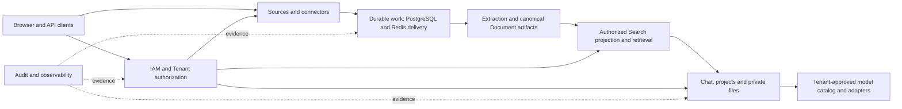

# MemoryOS vision

MemoryOS is a durable personal knowledge system whose data remains owned by a stable internal actor even when authentication providers or external account identifiers change.

## Outcomes

- Ingest knowledge into an actor-owned store with explicit provenance.
- Retrieve relevant knowledge under authorization boundaries.
- Provide assistant behavior grounded in owned knowledge rather than provider identity.
- Preserve an auditable trail for security-sensitive and ownership-changing operations.
- Keep data and processing recoverable across restart, deploy, and provider changes.

## Product principles

1. **Stable ownership before features.** Authentication establishes an internal actor; provider claims never become the long-term ownership key.
2. **Production path first.** A capability is not complete until its real storage, authorization, operations, and recovery path exist. Temporary application modes do not substitute for the product flow.
3. **Capability-owned vertical slices.** Add infrastructure only when a concrete capability needs it and owns its lifecycle.
4. **Fail closed.** Missing configuration, invalid tokens, unknown identity bindings, and ambiguous ownership fail explicitly.
5. **Repository continuity.** Architecture, decisions, active plans, and verification evidence are versioned with the code.

## Implemented foundation

MemoryOS currently delivers a controlled Spring Modulith application with separate API, Worker and Web deployables. PostgreSQL is the business authority; Redis Streams is rebuildable work delivery; MinIO stores raw and canonical artifacts; OpenSearch stores the searchable projection. IAM owns stable actors, Tenant membership, invitations, Users, Groups and authorization. FILE and Google Drive feed the same Document, extraction, chunking and indexing path. Search and Chat consume one authorization-aware retrieval capability, while Chat owns conversations, projects, assistants, sharing, feedback and private attachments. The exact runtime structure belongs in [ARCHITECTURE.md](../ARCHITECTURE.md).

## Target architecture

The target keeps the existing capability boundaries and evolves them through vertical slices. It does not introduce a second application stack or adopt another product as an architecture template.

The next architecture horizon is bounded by live Linear work:

- Complete Google Drive provider and customer-data acceptance without creating a second ingestion or retrieval path (MEM-9, MEM-10, MEM-60 and MEM-63).
- Finish provider/model administration and an approved local OpenAI-compatible adapter on the existing catalog extension point (MEM-77), informed by the separate gateway/model research in MEM-66.
- Complete Vietnamese/English presentation and stable API problem handling without coupling locale to authorization or stored content (MEM-74 and MEM-22).
- Add server-authored audit evidence only through the existing capability transactions after its consumer, retention and access contract is fixed (MEM-25).
- Finish session lifetime, identity-provider presentation and deployment hardening through their existing IAM and Compose boundaries (MEM-65, MEM-69 and MEM-54).

Backlog items are candidates, not approved topology. In particular, live updates, centralized administration metadata and source-screen redesign do not justify new services, packages or storage until an active increment defines their consumer and production path.

## Architectural invariants

1. PostgreSQL remains authoritative for ownership, operations and terminal outcomes; queues and indexes remain reconstructable projections.
2. New source types publish through the same Connector → Document → Ingestion → Retrieval path.
3. Search and Chat reuse the same evidence identity and authorization rules; private Chat files stay owner-scoped.
4. Model providers extend the catalog through explicit adapters and bounded client lifecycles; model choice does not change ownership or retrieval authority.
5. Observability and future audit evidence carry identifiers and outcomes without turning user content into generic telemetry.
6. A candidate becomes current architecture only after implementation, verification and consolidation into the relevant spec and this repository map.
