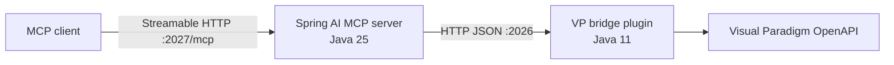

# Architecture

## Boundary

The Visual Paradigm bridge owns all calls to `openapi.jar` and all Swing EDT
coordination. It contains no Spring classes and is compiled with
`--release 11`.

The MCP server owns the MCP protocol and transport. It contains no Visual
Paradigm classes, runs on Java 25, and uses Spring Boot 4.1 plus Spring AI 2.0.

The bridge binds to loopback only. It is not an MCP server and does not expose
the deprecated SSE transport.
